# INDEX
- [画像診断総論] (28/51題)
    - [CT総論](#CT総論) (7題)  
    - [MRI総論](#MRI総論) (13題) (Complete!)
    - [US総論](#US総論) (1題)  
    - [造影剤](#造影剤) (12題) (7/12)
    - [医療情報](#医療情報) (16題) (10/16)
    - [ほか](#ほか) (2題)  
- [画像診断各論]
    - [脳](#脳) (48題)  
        - XJ0. 総論
            - 撮像法 (1題) Complete!
            - 解剖 (3題)
            - **正常所見 (2題)**
        - **XJT. 頭部外傷 (7題)**
        - **XJC. 脳血管障害 (6題)**
        - **XJF. 脱髄疾患 (2題)**
        - XJH. 中枢神経感染症 (2題)
        - XJN0. 脳腫瘍
            - **髄膜腫 (2題)**
            - **脳室内腫瘍 (2題)**
            - 脳腫瘍の鑑別 (3題)
            - **脊髄内腫瘍の疫学 (3題)**
        - XJN1. 腫瘍随伴症候群 (1題)
        - **XJD. 中毒と基底核病変 (3題)**
        - XJD. 下垂体 (2題)
        - XJZ. 脳画像診断ほか (8題)
    - [頭頸部](#頭頸部) (19題)
        - XR. 眼窩 (3題)
        - **XSa. 耳 (3題)**
        - **XSc. 咽喉頭 (6題)**
        - **XSe. 唾液腺 (3題)** (Complete!)
        - XDS. 甲状腺 (1題) (Complete!)
        - XSN. 頭頸部腫瘤の鑑別 (3題)
    - [胸部](#胸部) (67題) (30/67)
        - **XI0. 胸部単純X線 (7題)**
        - **XIC. 肺水腫と肺塞栓症 (3題)**
        - XIH. 呼吸器感染症
            - **結核とNTM (4題)** (3/4)
            - 呼吸器ウイルス感染症 (1題)
            - 呼吸器真菌感染症 (1題)
            - 呼吸器感染症の鑑別 (2題)
        - XIF. 膠原病,アレルギー (4題)
        - XII. びまん性肺疾患
            - **特発性間質性肺炎 (4題)** (Complete!)
            - びまん性肺疾患その他 (3題) (Complete!)
        - XIN. 肺結節,肺腫瘍,気管支腫瘍
            - 肺癌のstaging (8題) (Complete!)
            - **肺結節の良悪性 (2題)** (Complete!)
            - 肺結節ほか (5題)
            - 気管支結節 (1題)
        - **XIM. 石綿肺とその周辺 (3題)** (2/3)
        - XIT. 胸部外傷 (3題)
        - XIm. 縦隔
            - 縦隔の解剖 (1題)
            - **縦隔腫瘤の鑑別 (4題) **
            - 縦隔腫瘤総合 (1題)
        - **XIO. 肺分画症 (2題) ** (Complete!)
        - XIZ. 総合問題
            - **病変分布 (13題) ** (8/13)
            - 所見との関係 (5題)
    - [心血管](#心血管) (35題)
        - XC0. 心血管の解剖 (7題)
        - **XC1. 心臓CTの撮像 (7題)**
        - XCc. 冠動脈CTの読影 (1題)
        - XCm. 心筋疾患 (1題)
        - **XCv. 大血管疾患 (9題)**
        - **XCI. 肺塞栓症 (3題)**
        - XCO. 先天性心疾患 (3題)
        - XCZ. 心血管画像診断総合問題 (4題)
    - [乳腺](#乳腺) (24題)
        - XQI0. 総論: 乳腺解剖,疫学 (2題)
        - **XQI1. マンモグラフィ (8題)**
        - XQI2. 乳腺超音波 (2題)
        - **XQI3. 乳腺MRI (5題)**
        - XQI4. 乳腺総論まとめ (1題)
        - XQIN. 乳腺腫瘍各論 (6題)
    - [小児](#小児) (27題)        
        - **XOT1. 被虐待児症候群 (7題)** (Complete!)
        - XOT2. 小児骨疾患 (1題)
        - XOI. 小児胸部疾患
            - **XOI1. 小児の胸部単純X線 (3題)**
            - XOI2. 小児の胸部疾患の鑑別と治療 (4題)
        - **XOAB. 小児腹部疾患 (7題)**
        - XONa. 小児腹部腫瘤 (2題)
        - XOC. 川崎病 (1題)
        - XOJ. 頭蓋と中枢神経の発生異常 (2題)
    - [肝胆膵](#肝胆膵) (45題)
        - XBa. 肝 (23題)
            - XBa0. 解剖 (2題)
            - XBa1. 造影剤 (1題)
            - XBa2. **びまん性肝疾患 (7題)**
            - XBa3. 原発性胆汁性肝硬変と原発性硬化性胆管炎 (2題)
            - XBaN. **肝腫瘤 (10題)**
            - XBaZ. 肝の画像診断ほか (1題)
        - XBbc. 胆膵 (21題)
            - XBb0. 撮像法と解剖 (4題)
            - XBb1. 胆嚢炎と胆管炎と胆嚢腺筋腫症 (3題)
            - XBbN. 胆道腫瘤 (1題)
            - XBcF. **自己免疫性膵炎 (2題)**
            - XBcN. **膵腫瘤 (11題)**
        - XBZ. 肝胆膵脾画像診断総合問題 (1題)
    - [消化管](#消化管) (21題)  
        - XA00. 解剖 (4題)
        - **XA01. 消化管造影 (7題)**
        - XA02. 腹部単純X線 (1題)
        - XA2. 上部消化管 (2題)
        - XA4. 下部消化管 (4題)
        - XAN. 下部消化管腫瘍 (2題)
        - XAZ. 消化管画像診断ほか (1題)
    - [泌尿器](#泌尿器) (36題)
        - **XW0. 解剖 (3題)**
        - XE. 腎 (11題)
            - XE0. 水腎症と上部尿路狭窄 (3題)
            - **XEN1. 腎嚢胞 (4題)**
            - XEN2. 腎腫瘤 (3題)
            - XEH. 腎盂腎炎 (1題)
        - **XED. 副腎 (5題)**
        - XWp. 前立腺 (8題)
            - **XWp0. 解剖と撮像法 (4題)**
            - **XWpN. 前立腺肥大症と前立腺癌 (4題)**
        - XWu. 尿管 (2題)
        - XWt. 精巣 (3題)
        - XWZ. 泌尿器画像診断ほか (5題)
    - [産婦人科](#産婦人科) (20題)  
        - XQ0. 解剖 (1題)
        - **XQu0. 子宮総論 (3題)**
        - **XQuN. 子宮癌 (3題)**
        - **XQoN. 卵巣腫瘤 (8題)**
        - XQZ. 産婦人科画像診断ほか (5題)
    - [骨軟部](#骨軟部) (44題)      
        - XT2. 脊椎 (8題)
            - XT2T. 脊椎の外傷 (3題) (Complete!)
            - XT2H. 脊椎の感染症 (2題) (Complete!)
            - XT2F. 脊椎炎 (2題)
            - XT2O. 脊椎の先天奇形 (1題)
        - XT3. 肩 (1題) (Complete!)
        - XT4,7. 上下肢の骨折 (3題)
        - XT6. 股関節 (1題)
        - XT7. 膝 (3題)
        - XT8. 足 (1題)
        - XTD. **骨代謝性疾患 (5題)**
        - XTNb. **骨腫瘍 (15題)** (Complete!)
        - XTNs. 軟部腫瘍 (1題) (Complete!)
        - XTO. 先天性疾患 (2題)
        - XTZ. 骨軟部画像診断ほか (3題)
    - [ほか総合問題](#ほか総合問題) (1題)  
    - [多臓器疾患](#多臓器疾患) (8題)  

# 画像診断総論
## CT総論
[2019-05](http://www.radiology.jp/content/files/20190904_02.pdf#page=3)
X線CTで正しいのはどれか。1つ選べ。
`HUは空気を0とする。`  
`X線管には固定陽極を用いる。`  
`部分体積効果で組織の辺縁が明瞭になる。`  
`検出効率を上げるとコントラスト分解能がよくなる。`  
`スライス厚を1mmから2mmにすると空間分解能がよくなる。`  

[2018-07](http://www.radiology.jp/content/files/20180926_2.pdf#page=4)
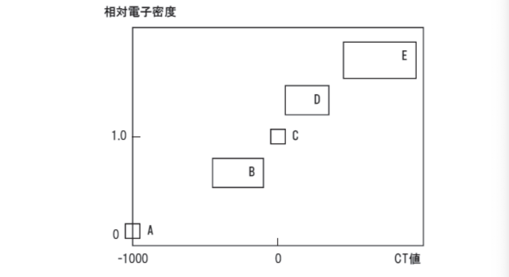
CT画像で，図のA～Eに該当する物質及び組織で正しいのはどれか。2つ選べ。A～E は水，空気，骨皮質，骨格筋，脂肪組織のいずれかである。  
`A - 空気` `B - 水` `C - 骨皮質` `D - 骨格筋` `E - 脂肪組織`  

[2014-03](http://www.radiology.jp/content/files/1377.pdf#page=1)
CT (Computed Tomography) について**誤っている**のはどれか。1つ選べ。  
`CT dose indexとは照射線量の指標である。`  
`単純CTで甲状腺のCT値は100HU前後である。`  
`骨皮質のCT値は1000HUを超える場合がある。`  
`水 (脳脊髄液など) のCT値はほぼ0HUである。`  
`検出器チャンネルの不具合でリングアーチファクトが生じる。`  

[2012-08](http://www.radiology.jp/content/files/2012_1s_exsam.pdf#page=3)
**誤っている**のはどれか。1つ選べ。  
`タングステンはX線管球に用いられる。  `  
`X線CT画像ではスライス厚を薄くすると部分体積効果の影響が減少する。`  
`超音波は組織間に音響インピーダンスの差が小さいほど強く反射する。`  
`荷電粒子が結晶に入射したとき閃光を発する物質をシンチレータという。`  
`陽電子は陰電子と結合して消滅するとき，2本の放射線を正反対の方向に放出する。`  

[2014-13](http://www.radiology.jp/content/files/1377.pdf#page=5)
小児の腹部CTにおける被ばく低減策として**誤っている**のはどれか。1つ選べ。  
`管電流を下げる。`  
`管電圧を下げる。`  
`スキャン範囲を限定する。`  
`ピッチファクターを小さくする。`  
`Automatic Exposure Control（AEC）を活用する。`  

[2016-13](http://www.radiology.jp/content/files/20160825.pdf#page=5)
小児の腹部CTにおける被ばく低減策として正しいのはどれか。2つ選べ。  
`管電流を下げる。`  
`管電圧を上げる。`  
`ピッチファクターを大きくする。`  
`AEC（automatic exposure control）を使用しない。`  
`寝台（クレードル）をガントリーの中心より低くする。`  

[2017-11](http://www.radiology.jp/content/files/20170904_2.pdf#page=5)
CT検査を受ける患者の被ばく低減に有用なのはどれか。2つ選べ。  
`電圧を上げる。`  
`電流を上げる。`  
`多相撮影を推奨する。`  
`ガントリーの中心に患者を置く。`  
`撮影範囲を必要最小限にする。`  

## MRI総論
◎[2013-03](http://www.radiology.jp/content/files/2013_2s_exsam.pdf#page=1)
MR hydrography に**含まれない**のはどれか。1つ選べ。  
`MR urography` `MR sialography` `MR myelography` `MR tractography` `MR cholangiopancreatography`  

**こたえ**
- 2013-03: `MR tractography`

◎[2017-07](http://www.radiology.jp/content/files/20170904_2.pdf#page=4)
MRI で高信号を示すのはどれか。2つ選べ。  
`T2 強調像での線維化`  
`T2 強調像での石灰化`  
`T1 強調像でのメラニン`  
`FLAIR 像でのヘモジデリン`  
`T1 強調像でのメトヘモグロビン`  

◎[2016-02](http://www.radiology.jp/content/files/20160825.pdf#page=1)
物質・病態と MRI の信号強度との組み合わせとして正しいのはどれか。1つ選べ。  
`線維化 - T2 強調像で高信号`  
`メラニン - T2 強調像で高信号`  
`速い血流 - T2 強調像で高信号`  
`脂肪沈着 - T1 強調像で高信号`  
`粘稠な液体 - T1 強調像で低信号`  

◎[2014-51](http://www.radiology.jp/content/files/1377.pdf#page=18)
MRIのT1強調像で高信号を呈しやすいのはどれか。2つ選べ。  
`腎癌` `副腎腺腫` `前立腺癌` `高分化型脂肪肉腫` `卵巣内膜症性囊胞`  

【Hbの経時的変化とMRI所見】

- 赤血球内オキシHb（HbO2）: 反磁性体
- 赤血球内デオキシHb（Hb）: 磁性体。磁化率artifact(+)
- 赤血球内メトHb（MetHb）: 反磁性体，T1短縮
- 遊離メトHb（MetHb）: 反磁性体，T1短縮
- 貪食細胞内ヘモジデリン: 磁性体

**こたえ**
- 2017-07: `T1 強調像でのメラニン`, `T1 強調像でのメトヘモグロビン`  
- 2016-02: `脂肪沈着 - T1 強調像で高信号`  
- 2014-51: `高分化型脂肪肉腫`, `卵巣内膜症性囊胞`  

◎[2013-64](http://www.radiology.jp/content/files/2013_2s_exsam.pdf#page=22)
MRI において脂肪抑制法として用いられるのはどれか。2つ選べ。  
`EPI 法` `GRE 法` `STIR 法` `FLAIR 法` `CHESS 法`  

◎[2015-04](http://www.radiology.jp/content/files/20150821.pdf#page=2)
MRIの脂肪抑制法は水と脂肪の物質特性の違いを利用している。物質特性として一般的なのはどれか。2つ選べ。  
`拡散係数` `縦緩和時間` `横緩和時間` `共鳴周波数` `プロトン密度`  

◎[2013-04](http://www.radiology.jp/content/files/2013_2s_exsam.pdf#page=2)
MRIにおけるケミカルシフトアーチファクトの原因はどれか。1つ選べ。  
`励起磁場の不均一性` `物質間の磁化率の差` `受信コイルの感度むら` `物質間の誘導電流の差` `物質間の共鳴周波数の差`  

◎[2018-08](http://www.radiology.jp/content/files/20180926_2.pdf#page=5)
MRI の脂肪抑制法について正しいのはどれか。2 つ選べ。
`脂肪の中心周波数は水よりも低い。`  
`STIR 法では脂肪以外は抑制されない。`  
`スピンエコー（SE）法以外は使用できない。`  
`水選択励起法は局所磁場変動に影響されない。`  
`周波数選択的脂肪抑制法は静磁場強度が高い方が脂肪抑制効果が良好である。`  

【Chemical Shiftについて】

- 電子がプロトンから離れるほど遮蔽効果が弱まり実効磁場が大きくなるため周波数が大きくなる.
- 電気陰性度は O > C なので, 水のプロトンのほうが脂肪のプロトンよりも共鳴周波数が大きい.

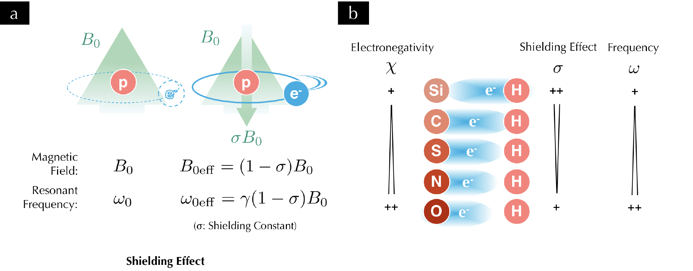

**こたえ**
- 2013-64: `STIR 法`, `CHESS 法`
- 2015-04: `縦緩和時間`, `共鳴周波数` 
- 2013-04: `物質間の共鳴周波数の差`
- 2018-08: `脂肪の中心周波数は水よりも低い。`, `周波数選択的脂肪抑制法は静磁場強度が高い方が脂肪抑制効果が良好である。` 

◎[2016-03](http://www.radiology.jp/content/files/20160825.pdf#page=1)
市販の超伝導 MRI 装置の筐体（MRI 装置の本体，ガントリー）に組みこまれて**いない**のはどれか。1つ選べ。  
`シムコイル` `表面コイル` `静磁場コイル` `傾斜磁場コイル` `照射コイル（RF コイル）`  

◎[2019-07](http://www.radiology.jp/content/files/20190904_02.pdf#page=4)
MRIの時定数T1に関して正しいのはどれか。2つ選べ。  
`位相分散の速さを表す。`  
`同一組織ではT2より短い。`  
`エネルギー放出の速さを表す。`  
`分子運動の方向性が関与する。`  
`スピン―格子緩和時間に相当する。`  

◎[2014-02](http://www.radiology.jp/content/files/1377.pdf#page=1)
MRIについて**誤っている**のはどれか。1つ選べ。  
`T1緩和時間は T2 緩和時間よりも長い。`  
`1.5T以上の高磁場装置は超伝導装置が多い。`  
`拡散強調画像において脳脊髄液は高信号となる。`  
`外国に比べてわが国は永久磁石装置の普及率が高い。`  
`超電導磁石の冷却は液体ヘリウムによって行われている。`  

【緩和時間】

- T1時間は周囲の分子とのエネルギー授受に要する時間 (スピン格子緩和)
    - 周囲の分子運動の周波数がプロトンの運動の周波数（ラーモア周波数）に近いほどエネルギー授受が早い＝T1時間が短い
        - 脂肪：ラーモア周波数に近い＝T1緩和早い＝T1 high
        - 純粋な水：ラーモア周波数よりかなり高＝T1緩和遅い＝T1 low
        - 蛋白溶液：ラーモア周波数よりやや高＝T1緩和やや遅い＝T1 iso-low
- T2時間は局所磁場の不均一性による位相分散に要する時間 (スピンスピン緩和)
    - 固体：プロトン同士が近接＝分散速い＝T2緩和速い＝T2 low
    - 液体：プロトン同士が遠い＝分散遅い＝T2緩和遅い＝T2 high

**こたえ**
- 2016-03: `表面コイル`
- 2019-07: `エネルギー放出の速さを表す。`, `スピン―格子緩和時間に相当する。` 
- 2014-02: `拡散強調画像において脳脊髄液は高信号となる。`

◎[2013-67](http://www.radiology.jp/content/files/2013_2s_exsam.pdf#page=23)
MRI のアーチファクト**でない**のはどれか。1つ選べ。  
`リングアーチファクト`  
`折り返しアーチファクト`  
`ジッパーアーチファクト`  
`クロストークアーチファクト`  
`トランケーションアーチファクト`  

◎[2012-07](http://www.radiology.jp/content/files/2012_1s_exsam.pdf#page=3)
MRIについて正しいのはどれか。2つ選べ。  
`折り返しアーチファクトは周波数エンコード方向に生じやすい。`  
`エコープラナー法は磁化率アーチファクトの影響を受けにくい。`  
`拍動流に伴うアーチファクトは位相エンコードの方向に観察される。`  
`撮像条件を同一とした場合，化学シフトアーチファクトは磁場強度が高いほど大きくなる。`  
`グラディエントエコー法は，スピンエコー法と比べて磁化率アーチファクトの影響を受けにくい。`  

【k-spaceエンコーディングとアーチファクト】

- 1回の信号収集で区別できるのは周波数エンコーディング方向の座標
- 複数回の信号収集によって連立方程式を解かないと区別できないのは位相エンコーディング方向の座標

**こたえ**
- 2013-67: `リングアーチファクト`
- 2012-07: `拍動流に伴うアーチファクトは位相エンコードの方向に観察される。`, `撮像条件を同一とした場合，化学シフトアーチファクトは磁場強度が高いほど大きくなる。`

## US総論
[2014-52](http://www.radiology.jp/content/files/1377.pdf#page=18)
体外式超音波検査が適していないのはどれか。1 つ選べ。
a 膵癌
b 脂肪肝
c 腎結石
d 胆囊腺筋腫症
e 膵管癒合不全

## 造影剤
◎[2016-11](http://www.radiology.jp/content/files/20160825.pdf#page=4)
ヨード造影剤使用に際して注意が必要な疾患はどれか。2つ選べ。  
`小細胞肺癌` `重症筋無力症` `甲状腺機能亢進症` `シェーグレン症候群` `副甲状腺機能亢進症`  

◎[2012-12(改題)](http://www.radiology.jp/content/files/2012_1s_exsam.pdf#page=4)
造影剤を慎重投与しなければならないのはどれか。1つ選べ。  
`腎不全` `重症筋無力症` `気管支喘息` `多発性骨髄腫` `重篤な甲状腺疾患`  

◎[2017-13](http://www.radiology.jp/content/files/20170904_2.pdf#page=6)
ヨード造影検査について**誤っている**のはどれか。1つ選べ。  
`検査前の腎機能評価には eGFR が推奨されている。`  
`緊急検査の場合も可能な限り事前にリスクを説明する。`  
`検査直前の静注ステロイド投与は副作用低減に有効である。`  
`造影剤腎症のリスク低減に検査前後の生理食塩水投与が有効である。`  
`喘息患者は治療で安定していても副作用発生リスクが健常人より高い。`  

◎[2015-11](http://www.radiology.jp/content/files/20150821.pdf#page=4)
非イオン性ヨード造影剤を静注した場合の副作用の症状として，最も高頻度にみられるのはどれか。1つ選べ。  
`熱感` `発疹` `嘔吐` `めまい` `血圧低下`  

◎[2014-10](http://www.radiology.jp/content/files/1377.pdf#page=4)
ヨード造影剤使用の際に副作用のリスクをあげる薬剤はどれか。2つ選べ。  
`チアミン` `コルヒチン` `アスコルビン酸` `ビグアナイド系糖尿病薬` `非ステロイド系抗炎症薬`  

◎[2012-11](http://www.radiology.jp/content/files/2012_1s_exsam.pdf#page=4)
非イオン性ヨード造影剤の副作用について**誤っている**のはどれか。1つ選べ。  
`心理的要因によって起こりうる。`  
`3～5％の患者に何らかの副作用が生じる。`  
`投与後1時間以上経過して発症することがある。`  
`重篤な副作用にはしばしば前駆症状がみられる。`  
`アナフィラキシー様反応は用量依存性に発生する。`  

◎[2012-13](http://www.radiology.jp/content/files/2012_1s_exsam.pdf#page=5)
細胞外液性ガドリニウム製剤について正しいのはどれか。1つ選べ。  
`通常胆道系から排泄される。`  
`造影剤濃度と信号強度は比例する。`  
`副作用の頻度はCT用造影剤よりも高い。`  
`体内動態はヨード系造影剤と同様である。`  
`透析を行っていれば腎不全の患者に投与可能である。`  

【造影剤の絶対禁忌, 原則禁忌, 慎重投与】

- 絶対禁忌
    - ヨード/Gd造影剤に過敏症の既往歴がある
    - CTのみ: 重篤な甲状腺疾患あり(コントロールされていない甲状腺機能亢進症)
    - CTのみ: ビグアナイド内服中
- 原則禁忌
    - 気管支喘息あり (無治療で5年以上発作なく経過しているか, 小児喘息の治癒後でなければ禁忌)
    - 重篤な腎障害 (無尿など)
    - 重篤な肝障害
    - 重篤な心障害
    - 褐色細胞腫あり, もしくは褐色細胞腫疑い
    - マクログロブリン血症
    - テタニー
- 慎重投与すべき疾患
    - 腎機能障害 (腎不全に至っている場合は禁忌)
    - 重症筋無力症
    - 甲状腺機能亢進症
    

【造影剤の副作用】

- ヨード造影剤の熱感は生理的反応としてよい

**こたえ**
- 2016-11: `重症筋無力症`, `甲状腺機能亢進症`
- 2012-12: `重症筋無力症`
- 2017-13: `検査直前の静注ステロイド投与は副作用低減に有効である。`
- 2015-11: `嘔吐` 
- 2014-10: `ビグアナイド系糖尿病薬`, `非ステロイド系抗炎症薬`
- 2012-11: `アナフィラキシー様反応は用量依存性に発生する。` 
- 2012-13: `体内動態はヨード系造影剤と同様である。`  

## 医療情報
### 電子診療録
◎[2018-10](http://www.radiology.jp/content/files/20180926_2.pdf#page=5)
 電子保存の三原則（基準）の中の真正性について**誤っている**のはどれか。1 つ選べ。
`書き換えを防止する。`  
`入力者の認証を行う。`  
`保存された情報を速やかに表示できる。`  
`代行操作を認める場合は運用管理規程で定める。`  
`一旦確定した診療録などを更新した場合，更新履歴を保存する。`  

◎[2017-14](http://www.radiology.jp/content/files/20170904_2.pdf#page=6)
診療録等の電子保存の三原則のうち，保存性に該当するのはどれか。2つ選べ。  
`使用者認証を必須とした。`  
`代行者による診療録入力を作成責任者が承認した。`  
`停電による意図しないデータ喪失が起こらないようにした。`  
`患者 ID が何らかの理由で二重になった場合に ID の統合を行えるようにした。`  
`PACS サーバ交換時に旧サーバに保存された画像が継続的に閲覧できるようにした。`  

◎[2015-14](http://www.radiology.jp/content/files/20150821.pdf#page=4)
電子カルテにおける電子保存について正しいのはどれか。1つ選べ。  
`電子保存の五原則を遵守する必要がある。`  
`電子カルテの保管期限は 20 年と定められている。`  
`電子化医用画像の保管期限は 10 年と定められている。`  
`システム更新で旧来の記録が利用不能になっても保存性は確保できる。`  
`権限保有者からの要求に基づき肉眼で見読可能な状態にできることを見読性という。`  

【電子保存の三原則】

厚労省の医療情報システム安全管理に関するガイドラインによれば, 法的に保存義務のある文書などの電子保存の要件が3つある.

- 真正性: 作成者がわかること, 改竄の恐れがないこと.
- 保存性: 復元が可能なように保存されていること.
- 見読性: 人間にとって可読性のあるように保存されていること.

**こたえ**
- 2018-10: `保存された情報を速やかに表示できる。`
- 2017-14: `停電による意図しないデータ喪失が起こらないようにした。`,  `PACS サーバ交換時に旧サーバに保存された画像が継続的に閲覧できるようにした。` 
- 2015-14: `権限保有者からの要求に基づき肉眼で見読可能な状態にできることを見読性という。` 

### 放射線部門システム
◎[2018-09](http://www.radiology.jp/content/files/20180926_2.pdf#page=5)
放射線検査におけるRISの機能について正しいのはどれか。2つ選べ。  
`画像閲覧` `画像診断` `検査依頼` `撮影実施情報管理` `検査依頼情報の撮影装置への送付`  

◎[2019-14](http://www.radiology.jp/content/files/20190904_02.pdf#page=6)
PACSの基本機能**でない**のはどれか。1つ選べ。
`画像検索` `画像参照` `画像生成` `画像配信` `画像保管`  

【RIS(医療情報第6版 医療情報システム編 3.9.7章より)】

- 画像検査のうえでの情報の一連の流れ:
    - (1) HIS -> RIS に依頼オーダーが発行される.
    - (2) RIS上で依頼オーダー受付を行う.
    - (3) RIS <-> 撮像装置間で依頼情報のやりとりを行う.
    - (4) 撮像装置で撮像を行う. 撮像された画像は, 撮像装置 -> 検像システム -> PACSサーバーのように送信, 保管される.
    - (5) 撮像装置 -> RIS に検査実施通知が送られる. 
    - (6) RIS -> HIS に実施オーダーを発行する.
    - (7) HIS -> 医事会計システムに実施情報通知が送られる.

【PACS(医療情報第6版 医療情報システム編 3.3.5章より)】

- PACS (Picture Archiving and Communication System) とは?
    - 役割: 画像診断装置から送られる画像データを電子的に保管し, かつネットワークを介してさまざまな端末から閲覧できるようにする.
        - 1: 撮像装置から画像データを受け取る.
        - 2: 受け取った画像データを保存する.
        - 3: 画像処理を行うワークステーション, 検像端末, 電子カルテ端末, レポーティングシステム端末などに必要に応じて画像を送信する.

**こたえ**
- 2018-09: `撮影実施情報管理`, `検査依頼情報の撮影装置への送付` 
- 2019-14: `画像生成`

### 医療情報の標準化
◎[2017-15](http://www.radiology.jp/content/files/20170904_2.pdf#page=7)
医療情報の標準化として**誤っている**のはどれか。1つ選べ。
`医用画像の標準化と同義である。`  
`通信プロトコルの標準化が必要である。`  
`DICOM 規格は医用画像の国際標準である。`  
`電子カルテの標準規格として HL7 が広く使われている。`  
`医療情報の施設間交換システムの作成に有用である。`  

【医療情報の規格(医療情報第6版 医療情報システム編 6.2章より)】

医療情報分野における代表的な標準規格には以下のようなものがある:
- DICOM (Digital Imaging and Communications in Medicine)
    - 医用画像における画像検査のデータ生成とデータ通信に利用される標準規格. 詳細は後述.
- HL7 (Health Level 7)
    - 病院間で診療データをスムーズに交換するための国際規約. 簡単にいうと電子カルテの標準規格.
    - Level 7という名称はOSI参照モデルの第7層のアプリケーション層を主な対象としていることから.
    - つまり, そもそもその下層部分にあたる通信プロトコルなどが病院間で一致していなければ診療データの交換はできない.
- IHE (Integrating the Healthcare Enterprise)
    - RSNA(北米放射線学会)とHIMSS(医療情報管理システム協会: The Healthcare Information and. Management System Society)の合同事業.
    - 病院内で発生する種々のワークフローにあわせて, 業務シナリオ(統合プロファイル)とそれを実現するための標準規格の組み合わせ(テクニカル・フレームワーク)をパッケージ化して策定している.

**こたえ**
- 2017-15: `医用画像の標準化と同義である。`

◎[2014-15](http://www.radiology.jp/content/files/1377.pdf#page=6)
DICOM 規格について正しいのはどれか。1つ選べ。  
`通信を規定している。`  
`ヘッダーは規定していない。`  
`ISO 認定の国際標準規格ではない。`  
`一種類の画像形式のみ使用可能である。`  
`放射線画像検査以外には使用できない。`  

◎[2012-15](http://www.radiology.jp/content/files/2012_1s_exsam.pdf#page=5)
DICOM について**誤っている**のはどれか。1つ選べ。  
`医用画像のフォーマットと通信プロトコルの規格である。`  
`すべての医用画像モダリティはこの規格に準拠している。`  
`Digital Imaging and Communications in Medicine の略である。`  
`Modality Working Management（MWM）はその機能の一つである。`  
`DICOM3.0 は 8 つのサービスクラスと呼ばれる機能で成り立っている。`  

[2013-09](http://www.radiology.jp/content/files/2013_2s_exsam.pdf#page=3)
放射線診療に関連する IT 用語の組み合わせで**関係ない**のはどれか。1つ選べ。  
`DICOM ―――― 医用画像`  
`GSDF ――――― 画像表示`  
`CPI ―――――― コスト効率`  
`HL7 ―――――― 電子カルテ`  
`IHE ―――――― 医療機関情報統合`  

【DICOM規格の詳細 (医療情報第6版 医療情報システム編 6.2章より)】

- 歴史
    - 前身はACRとNEMA(米国電気工業会: National Electrical Manufacturers Association)が策定したACR-NEMA規格.
    - 1993年にRSNAによってDICOMとして承認された.
    - 2006年にISOに承認され, 国際標準規格となった (当時はISO12052:2006. 現在はISO12052:2017が最新版).
    - 現在では放射線画像以外にも眼科, 内視鏡, 病理, 超音波などにも広がっている.
- 全体の構成
    - 規格書本体(Base standard)と補遺(Supplement)からなる.
- 情報モデルとオブジェクト
    - オブジェクトと, それに対して処理を行う機能であるサービスの組み合わせである, SOP (Service Object Pair)を単位として通信や処理を定義している.
        - サービスクラスとしては次のようなものがある:
            - 保存 Storage
            - 検索と取得 Query/Retrieve
            - モダリティワークリスト管理 MWM (Modality Worklist Management)
            - 交信確認 Verification
        - オブジェクトクラスとしてはCT, MRI, 取り込み画像, 単純X線などがある.
    - また, そのサービスクラスの機能の提供者をSCP (Service Class Provider), 利用者をSCU (Service Class User)とよぶ.
    - 装置の機能は, SOPとSCP/SCUの関係を単位として実装されている.

**こたえ**
- 2014-15: `通信を規定している。`
- 2012-15: `DICOM3.0 は 8 つのサービスクラスと呼ばれる機能で成り立っている。`
- 2013-09: 

### 地域医療と遠隔診療
◎[2016-15](http://www.radiology.jp/content/files/20160825.pdf#page=5)
地域医療連携に必要な医療情報システムの方針で正しいのはどれか。1つ選べ。  
`医療情報連携の目的には医療の質の向上を含む。`  
`地域医療連携での情報交換は専用線で行うようにする。`  
`医療施設間の情報交換は情報の種類にかかわらず匿名化が必要である。`  
`他院で取得された情報を利用する場合，該当患者による閲覧許可は不要である。`  
`患者医療情報は当該患者の診療に関与しない医師や看護師にも閲覧可能とする。`  

◎[2014-14](http://www.radiology.jp/content/files/1377.pdf#page=6)
遠隔画像診断について正しいのはどれか。1つ選べ。
`診療ではなく応談（コンサルテーション）である。`  
`画像は遠隔画像診断側にも保存の義務がある。`  
`診断する画像は匿名化した状態で伝送して匿名化のまま読影する。`  
`読影に不足する情報を依頼側から随時取得できる体制が必要である。`  
`緊急処置を要する所見を発見してもレポートに記載すれば迅速な直接連絡は必要ない。`  

【地域連携】

【遠隔医療】

- 日本遠隔医療学会による定義: 「通信技術を活用して離れた2拠点間で行われる医療活動全体を指す」
- 医師法20条のみずから診療せずに治療してはならないという定めがネックであったが, 厚労省による発令や事務連絡によって遠隔医療が可能となった.
- 2018年4月に診療報酬加算点数が認められるようになった.
- 対象はDtoPのみならず, DtoD, DtoNtoP, DtoNなどがある.
- 主なものにテレラジオロジー, テレパソロジー, 遠隔カンファレンス, 遠隔診療などがある.
- ほか, 慢性期患者のモニタリングや救急搬送モニタリングなども行われている.

**こたえ**
- 2016-15: `医療情報連携の目的には医療の質の向上を含む。`
- 2014-14: `読影に不足する情報を依頼側から随時取得できる体制が必要である。`

### 画像診断用モニタ

[2019-15](http://www.radiology.jp/content/files/20190904_02.pdf#page=6)
診断を行う際に 5 メガピクセルのモニターが推奨される検査はどれか。1 つ選べ。
a	 MRI
b	 PET
c	 超音波検査
d	 胸部 X 線撮影
e	 マンモグラフィ

[2012-14](http://www.radiology.jp/content/files/2012_1s_exsam.pdf#page=5)
画像診断用モニタについて正しいのはどれか。1 つ選べ。
a CT の画像観察では 50 万画素モニタが推奨される。
b カラーモニタはモノクロモニタの代替とはならない。
c 胸部 X 線写真では輝度が 20％ 低下すると精度が劣化する。
d マンモグラフィの画像観察では 500 万画素モニタが推奨される。
e モニタ管理用標準テストパターン（TG-18QC）のグレースケールは 8 階調である。

### 個人情報保護
◎[2013-10](http://www.radiology.jp/content/files/2013_2s_exsam.pdf#page=4)
電子化放射線部門システムでの患者情報の診療への利用に際し，**好ましくない**のはどれか。1つ選べ。  
`読影室への入室制限`  
`レポート端末のスクリーンロック`  
`遠隔画像診断時の患者基本情報の削除`  
`画像の記録媒体書き出し時の匿名化機能`  
`電子カルテとレポーティングシステムの患者同期`  

◎[2015-15](http://www.radiology.jp/content/files/20150821.pdf#page=5)
個人情報保護について**誤っている**のはどれか。1つ選べ。
`偽りその他不正の手段による個人情報の取得は禁止である。`  
`本人の同意を得ない個人データの第三者提供は原則禁止である。`  
`個人情報の取り扱い時は利用目的をできる限り特定すべきである。`  
`本人から直接個人情報を取得する場合の利用目的は明示する必要がある。`  
`同意取得後であれば特定された目的以外の利用でも本人の同意は不要である。`  

【個人情報保護(医療情報第6版 医療情報システム編)】

関連法規
- 個人情報保護法2009年4月に施行, 改正個人情報保護法2017年5月に施行.
    - 罰則規定が追加された(個人情報データベース等不正提供罪).
    - 個別の同意取得が不要となるようなオプトアウト手続きは, 個人情報保護委員会に届出しなければ行えないようになり, より厳格化された.
- 個人情報取扱事業者に対する監督業務は個人情報保護委員会が一手に引き受ける.
- 改正個人情報保護法における個人情報の定義:
    - 個人識別符合: いわゆる識別子のこと. 生体情報や公的に発行された番号が含まれる.
    - 要配慮個人情報: 人種, 信条, 犯罪, 病歴, 社会的身分などの情報.
        - 要配慮個人情報は取得時に原則として本人の同意を得なければならない. また, **オプトアウト手続きによる第三者提供は認められていない**.
    - 匿名加工情報: 個人情報の保護に関する法律についてのガイドラインに定められている匿名化処理を経た情報.
        - 匿名加工情報に対しては規制が緩くなり, 本人の同意を得ずに利活用したりすることが可能となる.
        - 具体的には識別子(氏名や年齢など, および個人識別符合)や識別子となりうる記述(稀少疾患など)の削除
        - また情報を相互に連結する符合の削除も必要.
        - 詳細はガイドラインを参照.

**こたえ**
- 2013-10: `遠隔画像診断時の患者基本情報の削除`
- 2015-15: `同意取得後であれば特定された目的以外の利用でも本人の同意は不要である。`

## ほか
[2017-12](http://www.radiology.jp/content/files/20170904_2.pdf#page=6)
医療事故調査制度について正しいのはどれか。2 つ選べ。
a	 解剖が必要である。
b	 診療所も対象である。
c	 予期した死亡も含む。
d	 対象は死亡と死産である。
e	 死亡時画像診断が必要である。

[2016-14](http://www.radiology.jp/content/files/20160825.pdf#page=5)
保険診療として正しいのはどれか。2 つ選べ。
a	 健康診断には保険を使用しない。
b	 検査は可能な限り多種類を行い誤診を防ぐ。
c	 研究目的の検査を行う場合は研究費で支払う。
d	 患者の職業や環境などの社会的事情には注意を払わなくてよい。
e	 自院発行の院外処方箋は特定の薬局で調剤するように患者に指導する。

# 画像診断各論
## 脳
### 撮像法
◎[2018-16](http://www.radiology.jp/content/files/20180926_2.pdf#page=7)
頭部 MR アンギオグラフィを表示するのに通常用いる処理法はどれか。1 つ選べ。
`曲断面画像再構成`  
`多断面画像再構成`  
`3次元画像作成法（volume rendering 法）`  
`最小値投影法（minimal intensity projection 法）`  
`最大値投影法（maximum intensity projection 法）`  

**こたえ**
- 2018-16: `最大値投影法（maximum intensity projection 法）`

### 解剖
[2019-19](http://www.radiology.jp/content/files/20190904_02.pdf#page=8)
頭蓋底の構造とそれを通るものの組み合わせで正しいのはどれか。2 つ選べ。
a	 上眼窩裂　 　視神経
b	 棘孔　 　中硬膜動脈
c	 Dorello 管　 　外転神経
d	 Meckel 腔　 　動眼神経
e	 正円孔　 　三叉神経第 1 枝

[2015-23](http://www.radiology.jp/content/files/20150821.pdf#page=8)
頭蓋底の正常解剖に関する組み合わせとして誤っているのはどれか。1 つ選べ。
a	 正円孔 上顎神経
b	 卵円孔 下顎神経
c	 翼突管 舌咽神経
d	 前庭水管 内リンパ管
e	 棘　孔 中硬膜動脈

[2016-19](http://www.radiology.jp/content/files/20160825.pdf#page=7)
視床を栄養する穿通枝群が主に分岐する動脈はどれか。1つ選べ。
a	 内頸動脈
b	 椎骨動脈
c	 前大脳動脈
d	 中大脳動脈
e	 後大脳動脈

### 正常所見
[2019-16](http://www.radiology.jp/content/files/20190904_02.pdf#page=7)
頭部単純 CT で生理的石灰化が見られる頻度が最も**低い**のはどれか。1 つ選べ。
`脈絡叢` `松果体` `淡蒼球` `下垂体` `小脳歯状核`  

[2017-16](http://www.radiology.jp/content/files/20170904_2.pdf#page=7)
頭蓋内生理的石灰化の好発部位はどれか。2つ選べ。  
`視床` `被殻` `淡蒼球` `下垂体` `手綱交連`  

### XJO. 中枢神経発生異常
[2014-28](http://www.radiology.jp/content/files/1377.pdf#page=10)
Chiari 奇形 I 型について正しいのはどれか。1 つ選べ。
a 後頭蓋窩の低形成を伴う。
b 常染色体優性遺伝である。
c 脊髄空洞症を高率に合併する。
d 生下時に診断されることが多い。
e 小脳虫部が脊柱管内に下垂している。

### XJT. 頭部外傷
[2017-17](http://www.radiology.jp/content/files/20170904_2.pdf#page=7)
 MRI としてびまん性軸索損傷を最も鋭敏に検出できるのはどれか。1 つ選べ。
a	 T1 強調像
b	 T2 強調像
c	 T2＊強調像
d	 拡散強調像
e	 磁化率強調像

[2016-17](http://www.radiology.jp/content/files/20160825.pdf#page=6)
出血性のびまん性軸索損傷を鋭敏に検出できるのはどれか。2つ選べ。
a	 T1 強調像
b	 T2 強調像
c	 T2＊強調像
d	 拡散強調像
e	 磁化率強調像

[2016-20](http://www.radiology.jp/content/files/20160825.pdf#page=7)
くも膜下出血の検出に最も有用なのはどれか。1 つ選べ。
a	 FLAIR 像
b	 T1 強調像
c	 T2 強調像
d	 拡散強調像
e	 プロトン密度強調像

[2012-25](http://www.radiology.jp/content/files/2012_1s_exsam.pdf#page=9)
クモ膜下出血の診断に最も有用なのはどれか。1 つ選べ。
a FLAIR 像
b T1 強調像
c T2 強調像
d 拡散強調像
e 脂肪抑制 T2 強調像

[2015-17](http://www.radiology.jp/content/files/20150821.pdf#page=6)
 頭部外傷について誤っているのはどれか。1 つ選べ。
a	 急性硬膜外血腫ではしばしば近傍に骨折を伴う。
b	 軸索損傷の診断には MRI の T2＊強調像が有効である。
c	 静脈洞損傷による硬膜外血腫は縫合を越えて広がる。
d	 典型的な脳挫傷の CT では高吸収と低吸収が混在する。
e	 少量の急性硬膜下血腫の CT では狭いウインドウ幅が有効である。

[2015-18](http://www.radiology.jp/content/files/20150821.pdf#page=7)
頭部外傷に伴う急性硬膜外血腫の責任血管として**考えにくい**のはどれか。1 つ選べ。
a	 皮質動脈
b	 板間静脈
c	 中硬膜静脈
d	 中硬膜動脈
e	 硬膜静脈洞

### XJC. 脳血管障害
[2018-18](http://www.radiology.jp/content/files/20180926_2.pdf#page=8)
脳梗塞の画像所見として正しいのはどれか。2つ選べ。
`超急性期の ADC 低下は血管性浮腫を反映する。`  
`超急性期の early CT sign は灰白質の低濃度化を反映する。`  
`超急性期の CT で hyperdense MCA sign がみられる。`  
`亜急性期以降には ADC が低下する。`  
`慢性期には T2 強調像で低信号を示す。`  

[2017-18](http://www.radiology.jp/content/files/20170904_2.pdf#page=8)
急性期脳梗塞の画像所見として**合致しない**のはどれか。1 つ選べ。
a	 fogging effect
b	 脳溝の狭小化
c	 hyperdense MCA sign
d	 皮髄境界の不明瞭化
e	 レンズ核の輪郭の不明瞭化

[2015-16](http://www.radiology.jp/content/files/20150821.pdf#page=6)
 脳梗塞について正しいのはどれか。1 つ選べ。
a	 超急性期脳梗塞では ADC は低下しない。
b	 CT 早期虚血サインは小脳に見られることが多い。
c	 分水嶺梗塞の原因はアテローム血栓性が多い。
d	 ラクナ梗塞の原因はほとんど心原性塞栓である。
e	 頭蓋内出血の有無にかかわらず rt-PA（アルテプラーゼ）静注療法を行う。

[2018-19](http://www.radiology.jp/content/files/20180926_2.pdf#page=8)
脳の静脈性血管腫 (静脈奇形) の診断に有用な MRI の撮影法はどれか。2つ選べ。  
`T1強調像` `拡散強調像` `磁化率強調像` `造影T1強調像` `time-of-flight MRA`  

[2018-20](http://www.radiology.jp/content/files/20180926_2.pdf#page=9)
感染性脳動脈瘤について**誤っている**のはどれか。1つ選べ。  
`前大脳動脈領域に多い。`  
`紡錘状や不整な形が多い。`  
`原因として感染性心内膜炎が多い。`  
`頭蓋内動脈壁の細菌感染により生じる。`  
`T2* 強調像で皮質・皮質下に点状～小結節状の低信号域を認める。`  

[2012-24](http://www.radiology.jp/content/files/2012_1s_exsam.pdf#page=8)
脳底動脈先端部の塞栓によって梗塞を生じるのはどれか。 2 つ選べ。
a 尾状核頭部
b 被殻
c 淡蒼球
d 視床
e 中脳

**こたえ**
- 2018-18: 
- 2018-19: 
- 2018-20: 

### XJF. 脱髄疾患
[2019-21](http://www.radiology.jp/content/files/20190904_02.pdf#page=8)
多発性硬化症との鑑別診断上，視神経脊髄炎で最も重要な所見はどれか。1 つ選べ。
a	 ovoid lesion
b	 視神経病変
c	 T1 black hole
d	 側脳室周囲病変
e	 3 椎体以上の脊髄病変

[2018-21](http://www.radiology.jp/content/files/20180926_2.pdf#page=9)
多発性硬化症の MRI 所見として**誤っている**のはどれか。1 つ選べ。  
`T2 black hole` `open-ring sign` `Dawson’s finger` `juxtacortical lesion` `ependymal dot-dash sign`  

**こたえ**
- 2019-21: 
- 2018-21: `T2 black hole`

### XJH. 中枢神経感染症
[2014-30](http://www.radiology.jp/content/files/1377.pdf#page=11)
単純ヘルペス脳炎の好発部位はどれか。2 つ選べ。
a 橋
b 島回
c 扁桃体
d 上前頭回
e 中心後回

[2012-23](http://www.radiology.jp/content/files/2012_1s_exsam.pdf#page=8)
免疫不全状態において発症するのはどれか。1つ選べ。
a Leigh 脳症
b 多発性硬化症
c Wernicke 脳症
d Creutzfeldt-Jakob 病
e 進行性多巣性白質脳症

### XJN0. 脳腫瘍
#### 髄膜腫
◎[2017-20](http://www.radiology.jp/content/files/20170904_2.pdf#page=8)
髄膜腫の画像所見として**誤っている**のはどれか。1つ選べ。  
`dural tail sign を高頻度に伴う。`  
`hypervascular な腫瘍であることが多い。`  
`周囲に浮腫を伴う場合は悪性髄膜腫を疑う。`  
`脳室内に発生する場合は側脳室三角部に多い。`  
`硬膜付着部近傍に hyperostosis を伴うことが多い。`  

◎[2014-26](http://www.radiology.jp/content/files/1377.pdf#page=10)
髄膜腫の画像所見について**誤っている**のはどれか。1つ選べ。  
`髄膜腫は脳室内に発生することがある。`  
`dural tail sign は髄膜腫に特異的である。`  
`硬膜付着部近傍に骨過形成を伴うことが多い。`  
`腫瘍に近接する副鼻腔が拡張することがある。`  
`神経線維腫症2型ではしばしば多発性にみられる。`  

【髄膜腫 (脳のMRIより)】

- 付着部に硬膜肥厚と骨増生をきたす. 硬膜肥厚はdural tail signの画像所見を与えるが, 髄膜腫に特異的なわけではない.
- 大きければそれだけで脳実質を圧排して脳浮腫をきたすことがある.
- 神経線維腫症2型で多発性にみられることがある.
- 脳室内に発生する場合は側脳室三角部にもっとも多い.

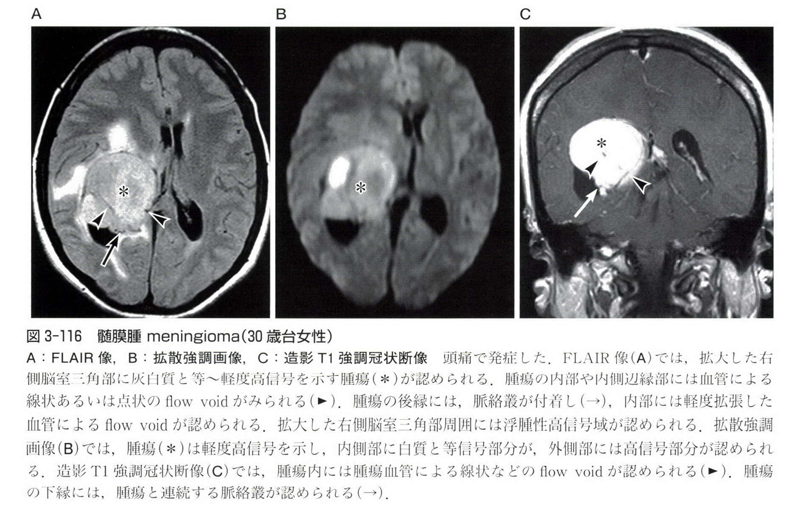

**こたえ**
- 2017-20: `周囲に浮腫を伴う場合は悪性髄膜腫を疑う。`
- 2014-26: `dural tail sign は髄膜腫に特異的である。`

#### 脳室内腫瘍
[2019-20](http://www.radiology.jp/content/files/20190904_02.pdf#page=8)
脳室に関連する病変と好発部位の組み合わせで誤っているのはどれか。1 つ選べ。
a	 コロイド囊胞　 　第 3 脳室
b	 脳室内髄膜腫　 　側脳室三角部
c	 未熟児の上衣下出血　 　尾状核近傍
d	 central neurocytoma 　透明中隔近傍
e	 上衣下巨細胞性星細胞腫　 Magendie 孔近傍

[2016-21](http://www.radiology.jp/content/files/20160825.pdf#page=7)
脳室内に発生しないのはどれか。1 つ選べ。
a	 髄膜腫
b	 上衣腫
c	 血管芽腫
d	 上衣下腫
e	 脈絡叢乳頭腫

#### 脳腫瘍の鑑別
[2017-19](http://www.radiology.jp/content/files/20170904_2.pdf#page=8)
石灰化が稀な腫瘍はどれか。1 つ選べ。
a	 髄膜腫
b	 聴神経鞘腫
c	 乏突起神経膠腫
d	 びまん性星細胞腫
e	 頭蓋咽頭腫（エナメル上皮腫型）

[2015-19](http://www.radiology.jp/content/files/20150821.pdf#page=7)
 脳腫瘍と好発部位との組み合わせとして正しいのはどれか。1 つ選べ。
a	 胚細胞腫 脈絡叢
b	 血管芽腫 小脳半球
c	 乏突起膠腫 頭頂葉
d	 頭蓋咽頭腫 斜台
e	 中枢性神経細胞腫（central neurocytoma） 側脳室下角

[2014-27](http://www.radiology.jp/content/files/1377.pdf#page=10)
画像所見として脳実質外腫瘍を示唆するのはどれか。2 つ選べ。
a 脳回の腫大
b 脳溝の狭小化
c くも膜下腔の開大
d 皮質動脈の頭蓋骨への接近
e 皮質静脈の頭蓋骨からの開離

#### 脊髄内腫瘍の疫学
[2015-20](http://www.radiology.jp/content/files/20150821.pdf#page=7)
 小児の脊髄内腫瘍として最も多いのはどれか。1 つ選べ。
a	 上衣腫
b	 血管芽腫
c	 星細胞腫
d	 神経節膠腫
e	 悪性リンパ腫

[2014-18](http://www.radiology.jp/content/files/1377.pdf#page=7)
成人の脊髄内腫瘍として最も多いのはどれか。1 つ選べ。
a 膠芽腫
b 上衣腫
c 血管芽腫
d 神経節膠腫
e 悪性リンパ腫

[2012-26](http://www.radiology.jp/content/files/2012_1s_exsam.pdf#page=9)
成人の脊髄髄内腫瘍の中で最も多いのはどれか。1 つ選べ。
a 上衣腫
b 星細胞腫
c 神経鞘腫
d 血管芽腫
e 神経節膠腫

### XJN1. 腫瘍随伴症候群
[2014-29](http://www.radiology.jp/content/files/1377.pdf#page=11)
腫瘍と関連して発症するのはどれか。1 つ選べ。
a MELAS
b Leigh 脳症
c Parkinson 病
d 抗 NMDA 受容体脳炎
e 抗アクアポリン 4 抗体陽性脊髄炎

### XJD. 中毒と基底核病変
[2016-16](http://www.radiology.jp/content/files/20160825.pdf#page=6)
 T1 強調像で淡蒼球が高信号を示さないのはどれか。1 つ選べ。
a	 肝性脳症
b	 マンガン中毒
c	 中心静脈栄養
d	 一酸化炭素中毒
e	 神経線維腫症 1 型

[2015-22](http://www.radiology.jp/content/files/20150821.pdf#page=8)
急性 CO 中毒症において障害されやすい部位はどれか。1 つ選べ。
a	 被　殻
b	 視　床
c	 淡蒼球
d	 尾状核
e	 大脳皮質

[2013-24](http://www.radiology.jp/content/files/2013_2s_exsam.pdf#page=8)
T1 強調像で被殻が高信号を呈するのはどれか。1 つ選べ。
a Wilson 病
b 肝性脳症
c トルエン中毒
d 多系統萎縮症
e 神経 Beçhet 病

### XJD. 下垂体
[2019-18](http://www.radiology.jp/content/files/20190904_02.pdf#page=7)
MRIのT1強調像で下垂体後葉の高信号が消失することが最も多いのはどれか。1つ選べ。
a	 Rathke 囊胞
b	 下垂体腺腫
c	 視床下部過誤腫
d	 鞍結節部髄膜腫
e	 鞍上部胚細胞腫瘍

[2014-25](http://www.radiology.jp/content/files/1377.pdf#page=9)
トルコ鞍部および傍鞍部の病変について正しいのはどれか。1 つ選べ。
a 若年女性では下垂体の腫大を認める。
b 視神経膠腫の組織型は膠芽腫が最も多い。
c ラトケ囊胞は T2 強調像で均一な高信号を呈する。
d ACTH 産生下垂体腺腫のほとんどは巨大腺腫である。
e リンパ球性下垂体炎が鞍上部に進展することは稀である。

### 脳画像診断ほか
◎[2019-17](http://www.radiology.jp/content/files/20190904_02.pdf#page=7)
ADC (apparent diffusion coefficient) が最も高値を示す病変はどれか。1つ選べ。  
`髄膜腫` `脳膿瘍` `くも膜囊胞` `悪性リンパ腫` `急性期脳梗塞`  

◎[2018-17](http://www.radiology.jp/content/files/20180926_2.pdf#page=8)
拡散強調像で拡散制限を**示しにくい**のはどれか。1つ選べ。  
`脳膿瘍` `脳内血腫` `悪性リンパ腫` `海綿状血管腫` `ヘルペス脳炎`  

◎[2017-21](http://www.radiology.jp/content/files/20170904_2.pdf#page=9)
MRIの拡散強調像でADCが低下するのはどれか。1つ選べ。
`温度上昇` `血管増生` `血管原性浮腫` `細胞密度増加` `慢性期脳梗塞`  

◎[2016-22](http://www.radiology.jp/content/files/20160825.pdf#page=8)
拡散強調像で低信号を示すのはどれか。1つ選べ。
`胚腫` `膠芽腫` `髄芽腫` `血管芽腫` `悪性リンパ腫`  

[2013-22](http://www.radiology.jp/content/files/2013_2s_exsam.pdf#page=8)
頭部拡散強調像で高信号を示すのはどれか。2つ選べ。
a 類上皮腫
b 神経鞘腫
c くも膜囊胞
d 悪性リンパ腫
e 毛様細胞性星細胞腫

◎[2012-22](http://www.radiology.jp/content/files/2012_1s_exsam.pdf#page=8)
頭部MRIの拡散強調像にて低信号を呈するのはどれか。1つ選べ。
`脳膿瘍` `類上皮腫` `くも膜囊胞` `急性期脳梗塞` `脳悪性リンパ腫`  

**こたえ**
- 2019-17: `くも膜嚢胞`
- 2018-17: `海綿状血管腫`
- 2017-21: `細胞密度増加`
- 2016-22: `血管芽腫`
- 2013-22:
- 2012-22: `くも膜囊胞`

[2013-26](http://www.radiology.jp/content/files/2013_2s_exsam.pdf#page=9)
Time of flight MR angiography において高信号なのはどれか。1 つ選べ。
a 脳実質
b 脈絡叢
c くも膜顆粒
d 下垂体後葉
e 内耳リンパ液

[2013-23](http://www.radiology.jp/content/files/2013_2s_exsam.pdf#page=8)
後頭葉病変として稀なのはどれか。1 つ選べ。
a 血管腫
b 膠芽腫
c 脳梗塞
d PRES（posterior reversible encephalopathy syndrome）
e MELAS（mitochondrial myopathy, encephalopathy, lactic acidosis, stroke-like episodes）

## 頭頸部
### XR. 眼窩
[2019-23](http://www.radiology.jp/content/files/20190904_02.pdf#page=9)
成人の眼窩の筋円錐内腫瘤として頻度が最も高いものはどれか。1 つ選べ。
a	 髄膜腫
b	 類表皮腫
c	 視神経膠腫
d	 悪性リンパ腫
e	 海綿状血管腫（奇形）

[2012-29](http://www.radiology.jp/content/files/2012_1s_exsam.pdf#page=10)
眼窩筋円錐内に発生しにくいのはどれか。 1 つ 選べ。
a 髄膜腫
b 類皮腫
c 神経膠腫
d 悪性黒色腫
e 悪性リンパ腫

[2016-24](http://www.radiology.jp/content/files/20160825.pdf#page=8)
 甲状腺眼症について正しいのはどれか。1 つ選べ。
a	 外眼筋の腱部が侵される。
b	 外眼筋肥厚は下直筋に最も多い。
c	 画像上両側性は 50％未満である。
d	 甲状腺機能が正常なのは 1％未満である。
e	 急性期に外眼筋は T2 強調像で低信号を呈する。

### XSa. 耳
[2019-24](http://www.radiology.jp/content/files/20190904_02.pdf#page=9)
上鼓室型（弛緩部型）真珠腫で見られることが最も少ない所見はどれか。1 つ選べ。
a	 耳小骨の侵食
b	 Prussak 腔病変
c	 鼓室天蓋の侵食
d	 顔面神経陥凹部の侵食
e	 鼓膜被蓋（scutum）の鈍化

[2018-25](http://www.radiology.jp/content/files/20180926_2.pdf#page=10)
真珠腫につき正しいのはどれか。2 つ選べ。
a	 鼓室硬化症を合併することはない。
b	 本邦では先天性真珠腫は鼓室後半部に多い。
c	 緊張部型真珠腫はしばしば Prussak 腔に生じる。
d	 弛緩部型真珠腫は耳小骨を外側に偏位させる。
e	 弛緩部型真珠腫は CT で scutum の鈍化がみられる。

[2017-22](http://www.radiology.jp/content/files/20170904_2.pdf#page=9)
中耳および内耳疾患の診断に MRI が CT よりも有用なのはどれか。1 つ選べ。
a	 骨化性迷路炎
b	 窓型耳硬化症
c	 耳小骨連鎖異常
d	 迷路内神経鞘腫
e	 上半規管裂隙症候群

### XSc. 咽喉頭
◎[2012-28](http://www.radiology.jp/content/files/2012_1s_exsam.pdf#page=10)
上咽頭癌のT分類として進展部位がT2に該当するのはどれか。1つ選べ。  
`眼窩` `副鼻腔` `Meckel洞` `傍咽頭間隙` `Rosenmüller 窩`  

◎[2017-23](http://www.radiology.jp/content/files/20170904_2.pdf#page=9)
上咽頭癌のTNM分類においてT4となる進展領域はどれか。2つ選べ。  
`眼窩` `上顎洞` `頭蓋底` `下咽頭` `傍咽頭間隙`  

◎[2014-16](http://www.radiology.jp/content/files/1377.pdf#page=6)
上咽頭癌のTNM分類においてT4となる進展領域はどれか。2つ選べ。  
`眼窩` `副鼻腔` `下咽頭` `頭蓋底（骨）` `傍咽頭間隙`  

◎[2016-23](http://www.radiology.jp/content/files/20160825.pdf#page=8)
頭頸部腫瘍のTNM分類で，Nカテゴリーが異なるのはどれか。1つ選べ。  
`口腔` `上咽頭` `中咽頭` `下咽頭` `喉頭`  

◎[2015-24](http://www.radiology.jp/content/files/20150821.pdf#page=9)
頭頸部癌のTNM分類において，病理組織型が病期分類に影響する部位はどれか。1つ選べ。  
`口腔` `咽頭` `喉頭` `鼻腔` `甲状腺`  

【頭頸部癌のstaging】

- 上咽頭癌のT因子
    - T1: 上咽頭, 中咽頭, 鼻腔にまで限局するが, 傍咽頭間隙には浸潤しない
    - T2: 傍咽頭間隙, 翼突筋, 椎前筋のいずれかに浸潤する
    - T3: 頭蓋底骨構造, 頸椎, 翼状突起, 副鼻腔のいずれかに浸潤する
    - T4: 頭蓋内, 脳神経, 下咽頭, 眼窩, 耳下腺, 外側翼突筋の外側表面をこえた浸潤, のいずれか
- 上咽頭癌のN因子
    - N1: 輪状軟骨の尾側縁より上方かつ6cm以下かつ片側性(ただし咽頭後リンパ節は両側でもよい)
    - N2: 輪状軟骨の尾側縁より上方かつ6cm以下かつ両側性
    - N3: 輪状軟骨の尾側縁より下方または6cm以上
- 上咽頭癌"以外"のN因子
    - N1: 同側かつ単発性かつ3cm以下かつ節外浸潤なし
    - N2a: 同側かつ単発性かつ3-6cmかつ節外浸潤なし
    - N2b: 同側かつ多発性かつ6cm以下かつ節外浸潤なし
    - N2c: 対側/両側かつ6cm以下かつ節外浸潤なし
    - N3a: 6cm以上かつ節外浸潤なし
    - N3b: 節外浸潤あり

**こたえ**
- 2012-28: `傍咽頭間隙`
- 2017-23: `眼窩`, `下咽頭`
- 2014-16: `眼窩`, `下咽頭`
- 2016-23: `上咽頭`
- 2015-24: `甲状腺`

[2013-28](http://www.radiology.jp/content/files/2013_2s_exsam.pdf#page=10)
若年性血管線維腫で正しいのはどれか。1 つ選べ。
a 被膜を有する。
b 女性に好発する。
c 蝶形骨洞に発生する。
d 翼口蓋窩が拡大する。
e 術前に生検が必須である。

### XSe. 唾液腺
◎[2018-23](http://www.radiology.jp/content/files/20180926_2.pdf#page=10)
Warthin 腫瘍について正しいのはどれか。1つ選べ。  
`女性に多い。`  
`高い ADC を示す。`  
`顎下腺に好発する。`  
`漸増性の造影パターンを示す。`  
`18F-FDG-PET で高集積を示す。`  

◎[2017-24](http://www.radiology.jp/content/files/20170904_2.pdf#page=10)
Warthin 腫瘍について正しいのはどれか。1つ選べ。  
`高い ADC 値を示す。`  
`顎下腺に好発する。`  
`非喫煙男性に多い。`  
`漸増性の造影パターンを示す。`  
`FDG-PET で高い SUV 値を示す。`  

◎[2013-29](http://www.radiology.jp/content/files/2013_2s_exsam.pdf#page=10)
耳下腺腫瘍の画像診断において正しいのはどれか。2つ選べ。  
`多形腺腫は被膜を認める。`  
`悪性リンパ腫は高い ADC 値を示す。`  
`耳下腺内に腫大リンパ節を認めることはない。`  
`下顎後静脈は顔面神経の位置の推定に有用である。`  
`Warthin 腫瘍はダイナミック MRI で漸増性の造影パターンを示す。`  

【耳下腺腫瘍】

- 多形腺腫もWarthin腫瘍もFDG-PETで異常集積となりうる. このため耳下腺腫瘍はFDG-PETでは良悪性判定できないと思ったほうがよい.
- 多形腺腫の特徴:
    - 上皮性腫瘍だが粘液腫様の間質成分が豊富なのでADC値高値かつDynamic緩徐濃染となりうる. 上皮成分が多いときはこの限りではない.
- Warthin腫瘍の特徴:
    - 上皮性成分+リンパ成分からなるためDynamic早期濃染 -> wash outとなる.
    - 喫煙者男性に多い.

**こたえ**
- 2018-23: `18F-FDG-PET で高集積を示す。` 
- 2017-24: `FDG-PET で高い SUV 値を示す。`
- 2013-29: `多形腺腫は被膜を認める。`, `下顎後静脈は顔面神経の位置の推定に有用である。`

### XDS. 甲状腺
◎[2012-30](http://www.radiology.jp/content/files/2012_1s_exsam.pdf#page=10)
甲状腺原発悪性腫瘍について正しいのはどれか。2つ選べ。  
`乳頭癌は最も頻度が高い。`  
`濾胞癌は最も予後が良い。`  
`未分化癌は若年者に発生する。`  
`悪性リンパ腫は慢性甲状腺炎に発生する。`  
`髄様癌は多発性内分泌腫瘍症1型に属する。`  

【甲状腺癌】

- もっとも頻度が高く, かつもっとも予後がよいのは乳頭癌.
- 高齢者に発生しやすいのは未分化癌とリンパ腫.
- 髄様癌はC細胞由来で, MEN2型に属する.
    - C細胞から分泌されるカルシトニンはPTHに拮抗するホルモン.

**こたえ**
- 2012-30: `乳頭癌は最も頻度が高い。`, `悪性リンパ腫は慢性甲状腺炎に発生する。`

### XSN. 頭頸部腫瘤の鑑別
[2018-24](http://www.radiology.jp/content/files/20180926_2.pdf#page=10)
拡散強調像で高信号を示すことが最も多い頭頸部病変はどれか。1つ選べ。
`側頸囊胞` `リンパ管腫` `眼窩静脈瘤` `中耳真珠腫` `グロームス腫瘍`  

[2014-17](http://www.radiology.jp/content/files/1377.pdf#page=7)
頭頸部の拡散強調画像で高信号を示すことが多いのはどれか。2つ選べ。
`神経鞘腫` `側頸囊胞` `中耳真珠腫` `悪性リンパ腫` `リンパ管腫（リンパ管奇形）` 

[2013-30](http://www.radiology.jp/content/files/2013_2s_exsam.pdf#page=10)
T2 強調像で低信号を呈するのはどれか。1 つ選べ。
a 上顎癌
b 急性副鼻腔炎
c 副鼻腔真菌症
d 術後性頬部囊胞
e 若年性血管線維腫

## 胸部
### XI0. 胸部単純X線
[2018-39](http://www.radiology.jp/content/files/20180926_2.pdf#page=15)
 外傷と関連の深いのはどれか。2 つ選べ。
a	 air crescent sign
b	 cervicothoracic sign
c	 continuous diaphragm sign
d	 deep sulcus sign
e	 inverted S sign

[2016-32](http://www.radiology.jp/content/files/20160825.pdf#page=11)
胸部X線写真で Kerley B線がみられる可能性が最も低いのはどれか。1つ選べ。
a	 肺胞蛋白症
b	 癌性リンパ管症
c	 サルコイドーシス
d	 急性好酸球性肺炎
e	 僧帽弁閉鎖不全症

[2016-33](http://www.radiology.jp/content/files/20160825.pdf#page=11)
疾患・病態と胸部X線写真のサインとの組み合わせとして正しいのはどれか。1 つ選べ。
a	 胸　水 Deep sulcus sign
b	 末梢型肺癌 S sign of Golden
c	 胸壁病変 Incomplete border sign
d	 縦隔腫瘍 Continuous diaphragm sign
e	 横隔神経麻痺 Juxtaphrenic peak sign

[2014-34](http://www.radiology.jp/content/files/1377.pdf#page=12)
正常胸腺の胸部 X 線所見として正しいのはどれか。2 つ選べ。
a sail sign
b wavy sign
c apical cap
d thyrocervical sign
e hilum overlay sign

[2013-31](http://www.radiology.jp/content/files/2013_2s_exsam.pdf#page=11)
胸部X線写真の所見とリンパ節腫大の組み合わせで誤っているのはどれか。1 つ選べ。
a 前接合線の開大 ――――――― 血管前リンパ節
b 奇静脈陰影の拡大 ―――――― 右気管気管支リンパ節
c 奇静脈食道線の偏位 ――――― 気管分岐下リンパ節
d 右心横隔膜角部腫瘤影 ―――― 右前部横隔膜リンパ節
e 大動脈肺動脈窓腫瘤影 ―――― 大動脈下リンパ節

[2013-32](http://www.radiology.jp/content/files/2013_2s_exsam.pdf#page=11)
胸部ポータブル写真について，胸部 X 線写真（立位 PA 像）との比較で，正しいのはどれか。1つ選べ。
a 横隔膜は低位
b 上肺野血管は拡張
c 胸水の評価が良好
d 肺野の評価が良好
e 心胸郭比の上限は 50％

[2012-36](http://www.radiology.jp/content/files/2012_1s_exsam.pdf#page=12)
正常の胸部X線写真について正しいのはどれか。1 つ選べ。
a 右肺門は左肺門より頭側に位置する。
b 前接合線は後接合線より尾側に見られる。
c 側面像では下大静脈陰影は認められない。
d 右上葉気管支は左上葉気管支より尾側にある。
e 正面像の心右縁下部を形成するのは右室である。

### XIC. 肺水腫と肺塞栓症
[2019-32](http://www.radiology.jp/content/files/20190904_02.pdf#page=12)
片側性の肺水腫の原因として，可能性が最も高いのはどれか。1つ選べ。
a	 過剰輸液
b	 閉塞性肺水腫
c	 神経原性肺水腫
d	 再膨張性肺水腫
e	 急性呼吸窮迫症候群

[2017-35](http://www.radiology.jp/content/files/20170904_2.pdf#page=13)
画像徴候として肺血栓塞栓症と関係が深いのはどれか。2 つ選べ。
a	 crazy-paving appearance
b	 extrapleural sign
c	 gloved finger sign
d	 knuckle sign
e	 mosaic perfusion

[2012-34](http://www.radiology.jp/content/files/2012_1s_exsam.pdf#page=12)
心原性肺水腫の画像所見として正しいのはどれか。1 つ選べ。
a 肺血流再分布
b 肺血管影狭小化
c 小葉中心性多発粒状影
d 肺野末梢多発空洞結節
e 区域性コンソリデーション

### XIH. 呼吸器感染症
#### 結核とNTM
[2012-32](http://www.radiology.jp/content/files/2012_1s_exsam.pdf#page=11)
肺結核について正しい組み合わせはどれか。1つ選べ。  
`空洞性病変 ――――――――――小児初感染結核`  
`リンパ節腫大 ―――――――――再感染結核`  
`すりガラス状陰影 ―――――――細胞性免疫不全`  
`下肺野末梢分布病変 ――――――再感染結核`  
`tree-in-bud appearance ―――――血行散布性結核`  

◎[2013-36](http://www.radiology.jp/content/files/2013_2s_exsam.pdf#page=12)
肺結核の所見として，再感染よりも初感染で頻度が高いのどれか。1つ選べ。  
`空洞` `斑状影` `結核腫` `リンパ節腫大` `tree in bud appearance`  

◎[2018-35](http://www.radiology.jp/content/files/20180926_2.pdf#page=14)
肺結核の明らかな活動性を示すCT所見はどれか。2つ選べ。  
`空洞` `石灰化` `粟粒結節` `浸潤性病変` `リンパ節腫大`  

◎[2015-35](http://www.radiology.jp/content/files/20150821.pdf#page=12)
肺結核と比較して，非結核性抗酸菌症で高頻度に病変が認められる区域はどれか。1つ選べ。  
`右 S1` `右 S2` `右 S6` `左 S1＋2` `左 S5`  

【結核(胸部のCT p387-)】

- 肺結核の経過
    - 経気道散布
        - 初感染:
            - 局所: 4〜8週間かけてマクロファージによる肉芽腫の形成が行われ, 数mm大の初感染巢を生じる
                - この封じ込めに失敗して初感染巢がどんどん拡大していく状態が**一次結核**
            - リンパ節腫大: しかしこのあいだに結核菌はリンパ節に到達するため, リンパ節腫大をきたす
                - ただし今日ではBCG接種が広く普及しているためリンパ節腫大に至るケースは少ない
            - 二次病巣: また, 一部の例では結核菌の一部は酸素の多いS1, S2, S6などに移動し, ここで新たな肉芽腫巢を生じる
                - この封じ込めが数年後〜数十年後に破綻して病巣が拡大していく状態が**二次結核**
            - 初感染後, 多くの場合はここで病変形成は停止する
        - 慢性気道散布性結核症
            - 多くの例では肉芽腫の一部破綻 -> 気道散布 -> 近傍での新たな肉芽腫形成という緩徐な経過をたどる. 症状もない
            - 粒状影の集簇となるのはこのため
        - 結核性肺炎
            - ただし大量に菌が散布された場合は広範な滲出巢をつくり, 強い免疫応答が起こる. それが次に大きな乾酪壊死となる
            - 強い外傷や打撲によって乾酪壊死巢が破綻することによって起こることもある
            - 浸潤影を呈するが, 初期の場合は濃淡にむらがあることがある. **浸潤影の周囲にすりガラス影が広く分布する領域がある. これは細菌性肺炎にはない特徴**.
    - 血行性散布(粟粒結核)
        - 粟粒結核とは血行性に結核菌が散布されて複数の臓器にびまん性に微小肉芽腫を形成すること.
        - 宿主の免疫低下によって起こる.

**こたえ**
- 2012-32: 
- 2013-36: `リンパ節腫大`
    - `空洞`: 一次病巣の破綻によって生じる.
    - `斑状影`: 一次病巣が破綻したあとの病巣拡大期でも生じる.
    - `結核腫`: ???
    - `リンパ節腫大`: 初感染時に結核菌はリンパ節に到達する.
    - `tree in bud appearance`: 慢性気道散布性結核症で生じる.
- 2018-35: `空洞`, `粟粒結節` or `粟粒結節`, `浸潤性病変` 
- 2015-35: `左 S5`

#### 呼吸器ウイルス感染症
[2013-38](http://www.radiology.jp/content/files/2013_2s_exsam.pdf#page=13)
マイコプラズマ肺炎の CT 所見として頻度が高いのはどれか。1 つ選べ。
a 空洞
b 小葉間隔壁の肥厚
c 小葉中心性粒状影
d 中葉，舌区優位の分布
e crazy-paving appearance

#### 呼吸器真菌感染症
[2015-37](http://www.radiology.jp/content/files/20150821.pdf#page=13)
未治療の AIDS 患者に合併したニューモシスティス肺炎において特徴的なCT所見はどれか。2 つ選べ。
a	 びまん性スリガラス影
b	 多発性の空洞性病変
c	 多発性の angiogram sign
d	 びまん性の tree in bud appearance
e	 肺門側優位の気管支血管束の肥厚

#### 呼吸器感染症の鑑別
[2017-33](http://www.radiology.jp/content/files/20170904_2.pdf#page=13)
肺炎症状を呈する患者の胸部CTにて，広範に分布する小葉中心性粒状結節が主な所見であった。可能性が高いのはどれか。2 つ選べ。
a	 レジオネラ肺炎
b	 クレブシエラ肺炎
c	 非結核性抗酸菌症
d	 マイコプラズマ肺炎
e	 ニューモシスティス肺炎

[2014-39](http://www.radiology.jp/content/files/1377.pdf#page=14)
肺感染症として右肺中葉や左肺上葉舌区に好発するのはどれか。1つ選べ。
a 気道散布結核
b レジオネラ肺炎
c 非結核性抗酸菌症
d マイコプラズマ感染症
e クリプトコッカス感染症

### XIF. 膠原病,アレルギー
[2018-33](http://www.radiology.jp/content/files/20180926_2.pdf#page=13)
 膠原病の中で気管支や細気管支病変を合併する頻度が高いのはどれか。2 つ選べ。
a	 関節リウマチ
b	 全身性強皮症
c	 シェーグレン症候群
d	 多発性筋炎・皮膚筋炎
e	 全身性エリテマトーデス

[2017-39](http://www.radiology.jp/content/files/20170904_2.pdf#page=15)
喘息の既往のある患者の胸部 CT にて，上肺野優位の浸潤影，気管支拡張および気管支
粘液栓を示唆する所見が認められた。最も考えやすいのはどれか。1 つ選べ。
a	 急性好酸球性肺炎（AEP）
b	 気腫合併肺線維症（CPFE）
c	 顕微鏡的多発血管炎（MPA）
d	 好酸球性多発血管炎性肉芽腫症（EGPA）
e	 アレルギー性気管支肺アスペルギルス症（ABPA）

[2012-38](http://www.radiology.jp/content/files/2012_1s_exsam.pdf#page=13)
膠原病と肺疾患との組み合わせで正しいのはどれか。1 つ選べ。
a SLE ――――――――――――肺胞出血
b 多発性筋炎 ―――――――――肺動脈血栓塞栓症
c 関節リウマチ ――――――――肺動静脈奇形
d 強直性脊椎炎 ――――――――肺カルチノイド
e 全身性硬化症 ――――――――肺過誤腫

[2012-39](http://www.radiology.jp/content/files/2012_1s_exsam.pdf#page=13)
喘息患者にみられる CT 所見として正しいのはどれか。1 つ選べ。
a 胸水
b 肺過膨張
c Kerley B 線
d 胸膜肥厚
e 多発すりガラス状陰影

### XII. びまん性肺疾患
#### 特発性間質性肺炎
◎[2013-37](http://www.radiology.jp/content/files/2013_2s_exsam.pdf#page=13)
特発性肺線維症のCT所見として特徴的なのはどれか。2つ選べ。    
`蜂巣肺` `小葉中心性粒状影` `牽引性気管支拡張` `気管支血管周囲に優位な分布` `下葉の広範なすりガラス状陰影`  

◎[2017-31](http://www.radiology.jp/content/files/20170904_2.pdf#page=12)
高分解能CT所見として特発性肺線維症（IPF/UIP）の診断が**否定的**となるのはどれか。1つ選べ。  
`蜂巣肺` `網状病変` `牽引性気管支拡張` `連続しない多発囊胞` `肺底部優位の病変分布`  

◎[2019-37](http://www.radiology.jp/content/files/20190904_02.pdf#page=14)
非特異性間質性肺炎（Non-specific Interstitial Pneumonia；NSIP）で頻度が最も**低い**CT所見はどれか。1つ選べ。
`蜂巣肺` `肺容積減少` `下肺野優位の分布` `牽引性気管支拡張` `気管支周囲に広がるすりガラス影`  

◎[2015-38](http://www.radiology.jp/content/files/20150821.pdf#page=13)
特発性器質化肺炎に特徴的な画像所見はどれか。2つ選べ。  
`蜂窩肺` `遊走性` `halo sign` `中枢性分布` `非区域性分布`  

【特発性間質性肺炎(IIPs)】

- IPF/UIP
    - Consistent with IPF/UIP pattern
        - 分布が胸膜下かつ肺底部優位
        - 網状病変
        - 蜂巣肺
    - Inconsistent with IPF/UIP pattern
        - 上下の分布が異なる (上肺野や中肺野優位) -> 膠原病肺, 慢性過敏性肺炎, PPFE
        - 同一平面上の分布が異なる (気管支周囲) -> NSIP
        - 矛盾する所見がある -> すりガラス影, 上肺野優位の微小結節, 複数の離散する嚢胞, mosaic attenuationやair trapping
- NSIP
    - 気管支周囲のすりガラス影, 下肺野優位の分布, 牽引性気管支拡張
    - **蜂巣肺をきたすことは少ない**.
- COP
    - 約60-80%で気管支血管束に沿う, もしくは胸膜下優位に分布する
    - 基本的に肺区域とは無関係に分布する.
    - 約20%で**reversed halo sign**を認める.

- 2013-37: `蜂巣肺`, `牽引性気管支拡張`
- 2017-31: `連続しない多発囊胞`
- 2019-37: `蜂巣肺`
- 2015-38: `遊走性`, `非区域性分布`  

#### びまん性肺疾患その他
◎[2012-33](http://www.radiology.jp/content/files/2012_1s_exsam.pdf#page=11)
Langerhans 細胞組織球症について正しいのはどれか。1つ選べ。  
`斑状影` `多発薄壁囊胞` `下肺野優位線状影` `肺門周囲の多発粒状影` `肺野末梢のすりガラス状陰影`  

◎[2019-36](http://www.radiology.jp/content/files/20190904_02.pdf#page=14)
閉塞性細気管支炎と関連が**低い**のはどれか。1つ選べ。  
`膠原病` `糖尿病` `臓器移植` `重症感染` `有毒ガス吸引`  

◎[2014-37](http://www.radiology.jp/content/files/1377.pdf#page=13)
閉塞性細気管支炎のCT所見として正しいのはどれか。2つ選べ。  
`肺容積低下` `肺血管の狭細化` `tree-in-bud pattern` `びまん性すりガラス陰影` `肺野のモザイク状吸収域`  

【びまん性肺疾患その他】

- PLCH
    - Langerhans細胞からなる肉芽腫が, 呼吸細気管支領域に小葉中心性に多発する.
    - 肉芽腫の内部のLangerhans細胞はやがて脱落するので, 高率で空洞化する.
    - さらに, チェックバルブ機構などもあいまって歪な嚢胞を多数形成する.
    - 上中肺野中心.
    - 喫煙と強く関連し, 若年発症するため, DIPを伴っている場合はすりガラス影も随伴することがある.

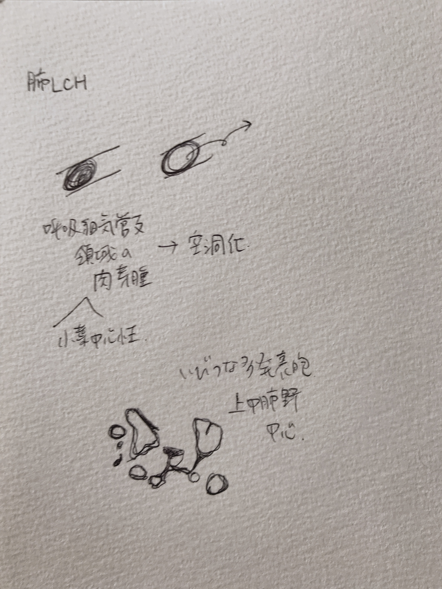
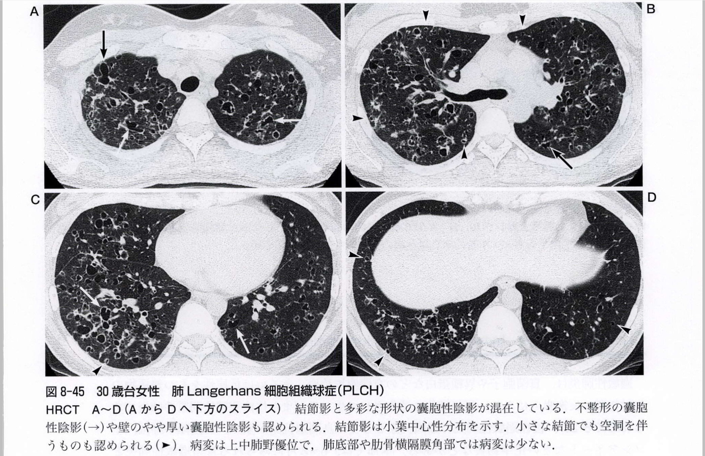

- 閉塞性細気管支炎(BO: Bronchiolitis obliterans)
    - 膠原病, タバコ, 重症感染, 臓器移植, 有毒ガス吸入などによって起こる.
    - 末梢細気管支が閉塞してair trappingによる肺過膨張をきたす, 閉塞性肺障害.
    - 機序は2通りある:
        - 呼吸細気管支内部にポリープ様肉芽が生じる(classical proliferative type)
        - 粘膜下や周囲の瘢痕化による周囲からの狭窄(constrictive type)
    - 画像所見はmosaic attenuation + air trappingが起きている箇所の肺血管狭小化.

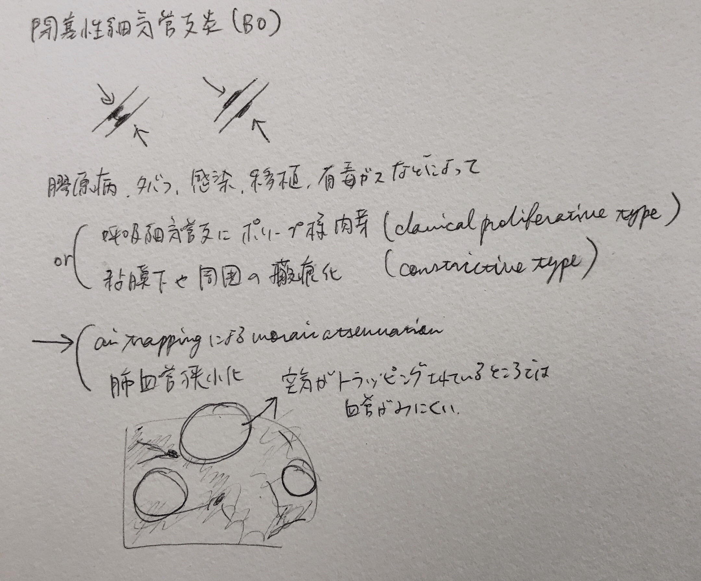
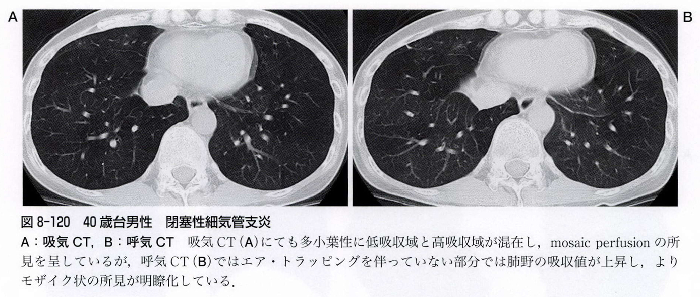    

- 2012-33: `多発薄壁囊胞` 
- 2019-36: `糖尿病`
- 2014-37: `肺血管の狭細化`, `肺野のモザイク状吸収域`  

### XIN. 肺結節,肺腫瘍,気管支腫瘍
#### 肺癌のstaging
◎[2019-35](http://www.radiology.jp/content/files/20190904_02.pdf#page=13)
原発性肺癌患者の病期で M1a と診断されるのはどれか。2 つ選べ。
`肝転移` `胸膜播種` `副腎転移` `対側肺転移` `後腹膜リンパ節転移` 

◎[2018-37](http://www.radiology.jp/content/files/20180926_2.pdf#page=15)
高分解能 CT を撮影し，肺に部分充実型の結節を認めた。病変全体径が 4.5 cm で，充実成分径が 2.5 cm であった。後日気管支鏡検査を行い，組織学的に腺癌と診断された。この病変の T 因子分類として正しいのはどれか。1 つ選べ。
`T1a` `T1b` `T1c` `T2a` `T2b`  

◎[2017-37](http://www.radiology.jp/content/files/20170904_2.pdf#page=14)
右肺上葉に肺癌が存在する患者に術前の胸部CTが施行された。転移が疑われる腫大があった場合にN2に分類される領域のリンパ節はどれか。2つ選べ。  
`右鎖骨上窩リンパ節 (#1R)` `左上部気管傍リンパ節 (#2L)` `右気管傍リンパ節 (#4R)` `大動脈下リンパ節 (#5)` `気管分岐下リンパ節 (#7)`  

◎[2015-34](http://www.radiology.jp/content/files/20150821.pdf#page=12)
肺癌病期分類について正しいのはどれか。1つ選べ。
`T1aは腫瘍最大径1cm以下`  
`T2は腫瘍最大径5cm以下`  
`同一肺葉内転移はT3`  
`対側肺転移はT4`  
`悪性心囊水はM1b` 

◎[2014-36](http://www.radiology.jp/content/files/1377.pdf#page=13)
胸部CTにて右肺S8に最大径8cm大の腫瘤影を認め，原発性肺癌が疑われた。腫瘤影は胸膜に接していない。その他，明らかな病変は認めない。肺癌取扱い規約のT分類として正しいのはどれか。1 つ選べ。
`T1a` `T1b` `T1c` `T2a` `T2b` `T3` `T4`

◎[2013-34](http://www.radiology.jp/content/files/2013_2s_exsam.pdf#page=12)
肺癌の臨床病期分類で正しいのはどれか。1つ選べ。
`骨転移はM1aである。`  
`分岐部リンパ節腫大はN2である。`  
`長径30mm以下の肺癌はT1である。`  
`腹部大動脈周囲リンパ節腫大はN3である。`  
`判定に迷う場合は, より進行した病期に分類する。`  

◎[2012-40](http://www.radiology.jp/content/files/2012_1s_exsam.pdf#page=14)
原発性肺癌治療前患者において，左下葉に長径6.0cmの原発巣，右下部気管傍リンパ節(#4R)，気管分岐下リンパ節(#7)に短径2.0cmのリンパ節腫大，左胸腔内播種が認められた。TNM分類として適切なのはどれか。1つ選べ。
`T2aN2M1a` `T2aN2M1b` `T2aN3M1a` `T2aN3M1b` 
`T2bN2M1a` `T2bN2M1b` `T2bN3M1a` `T2bN3M1b` 
`T3N2M1a` `T3N2M1b` `T3N3M1a` `T3N3M1b` 
`T4N2M1a` `T4N2M1b` `T4N3M1a` `T4N3M1b` 

◎[2018-32](http://www.radiology.jp/content/files/20180926_2.pdf#page=13)
肺癌の転移が疑われた場合の検査法で誤った組み合わせはどれか。1 つ選べ。
`脳転移 - 18F-FDG-PET/CT`  
`肝転移 - Gd-EOB-DTPA を用いた造影 MRI`  
`胸椎転移 - MRI 造影後脂肪抑制 T1 強調像`  
`副腎転移 - MRI の chemical shift imaging`  
`縦隔リンパ節転移 - 超音波気管支鏡ガイド下針生検`  

【肺癌のStaging】

- **非小細胞肺癌と小細胞肺癌では同一のTNM分類を用いる(違いはない)**.
- **UICC 第8版と肺癌取扱い規約第8版では内容に違いはない.**

- 充実成分径によるT因子
    - Tis: 上皮内癌
    - T1: 3cm以下 (T1a: 1cm以下, T1b: 1cmを超え2cm以下, T1c: 2cmを超え3cm以下)
    - T2a: 3cmを超え4cm以下 (ただし後述する条件を満たす場合は大きさを問わない)
    - T2b: 4cmを超え5cm以下 (ただし後述する条件を満たす場合は大きさを問わない)
    - T3: 5cmを超え7cm以下 (ただし後述する条件を満たす場合は大きさを問わない)
    - T4: 7cmを超える (ただし後述する条件を満たす場合は大きさを問わない)
- 進展範囲によるT因子
    - 末梢側への進展
        - T1: 胸膜浸潤なし
        - T2: 臓側胸膜まで浸潤あれば大きさによらずT2
        - T3: 壁側胸膜または胸壁まで浸潤あれば大きさによらずT3
    - 中枢側への進展
        - T1: 主気管支に及んでいない
        - T2: 主気管支に及ぶが気管分岐部には及んでいなければ大きさによらずT2
        - T4: 気管分岐部に及んでいれば大きさによらずT4
    - 副腫瘍結節
        - T3: 不連続な副腫瘍結節が同一肺葉内にあれば大きさによらずT3
        - T4: 不連続な副腫瘍結節が同側の異なる肺葉内にあれば大きさによらずT4
    - 他臓器浸潤
        - T3: 心膜, 横隔神経のいずれかに浸潤していれば大きさによらずT3
        - T4: 心臓大血管, 縦隔, 食道, 反回神経, 横隔膜, 椎体のいずれかに浸潤していれば大きさによらずT4
    - ほか
        - T2: 肺門まで連続する部分的もしくは一側全体の無気肺もしくは閉塞性肺炎があれば大きさによらずT2
- N因子
    - N1: 同側肺門リンパ節までの転移
    - N2: 同側縦隔リンパ節または気管分岐部リンパ節までの転移
    - N3: 他の領域リンパ節 (対側縦隔, 対側肺門, 左右いずれかの前斜角筋, 左右いずれかの鎖骨上窩) までの転移
- M因子
    - M1a: 対側肺内の副腫瘍結節, 胸膜結節, 悪性胸水, 悪性心嚢水
    - M1b: 肺以外に遠隔転移があり, 単発である (1臓器かつ病変が1個)
    - M1c: 肺以外に遠隔転移があり, 多発している (病変が複数ある)
- Staging
    - Stage IA: T1N0M0
    - Stage IB: T2aN0M0
    - Stage IIA: T2bN0M0
    - Stage IIB: T1-2N1M0 または T3N0M0
    - Stage IIIA: T1-2N2M0 または T3N1M0 または T4N0-1M0
    - Stage IIIB: T1-2N3M0 または T3N2M0 または T4N2M0
    - Stage IIIC: T3-4N3M0
    - Stage IVA: M1a-b
    - Stage IVB: M1c

- 2019-35: `胸膜播種`, `対側肺転移`
- 2018-37: `T1c`
- 2017-37: `右気管傍リンパ節 (#4R)`, `気管分岐下リンパ節 (#7)`  
- 2015-34: `同一肺葉内転移はT3`
- 2014-36: `T4`
- 2013-34: `分岐部リンパ節腫大はN2である。`
- 2012-40: `T3N2M1a`
- 2018-32: `脳転移 - 18F-FDG-PET/CT`

#### 肺結節の良悪性
◎[2019-34](http://www.radiology.jp/content/files/20190904_02.pdf#page=13)
悪性の孤立性肺結節で，認めやすいCT所見はどれか。1つ選べ。  
`周囲の衛星病変` `倍加時間30日未満` `壁が薄い空洞性結節` `ポップコーン状石灰化` `造影前後の増強効果15HU 以上`  

◎[2012-35](http://www.radiology.jp/content/files/2012_1s_exsam.pdf#page=12)
肺結節陰影の所見として良性を示唆するのはどれか。1つ選べ。  
`内部の空洞` `辺縁部点状石灰化` `末梢の気道散布陰影` `CT上の良好な造影効果` `3ヶ月の経過観察で不変`  

【結節の良悪性判定】

- 多くの悪性腫瘍で, 結節の倍加時間は30〜400日であるため, 3ヶ月不変であるだけでは悪性を否定できない(Radiology Review Manualより).

- 2019-34: `造影前後の増強効果15HU以上`
- 2012-35: `末梢の気道散布陰影`

#### 肺結節ほか
[2016-37](http://www.radiology.jp/content/files/20160825.pdf#page=13)
肺過誤腫に特徴的なCT所見はどれか。2つ選べ。  
`スピクラ` `胸膜嵌入像` `すりガラス影` `ポップコーン状石灰化` `脂肪を示唆する低吸収域`  

[2018-36](http://www.radiology.jp/content/files/20180926_2.pdf#page=14)
CTで両肺に多発する空洞性転移を認めた。原発巣として**考えにくい**のはどれか。1つ選べ。  
`膵癌` `大腸癌` `下咽頭癌` `甲状腺癌` `頭皮血管肉腫`  

[2016-38](http://www.radiology.jp/content/files/20160825.pdf#page=13)
肺定型的カルチノイドの画像所見として頻度が最も**低い**のはどれか。1つ選べ。  
`石灰化` `辺縁平滑` `空洞形成` `気管支内病変` `FDG 集積陰性`  

[2018-31](http://www.radiology.jp/content/files/20180926_2.pdf#page=12)
造影CTで，増強効果が最も低い肺結節・腫瘤はどれか。1つ選べ。  
`肺過誤腫` `充実型腺癌` `円形無気肺` `カルチノイド` `硬化性肺胞上皮腫`  

[2013-40](http://www.radiology.jp/content/files/2013_2s_exsam.pdf#page=14)
肺腫瘤のCT所見として正しいのはどれか。2つ選べ。  
`カルチノイドは空洞を生じることが多い。`  
`粘液腺癌は気管支散布性転移を生じる。`  
`造影効果の乏しい肺野結節は悪性の可能性が高い。`  
`肺末梢型小細胞癌では血管収束像が見られることが多い。`  
`高分化型肺腺癌は辺縁にすりガラス影を有することが多い。`  

#### 気管支結節
[2017-36](http://www.radiology.jp/content/files/20170904_2.pdf#page=14)
胸部CTにて気管支内に結節性病変を認めた。可能性が最も**低い**のはどれか。1 つ選べ。
`粘表皮癌` `肺過誤腫` `カルチノイド` `腺様囊胞癌` `硬化性血管腫`  

### XIM. 石綿肺とその周辺
◎[2017-34](http://www.radiology.jp/content/files/20170904_2.pdf#page=13)
石綿関連疾患として**誤っている**のはどれか。1つ選べ。  
`胸膜斑` `良性胸水` `気管支拡張` `円形無気肺` `悪性中皮腫`  

◎[2012-31](http://www.radiology.jp/content/files/2012_1s_exsam.pdf#page=11)
石綿曝露でみられる画像所見として正しいのはどれか。1つ選べ。  
`多発空洞小結節` `進行性塊状線維化` `下肺野末梢網状影` `上肺野多発小粒状影` `リンパ節卵殻状石灰化`  

[2013-39](http://www.radiology.jp/content/files/2013_2s_exsam.pdf#page=13)
胸膜中皮腫について正しいのはどれか。1つ選べ。  
`縦隔側胸膜の肥厚は認めない。`  
`低濃度の石綿暴露では生じない。`  
`肉腫型は上皮型より予後不良である。`  
`石綿暴露から10年程度の発症が多い。`  
`胸水のみが所見であることはまれである。`  

【粉塵暴露による肺疾患】

- 「塵肺」の定義
    - 粉塵吸入によって生じた肺病変の総称. 肺病変以外は塵肺に含まない.
        - 石綿による肺線維症は「塵肺」
        - 石綿による胸膜プラークは「塵肺ではない」
        - 石綿による悪性胸膜中皮腫は「塵肺ではない」
        - 石綿による良性石綿胸水は「塵肺ではない」
        - 石綿による肺癌は「塵肺ではない」
- 珪肺症
    - 病態
        - a
    - 画像所見
        - a
- 石綿肺
    - 石綿肺の発症について
        - 少量で発症するものとそうでないものがある.
            - 少量の曝露でも発生するもの: 胸膜プラーク, 悪性胸膜中皮腫
            - 中程度の曝露で発生すると推定されているもの: びまん性胸膜肥厚, 良性石綿胸水
            - 高濃度曝露でなければ発生しない: 石綿肺, 石綿肺癌
    - 石綿肺の主な画像所見
        - アスベスト関連胸膜プラーク: 石灰化を伴う胸膜結節(特に横隔膜面)
        - 悪性胸膜中皮腫: 
        - 良性石綿胸水
        - びまん性胸膜肥厚: 
        - 石綿肺: **IPFに類似して肺底部末梢側優位の網状影を呈する**が, 胸膜下に線状影や粒状影を随伴することで鑑別できる.
        - 石綿肺癌: 
        - 円形無気肺: **良性石綿胸水**につづいて発症することが多い (石綿によらなくても発症することはある).

**こたえ**
- 2017-34: `気管支拡張`
- 2012-31: `下肺野末梢網状影` 
- 2013-39: 

### XIT. 胸部外傷
[2016-39](http://www.radiology.jp/content/files/20160825.pdf#page=13)
胸部外傷の画像所見として正しいのはどれか。1 つ選べ。
a	 外傷性横隔膜損傷は右側に多い。
b	 肺挫傷は区域性浸潤影を呈する。
c	 外傷性肺囊胞は 1～2 週で消退する。
d	 胸骨骨折は胸部 X 線写真により容易に検出できる。
e	 大動脈損傷は大動脈峡部に生じることが最も多い。

[2015-39](http://www.radiology.jp/content/files/20150821.pdf#page=14)
胸部外傷の画像所見として正しいのはどれか。2 つ選べ。
a	 横隔膜損傷は左側に多い。
b	 大動脈損傷は遠位下行大動脈に多い。
c	 外傷性肺囊胞は 1～2 週で消退する。
d	 気道損傷は気管分岐部の近傍に多い。
e	 肺挫傷は受傷の数時間後に生じることが多い。

[2012-41](http://www.radiology.jp/content/files/2012_1s_exsam.pdf#page=14)
胸部の鈍的外傷について正しいのはどれか。1 つ選べ。
a 大動脈損傷は峡部に多い。
b 気道損傷は末梢気道に多い。
c 外傷性肺囊胞は 1～2 週で消退する。
d 肺挫傷は 24 時間以後で明らかとなる。
e 横隔膜損傷では，他臓器損傷合併はまれである。

### XIm. 縦隔
#### 縦隔の解剖
[2018-38](http://www.radiology.jp/content/files/20180926_2.pdf#page=15)
縦隔の神経の走行で，誤っているのはどれか。1 つ選べ。
`横隔神経 - 肺門背側`  
`内臓神経 - 大動脈裂孔`  
`迷走神経 - 食道裂孔`  
`左反回神経 - 大動脈弓下`  
`右反回神経 - 右鎖骨下動脈下`  

#### 縦隔腫瘤の鑑別
[2019-38](http://www.radiology.jp/content/files/20190904_02.pdf#page=14)
MRI上, T2 強調像で低信号を示す前縦隔の腫瘤で，可能性が最も高いのはどれか。1 つ選べ。
`血管腫` `胸腺囊胞` `心膜囊胞` `リンパ管腫` `胸腺扁平上皮癌`  

[2016-31](http://www.radiology.jp/content/files/20160825.pdf#page=11)
前縦隔腫瘤のなかでMRIの逆位相グラディエントエコー(GRE)像で信号低下を示すのはどれか。1つ選べ。
`胸腺腫` `胸腺囊胞` `胸腺過形成` `悪性リンパ腫` `縦隔内甲状腺腫`  

[2016-35](http://www.radiology.jp/content/files/20160825.pdf#page=12)
胸部CTにて，前縦隔に石灰化を伴う充実性の腫瘤がみられた。最も可能性が**低い**のはどれか。1つ選べ。  
`胸腺腫` `胸腺癌` `悪性リンパ腫` `悪性胚細胞腫瘍` `縦隔内甲状腺腫`  

[2013-41](http://www.radiology.jp/content/files/2013_2s_exsam.pdf#page=14)
縦隔腫瘍で石灰化を来たしやすいのはどれか。2つ選べ。  
`胸腺腫` `神経鞘腫` `精上皮腫` `成熟奇形腫` `悪性リンパ腫`  

【縦隔腫瘤の鑑別】

- 2019-34: 

#### 縦隔腫瘤総合
[2014-40](http://www.radiology.jp/content/files/1377.pdf#page=14)
縦隔腫瘤について正しいのはどれか。2つ選べ。  
`気管支原性囊胞は，後縦隔に好発する。`  
`胸郭内甲状腺腫は，石灰化を含むことが多い。`  
`奇形腫の穿破では，胸水や心囊水の貯留をきたす。`  
`胸腺腫と胸腺癌は，FDG-PET の集積が同程度のことが多い。`  
`神経鞘腫で Antoni B 型の部分は，MRI の T2 強調像で低信号を示す。`  

### XIO. 肺分画症
◎[2017-32](http://www.radiology.jp/content/files/20170904_2.pdf#page=12)
肺分画症として**誤っている**のはどれか。1つ選べ。  
`局在は左下葉 S10 に多い。`  
`病変内に軟骨が存在する。`  
`肺葉内型が肺葉外型より多い。`  
`肺葉内型の還流静脈は肺静脈である。`  
`肺葉内型は合併奇形が高頻度である。`  

◎[2012-37](http://www.radiology.jp/content/files/2012_1s_exsam.pdf#page=13)
肺分画症について正しいのはどれか。2つ選べ。  
`分画肺は正常の気管支と交通がある。`  
`肺葉内分画症は正常肺と別の胸膜を有する。`  
`肺葉内分画症の異常動脈は胸部下行大動脈より分岐する。`  
`肺葉外分画症の合併奇形は稀である。`  
`肺葉外分画症は肺葉内分画症より発生頻度が低い。`  

【肺分画症】

- 肺の一部が性状肺から分離され, 体循環から血液が供給されている状態.
    - 肺葉内型: 75%を占める. 分画肺は気管支と交通していないが, 正常肺とは連続している(胸膜を隔てていない).
        - このため肺炎を繰り返しやすい. 成人になってから診断される.
        - ほぼ全例が肺S10に生じる.
        - 血流はたいていはAortaからの異常血管から流入し, 正常な肺静脈へと還る.
    - 肺葉外型: 15-25%を占める. 分画肺は気管支と交通しておらず, 正常肺とも連続していない(胸膜を隔てている).
        - 合併奇形が多い. 
        - 出征直後からチアノーゼや呼吸困難をきたしやすいため乳児のうちに診断される.
        - 血流はたいていはAortaからの異常血管から流入する.

**こたえ**
- 2017-32: `肺葉内型は合併奇形が高頻度である。`
- 2012-37: `肺葉内分画症の異常動脈は胸部下行大動脈より分岐する。`, `肺葉外分画症は肺葉内分画症より発生頻度が低い。`

### XIZ. 総合問題
#### 病変分布
◎[2015-32](http://www.radiology.jp/content/files/20150821.pdf#page=11)
病変が上肺に多い疾患はどれか。2つ選べ。  
`肺結核症` `誤嚥性肺炎` `肺血栓塞栓症` `特発性間質性肺炎` `Langerhans 細胞組織球症`  

◎[2013-33](http://www.radiology.jp/content/files/2013_2s_exsam.pdf#page=11)
病変が上肺野に優位な分布を示すのはどれか。1つ選べ。  
`石綿肺症` `粟粒結核` `非特異性間質性肺炎` `びまん性汎細気管支炎` `Langerhans 細胞組織球症`  

◎[2016-34](http://www.radiology.jp/content/files/20160825.pdf#page=12)
びまん性肺疾患で上肺野優位に病変が分布するのはどれか。2つ選べ。  
`珪肺症` `石綿肺` `粟粒結核` `特発性肺線維症` `Langerhans 細胞組織球症`  

◎[2014-32](http://www.radiology.jp/content/files/1377.pdf#page=12)
病変が下肺野に優位に分布するのはどれか。2つ選べ。  
`石綿肺` `特発性肺線維症` `慢性過敏性肺炎` `肺野型サルコイドーシス` `肺 Langerhans 細胞組織球症`  

◎[2019-33](http://www.radiology.jp/content/files/20190904_02.pdf#page=13)
下肺野優位に分布する肺疾患はどれか。2つ選べ。  
`珪肺症` `特発性肺線維症` `敗血症性肺塞栓` `異所性石灰化症` `サルコイドーシス`  

◎[2017-38](http://www.radiology.jp/content/files/20170904_2.pdf#page=14)
胸部疾患として頭尾方向の分布が異なる特徴を示すのはどれか。1つ選べ。  
`石綿肺` `血行性転移` `サルコイドーシス` `特発性肺線維症` `非特異的間質性肺炎`  

【肺の病変分布】

- 基本: **肺内において酸素が多いのは上肺野, 血流やリンパ流が多いのは下肺野**

- 感染症:
    - 肺結核: 上肺野優位
- 血行性病変
    - 敗血症性塞栓: 下肺野優位
    - 血行性転移: 下肺野優位
- IIPs:
    - IPF/UIP, NSIP, COP: 下肺野優位
- びまん肺ほか:
    - PLCH: 上肺野優位 & 小葉中心性
    - サルコイドーシス: 上肺野優位
- 塵肺:
    - 珪肺症: 上肺野優位 (粉塵がリンパ流に乗ってクリアランスの悪い上肺野に集まり, そこで線維性結節を形成する)
    - 石綿肺: 下肺野優位 

**こたえ**

- 2015-32: `肺結核症`,` Langerhans 細胞組織球症`  
- 2013-33: `Langerhans 細胞組織球症`
- 2016-34: `珪肺症`, `Langerhans 細胞組織球症`  
- 2014-32: `石綿肺`, `特発性肺線維症` 
- 2019-33: `特発性肺線維症`, `敗血症性肺塞栓`
- 2017-38: `サルコイドーシス`

[2015-33](http://www.radiology.jp/content/files/20150821.pdf#page=12)
病変分布が肺野末梢優位な疾患はどれか。2つ選べ。
a	 珪　肺
b	 過敏性肺炎
c	 肺胞性肺水腫
d	 特発性肺線維症
e	 慢性好酸球性肺炎

[2013-35](http://www.radiology.jp/content/files/2013_2s_exsam.pdf#page=12)
胸部CTで肺内病変の分布が肺野外層に少ないのはどれか。1 つ選べ。
a 感染性肺塞栓
b 特発性肺線維症
c 慢性好酸球性肺炎
d 亜急性過敏性肺炎
e アレルギー性気管支肺真菌症

◎[2014-31](http://www.radiology.jp/content/files/1377.pdf#page=11)
広義間質分布（リンパ路性分布）を示すのはどれか。2つ選べ。  
`珪肺症` `粟粒結核` `サルコイドーシス` `特発性肺線維症` `びまん性肺胞出血`  

[2019-31](http://www.radiology.jp/content/files/20190904_02.pdf#page=12)
高分解能CTで，広義間質肥厚を認める可能性が最も**低い**肺病変はどれか。1つ選べ。  
a	 肺水腫
b	 癌性リンパ管症
c	 サルコイドーシス
d	 急性好酸球性肺炎
e	 びまん性汎細気管支炎

[2018-34](http://www.radiology.jp/content/files/20180926_2.pdf#page=13)
高分解能CTで小葉間隔壁の肥厚が見られやすい肺病変はどれか。1 つ選べ。
a	 リンパ脈管筋腫症
b	 急性好酸球性肺炎
c	 閉塞性細気管支炎
d	 びまん性汎細気管支炎
e	 アレルギー性気管支肺真菌症

◎[2015-31](http://www.radiology.jp/content/files/20150821.pdf#page=11)
肺の薄層CTにてランダム分布を示す粒状結節が認められた。考えられる疾患はどれか。1つ選べ。  
`珪肺症` `粟粒結核` `過敏性肺炎` `びまん性汎細気管支炎` `Langerhans 細胞組織球症`  

[2019-39](http://www.radiology.jp/content/files/20190904_02.pdf#page=15)
高分解能CTでランダム分布を示す可能性が**低い**のはどれか。1 つ選べ。
a	 粟粒結核
b	 水痘肺炎
c	 転移性肺腫瘍
d	 播種性真菌症
e	 慢性過敏性肺臓炎

【肺の病変分布】

- 基本: **肺内において酸素が多いのは上肺野, 血流やリンパ流が多いのは下肺野**

- 感染症:
    - 肺結核: 上肺野優位 & 小葉中心性粒状影
- 血行性病変
    - 粟粒結核: びまん性 & ランダム分布
    - 敗血症性塞栓: 下肺野優位 & ランダム分布
    - 血行性転移: 下肺野優位 & ランダム分布
- IIPs:
    - IPF/UIP, NSIP, COP: 下肺野優位
- びまん肺ほか:
    - PLCH: 上肺野優位 & 小葉中心性結節影
    - サルコイドーシス: 上肺野優位
- 塵肺:
    - 珪肺症: 上肺野優位 & リンパ路に沿った結節影 (粉塵がリンパ流に乗ってクリアランスの悪い上肺野に集まり, そこで線維性結節を形成する)
    - 石綿肺: 下肺野優位

**こたえ**
- 2014-31: `珪肺症`, `サルコイドーシス`
- 2015-31: `粟粒結核`
- 2019-39: 

#### 所見との関係
[2016-36](http://www.radiology.jp/content/files/20160825.pdf#page=12)
肺疾患と CT 所見との組み合わせとして正しいのはどれか。1 つ選べ。
a	 肺胞蛋白症 CT galaxy sign
b	 特発性器質化肺炎 halo sign
c	 粘液腺癌 CT angiogram sign
d	 サルコイドーシス crazy-paving appearance
e	 血管侵襲性アスペルギルス症 reversed halo sign

[2015-36](http://www.radiology.jp/content/files/20150821.pdf#page=13)
びまん性肺胞出血をきたす疾患はどれか。1 つ選べ。
a	 サルコイドーシス
b	 慢性過敏性肺炎
c	 急性好酸球性肺炎
d	 Langerhans 細胞組織球症
e	 全身性エリテマトーデス（SLE）

[2014-33](http://www.radiology.jp/content/files/1377.pdf#page=12)
疾患と画像所見との組み合わせとして正しいのはどれか。2 つ選べ。
a 悪性リンパ腫 ―――――――――CT angiogram sign
b クレブシェラ肺炎 ―――――――meniscus sign
c サルコイドーシス ―――――――CT halo sign
d ニューモシスティス肺炎 ――――crazy paving appearance
e 侵襲性アスペルギルス症 ――――finger-in-globe sign

[2014-35](http://www.radiology.jp/content/files/1377.pdf#page=13)
無気肺の原因として考えにくいのはどれか。1 つ選べ。
a カルチノイド
b 気管支異物
c 気管支結核
d 扁平上皮癌
e 気管支閉鎖症

[2014-38](http://www.radiology.jp/content/files/1377.pdf#page=14)
肺疾患として喫煙と関連が深いのはどれか。2 つ選べ。
a 肺胞微石症
b リンパ脈管筋腫症
c 急性好酸球性肺炎
d 肺 Langerhans 細胞組織球症
e 多発血管肉芽腫症（Wegener 肉芽腫症）

## 心血管
### XC0. 心血管の解剖
[2015-40](http://www.radiology.jp/content/files/20150821.pdf#page=14)
◎正常人において胸骨背面に最も近接するのはどれか。1つ選べ。
`上大静脈` `右心房` `右心室` `左心房` `左心室`  

[2018-41](http://www.radiology.jp/content/files/20180926_2.pdf#page=16)
正常の心臓について正しいものはどれか。1 つ選べ。
a	 心尖を形成するのは右心室である。
b	 大動脈弁は肺動脈弁の右後方にある。
c	 三尖弁と肺動脈弁とは線維性の連続性が見られる。
d	 右心室の肉柱の方が左心室肉柱より幅が狭く，密である。
e	 大動脈弁の冠尖のうち，左冠尖が最も尾側に位置している。

[2012-43](http://www.radiology.jp/content/files/2012_1s_exsam.pdf#page=15)
心臓の解剖について正しいのはどれか。1つ選べ。
a 冠静脈洞は左房に還流する。
b 右冠動脈は右房室間溝に沿って走行する。
c 左冠動脈回旋枝は前心室間溝に沿って走行する。
d 肺動脈弁は 2 枚の半月弁からなる。
e 左心室の肉柱構造は右心室より直交する。

【心臓の解剖】    

- 2015-40: `右心室`

[2018-40](http://www.radiology.jp/content/files/20180926_2.pdf#page=16)
冠動脈解剖に関して正しいものはどれか。1つ選べ。
a	 右冠動脈から鈍縁枝が分枝する。
b	 対角枝は左心室後壁を灌流する。
c	 右冠動脈優位型の頻度は約 50% である。
d	 左冠動脈回旋枝から鋭縁枝が分枝する。
e	 左冠動脈前下行枝は前壁側心室中隔を灌流する。

[2016-40](http://www.radiology.jp/content/files/20160825.pdf#page=14)
冠動脈分枝と解剖学的走行部との組み合わせとして誤っているのはどれか。1 つ選べ。
a	 鈍縁枝 右心室前壁
b	 対角枝 左心室前壁
c	 左前下行枝 前室間溝
d	 左回旋枝 左房室間溝
e	 右冠動脈近位部 右房室間溝

◎[2014-42](http://www.radiology.jp/content/files/1377.pdf#page=15)
通常の右冠動脈優位型の解剖の場合，左冠動脈の分枝はどれか。2つ選べ。  
`鋭縁枝` `回旋枝` `後下行枝` `前下行枝` `房室結節枝`  

【冠動脈の解剖】

- 2018-40: 
- 2016-40: 
- 2014-42: `回旋枝`, `前下行枝`

[2017-41](http://www.radiology.jp/content/files/20170904_2.pdf#page=15)
足関節の内果背側を走行する動脈はどれか。1 つ選べ。
a	 anterior tibial artery
b	 arcuate artery
c	 fibular artery
d	 lateral plantar artery
e	 posterior tibial artery

### XC1. 心臓CTの撮像
[2019-40](http://www.radiology.jp/content/files/20190904_02.pdf#page=15)
冠動脈CTにおける至適条件として誤っているのはどれか。1 つ選べ。
a	 造影剤の注入時間は 10～15 秒程度とする。
b	 生理食塩水の後押しは 40 ml 程度を使用する。
c	 画像ノイズ（標準偏差値）は 20～25 HU 以下とする。
d	 冠動脈内腔の造影効果は CT 値で 200～250 HU 程度とする。
e	 β 遮断薬を使用する場合，心拍数 60 回/分以下にすることを目標にする。

[2019-41](http://www.radiology.jp/content/files/20190904_02.pdf#page=15)
心臓CT検査時，β 遮断薬の使用時に注意すべき疾患はどれか。1 つ選べ。
a	 心臓神経症
b	 頻脈型不整脈
c	 冠攣縮性狭心症
d	 心室性期外収縮
e	 本態性高血圧症

[2018-42](http://www.radiology.jp/content/files/20180926_2.pdf#page=16)
冠動脈 CT 時の前処置として高心拍数患者に投与する薬剤はどれか。1 つ選べ。
a	 アデノシン 60 mg（アデノスキャン）
b	 エルゴタミン酒石酸塩 1 mg（クリアミン）
c	 ジピリダモール 25 mg（ペルサンチン）
d	 ニフェジピン 10 mg（アダラート）
e	 ランジオノール塩酸塩 12.5 mg（コアベータ）

[2017-40](http://www.radiology.jp/content/files/20170904_2.pdf#page=15)
冠動脈 CT について正しいのはどれか。2 つ選べ。
a	 収縮期早期で再構成する。
b	 β 遮断薬で脈拍数をコントロールする。
c	 低心拍はアーチファクトの原因となる。
d	 左冠動脈は右冠動脈より拍動による動きが大きい。
e	 プロスペクティブ心電図同期撮影は被ばくが少ない。

[2016-41](http://www.radiology.jp/content/files/20160825.pdf#page=14)
 冠動脈 CT の撮影方法として正しいのはどれか。1 つ選べ。
a	 心拍数は 1 分間 90 拍以下を目標に調整する。
b	 造影剤は可能な限り橈側皮静脈から注入する。
c	 造影剤注入開始から撮影開始までの時間は 20 秒程度に固定する。
d	 体重に応じた造影剤注入速度は 0.02 ml/秒/kg 程度が適切である。
e	 上大静脈内の造影剤を生理食塩水で洗い流したタイミングで撮影する。

[2016-43](http://www.radiology.jp/content/files/20160825.pdf#page=15)
心臓 CT について誤っているのはどれか。1 つ選べ。
a	 ガントリー回転時間の短い CT が適している。
b	 単純 CT にて冠動脈の石灰化量を測定できる。
c	 冠動脈狭窄の診断における陽性的中率は高い。
d	 心筋虚血の評価には薬剤を負荷し造影 CT を撮像する。
e	 低心拍数ではプロスペクティブ同期法で拡張中期位相を撮像する。

[2013-44](http://www.radiology.jp/content/files/2013_2s_exsam.pdf#page=15)
心電図同期冠動脈 CT について正しいのはどれか。1 つ選べ。
a 冠動脈奇形の診断は困難である。
b ステント内狭窄の評価が容易である。
c 高心拍数の患者ではアーチファクトが少ない。
d 不整脈患者では階段状のアーチファクトが見られる。
e 石灰化病変による冠動脈狭窄の評価が容易である。

### XCc. 冠動脈CTの読影
[2019-43](http://www.radiology.jp/content/files/20190904_02.pdf#page=16)
プラークのCT所見で，急性冠症候群をきたす可能性が低いのはどれか。1 つ選べ。
a	 粗大石灰化
b	 点状石灰化
c	 低吸収（50 HU 未満）
d	 ナプキンリング・サイン
e	 ポジティブリモデリング

### XCm. 心筋疾患
[2015-41](http://www.radiology.jp/content/files/20150821.pdf#page=14)
心筋脂肪変性をきたしやすい疾患はどれか。1 つ選べ。
a	 心筋炎
b	 収縮性心膜炎
c	 陳旧性心筋梗塞
d	 心アミロイドーシス
e	 心サルコイドーシス

### XCv. 大血管疾患
[2019-42](http://www.radiology.jp/content/files/20190904_02.pdf#page=16)
炎症性大動脈瘤について，誤っているのはどれか。1 つ選べ。
a	 胸部大動脈に好発する。
b	 造影 CT でマントルサインを認める。
c	 FDG-PET/CT で異常集積を認める。
d	 原因疾患として IgG4 関連疾患が最多である。
e	 大動脈外膜に線維化を伴うリンパ球浸潤が見られる。

[2018-44](http://www.radiology.jp/content/files/20180926_2.pdf#page=17)
 エンドリークについて正しいものはどれか。1 つ選べ。
a	 腰動脈からの逆行性血流によるリーク：Type Ⅰa
b	 ステントグラフト近位部からのリーク：Type Ⅰb
c	 ステントグラフト間の継ぎ目からのリーク：Type Ⅱ
d	 ステントグラフトの裂け目からのリーク：Type Ⅲ
e	 ステントグラフト遠位部からのリーク：Type Ⅳ

[2017-42](http://www.radiology.jp/content/files/20170904_2.pdf#page=16)
腹部大動脈のステントグラフト留置後に，腹部造影 CT にて下腸間膜動脈からの逆行性
血流によるリークが見られた。分類として正しいのはどれか。1 つ選べ。
a	 type Ⅰa
b	 type Ⅰb
c	 type Ⅱ
d	 type Ⅲ
e	 type Ⅳ

[2013-43](http://www.radiology.jp/content/files/2013_2s_exsam.pdf#page=15)
大動脈解離について誤っているのはどれか。1 つ選べ。
a 真腔は拡大した偽腔で圧排される。
b 剥離内膜の同定は診断上特異性が高い。
c 血栓閉塞型の偽腔は単純 CT で高吸収を示す。
d DeBakey II 型では下行大動脈にエントリーがある。
e 大動脈基部の評価に心電図同期 CT が有用である。

[2012-42](http://www.radiology.jp/content/files/2012_1s_exsam.pdf#page=14)
大動脈解離について正しいのはどれか。1 つ選べ。
a Stanford A 型は，DeBakey II 型に相当する。
b Stanford B 型は，DeBakey III 型に相当する。
c Stanford B 型の予後は A 型より不良である。
d 動脈瘤合併が多い。
e 単純 CT で急性期解離腔は低吸収を示す。

[2017-44](http://www.radiology.jp/content/files/20170904_2.pdf#page=16)
Marfan 症候群の診断基準として誤っているのはどれか。1 つ選べ。
a	 鳩　胸
b	 漏斗胸
c	 大動脈解離
d	 脊柱管狭窄
e	 上行大動脈拡張

[2015-43](http://www.radiology.jp/content/files/20150821.pdf#page=15)
左右上肢に血圧差が見られる頻度が最も高い疾患はどれか。1 つ選べ。
a	 川崎病
b	 高安動脈炎
c	 動脈管開存症
d	 Leriche 症候群
e	 Stanford B 型大動脈解離

[2015-44](http://www.radiology.jp/content/files/20150821.pdf#page=15)
動脈疾患と特徴的所見との組み合わせとして正しいのはどれか。2 つ選べ。
a	 高安動脈炎 冠動脈病変
b	 炎症性大動脈瘤 大動脈壁菲薄化
c	 Marfan 症候群 大動脈弁輪拡張
d	 感染性大動脈瘤 紡錘状拡張
e	 線維筋性異型成 腎動脈起始部

[2018-43](http://www.radiology.jp/content/files/20180926_2.pdf#page=17)
高安動脈炎について間違っているのはどれか。1 つ選べ。
a	 肺動脈にも病変を生じる。
b	 慢性期では動脈の全周性石灰化を生じる。
c	 血管壁の状態は CT の造影早期相で評価する。
d	 18F-FDG-PET/CT は活動性の評価に有用である。
e	 急性期では大動脈壁の double ring enhancement がみられる。

### XCI. 肺塞栓症
[2019-44](http://www.radiology.jp/content/files/20190904_02.pdf#page=16)
慢性血栓塞栓性肺高血圧症（CTEPH）における肺動脈造影もしくは造影 CT の所見と
して誤っているのはどれか。1 つ選べ。
a	 mural defects
b	 web and bands
c	 abrupt narrowing
d	 intimal irregularities
e	 dilatation and beading

[2017-43](http://www.radiology.jp/content/files/20170904_2.pdf#page=16)
慢性血栓性肺高血圧症の造影CT所見として誤っているのはどれか。1 つ選べ。
a	 abrupt narrowing
b	 complete obstruction
c	 intimal dilatation
d	 pouch/mural defect
e	 webs and band

[2014-44](http://www.radiology.jp/content/files/1377.pdf#page=16)
肺塞栓症について正しいのはどれか。2 つ選べ。
a 造影 CT では，区域動脈枝の血栓を検出できる。
b 下腿の塞栓源の検出には，造影 CT が第一選択である。
c CT における肺野のモザイクパターンは，急性期で見られる。
d D-ダイマーが陰性でも，造影 CT ではしばしば血栓が検出される。
e 造影 CT で血管壁に偏心性に付着した血栓は，慢性期肺塞栓を示す。

### XCO. 先天性心疾患
[2016-42](http://www.radiology.jp/content/files/20160825.pdf#page=14)
疾患と胸部X線所見との組み合わせとして正しいのはどれか。1 つ選べ。
a	 高安動脈炎 右第 2 弓拡大
b	 Fallot 四徴症 心腰部陥凹
c	 動脈管開存症 肺血管陰影減弱
d	 心房中隔欠損症 左第 1 弓拡大
e	 肺動脈血栓塞栓症 肺門部陰影縮小

[2013-42](http://www.radiology.jp/content/files/2013_2s_exsam.pdf#page=14)
胸部X線写真で肺血管陰影が増強するのはどれか。2 つ選べ。
a 動脈管開存
b Ebstein 奇形
c Fallot 四徴症
d 心房中隔欠損
e 修正大血管転位

[2012-44](http://www.radiology.jp/content/files/2012_1s_exsam.pdf#page=15)
肺血管陰影が減少するのはどれか。1 つ選べ。
a 動脈管開存
b 大動脈縮窄
c Fallot 四徴症
d 心室中隔欠損
e 心房中隔欠損

### XCZ. 心血管画像診断総合問題
[2016-44](http://www.radiology.jp/content/files/20160825.pdf#page=15)
疾患と異常所見との組み合わせとして正しいのはどれか。1 つ選べ。
a	 川崎病 冠動脈遠位部瘤
b	 高安動脈炎 上行大動脈拡張
c	 大動脈弁狭窄症 上行大動脈縮小
d	 Buerger 病 虫食い状血管狭窄・石灰化
e	 小伏在静脈弁不全 大腿内側部静脈瘤

[2015-42](http://www.radiology.jp/content/files/20150821.pdf#page=15)
心疾患について正しいのはどれか。1 つ選べ。
a	 粘液腫は無茎性が多い。
b	 血栓は左心耳に好発する。
c	 心室瘤の好発部位は右心室前壁である。
d	 収縮性心膜炎の石灰化は心尖部で厚い。
e	 川崎病の冠動脈瘤は遠位部に好発する。

[2014-41](http://www.radiology.jp/content/files/1377.pdf#page=15)
造影 MR angiography が CT angiography よりも適しているのはどれか。1 つ選べ。
a ステント留置術後
b 急性期大動脈解離
c 透析患者の末梢動脈病変
d 高度石灰化病変の内腔評価
e 肺塞栓症の胸部と下肢の同時評価

[2014-43](http://www.radiology.jp/content/files/1377.pdf#page=15)
心大血管疾患と好発部との組み合わせとして正しいのはどれか。2 つ選べ。
a 粘液腫 ――――――――――右室
b 胸部外傷 ―――――――――大動脈峡部
c 高安動脈炎 ――――――――大腿動脈
d 閉塞性血栓血管炎 ―――――上行大動脈
e 心房細動による血栓 ――――左心耳

## 乳腺
### XQI0. 総論: 乳腺解剖,疫学
[2016-45](http://www.radiology.jp/content/files/20160825.pdf#page=15)
 乳房の解剖について正しいのはどれか。2 つ選べ。
a	 男性乳腺にも乳管と小葉がみられる。
b	 乳頭には 100 本程度の乳管洞が開口している。
c	 輸出リンパ流の 2/3 以上は胸骨傍リンパ節に注ぐ。
d	 妊娠後期には小葉内の腺房の増加と拡張を認める。
e	 1 本の集合管に連なる乳管系と他の乳管系の間には交通はみられない。

[2013-45](http://www.radiology.jp/content/files/2013_2s_exsam.pdf#page=15)
乳癌の疫学について正しいのはどれか。2 つ選べ。
a 日本の乳癌罹患率は 70 歳代がピークである。
b 日本の乳癌年齢調整死亡率は減少傾向にある。
c 閉経後女性では肥満が乳癌発症リスクを増加させる。
d 初産年齢が低い女性ほど乳癌発症リスクは減少する。
e 授乳経験のある女性は，ない女性よりも乳癌発症リスクが高い。

### XQI1. 総論: マンモグラフィ
[2018-45](http://www.radiology.jp/content/files/20180926_2.pdf#page=17)
デジタルマンモグラムの LCD モニタ読影で，正しいのはどれか。1 つ選べ。
a	 部屋の照度への配慮は不要である。
b	 3Mega-pixel モニタでの読影が推奨される。
c	 腫瘤の評価ではピクセル等倍表示が必要である。
d	 原画像のピクセルサイズはモニタのそれより大きい。
e	 LCD モニタのコントラスト分解能はフィルムよりも劣っている。

[2017-46](http://www.radiology.jp/content/files/20170904_2.pdf#page=17)
マンモグラムの所見として悪性が示唆されるのはどれか。2 つ選べ。
a	 構築の乱れ
b	 分枝状石灰化
c	 脂肪含有腫瘤
d	 リング状石灰化
e	 ポップコーン状石灰化

[2013-47](http://www.radiology.jp/content/files/2013_2s_exsam.pdf#page=16)
マンモグラムの所見で悪性が疑われるのはどれか。2 つ選べ。
a 構築の乱れ
b 石灰乳石灰化
c 中心透亮性石灰化
d 不均一高濃度乳腺
e 微細線状分枝状石灰化

[2012-45](http://www.radiology.jp/content/files/2012_1s_exsam.pdf#page=15)
マンモグラムの所見として悪性の可能性が高いのはどれか。1 つ選べ。
a 石灰乳石灰化
b 領域性石灰化
c 分枝状石灰化
d 中心透亮性石灰化
e 1 mm 以上の孤立円形石灰化

[2019-45](http://www.radiology.jp/content/files/20190904_02.pdf#page=17)
マンモグラフィにおいてカテゴリー2に分類される所見はどれか。2つ選べ。
a	 粗大石灰化
b	 局所的非対称性陰影
c	 スピキュラを有する高濃度腫瘤
d	 脂肪濃度を含む境界明瞭平滑な腫瘤
e	 構築の乱れ（手術などの既往がない場合）

[2016-47](http://www.radiology.jp/content/files/20160825.pdf#page=16)
 マンモグラムのカテゴリー分類が 3 である所見はどれか。2 つ選べ。
a	 構築の乱れ
b	 境界不明瞭な腫瘤
c	 局所的非対称性陰影
d	 多形性石灰化の集簇
e	 淡く不明瞭な石灰化の集簇

[2015-47](http://www.radiology.jp/content/files/20150821.pdf#page=16)
マンモグラムのカテゴリー分類が 5 である所見はどれか。1 つ選べ。
a	 構築の乱れ
b	 境界明瞭な腫瘤
c	 淡く不明瞭な石灰化の集簇
d	 微小円形石灰化の線状分布
e	 微細線状石灰化の区域性分布

[2013-46](http://www.radiology.jp/content/files/2013_2s_exsam.pdf#page=16)
マンモグラムにおける腫瘤のカテゴリー分類について正しいのはどれか。2 つ選べ。
a 粗大石灰化を有する腫瘤はカテゴリー 2 である。
b 脂肪を含む腫瘤はカテゴリー 3 である。
c 境界明瞭平滑な腫瘤はカテゴリー 3 である。
d スピキュラを伴う腫瘤はカテゴリー 4 である。
e 境界不明瞭な腫瘤はカテゴリー 5 である。

### XQI2. 総論: 乳腺超音波
[2015-45](http://www.radiology.jp/content/files/20150821.pdf#page=16)
乳房の超音波検査について正しいのはどれか。2 つ選べ。
a	 プローブは皮膚に垂直にあてるように心がける。
b	 プローブは約 5 MHz の周波数のものを使用する。
c	 患者によってフォーカスを変更する必要はない。
d	 見逃しやすい部位は乳房辺縁部と乳頭直下である。
e	 乳腺量が少ないほうが腫瘤の検出は容易である。

[2014-46](http://www.radiology.jp/content/files/1377.pdf#page=16)
乳房超音波検査所見として良性腫瘤の可能性が高いのはどれか。2 つ選べ。
a 外側陰影
b 縦横比 0.7 以上
c 境界部高エコー（halo）
d 乳腺前方境界線の断裂
e 腫瘤内部の粗大高エコー

### XQI3. 総論: 乳腺MRI
[2019-46](http://www.radiology.jp/content/files/20190904_02.pdf#page=17)
乳腺造影 MRI の役割として，誤っているのはどれか。1 つ選べ。
a	 対策型検診
b	 乳癌の術式決定
c	 対側乳癌の検出
d	 乳腺病変の質的診断
e	 術前化学療法後の治療効果判定

[2018-46](http://www.radiology.jp/content/files/20180926_2.pdf#page=18)
乳腺造影 MRI の撮影法の推奨で正しいのはどれか。1 つ選べ。
a	 両側同時撮影
b	 仰臥位で撮像
c	 面内分解能は 3 mm 以下
d	 脂肪抑制はサブトラクション法を使用
e	 ダイナミック造影 MRI の時間分解能は 3 分以内

[2015-46](http://www.radiology.jp/content/files/20150821.pdf#page=16)
乳房の MRI について正しいのはどれか。2 つ選べ。
a	 通常は仰臥位で撮像する。
b	 磁場強度は 1.5 T（テスラ）以上が望ましい。
c	 実施に最適な時期は生理周期開始後 5～12 日とされている。
d	 造影ダイナミック撮像は患側乳房のみの撮像が一般的である。
e	 造影ダイナミック撮像の 1 回撮像時間は約 3 分が推奨されている。

[2019-47](http://www.radiology.jp/content/files/20190904_02.pdf#page=17)
乳腺造影 MRI 上，non-mass enhancement を示す可能性が低いのはどれか。1 つ選べ。
a	 乳腺症
b	 葉状腫瘍
c	 悪性リンパ腫
d	 浸潤性小葉癌
e	 非浸潤性乳管癌

[2017-45](http://www.radiology.jp/content/files/20170904_2.pdf#page=17)
乳腺 MRI について誤っているのはどれか。1 つ選べ。
a	 主に病変の広がり診断の目的で行う。
b	 通常腹臥位にて両側乳腺を同時に検査する。
c	 造影ダイナミックスタディーでセンチネルリンパ節を同定可能である。
d	 拡散強調像では非浸潤癌より浸潤癌の方が検出感度が良好である。
e	 非腫瘤性病変で区域性の増強効果を見た場合は悪性の可能性が高い。

### XQI4. 乳癌総論まとめ
[2014-45](http://www.radiology.jp/content/files/1377.pdf#page=16)
乳房の画像診断について正しいのはどれか。2 つ選べ。
a 乳房腫瘍の質的診断には dynamic CT が推奨される。
b マンモグラフィ検診は 60 歳以上の女性に推奨される。
c デジタルマンモグラムの読影モニタは 5 M が推奨される。
d MRI は，超音波検査よりも乳癌の広がり診断の精度が高い。
e 超音波検査ではプローブの使用周波数は 5 MHz 前後とする。

### XQIN. 乳腺腫瘍各論
[2018-47](http://www.radiology.jp/content/files/20180926_2.pdf#page=18)
非浸潤性乳管癌の画像所見で，誤っているのはどれか。1 つ選べ。
a	 造影 MRI で，内部が clumped pattern を示す。
b	 造影 MRI で，病変辺縁が spiculated margin を示す。
c	 マンモグラムで，多形性・区域性の石灰化を示す。
d	 超音波検査で，拡張した乳管構造に高輝度エコーを伴う。
e	 超音波検査で，のう胞内腫瘤の場合は充実部が広基性を示す。

[2014-47](http://www.radiology.jp/content/files/1377.pdf#page=17)
乳腺の浸潤性小葉癌について正しいのはどれか。2 つ選べ。
a 近年，増加傾向にある。
b skip lesion の頻度が高い。
c 通常型浸潤性乳癌の 1 つである。
d 超音波検査では後方エコー増強を示す。
e マンモグラフィでは石灰化で発見される。

[2012-46](http://www.radiology.jp/content/files/2012_1s_exsam.pdf#page=16)
乳腺の線維腺腫について正しいのはどれか。2 つ選べ。
a 画像診断による葉状腫瘍との鑑別は容易である。
b 超音波検査では辺縁不明瞭な腫瘤像を示す。
c ポップコーン様石灰化がマンモグラムでの典型的所見である。
d MRI では粘液癌との鑑別は容易である。
e MRI の信号強度には結合織成分の多寡が大きく反映される。

[2016-46](http://www.radiology.jp/content/files/20160825.pdf#page=16)
乳腺の葉状腫瘍について正しいのはどれか。2 つ選べ。
a	 40 歳代に多くみられる。
b	 腫瘍切除後の再発は稀である。
c	 針生検での線維腺腫との鑑別は容易である。
d	 腫瘍の悪性度は上皮成分によって亜分類される。
e	 上皮成分と間質成分がともに増殖する混合腫瘍である。

[2017-47](http://www.radiology.jp/content/files/20170904_2.pdf#page=17)
乳腺粘液癌の超音波所見として最も考えにくいのはどれか。1 つ選べ。
a	 形　状　 　楕円形
b	 縦横比　 　大きい
c	 後方エコー　 　減　弱
d	 境界部　 　明瞭平滑
e	 内部エコー　 　高～等エコー

[2012-47](http://www.radiology.jp/content/files/2012_1s_exsam.pdf#page=16)
乳腺粘液癌の MRI について正しいのはどれか。1 つ選べ。
a T1 強調像で高信号を示す。
b 造影 MRI は漸増型の造影パターンを示す。
c T2 強調像で筋と同程度の信号を示す。
d 辺縁は不明瞭である。
e 腋窩リンパ節転移が高頻度に見られる。

## 小児
### XOT1. 被虐待児症候群
◎[2017-30](http://www.radiology.jp/content/files/20170904_2.pdf#page=12)
乳児期の骨折として被虐待児症候群に特異的なのはどれか。2つ選べ。  
`鎖骨骨折` `肋骨骨折` `骨幹端骨折` `頭蓋骨線状骨折` `長管骨骨幹部骨折`  

◎[2015-25](http://www.radiology.jp/content/files/20150821.pdf#page=9)
乳児の骨折において虐待を強く疑うのはどれか。2つ選べ。  
`骨盤骨折` `肋骨骨折` `顔面骨骨折` `骨幹端骨折` `骨幹部骨折`  

◎[2014-50](http://www.radiology.jp/content/files/1377.pdf#page=18)
被虐待児症候群に特徴的な骨病変はどれか。1つ選べ。  
`隆起骨折` `若木骨折` `成長板損傷` `骨幹端損傷` `上腕骨外側顆骨折`  

◎[2012-48](http://www.radiology.jp/content/files/2012_1s_exsam.pdf#page=16)
被虐待児症候群の骨画像所見として頻度が高いのはどれか。1つ選べ。  
`wormian bone（間挿骨）` `後側弯症` `骨幹端損傷` `椎体圧迫骨折` `成長板軟骨損傷`  

◎[2019-48](http://www.radiology.jp/content/files/20190904_02.pdf#page=18)
被虐待児症候群の画像所見として頻度が**低い**のはどれか。1つ選べ。  
`肋骨骨折` `硬膜下血腫` `消化管穿孔` `頭蓋骨骨折` `眼窩吹き抜け骨折`  

◎[2016-50](http://www.radiology.jp/content/files/20160825.pdf#page=17)
被虐待児症候群と関連が**低い**のはどれか。1つ選べ。  
`肋骨骨折` `脊椎棘突起骨折` `脛骨骨幹部斜状骨折` `大腿骨遠位骨幹端骨折` `時相の異なる複数の骨折`  

◎[2013-21](http://www.radiology.jp/content/files/2013_2s_exsam.pdf#page=7)
単純X線写真で児童虐待と関連が**低い**のはどれか。1つ選べ。  
`肋骨骨折` `新旧骨折の混在` `脛骨骨幹斜状骨折` `大腿骨遠位骨幹端角の骨折` `過剰な仮骨を伴う上腕骨骨幹骨折`  

◎[2013-25](http://www.radiology.jp/content/files/2013_2s_exsam.pdf#page=9)
児童虐待の頭部画像所見として関連が**低い**のはどれか。1つ選べ。  
`脳挫傷` `静脈洞血栓` `頭蓋骨骨折` `慢性硬膜下血腫` `急性硬膜下血腫`  

【被虐待児症候群(KeyBook小児)】

- 疫学:
    - 90%が2歳未満に起こるため, 骨折患児が2歳未満の場合は全例に全身骨撮影をスクリーニングで行うべき
- 存在診断:
    - 頻度は低いが, 虐待との関連性が高い骨折: 骨幹端損傷, 肋骨骨折, 肩甲骨骨折, 胸骨骨折
    - 頻度は低いが, 虐待との関連性が高い骨折: 時期の異なる骨折の存在 (ただし虐待症例の半数は単発の骨折)
    - 頻度は高いが, 虐待に特異的とはいえない骨折: 上腕骨骨幹部螺旋骨折, 大腿骨骨折, 脛骨骨折, 前腕骨骨折

【よちよち歩き骨折(KeyBook小児)】

- 1〜3歳児に起こる骨折の総称. その多くは転位がほとんどない**脛骨の斜骨折**.

**こたえ**
- 2017-30: `肋骨骨折`, `骨幹端骨折`
- 2015-25: `肋骨骨折`, `骨幹端骨折`
- 2014-50: `骨幹端損傷`
- 2012-48: `骨幹端損傷`
- 2019-48: `消化管穿孔`が誤り
- 2016-50: `脊椎棘突起骨折`が誤り
- 2013-21: `脛骨骨幹斜状骨折`
- 2013-25: `静脈洞血栓`

### XOT2. 小児骨疾患
[2019-50](http://www.radiology.jp/content/files/20190904_02.pdf#page=18)
Langerhans 細胞組織球症（LCH）の画像所見として，誤っているのはどれか。1 つ選
べ。
a	 扁平椎
b	 floating tooth
c	 胸腺の多数の小石灰化
d	 頭蓋骨 punched out lesion
e	 全肺均等に分布するのう胞性病変

### XOI. 小児胸部疾患
#### XOI1. 小児の胸部単純X線
[2018-49](http://www.radiology.jp/content/files/20180926_2.pdf#page=19)
新生児胸部X線写真で認めるサインのうち，病的所見はどれか。2 つ選べ。
a	 sail sign
b	 wavy sign
c	 notch sign
d	 spinnaker sign
e	 angel wing sign

[2016-49](http://www.radiology.jp/content/files/20160825.pdf#page=17)
新生児・乳児に認められる胸部X線所見として病的なのはどれか。2つ選べ。
a	 sail sign
b	 wavy sign
c	 notch sign
d	 spinnaker sign
e	 distinct cardiac border sign

[2015-49](http://www.radiology.jp/content/files/20150821.pdf#page=17)
新生児・乳児の単純 X 線写真における所見として異常なのはどれか。1つ選べ。
a	 胸腺陰影
b	 小泉門開大
c	 大腿骨頭骨端核
d	 前頭洞含気不良
e	 生後 2 日で直腸ガスが同定不可

#### XOI2. 小児の胸部疾患の鑑別と治療
[2018-50](http://www.radiology.jp/content/files/20180926_2.pdf#page=19)
新生児肺疾患とX線写真所見の組み合わせで正しいのはどれか。1 つ選べ。
a	 Gross A 型 食道閉鎖　 　胃泡の存在
b	 呼吸窮迫症候群（RDS）　 　両側肺の過膨張
c	 先天性横隔膜ヘルニア　 　縦隔の患側偏位
d	 胎便吸引症候群（MAS）　 　両側肺の網状顆粒状陰影
e	 新生児一過性多呼吸症（TTN）　 　両側肺門から末梢に拡がる索状影

[2017-48](http://www.radiology.jp/content/files/20170904_2.pdf#page=18)
新生児期に認める胸部疾患と画像所見との組み合わせとして誤っているのはどれか。1 つ選べ。
a	 呼吸窮迫症候群（RDS）　 　肺野のすりガラス影
b	 新生児一過性多呼吸　 　片側性の肺野透過性亢進
c	 先天性横隔膜ヘルニア　 　縦隔影の健常側偏位
d	 先天性肺気道奇形（CPAM）　 　肺野の限局性透亮像
e	 気管食道瘻（TEF）Gross C 型　 　胃泡の存在

[2012-49](http://www.radiology.jp/content/files/2012_1s_exsam.pdf#page=17)
小児呼吸器疾患のうち両側肺過膨張を呈するのはどれか。1 つ選べ。
a クループ
b 急性喉頭蓋炎
c ウィルス性肺炎
d シミター症候群
e 呼吸窮迫症候群

[2013-48](http://www.radiology.jp/content/files/2013_2s_exsam.pdf#page=16)
新生児期の胸部疾患で外科手術の適応となるのはどれか。2 つ選べ。
a 気管食道瘻
b 気管支肺異形成
c 胎便吸引症候群
d 呼吸促迫症候群
e 先天性横隔膜ヘルニア

### XOAB. 小児腹部疾患
[2014-48](http://www.radiology.jp/content/files/1377.pdf#page=17)
正常な新生児の腹部単純X線写真として正しいのはどれか。1 つ選べ。
a 出生直後には胃泡を認めない。
b 生後 6 時間以内では小腸にガスは認められない。
c 生後 24 時間以内に腸管ガスは直腸に達する。
d 生後 24 時間以内で腸管の拡張を認める。
e 生後 24 時間以後は小腸と大腸の区別は容易になる。

[2018-48](http://www.radiology.jp/content/files/20180926_2.pdf#page=18)
急激進行性の嘔吐を主訴に来院した新生児の腹部超音波検査で，上腹部に clockwise
whirlpool sign を認めた。その後の対応に関して正しいのはどれか。1 つ選べ。
a	 胃管挿入
b	 人工肛門造設
c	 根治的開腹手術
d	 高圧注腸による整復
e	 翌日超音波検査再検

[2017-49](http://www.radiology.jp/content/files/20170904_2.pdf#page=18)
 新生児，乳児の消化管疾患と画像所見との組み合わせとして誤っているのはどれか。
1 つ選べ。
a	 新生児胃破裂　 　Football sign
b	 肥厚性幽門狭窄症　 　Cervix sign
c	 十二指腸閉鎖症　 　Triple bubble sign
d	 中腸軸捻転を合併した腸回転異常症　 　Whirlpool sign
e	 腸重積　 　Target sign

[2016-48](http://www.radiology.jp/content/files/20160825.pdf#page=16)
超音波検査所見の triangular cord sign が診断に有用なのはどれか。1 つ選べ。
a	 腸重積
b	 胆道閉鎖症
c	 消化管重複症
d	 肥厚性幽門狭窄症
e	 先天性胆道拡張症

[2015-50](http://www.radiology.jp/content/files/20150821.pdf#page=17)
先天性横隔膜ヘルニアについて正しいのはどれか。2 つ選べ。
a	 右側に多い。
b	 縦隔は患側に偏位する。
c	 肺成熟度は MRI で評価できる。
d	 Bochdalek ヘルニアが最も多い。
e	 胸腔内への肝臓の脱出は予後因子ではない。

[2013-49](http://www.radiology.jp/content/files/2013_2s_exsam.pdf#page=17)
小児疾患と画像所見の組み合わせで正しいのはどれか。1 つ選べ。
a 腸重積―――――――――――― target sign
b 虫垂炎―――――――――――― whirlpool sign
c 先天性巨大結腸症――――――― corkscrew sign
d 肥厚性幽門狭窄症――――――― 幽門管短縮
e 気管食道痩 Gross A 型 ―――― 胃泡拡大

[2012-50](http://www.radiology.jp/content/files/2012_1s_exsam.pdf#page=17)
小児消化管・腹膜・腹壁疾患について正しいのはどれか。1 つ選べ。
a 肥厚性幽門狭窄症の幽門筋肥厚は 8 mm 以上である。
b 十二指腸閉鎖症では膜様閉鎖を呈するものが多い。
c 腸重積では超音波検査で target sign を示す。
d Hirschsprung 病の注腸検査では浣腸の前処置が必要である。
e 腹壁破裂の腸管は囊で覆われている。

### XONa. 小児腹部腫瘤
[2014-49](http://www.radiology.jp/content/files/1377.pdf#page=17)
小児の腹部腫瘍について正しいのはどれか。2 つ選べ。
a 腎芽腫は，しばしば対側へ進展する。
b 小児の卵巣腫瘍は，ほとんどが悪性である。
c 肝芽腫では，血清 AFP が上昇することが多い。
d 神経芽腫では，石灰化を認めることは稀である。
e 仙尾部奇形腫では，鎖肛等の奇形をしばしば合併する。

[2013-50](http://www.radiology.jp/content/files/2013_2s_exsam.pdf#page=17)
肝芽腫について正しいのはどれか。1 つ選べ。
a 新生児期に多い。
b 肺転移は稀である。
c 腫瘍内の出血や壊死が多い。
d 小児悪性腫瘍で最も頻度が高い。
e 全体の 50％ で血清 AFP の上昇を認める。

### XOC. 川崎病
[2019-49](http://www.radiology.jp/content/files/20190904_02.pdf#page=18)
 川崎病の合併症として，誤っているのはどれか。1 つ選べ。
a	 心筋炎
b	 冠動脈瘤
c	 咽後膿瘍
d	 冠動脈狭窄
e	 頸部リンパ節腫大

### XOJ. 頭蓋と中枢神経の発生異常
[2017-50](http://www.radiology.jp/content/files/20170904_2.pdf#page=18)
 小児の頭蓋骨画像所見と疾患との組み合わせとして誤っているのはどれか。1 つ選べ。
a	 Wormian bone（縫合間挿骨）　 　骨形成不全症
b	 長頭頭蓋（舟状頭蓋）　 　冠状縫合早期癒合症
c	 Lacunar skull　 　Chiari Ⅱ型奇形
d	 Beveled edge appearance　 　Langerhans 細胞組織球症
e	 Cloverleaf 頭蓋　 　Crouzon 症候群

[2015-48](http://www.radiology.jp/content/files/20150821.pdf#page=17)
Chiari II 奇形に通常伴わないのはどれか。1 つ選べ。
a	 滑脳症
b	 延髄圧迫
c	 二分脊椎
d	 脊髄髄膜瘤
e	 脳梁形成異常

## 肝胆膵
### XBa. 肝
#### XBa0. 肝の解剖
[2018-53](http://www.radiology.jp/content/files/20180926_2.pdf#page=20)
肝の解剖について誤りはどれか。1 つ選べ。
a	 肝尾状葉では尾状突起部が最も頭側に位置する。
b	 肝のリンパ流の主要経路は肝十二指腸間膜を通る。
c	 肝左葉表面のリンパ流は一部縦隔側へも還流する。
d	 右胃静脈異所性還流は肝の偽病変の原因になり得る。
e	 転位右肝動脈は上腸間膜動脈から分岐するものが最も多い。

[2015-53](http://www.radiology.jp/content/files/20150821.pdf#page=18)
 肝門部の解剖について正しいのはどれか。2 つ選べ。
a	 総胆管は門脈の背側を走行する。
b	 総肝動脈は胆管の外側を走行する。
c	 肝十二指腸間膜の背側に網囊孔がある。
d	 胆囊動脈は Calot の三角を走行することが多い。
e	 右肝動脈は総肝管の背側を走行することが多い。

#### XBa1. 肝の造影剤について
[2019-51](http://www.radiology.jp/content/files/20190904_02.pdf#page=19)
MRI 造影剤 Gd-EOB-DTPA について正しいのはどれか。1つ選べ。
a	 Kupffer 細胞の機能を反映する。
b	 腎機能低下例でも安全に使用できる。
c	 造影剤の大部分が胆道系から排泄される。
d	 肝細胞相の評価には T2 強調像を撮影する。
e	 ダイナミックスタディでの血流評価が可能である。

[2018-52](http://www.radiology.jp/content/files/20180926_2.pdf#page=20)
Gd-EOB-DTPA 造影 MRI 検査について正しいのはどれか。2 つ選べ。
a	 約半量が腎から排泄される。
b	 造影剤の一部は網内系に取り込まれる。
c	 肝機能不良例では肝内への取り込みが増加する。
d	 ほとんどの多血肝細胞癌は肝細胞相で高信号を示す。
e	 ダイナミック CT と比べて早期肝細胞癌の検出能が優れている。

[2014-55](http://www.radiology.jp/content/files/1377.pdf#page=19)
クッパー細胞に取り込まれて造影効果を発揮するのはどれか。1 つ選べ。
a イオパミドール
b フェルカルボトラン
c 塩化マンガン四水和物
d ガドキセト酸ナトリウム
e ガドペンテト酸メグルミン

[2019-53](http://www.radiology.jp/content/files/20190904_02.pdf#page=19)
健常者においてダイナミック造影 CT の適切な後期動脈相で増強効果がみられないのはどれか。1つ選べ。
a	 門　脈
b	 肝静脈
c	 肝動脈
d	 腎静脈
e	 腹部大動脈

#### XBa2. びまん性肝疾患
[2019-52](http://www.radiology.jp/content/files/20190904_02.pdf#page=19)
腹部単純 CT で肝実質のびまん性高吸収が見られる可能性が最も低いのはどれか。1つ選べ。
a	 糖原病
b	 急性肝炎
c	 アミオダロン肝
d	 鉄剤投与中の貧血
e	 ヘモクロマトーシス

[2019-54](http://www.radiology.jp/content/files/20190904_02.pdf#page=20)
急性肝炎（非劇症型）で見られる頻度が高い画像所見はどれか。2つ選べ。
a	 肝萎縮
b	 胆管壁肥厚
c	 肝内胆管拡張
d	 胆囊漿膜下浮腫
e	 periportal collar sign

[2018-57](http://www.radiology.jp/content/files/20180926_2.pdf#page=21)
Caroli 病について誤っているのはどれか。1 つ選べ。
a	 肝の線維化
b	 常染色体優性遺伝
c	 肝内胆管癌のリスク
d	 腎囊胞性疾患の合併
e	 central dot sign 陽性

[2016-52](http://www.radiology.jp/content/files/20160825.pdf#page=18)
単純 CT で肝実質がびまん性に高吸収を呈する可能性があるのはどれか。2 つ選べ。
a	 脂肪肝
b	 うっ血肝
c	 劇症肝炎
d	 Wilson 病
e	 ヘモクロマトーシス

[2014-65](http://www.radiology.jp/content/files/1377.pdf#page=23)
Budd-Chiari 症候群の画像所見として頻度が低いのはどれか。1 つ選べ。
a 尾状葉腫大
b 門脈石灰化
c FNH-like nodule
d 肝中枢側の斑状濃染
e 肝内静脈―静脈シャント

[2013-58](http://www.radiology.jp/content/files/2013_2s_exsam.pdf#page=20)
MRIのT2★強調像が診断に有用なのはどれか。1 つ選べ。
a 脂肪肝
b 慢性肝炎
c Wilson 病
d 肝ヘモジデローシス
e 肝サルコイドーシス

[2012-70](http://www.radiology.jp/content/files/2012_1s_exsam.pdf#page=24)
単純 CT にて肝実質が高吸収を示すことがあるのはどれか。2 つ選べ。
a ヘモクロマトーシス
b 急性肝炎
c うっ血肝
d 脂肪肝
e 糖原病

#### XBa3. 原発性胆汁性肝硬変と原発性硬化性胆管炎
[2018-58](http://www.radiology.jp/content/files/20180926_2.pdf#page=22)
原発性硬化性胆管炎について正しいのはどれか。2 つ選べ。
a	 胆石を合併しやすい。
b	 胆管癌を合併しやすい。
c	 自己免疫性膵炎を合併しやすい。
d	 血清 IgG4 高値を示すことが多い。
e	 数珠状の胆管拡張を呈することは少ない。

[2014-66](http://www.radiology.jp/content/files/1377.pdf#page=23)
原発性胆汁性肝硬変について正しいのはどれか。2 つ選べ。
a 女性に多い。
b 肝内胆管が不規則に拡張する。
c 抗ミトコンドリア抗体は陰性である。
d 反応性リンパ節腫大が高頻度に認められる。
e MRI T1 強調像で門脈周囲に明瞭な高信号域がみられる。

#### XBaN. 肝腫瘤
[2019-55](http://www.radiology.jp/content/files/20190904_02.pdf#page=20)
ダイナミック造影 CT 所見のうち，肝細胞癌の特徴に含まれないのはどれか。1 つ選べ。
a	 被膜形成
b	 結節内結節
c	 脂肪の含有
d	 遅延相における低吸収域
e	 腫瘍末梢側の肝臓表面の陥凹

[2018-51](http://www.radiology.jp/content/files/20180926_2.pdf#page=19)
SPIO 投与後造影 MRIT2 強調像で投与前より低信号化するのはどれか。1 つ選べ。
a	 肝血管腫
b	 肝内胆管癌
c	 大腸癌肝転移
d	 低分化型肝細胞癌
e	 限局性結節性過形成

[2018-54](http://www.radiology.jp/content/files/20180926_2.pdf#page=20)
CTAP 上欠損像として見られないのはどれか。1 つ選べ。
a	 肝血管腫
b	 再生結節
c	 肝細胞腺腫
d	 中分化型肝細胞癌
e	 限局性結節性過形成

[2016-51](http://www.radiology.jp/content/files/20160825.pdf#page=18)
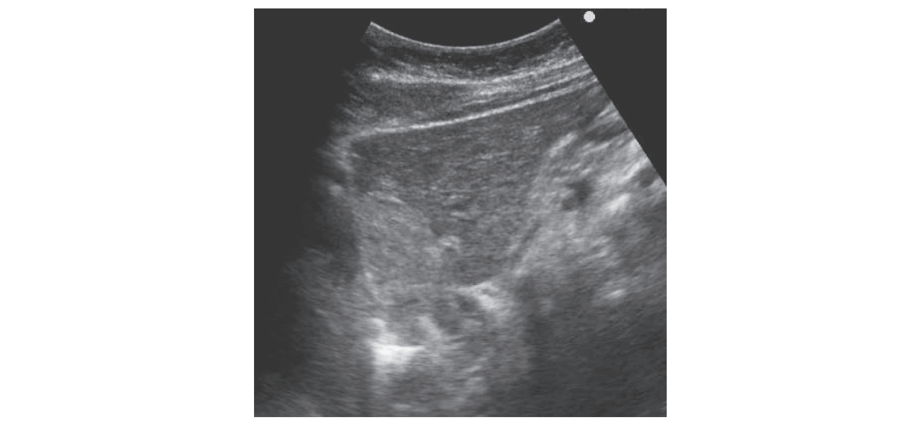
肝腫瘤の超音波像（正中縦断走査）を示す。鑑別に役立つのはどれか。2 つ選べ。
a	 MRI T2 強調像
b	 MRI 磁化率強調像
c	 ダイナミック造影 CT
d	 99mTc-GSA シンチグラフィ
e	 99mTc-PMT シンチグラフィ

[2015-56](http://www.radiology.jp/content/files/20150821.pdf#page=19)
 肝限局性結節性過形成の特徴はどれか。2 つ選べ。
a	 肝硬変を背景に発生する。
b	 T2 強調像で被膜が確認できる。
c	 肝コロイドシンチグラフィで集積を認める。
d	 ダイナミック造影 CT 動脈優位相で増強効果を示す。
e	 Gd-EOB-DTPA 造影 MRI の肝細胞相で低信号を呈する。

[2014-54](http://www.radiology.jp/content/files/1377.pdf#page=19)
肝病変の位相コントラスト MRI において，同位相像と比較して逆位相像で信号低下を
示さないのはどれか。1 つ選べ。
a 肝細胞癌
b 肝細胞腺腫
c 限局性脂肪肝
d 肝血管筋脂肪腫
e 限局性結節性過形成

[2014-56](http://www.radiology.jp/content/files/1377.pdf#page=20)
肝腫瘤性病変において，細胞外液性造影剤を用いた際に遅延性濃染パターンを呈しやす
いのはどれか。1 つ選べ。
a 肝細胞癌
b 胆管細胞癌
c 海綿状血管腫
d 腎癌からの転移
e 限局性結節性過形成

[2013-52](http://www.radiology.jp/content/files/2013_2s_exsam.pdf#page=18)
Gd-EOB-DTPA 造影 MRI の肝細胞相において，周囲肝実質と同程度に EOB を取り込む可能性が最
も低いのはどれか。1 つ選べ。
a 肝細胞癌
b 肝細胞腺腫
c 大腸癌肝転移
d 限局性脂肪沈着
e 限局性結節性過形成

[2013-62](http://www.radiology.jp/content/files/2013_2s_exsam.pdf#page=21)
肝限局性結節性過形成の画像所見として正しいのはどれか。2 つ選べ。
a 被膜を認めることが多い。
b ダイナミック CT の動脈相で強く濃染する。
c 腫瘤内に脂肪成分を認めることが多い。
d 中心瘢痕は MRI の T2 強調像で低信号を示す。
e 車輻状血管像（spoke-wheel appearance）が特徴的である。

[2012-69](http://www.radiology.jp/content/files/2012_1s_exsam.pdf#page=23)
石灰化をきたすことが少ない肝腫瘤はどれか。1 つ選べ。
a 肝芽腫
b 肝肉芽腫
c 肝血管腫
d 転移性肝腫瘍
e 限局性結節性過形成

#### XBaZ. 肝の画像診断ほか
[2016-53](http://www.radiology.jp/content/files/20160825.pdf#page=19)
Periportal collar sign を示す病態として考えにくいのはどれか。1 つ選べ。
a	 急性肝炎
b	 右心不全
c	 門脈血栓症
d	 急性胆管炎
e	 悪性リンパ腫

### XBbc. 胆,膵
#### XBc0. 撮像法と解剖
[2017-52](http://www.radiology.jp/content/files/20170904_2.pdf#page=19)
MR cholangiopancreatography（MRCP）について誤っているのはどれか。1 つ選べ。
a	 小児でも撮像できる。
b	 呼吸同期撮像が可能である。
c	 消化管の再建術後でも撮像できる。
d	 腹水が多量にあっても胆管・膵管を明瞭に観察できる。
e	 胆管・膵管閉塞部の下流のみならず上流側も観察できる。

[2018-56](http://www.radiology.jp/content/files/20180926_2.pdf#page=21)
膵・胆道系について誤りはどれか。1 つ選べ。
a	 膵管癒合不全では膵癌を合併しやすい。
b	 総胆管と主膵管は十二指腸壁内で合流する。
c	 輪状膵は十二指腸下行脚に狭窄を生じやすい。
d	 膵管胆管合流異常においては膵炎を合併しやすい。
e	 膵管胆管合流異常においては胆道系の癌が合併しやすい。

[2017-54](http://www.radiology.jp/content/files/20170904_2.pdf#page=20)
腹腔動脈およびその分枝から分岐する膵枝として頻度が最も低いのはどれか。1つ選べ。
a	 大膵動脈
b	 背側膵動脈
c	 下膵十二指腸動脈
d	 前上膵十二指腸動脈
e	 後上膵十二指腸動脈

[2013-68](http://www.radiology.jp/content/files/2013_2s_exsam.pdf#page=23)
上腹部の解剖で正しいのはどれか。2 つ選べ。
a 腹側膵は背側膵より大きい。
b Santorini 管は Vater 乳頭に開口する。
c Winslow 孔は門脈の背側に位置する。
d 総胆管は膵頭部内の背側を走行する。
e 胆囊は肝左葉外側区と方形葉の境界に位置する。

#### XBb1. 胆嚢炎と胆管炎と胆嚢腺筋腫症
[2016-54](http://www.radiology.jp/content/files/20160825.pdf#page=19)
急性胆囊炎を示唆する画像所見はどれか。2 つ選べ。
a	 Comet sign
b	 String of beads sign
c	 Onion skin appearance
d	 Sonographic Murphy’s sign
e	 Sonolucent layer in the wall

[2012-59](http://www.radiology.jp/content/files/2012_1s_exsam.pdf#page=20)
急性胆囊炎の超音波検査所見のうち頻度が最も高いのはどれか。1 つ選べ。
a 胆囊頸部の嵌頓胆石
b 胆囊内デブリエコー
c 胆囊周囲液貯留
d 胆囊壁肥厚
e 胆囊腫大

[2012-60](http://www.radiology.jp/content/files/2012_1s_exsam.pdf#page=20)
胆囊腺筋腫症でよく見られるのはどれか。2 つ選べ。
a 胆囊癌の合併
b 胆囊周囲腹水
c 肝門部リンパ節腫大
d 胆囊壁周囲脂肪増生
e Rokitansky-Aschoff 洞拡張

#### XBbN. 胆道腫瘤
[2017-53](http://www.radiology.jp/content/files/20170904_2.pdf#page=19)
胆管癌の CT 所見として頻度が高いのはどれか。2 つ選べ。
a	 不整壁肥厚
b	 遅延性濃染
c	 門脈腫瘍塞栓
d	 胆管内限局病変
e	 びまん性同心円状胆管壁肥厚

#### XBcF. 自己免疫性膵炎
[2019-57](http://www.radiology.jp/content/files/20190904_02.pdf#page=21)
自己免疫性膵炎の特徴として誤っているのはどれか。1 つ選べ。
a	 血清 IgG4 が上昇する。
b	 膵がびまん性に腫大する。
c	 病変部の主膵管が拡張する。
d	 CT にて被膜様構造を認める。
e	 FDG-PET で集積がみられる。

[2014-57](http://www.radiology.jp/content/files/1377.pdf#page=20)
自己免疫性膵炎について正しいのはどれか。2 つ選べ。
a ダイナミックスタディで早期濃染パターンを示すことが多い。
b 膵臓はびまん性に萎縮することが多い。
c 主膵管がびまん性に拡張することが多い。
d FDG-PET で高集積を示すことが多い。
e 総胆管壁が肥厚することが多い。

#### XBcN. 膵腫瘤
[2019-56](http://www.radiology.jp/content/files/20190904_02.pdf#page=20)
膵臓の粘液性囊胞性腫瘍の特徴として合致するのはどれか。1 つ選べ。
a	 主膵管拡張
b	 男性に好発
c	 膵頭部に好発
d	 40～60 歳に好発
e	 中心部の星芒状石灰化

[2013-59](http://www.radiology.jp/content/files/2013_2s_exsam.pdf#page=20)
膵囊胞性腫瘍について正しいのはどれか。2 つ選べ。
a 漿液性囊胞腺腫の石灰化は中心部に多い。
b 粘液性囊胞腫瘍は若年女性に好発する。
c 粘液性囊胞腫瘍は主膵管と交通することが多い。
d 膵管内乳頭粘液性腫瘍の分枝型は主膵管型より悪性度が高い。
e 膵管内乳頭粘液性腫瘍のある膵臓には通常型膵癌が合併しやすい。

[2018-55](http://www.radiology.jp/content/files/20180926_2.pdf#page=21)
 超音波による膵癌のスクリーニングにおいて重要でない膵画像所見はどれか。1つ選べ。
a	 低エコー腫瘤
b	 多発する石灰化
c	 びまん性脂肪浸潤
d	 囊胞性病変の合併
e	 主膵管径 3 mm 以上

[2017-55](http://www.radiology.jp/content/files/20170904_2.pdf#page=20)
膵腫瘤として女性に好発するのはどれか。2 つ選べ。
a	 仮性囊胞
b	 類表皮囊胞
c	 粘液性囊胞腫瘍
d	 充実性偽乳頭状腫瘍
e	 膵管内乳頭粘液性腫瘍

[2016-55](http://www.radiology.jp/content/files/20160825.pdf#page=19)
主膵管拡張をきたす頻度が最も低いのはどれか。1 つ選べ。
a	 慢性膵炎
b	 乳頭部癌
c	 Hemosuccus pancreaticus
d	 膵管内乳頭粘液性腫瘍
e	 びまん型自己免疫性膵炎

[2016-56](http://www.radiology.jp/content/files/20160825.pdf#page=20)
ダイナミック造影 CT で多血性病変として描出されるのはどれか。2 つ選べ。
a	 浸潤性膵管癌
b	 膵神経内分泌腫瘍
c	 膵漿液性囊胞腫瘍（SCN）
d	 膵粘液性囊胞腫瘍（MCN）
e	 膵管内乳頭粘液性腫瘍（IPMN）

[2015-57](http://www.radiology.jp/content/files/20150821.pdf#page=20)
膵漿液性囊胞腫瘍について正しいのはどれか。2 つ選べ。
a	 主膵管と交通しない。
b	 卵巣様間質を有する。
c	 卵殻状石灰化を生じる。
d	 境界悪性である頻度が高い。
e	 中心部に星芒状瘢痕を形成する。

[2013-57](http://www.radiology.jp/content/files/2013_2s_exsam.pdf#page=19)
 膵内分泌腫瘍と膵漿液性囊胞腺腫の鑑別診断法として最も有用なのはどれか。1 つ選べ。
a 超音波検査
b ダイナミック CT
c MRCP
d ERCP
e 血管造影

[2012-61](http://www.radiology.jp/content/files/2012_1s_exsam.pdf#page=21)
膵 Solid-pseudopapillary neoplasm（SPN）について正しいのはどれか。1 つ選べ。
a 男性に多い。
b 中高年に多い。
c 悪性の頻度が高い。
d 石灰化を伴うことは少ない。
e 腫瘍内出血を伴うことが多い。

[2012-62](http://www.radiology.jp/content/files/2012_1s_exsam.pdf#page=21)
膵囊胞性病変について誤っているのはどれか。1 つ選べ。
a 膵管内乳頭粘液性腫瘍では通常型膵癌の合併が多い。
b 主膵管型膵管内乳頭粘液性腫瘍は手術適応である。
c 粘液性囊胞腫瘍は膵管との交通はないことが多い。
d 漿液性囊胞腫瘍は中心部に石灰化が見られる。
e 粘液性囊胞腫瘍は膵頭部に好発する。

[2012-63](http://www.radiology.jp/content/files/2012_1s_exsam.pdf#page=21)
膵に多発性の囊胞を伴うことがあるのはどれか。2 つ選べ。
a 常染色体優性多発性囊胞腎
b Sturge-Weber 症候群
c von Hippel-Lindau 病
d Recklinghausen 病
e 結節性硬化症

### XB. 肝胆膵脾画像診断総合問題
[2017-51](http://www.radiology.jp/content/files/20170904_2.pdf#page=19)
脂肪抑制 T1 強調像で高信号を呈することが多いのはどれか。1 つ選べ。
a	 線維腫
b	 胆管細胞癌
c	 高分化肝細胞癌
d	 高分化脂肪肉腫
e	 膵管内乳頭粘液性腫瘍

[2015-54](http://www.radiology.jp/content/files/20150821.pdf#page=19
造影剤についての記述で正しいのはどれか。1 つ選べ。
a	 ガストログラフィン® は腎不全時には使用できない。
b	 ガドリニウム系造影剤は透析患者にも使用できる。
c	 Gd-EOB-DTPA 造影剤は大部分が腎臓から排泄される。
d	 ヨード系造影剤はヨードの原子番号が高いため増強効果を呈する。
e	 MRI 用経口造影剤（塩化マンガン四水和物）は大部分が胆汁中へ排泄される。

[2015-55](http://www.radiology.jp/content/files/20150821.pdf#page=19)
腹部画像検査と造影剤との組み合わせを示す。陰性造影剤はどれか。2 つ選べ。
a	 MRCP MRI 用経口造影剤
b	 肝 MRI 網内系造影剤
c	 消化管造影 バリウム
d	 肝造影超音波検査 マイクロバブル造影剤
e	 肝ダイナミック造影 CT ヨード系造影剤

## 消化管
[2019-58](http://www.radiology.jp/content/files/20190904_02.pdf#page=21)
 小網を走行する血管はどれか。2 つ選べ。
a	 左胃動脈
b	 腹腔動脈
c	 固有肝動脈
d	 胃大網動脈
e	 上腸間膜動脈

[2019-59](http://www.radiology.jp/content/files/20190904_02.pdf#page=21)
Treitz 靱帯の位置を表す解剖学的指標はどれか。1 つ選べ。
a	 脾静脈
b	 左副腎静脈
c	 第一空腸動脈
d	 下腸間膜静脈
e	 胃十二指腸動脈

[2019-60](http://www.radiology.jp/content/files/20190904_02.pdf#page=22)
超音波検査で小腸閉塞を表すのはどれか。1 つ選べ。
a	 comet sign
b	 sandwich sign
c	 keyboard sign
d	 chameleon sign
e	 parallel channel sign

[2018-59](http://www.radiology.jp/content/files/20180926_2.pdf#page=22)
Meckel 憩室について誤っているのはどれか。1 つ選べ。
a	 腸間膜の対側に発生する。
b	 合併症として腸閉塞がある。
c	 異所性組織として胃粘膜を含む。
d	 胎生期の卵黄腸管の一部が残存したものである。
e	 Treitz 靱帯より肛門側 90 cm 程度の空腸に好発する。

[2018-60](http://www.radiology.jp/content/files/20180926_2.pdf#page=22)
ヘリコバクターピロリ感染症と関係の乏しいのはどれか。1 つ選べ。
a	 皺襞腫大
b	 鳥肌胃炎
c	 萎縮性胃炎
d	 腸上皮化生
e	 胃底腺ポリープ

[2017-56](http://www.radiology.jp/content/files/20170904_2.pdf#page=20)
消化管の解剖について誤っているのはどれか。1 つ選べ。
a	 上行結腸は外膜を有する。
b	 右胃動脈は総肝動脈から分岐することが多い。
c	 下腸間膜静脈は Treitz 靱帯の外側辺縁部を走行する。
d	 食道の生理的第三狭窄部は横隔膜食道裂孔部である。
e	 辺縁動脈などによる側副路は小腸の方が大腸よりも多い。

[2017-57](http://www.radiology.jp/content/files/20170904_2.pdf#page=21)
上部消化管造影について正しいのはどれか。2 つ選べ。
a	 第一斜位とは左前斜位を意味する。
b	 検査前処置として水分摂取が推奨される。
c	 Schatzki 体位像では胃穹窿部を評価しやすい。
d	 圧迫法は胃穹窿部の潰瘍性病変の描出に有用である。
e	 腹臥位二重造影像でのバリウム貯留所見は前壁の陥凹性病変を示唆する。

[2017-58](http://www.radiology.jp/content/files/20170904_2.pdf#page=21)
潰瘍性大腸炎よりも Crohn 病を示唆するのはどれか。2 つ選べ。
a	 大腸癌
b	 瘻孔形成
c	 仙腸関節炎
d	 スキップ病変
e	 中毒性巨大結腸症

[2016-57](http://www.radiology.jp/content/files/20160825.pdf#page=21)
70 歳代の男性。昨夜から持続する胸部違和感を主訴に来院した。単純 CT を示す。
描出されている病態はどれか。1 つ選べ。
a	 食道癌
b	 アカラシア
c	 逆流性食道炎
d	 魚骨による食道穿孔
e	 PTP（press through pack）誤飲

[2016-58](http://www.radiology.jp/content/files/20160825.pdf#page=22)
CT コロノグラフィについて正しいのはどれか。2 つ選べ。
a	 鎮痙剤の投与は不要である。
b	 偶発症として腸管穿孔がある。
c	 腹臥位と背臥位の両体位で撮影する。
d	 腸管の拡張には生理食塩水を用いる。
e	 前処置として検査 6 時間前から絶食すればよい。

[2016-59](http://www.radiology.jp/content/files/20160825.pdf#page=22)
確定診断に水溶性ヨード造影剤を用いた注腸が推奨されるのはどれか。1 つ選べ。
a	 クローン病
b	 憩室炎穿孔
c	 虚血性腸炎
d	 偽膜性大腸炎
e	 潰瘍性大腸炎

[2015-58](http://www.radiology.jp/content/files/20150821.pdf#page=20)
 ブチルスコポラミン（ブスコパン®
）が投与禁忌でないのはどれか。1 つ選べ。
a	 喘　息
b	 緑内障
c	 心筋梗塞
d	 前立腺肥大症
e	 麻痺性イレウス

[2015-59](http://www.radiology.jp/content/files/20150821.pdf#page=20)
ガストログラフィン® による造影検査を行ってはならないのはどれか。1 つ選べ。
a	 胃　癌
b	 直腸膣瘻
c	 食道気管瘻
d	 小腸悪性リンパ腫
e	 十二指腸潰瘍穿孔

[2015-60](http://www.radiology.jp/content/files/20150821.pdf#page=21)
単純 CT で検出しにくい消化管異物はどれか。1 つ選べ。
a	 義　歯
b	 ヘアピン
c	 10 円硬貨
d	 梅干しの種
e	 PTP（Press through package）シート

[2014-67](http://www.radiology.jp/content/files/1377.pdf#page=23)
胃結腸静脈幹（Gastrocolic trunk）を形成する血管はどれか。2 つ選べ。
a 左胃静脈
b 後胃静脈
c 中結腸静脈
d 左結腸静脈
e 右胃大網静脈

[2014-69](http://www.radiology.jp/content/files/1377.pdf#page=24)
CT colonography について正しいのはどれか。2 つ選べ。
a 前処置は不要である。
b 注腸造影より安価である。
c 仰臥位と腹臥位の 2 体位で撮影する。
d 診断能は注腸造影と同等である。
e 大腸の拡張には空気より CO2 ガスが適している。

[2013-51](http://www.radiology.jp/content/files/2013_2s_exsam.pdf#page=17)
進行性大腸癌を疑う CT 所見はどれか。2 つ選べ。
a beak sign
b whirl sign
c overhanging edge
d eccentric stenosis
e cobblestone appearance

[2013-53](http://www.radiology.jp/content/files/2013_2s_exsam.pdf#page=18)
大腸壁のび漫性肥厚をきたしにくいのはどれか。1 つ選べ。
a 大腸憩室炎
b 偽膜性腸炎
c 好酸球性腸炎
d 過敏性大腸炎
e カンピロバクター腸炎

[2012-51](http://www.radiology.jp/content/files/2012_1s_exsam.pdf#page=17)
バリウムによる上部消化管造影の合併症として頻度が最も低いのはどれか。1 つ選べ。
a 便秘
b 誤嚥
c 蕁麻疹
d イレウス
e 小腸穿孔

[2012-52](http://www.radiology.jp/content/files/2012_1s_exsam.pdf#page=18)
Gatrointestinal Stromal Tumor（GIST）について誤っているのはどれか。1 つ選べ。
a 胃に好発する。
b 転移の中ではリンパ節転移が多い。
c 食道においては平滑筋腫のほうが多い。
d 5 cm を超えるものは絶対的手術適応となる。
e 転移，再発症例には分子標的治療薬が試みられる。

[2012-53](http://www.radiology.jp/content/files/2012_1s_exsam.pdf#page=18)
腹部単純 X 線写真背臥位像における気腹（free air）のサインはどれか。1 つ選べ。
a continuous diaphragm sign
b incomplete border sign
c deep sulcus sign
d angel wings sign
e football sign

## 泌尿器
[2019-61](http://www.radiology.jp/content/files/20190904_02.pdf#page=22)
破裂しやすい腎腫瘤を合併する頻度が高いのはどれか。1 つ選べ。
a	 結節性硬化症
b	 神経線維腫症 1 型
c	 神経線維腫症 2 型
d	 von Hippel-Lindau 病
e	 Sturge-Weber 症候群

[2019-62](http://www.radiology.jp/content/files/20190904_02.pdf#page=22)
腎囊胞性病変の CT 所見と Bosniak 分類の組み合わせで，正しいのはどれか。2 つ選べ。
a	 薄い隔壁を有する囊胞　 classⅠ
b	 造影効果のある囊胞壁　 classⅡ
c	 4 cm 大の高濃度囊胞　 classⅡF
d	 囊胞壁の薄い弧状石灰化　 classⅢ
e	 造影効果を示す充実部分　 classⅣ

[2019-63](http://www.radiology.jp/content/files/20190904_02.pdf#page=23)
MRI chemical shift imaging の opposed-phase 像で信号低下を示す頻度の高い副腎腫
瘤はどれか。1 つ選べ。
a	 血　腫
b	 腺　腫
c	 肺癌転移
d	 褐色細胞腫
e	 結核性肉芽腫

[2019-64](http://www.radiology.jp/content/files/20190904_02.pdf#page=23)
前立腺の解剖について誤っているのはどれか。1 つ選べ。
a	 射精管周囲に中心域がある。
b	 尿道の両外側に移行域がある。
c	 前線維筋性間質は腺組織を有する。
d	 尖部では尿道周囲に辺縁域が存在する。
e	 精阜のレベルで射精管が尿道へ開口する。

[2019-65](http://www.radiology.jp/content/files/20190904_02.pdf#page=23)
 尿膜管癌に関する記述で，正しいのはどれか。2 つ選べ。
a	 扁平上皮癌が最も多い。
b	 乳頭状膀胱癌と比較して予後は良好である。
c	 乳頭状膀胱癌と比較して乏血性を示すものが多い。
d	 乳頭状膀胱癌と比較して T2 強調像で低信号を示す。
e	 膀胱尿膜管移行部に発生するものがほとんどである。

[2018-61](http://www.radiology.jp/content/files/20180926_2.pdf#page=23)
急性腎盂腎炎で正しいのはどれか。2 つ選べ。
a	 血行性感染が原因である。
b	 熱発を伴わないことが多い。
c	 結石がなくても腎盂拡張を生じる。
d	 初期診断法として単純 CT が適切である。
e	 治療に対する反応が乏しい場合，造影 CT を行う。

[2018-62](http://www.radiology.jp/content/files/20180926_2.pdf#page=23)
常染色体優性多発性囊胞腎（ADPKD）の合併症として最も少ないのはどれか。1 つ選
べ。
a	 腎細胞癌
b	 尿路結石
c	 脳動脈瘤
d	 囊胞感染
e	 囊胞内出血

[2018-63](http://www.radiology.jp/content/files/20180926_2.pdf#page=23)
前立腺肥大症について正しいのはどれか。1 つ選べ。
a	 膀胱壁に肉柱形成を伴う。
b	 主として中心域が腫大する。
c	 PSA が異常値を示すことは少ない。
d	 全体として T2 強調像で均一な信号を呈する。
e	 肥大結節は拡散強調画像で辺縁域と同等の信号となる。

[2018-64](http://www.radiology.jp/content/files/20180926_2.pdf#page=24)
疾患のスクリーニングを行う際，疾患名と検査名の適切な組み合わせはどれか。1 つ選
べ。
a	 腎血管筋脂肪腫　 　血管造影検査
b	 尿管癌　 　CT ウログラフィー
c	 尿管結石　 　排泄性尿路造影
d	 膀胱癌　 　PET
e	 精巣捻転　 　MRI

[2017-59](http://www.radiology.jp/content/files/20170904_2.pdf#page=21)
 拡散強調像で拡散制限による高信号が最も顕著なのはどれか。1 つ選べ。
a	 腎髄質
b	 子宮筋層
c	 膀胱粘膜
d	 リンパ節
e	 前立腺辺縁域

[2017-60](http://www.radiology.jp/content/files/20170904_2.pdf#page=22)
泌尿器領域の解剖として正しいのはどれか。2 つ選べ。
a	 腎の区域動脈の間に吻合はない。
b	 尿管は腸骨動脈の背側を走行する。
c	 膀胱頸部のリンパは外腸骨リンパ節に流れる。
d	 右副腎静脈は右腎静脈に合流して下大静脈に還流する。
e	 男性の後部尿道は前立腺部尿道と膜様部尿道からなる。

[2017-61](http://www.radiology.jp/content/files/20170904_2.pdf#page=22)
水腎症の原因になりにくいのはどれか。1 つ選べ。
a	 膀胱憩室
b	 後部尿道弁
c	 重複腎盂尿管
d	 下大静脈後尿管
e	 腎盂尿管移行部狭窄

[2017-62](http://www.radiology.jp/content/files/20170904_2.pdf#page=22)
 MRI の T1 強調像で病変部の flow void が最も顕著なのはどれか。1 つ選べ。
a	 腎盂癌
b	 腎動静脈瘻
c	 精索静脈瘤
d	 ナットクラッカー症候群
e	 原発性アルドステロン症

[2017-63](http://www.radiology.jp/content/files/20170904_2.pdf#page=23)
停留精巣について正しいのはどれか。2 つ選べ。
a	 不妊のリスクが高い。
b	 腺癌発生のリスクが高い。
c	 5 歳までに精巣固定術を行う。
d	 精巣が鼠径管内に留まっていると外傷を受けやすい。
e	 生後 4 か月の時点で精巣が陰囊内に存在しない場合に診断される。

[2017-64](http://www.radiology.jp/content/files/20170904_2.pdf#page=23)
ADC 値の低下が最も顕著なのはどれか。1 つ選べ。
a	 尿膜管囊胞
b	 卵巣線維腫
c	 傍腎盂囊胞
d	 卵管卵巣膿瘍
e	 前立腺肥大結節

[2016-60](http://www.radiology.jp/content/files/20160825.pdf#page=22)
脂肪の乏しい腎血管筋脂肪腫を示唆する所見はどれか。2 つ選べ。
a	 腫瘍偽被膜の存在
b	 T1 強調像で高信号
c	 腎実質との間に beak sign
d	 単純 CT で腎実質よりも高吸収値
e	 T2 強調像で骨格筋と類似の低信号

[2016-61](http://www.radiology.jp/content/files/20160825.pdf#page=23)
水腎症と最も関連性が低いのはどれか。1 つ選べ。
a	 胃　癌
b	 膀胱尿管逆流
c	 下大静脈後尿管
d	 ナットクラッカー症候群
e	 IgG4 関連後腹膜線維症

[2016-62](http://www.radiology.jp/content/files/20160825.pdf#page=23)
前立腺癌における MRI 撮像法と所見との組み合わせとして典型的でないのはどれか。
1 つ選べ。
a	 T2 強調像 低信号
b	 ADC マップ 低　値
c	 拡散強調像 高信号
d	 化学シフト画像 out of phase 像で信号低下
e	 ダイナミック造影像 早期増強

[2016-63](http://www.radiology.jp/content/files/20160825.pdf#page=23)
後腹膜解剖について誤っているのはどれか。1 つ選べ。
a	 前腎傍腔には膵が存在する。
b	 前腎傍腔には上行結腸が存在する。
c	 前・後腎傍腔は横筋筋膜で境される。
d	 腎周囲腔は足側で前・後腎傍腔と連続する。
e	 後腎傍腔は腹膜前脂肪（properitoneal fat）と連続する。

[2015-61](http://www.radiology.jp/content/files/20150821.pdf#page=21)
 高血圧をきたす副腎疾患について正しいのはどれか。2 つ選べ。
a	 腺腫は髄質由来である。
b	 皮質過形成は片側性である。
c	 単純 CT で腫瘤が低吸収のときは腺腫を疑う。
d	 腺腫はダイナミック造影 CT で増強効果の遷延を示す。
e	 原発性アルドステロン症では，腺腫のサイズは 2 cm 以下のことが多い。

[2015-62](http://www.radiology.jp/content/files/20150821.pdf#page=21)
腎盂尿管移行部狭窄を疑う症例で腹部 CT を撮像した。所見として重要性が低いのはど
れか。1 つ選べ。
a	 尿管壁の厚さ
b	 腎実質の厚さ
c	 腎杯の拡張程度
d	 腎動脈の分岐・走行
e	 腎静脈の分岐・走行

[2015-63](http://www.radiology.jp/content/files/20150821.pdf#page=22)
囊胞性腎腫瘤の CT 所見として悪性を最も疑わせるのはどれか。1 つ選べ。
a	 壁の石灰化
b	 高吸収の内容液
c	 密に存在する隔壁
d	 囊胞壁の不整な肥厚
e	 周囲組織内へ広がる充実性成分

[2015-64](http://www.radiology.jp/content/files/20150821.pdf#page=22)
前立腺癌精囊浸潤を疑わせる MRI 所見はどれか。2 つ選べ。
a	 T1 強調像：精囊内腔の高信号化
b	 T2 強調像：精囊内腔の高信号が不明瞭化
c	 ADC マップ：精囊全体の ADC 値が膀胱内の尿と同程度
d	 造影 T1 強調像：壁・隔壁から精囊内腔に突出する局所的な増強
e	 ダイナミック造影像：肥厚を伴わない精囊壁・隔壁に漸増性の増強

[2015-65](http://www.radiology.jp/content/files/20150821.pdf#page=22)
 精巣セミノーマの特徴はどれか。1 つ選べ。
a	 50 歳以降に多い。
b	 hCG が著明高値となる。
c	 内部に出血・壊死を伴いやすい。
d	 停留精巣における発生率が高い。
e	 非セミノーマよりも転移を生じやすい。

[2015-66](http://www.radiology.jp/content/files/20150821.pdf#page=23)
 前立腺の T2 強調横断像を別に示す。中心域（central zone）はどれか。1 つ選べ。
a	 ①
b	 ②
c	 ③
d	 ④
e	 ⑤

[2014-58](http://www.radiology.jp/content/files/1377.pdf#page=20)
機能性副腎皮質腺腫の画像所見として可能性が高いのはどれか。1 つ選べ。
a 対側副腎の腫大
b CT 値が平均 10 HU 未満
c MRI opposed phase 画像にて信号上昇
d 131I-アドステロールシンチグラムでの取り込み低下
e 造影 CT で早期濃染，10 分後程度の遅延相で washout が 70％ 以上

[2014-59](http://www.radiology.jp/content/files/1377.pdf#page=21)
画像所見として尿路結石を示唆するのはどれか。2 つ選べ。
a soft tissue rim sign
b teacup calcification
c Mercedes Benz sign
d string of beads sign
e staghorn appearance

[2014-62](http://www.radiology.jp/content/files/1377.pdf#page=22)
前立腺の MR 検査法において有用性が低いのはどれか。1 つ選べ。
a FLAIR 像
b T2 強調像
c 拡散強調像
d ダイナミック造影像
e MR スペクトロスコピー

[2014-68](http://www.radiology.jp/content/files/1377.pdf#page=24)
後腹膜腔について正しいのはどれか。2 つ選べ。
a 左右の後腎傍腔に交通はない。
b 下行結腸は腎周囲腔に含まれる。
c 後腎傍腔内に実質臓器は含まれない。
d 腎周囲腔と後腎傍腔は交通していない。
e 前腎傍腔は壁側腹膜と Gerota 筋膜に囲まれる。

[2013-61](http://www.radiology.jp/content/files/2013_2s_exsam.pdf#page=21)
左精巣癌 pT1 の経過観察 CT で，最も注意して観察すべきリンパ節が含まれる断面はどのレベルか。
1 つ選べ。
a 鎖骨上窩
b 肺門部
c 腎門部
d 骨盤入口部
e 鼠径部

[2013-69](http://www.radiology.jp/content/files/2013_2s_exsam.pdf#page=23)
副腎腺腫と肺癌副腎転移の鑑別のための検査情報として有用性が低いのはどれか。1 つ選べ。
a FDG-PET の SUV
b 単純 CT での CT 値
c 造影ダイナミック CT の washout ratio
d MRI の拡散強調像の ADC 値
e MRI の in-phase 像と out-of-phase 像の信号差

[2012-54](http://www.radiology.jp/content/files/2012_1s_exsam.pdf#page=18)
クリスマスツリー様膀胱を示す神経因性膀胱の原因として可能性が最も低いのはどれか。 1 つ選べ。
a 多発性硬化症
b 脊髄星細胞腫
c 脊髄空洞症
d 脊髄梗塞
e 糖尿病

[2012-55](http://www.radiology.jp/content/files/2012_1s_exsam.pdf#page=19)
前立腺癌の MRI について正しいのはどれか。 2 つ選べ。
a スクリーニングとしての使用が推奨されている。
b 生検による出血の影響はほとんど受けない。
c 造影検査は精囊浸潤の評価に有用である。
d T1 強調像は骨転移の評価に有用である。
e 移行域癌の診断はできない。

[2012-56](http://www.radiology.jp/content/files/2012_1s_exsam.pdf#page=19)
腎囊胞性病変について正しいのはどれか。1 つ選べ。
a 石灰化は悪性化の指標である。
b multilocular cystic nephroma は女児に好発する。
c 遺伝性の多発囊胞腎には腎癌が合併しやすい。
d 囊胞性腎癌は通常型腎癌よりも予後不良である。
e CT で高吸収を示す径 3 cm 以上の囊胞は経過観察とすべきである。

[2012-57](http://www.radiology.jp/content/files/2012_1s_exsam.pdf#page=19)
腎細胞癌について正しいのはどれか。1 つ選べ。
a 浸潤性発育が多い。
b 乏血性のものは 5％ 以下である。
c 遠隔転移の臓器は肺が最も多い。
d MRI で脂質を認めるのは 5％ 以下である。
e 質的診断が困難な径 2 cm 以下の腫瘤は，腎細胞癌として手術すべきである。

[2012-58](http://www.radiology.jp/content/files/2012_1s_exsam.pdf#page=20)
原発性アルドステロン症について正しいのはどれか。2 つ選べ。
a 腺腫の CT 値は 20 H.U. 以上である。
b 高血圧症の原因の 10％ 以上を占める。
c 多発性内分泌腫瘍（MEN）と関連が深い。
d わが国では副腎過形成が原因として最も多い。
e 診断には副腎静脈血サンプリングが有用である。

## 産婦人科
### XQ0. 解剖
[2018-65](http://www.radiology.jp/content/files/20180926_2.pdf#page=24)
産婦人科臓器・構造で両者が接している組み合わせはどれか。1 つ選べ。
a	 卵管間質部　 　卵巣
b	 直腸子宮窩　 　前腟円蓋
c	 子宮体部　 　広間膜
d	 子宮頸部膣部　 　基靭帯
e	 子宮円索　 　子宮動脈

### XQu0. 子宮総論

[2016-65](http://www.radiology.jp/content/files/20160825.pdf#page=24)
子宮に関して正しいのはどれか。1 つ選べ。
a	 子宮傍組織には尿管が走行する。
b	 子宮頸部膣部は主として円柱上皮が存在する。
c	 内子宮口の高さは後腟円蓋の高さと一致する。
d	 高齢者では子宮頸部膣部に癌が発生しやすい。
e	 子宮頸部膣部発生の癌は膣上部発生の癌よりも子宮傍組織に浸潤しやすい。

[2017-66](http://www.radiology.jp/content/files/20170904_2.pdf#page=24)
子宮内膜肥厚精査のため行われた MRI を読影する際に臨床情報として有用性が最も低
いのはどれか。1 つ選べ。
a	 喫煙歴
b	 妊娠出産歴
c	 乳癌の既往の有無
d	 検査当日の月経周期
e	 エストロゲン補充療法の有無

[2015-67](http://www.radiology.jp/content/files/20150821.pdf#page=24)
分泌期の子宮構造のうち，T2 強調像で高信号を呈するのはどれか。2 つ選べ。
a	 頸管上皮
b	 頸部間質
c	 子宮内膜
d	 体部筋層
e	 Junctional zone

### XQuN. 子宮癌
◎[2013-56](http://www.radiology.jp/content/files/2013_2s_exsam.pdf#page=19)
子宮頸癌の臨床進行期分類(FIGO)として**誤っている**のはどれか。1つ選べ。  
`病巣が5cmで頸部に限局する場合は，IB2期である。`  
`傍子宮結合組織浸潤があった場合は，IIB期である。`  
`腟壁浸潤が下1/3に達する場合は，IIIA 期である。`  
`水腎症があれば，IIIB 期である。`  
`IVB 期の診断には，膀胱鏡検査が必要である。`  

◎[2018-66](http://www.radiology.jp/content/files/20180926_2.pdf#page=24)
原発巣に対する手術療法が**推奨されない**のはどれか。1つ選べ。  
`子宮体癌頸部間質浸潤`  
`子宮体癌浅部筋層浸潤`  
`子宮頸癌膀胱筋層浸潤`  
`子宮頸癌子宮傍組織浸潤`  
`卵巣癌傍大動脈リンパ節転移`  

【子宮頸癌】

詳細は子宮頸癌の放射線治療の項を参照.

**こたえ**
- 2013-56: `IVB 期の診断には，膀胱鏡検査が必要である。`
- 2018-66: `子宮頸癌膀胱筋層浸潤`

[2016-64](http://www.radiology.jp/content/files/20160825.pdf#page=24)
MRI の撮像法と画像所見との組み合わせで子宮体癌を疑わせるのはどれか。1 つ選べ。
a	 T2 強調像 子宮内膜に多数の囊胞含有
b	 T2 強調像 月経周期に合わない子宮内膜肥厚
c	 拡散強調像 子宮内膜が体部筋層と等信号
d	 脂肪抑制 T1 強調像 病変部に点状の高信号
e	 ダイナミック造影 MRI 漸増性増強

### XQoN. 卵巣腫瘍
[2019-67](http://www.radiology.jp/content/files/20190904_02.pdf#page=24)
単純 CT で石灰化以外の高吸収を呈することが多いのはどれか。2 つ選べ。
a	 黄体出血
b	 傍卵巣囊胞
c	 卵巣甲状腺腫
d	 転移性卵巣腫瘍
e	 卵巣漿液性囊胞腺腫

[2019-66](http://www.radiology.jp/content/files/20190904_02.pdf#page=24)
画像所見と疾患との組み合わせで誤っているのはどれか。1 つ選べ。
a	 Central fibrous core 　卵巣未分化胚細胞腫
b	 Cosmos sign 　分葉状頸管腺過形成
c	 Fat-fluid level 　卵巣成熟囊胞奇形腫
d	 Follicle preserving sign 　卵巣悪性リンパ腫
e	 Kissing ovary 　骨盤子宮内膜症

[2017-67](http://www.radiology.jp/content/files/20170904_2.pdf#page=24)
子宮内膜症を鑑別に挙げる必要性が高いのはどれか。1 つ選べ。
a	 膀胱憩室内に生じた腫瘤
b	 尿膜管に生じた囊胞性腫瘤
c	 子宮頸部間質内に生じた腫瘤
d	 ダグラス窩に生じた癒着性病変
e	 子宮筋腫内に生じた出血性病変

[2015-69](http://www.radiology.jp/content/files/20150821.pdf#page=24)
成熟期女性のダグラス窩に囊胞性腫瘤が存在する時，内膜症性囊胞を積極的に考える画
像所見はどれか。2 つ選べ。
a	 単純 CT で囊胞内は筋肉に近い濃度を呈する。
b	 T2 強調像で多房性囊胞性腫瘤の形態を呈する。
c	 T1 強調像で直腸前壁との間に索状のひきつれを伴う。
d	 T2 強調像で囊胞壁の厚さは卵胞の壁と同程度である。
e	 T1 強調像で囊胞内は皮下脂肪よりやや低い程度の高信号を呈する。

[2018-67](http://www.radiology.jp/content/files/20180926_2.pdf#page=25)
子宮内膜症の発生頻度が低いのはどれか。1 つ選べ。
a	 卵　管
b	 広間膜
c	 子宮円索
d	 膀胱子宮窩
e	 直腸子宮窩

[2016-66](http://www.radiology.jp/content/files/20160825.pdf#page=24)
T2強調像においてケミカルシフトアーチファクトが診断に役立つのはどれか。1つ選べ。
a	 卵巣出血
b	 莢膜細胞腫
c	 内膜症性囊胞
d	 成熟囊胞奇形腫
e	 粘液性囊胞腺腫

[2014-70](http://www.radiology.jp/content/files/1377.pdf#page=24)
画像所見と疾患との組み合わせとして間違っているのはどれか。1 つ選べ。
a shading ――――――――――――内膜症性囊胞
b scalloping effect ――――――――腹膜偽粘液腫
c egg-shell calcification ――――――卵巣成熟奇形腫
d bridging vascular sign ―――――漿膜下子宮筋腫
e stained glass appearance ――――卵巣粘液性囊胞腺腫

[2012-64](http://www.radiology.jp/content/files/2012_1s_exsam.pdf#page=22)
MRI T2 強調像で低信号部を認めにくい子宮・卵巣病変はどれか。1 つ選べ。
a 子宮筋腫
b 子宮頸部ナボット囊胞
c 卵巣線維腫
d 卵巣甲状腺腫
e 卵巣内膜症性囊胞

[2012-65](http://www.radiology.jp/content/files/2012_1s_exsam.pdf#page=22)
捻転を来す女性生殖器（疾患）として，考えにくいのはどれか。1 つ選べ。
a 卵巣成熟奇形腫
b 内膜症性囊胞
c 卵巣線維腫
d 正常卵巣
e 子宮筋腫

### XQZ. 産婦人科画像診断ほか
[2017-65](http://www.radiology.jp/content/files/20170904_2.pdf#page=23)
重複子宮に合併しやすいのはどれか。1 つ選べ。
a	 腎低形成
b	 卵巣欠損
c	 処女膜閉鎖
d	 重複腎盂尿管
e	 腎盂尿管移行部狭窄

[2016-67](http://www.radiology.jp/content/files/20160825.pdf#page=25)
20 歳代の女性。急性腹症のため受診した。MRI を撮像すると，T2 強調像で著明な低信
号を呈する液体がダグラス窩に貯留していた。子宮や付属器の様子は体動による画質劣
化で評価できない。可能性が高いのはどれか。2 つ選べ。
a	 卵巣出血
b	 子宮外妊娠
c	 子宮腺筋症
d	 卵管留水腫
e	 卵巣莢膜細胞腫

[2015-68](http://www.radiology.jp/content/files/20150821.pdf#page=24)
 疾患と疾患を示唆する MR 所見との組み合わせで正しいのはどれか。2 つ選べ。
a	 子宮腺筋症 T2 強調像で子宮筋層内に境界明瞭な低信号域
b	 子宮筋腫赤色変性 T2 強調像で子宮筋層内にリング状低信号を伴う腫瘤
c	 絨毛癌 ダイナミック造影像（動脈優位相）で子宮内腔から筋
層内に強い増強効果を呈する腫瘤
d	 卵巣線維腫 T1 強調像で附属器に flow void を有する腫瘤
e	 卵巣成熟囊胞性奇形腫 T1 強調像で附属器に低信号腫瘤

[2013-60](http://www.radiology.jp/content/files/2013_2s_exsam.pdf#page=20)
骨盤腹膜炎について誤っているのはどれか。1 つ選べ。
a 不妊の原因になる。
b 卵巣の腫大を伴うことが多い。
c 慢性期には下痢や便秘がみられる。
d 膣からの上行感染によることが多い。
e 子宮内避妊器具の長期装着症例では大腸菌感染が多い。

## 骨軟部
### XT2. 脊椎
#### XT2T. 脊椎の外傷
◎[2019-27](http://www.radiology.jp/content/files/20190904_02.pdf#page=11)
脊椎骨折について正しいのはどれか。1つ選べ。  
`脱臼骨折では脊髄損傷は稀である。`  
`歯突起骨折は若年者によくみられる。`  
`Hangman骨折は軸椎後弓の骨折である。`  
`Jefferson骨折は軸椎骨折のひとつである。`  
`頸椎横突起骨折では血管損傷の危険性が高い。`  

◎[2014-20](http://www.radiology.jp/content/files/1377.pdf#page=8)
脊椎骨折の画像検査について**誤っている**のはどれか。1つ選べ。  
`単純X線撮影は2方向撮影が基本である。`  
`単純X線撮影は高齢者での骨折の評価に適している。`  
`MRIは骨折の新旧を評価することができる。`  
`CTでは再構成画像が骨折の形態評価に有用である。`  
`CTが先行した場合は単純X線撮影は省略できる。`  

◎[2012-17](http://www.radiology.jp/content/files/2012_1s_exsam.pdf#page=6)
脊椎すべりについて正しいのはどれか。2つ選べ。  
`先天性脊椎すべりは L1 に最も多い。`  
`分離すべりは L4 に最も多い。`  
`分離すべりは神経根症状をきたし易い。`  
`変性すべりは L5 に最も多い。`  
`変性すべりは馬尾症状をきたし易い。`  

【脊椎の外傷】

- Jefferson骨折: C1椎体の破裂骨折
- Hangman骨折: C2椎体椎弓移行部の骨折

【脊椎辷り症 spondylolisthesis】

- 「上位椎体が下位椎体に対して辷っている」と表現する.
- 変性辷りはL4/L5間に多い(つまりL4 levelに多い).
    - 中年以上の女性のL4/L5に好発する.
- 分離辷りはL5/S1間に多い(つまりL5 levelに多い).
    - 10-20歳での発症が多い. スポーツなどによる慢性的負荷によって生じた疲労骨折が偽関節となった状態と考えられる.
- 先天性脊椎辷り
    - 

**こたえ**
- 2019-27: `頸椎横突起骨折では血管損傷の危険性が高い。`
- 2014-20: `単純X線撮影は高齢者での骨折の評価に適している。`
- 2012-17: `分離すべりは神経根症状をきたし易い。`, `変性すべりは馬尾症状をきたし易い。`

#### XT2H. 脊椎の感染症
◎[2017-29](http://www.radiology.jp/content/files/20170904_2.pdf#page=11)
結核性脊椎炎の画像所見の特徴として**誤っている**のはどれか。1つ選べ。  
`椎体癒合` `脊椎周囲の石灰化` `椎間板への早期波及` `複数レベルのスキップ病変` `脊椎周囲の境界明瞭な膿瘍`  

◎[2016-29](http://www.radiology.jp/content/files/20160825.pdf#page=10)
化膿性脊椎炎の特徴として正しいのはどれか。1つ選べ。  
`石灰化` `後方進展` `多椎間病変` `腰椎に好発` `傍椎体腫瘤形成`  

【脊椎の感染症】

- 化膿性脊椎炎
    - 部位: 下位腰椎に多い
    - 発生: 脊椎外からの血行性波及による(つまり敗血症であるということ). 感染巣は椎間板に接した終板に生じる
    - 椎間板: ほぼ全例で**椎間板に浸潤**する. 
    - 前後進展: 椎体を破って**前方に進展**することもある
- 結核性脊椎炎
    - 部位: 胸腰椎移行部に多い
    - 発生: 肺結核からの血行性波及による. 感染巣は椎体の前方に生じる
    - 椎間板: 保たれることがある.
    - 前後進展: 前方進展も後方進展もしうる.
    - 上下進展: 前縦靭帯を通じて隣接していない離れた椎体にも波及する. 

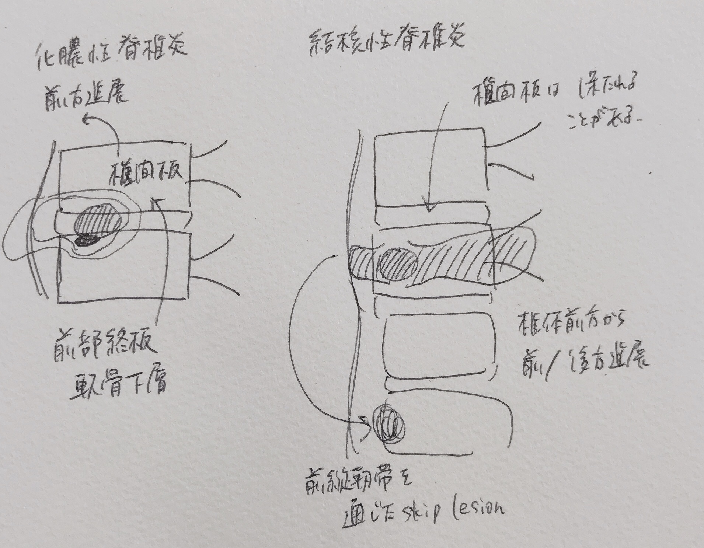

**こたえ**
- 2017-29: `椎間板への早期波及` 
- 2016-29: `腰椎に好発`

#### XT2F. 脊椎炎
[2018-27](http://www.radiology.jp/content/files/20180926_2.pdf#page=11)
強直性脊椎炎の骨単純 X 線写真の所見として誤っているのはどれか。1 つ選べ。
a	 仙腸関節の骨びらん
b	 脊椎椎体前縁の直線化
c	 脊椎椎体終板の骨破壊像
d	 脊椎椎体周囲靱帯の厚い骨化
e	 両側股関節のびまん性関節裂隙狭小化

[2012-18](http://www.radiology.jp/content/files/2012_1s_exsam.pdf#page=6)
成人の骨盤単純 X 線写真正面像で仙腸関節の開大がある。
最も考えにくいのはどれか。1 つ選べ。
a 強直性脊椎炎
b 乾癬性関節炎
c 腸炎性関節炎
d 甲状腺機能亢進症
e 副甲状腺機能亢進症

#### XT2O. 脊椎の先天奇形
[2018-26](http://www.radiology.jp/content/files/20180926_2.pdf#page=11)
脊椎の先天奇形について正しいのはどれか。2 つ選べ。
a	 半椎の後方要素は正常である。
b	 潜在性二分脊椎は健常者では見られない。
c	 蝶形椎は半椎が左右非対称になったものである。
d	 脊椎癒合不全には神経系の異常を合併するものが多い。
e	 先天性椎弓根欠損は対側の椎弓根過形成が診断の手がかりとなる。

### XT3. 肩

◎[2012-19](http://www.radiology.jp/content/files/2012_1s_exsam.pdf#page=7)
損傷を最も受けやすいのはどれか。1つ選べ。   
`棘上筋腱` `棘下筋腱` `小円筋腱` `肩甲下筋腱` `上腕二頭筋腱長頭`  

【腱板損傷】

**こたえ**
- 2012-19: `棘上筋腱`

### XT4,7. 上下肢
[2018-28](http://www.radiology.jp/content/files/20180926_2.pdf#page=11)
 骨折後に無腐性骨壊死を来し易いのはどれか。1 つ選べ。
a	 膝蓋骨骨折
b	 踵骨隆起骨折
c	 有鉤骨鉤骨折
d	 舟状骨腰部骨折
e	 橈骨遠位端骨折

[2013-18](http://www.radiology.jp/content/files/2013_2s_exsam.pdf#page=6)
骨壊死をきたしやすいのはどれか。2 つ選べ。
a 脛骨プラトー骨折
b 舟状骨腰部骨折
c 橈骨遠位端骨折
d 大腿骨頚部骨折
e 外果骨折

[2013-20](http://www.radiology.jp/content/files/2013_2s_exsam.pdf#page=7)
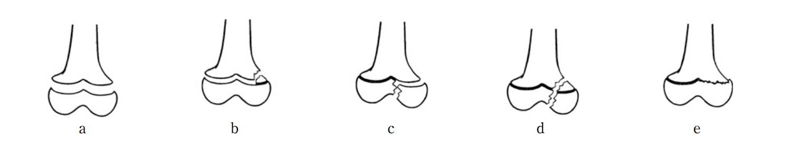
骨端線骨折で最も頻度が高いのはどれか。1 つ選べ。
a b c d e

### XT6. 股関節
[2016-28](http://www.radiology.jp/content/files/20160825.pdf#page=10)
両側大腿骨頭壊死の原因となるのはどれか。2 つ選べ。
a	 潜函病
b	 アルコール多飲
c	 深部静脈血栓症
d	 金属加工業従事
e	 非ステロイド性抗炎症薬

### XT7. 膝
[2019-28](http://www.radiology.jp/content/files/20190904_02.pdf#page=11)
膝関節の前十字靱帯断裂において骨挫傷の好発部位はどれか。2 つ選べ。
a	 大腿骨外側顆前面
b	 大腿骨外側顆後面
c	 大腿骨外側顆下面
d	 脛骨外側顆後面
e	 脛骨外側顆前面

[2014-22](http://www.radiology.jp/content/files/1377.pdf#page=8)
Baker 囊胞が接するのはどれか。1 つ選べ。
a 縫工筋
b 半腱様筋
c 大腿二頭筋
d 腓腹筋外側頭
e 腓腹筋内側頭

[2014-23](http://www.radiology.jp/content/files/1377.pdf#page=9)
膝の半月板について誤っているのはどれか。1 つ選べ。
a 円板状半月板は外側に多い。
b 半月板辺縁部 1/4 には血行（red zone）がある。
c 外側半月板の前角と後角の幅はほぼ等しい。
d 内側半月板は外側半月板より可動性が大きい。
e 外側半月板は，内側半月板に比し，より C 字に近い形態である。

### XT8. 足
[2019-25](http://www.radiology.jp/content/files/20190904_02.pdf#page=10)
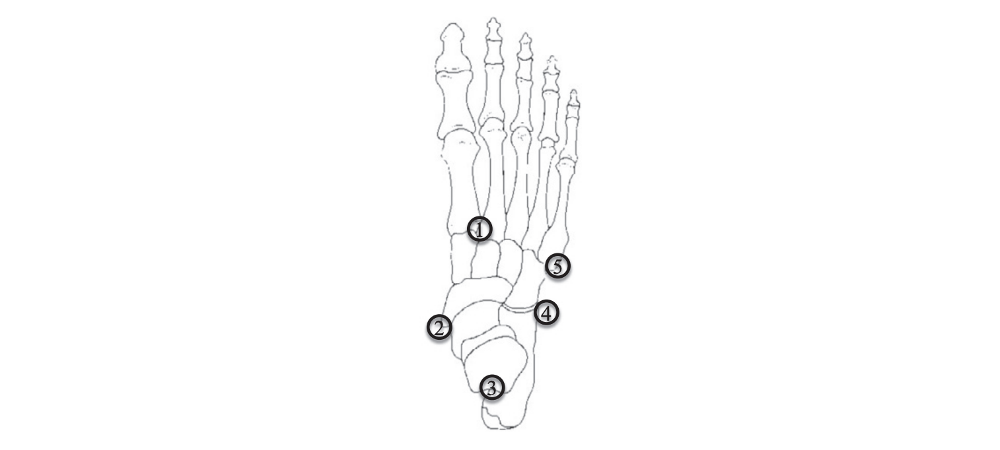
 足の副骨の部位を示す。外脛骨はどれか。1 つ選べ。
a	 1
b	 2
c	 3
d	 4
e	 5

### XTD. 骨代謝性疾患
◎[2017-25](http://www.radiology.jp/content/files/20170904_2.pdf#page=10)
疾患と所見との組み合わせとして正しいのはどれか。2つ選べ。  
`副甲状腺機能亢進症 - 骨膜骨形成`  
`骨粗鬆症 - 骨膜下骨吸収`  
`腎性骨異栄養症 - 転移性石灰化`  
`骨軟化症 - Looser’s zone (偽骨折)`  
`くる病 - 長管骨骨幹端の三角フラスコ変形`  

[2016-25](http://www.radiology.jp/content/files/20160825.pdf#page=9)
Paget病で**誤っている**のはどれか。1つ選べ。  
`臼蓋底突出` `額縁様変形` `綿花様所見` `バナナ骨折` `すりガラス陰影`  

[2015-28](http://www.radiology.jp/content/files/20150821.pdf#page=10)
関節軟骨の石灰化をきたす疾患はどれか。2つ選べ。  
`偽痛風` `関節リウマチ` `アミロイド関節症` `滑膜性骨軟骨腫症` `副甲状腺機能亢進症`  

[2014-19](http://www.radiology.jp/content/files/1377.pdf#page=7)
骨が膨脹(腫大)するのはどれか。2つ選べ。  
`線維性骨異形成` `骨軟化症` `Paget病` `骨挫傷` `骨梗塞`  

[2012-16](http://www.radiology.jp/content/files/2012_1s_exsam.pdf#page=6)
骨硬化像を来すのはどれか。2つ選べ。  
`骨肉腫` `ビタミンD欠乏症` `骨Paget病慢性期` `副甲状腺機能亢進症` `Langerhans細胞組織球症`  

【骨代謝性疾患】

- 骨代謝の概観
    - PTHの作用
        - 以下の2つにより血中Ca濃度を上昇させる.
            - 遠位尿細管におけるCa再吸収の増加とP排泄の増加
            - 破骨細胞の数と活動性の増大
    - 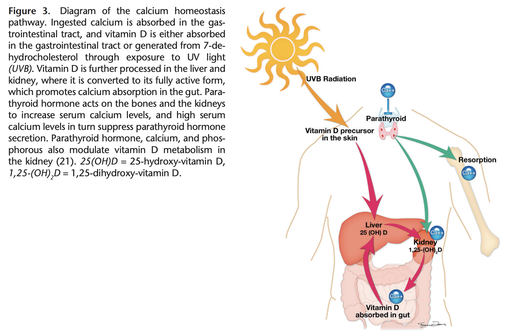

- 骨粗鬆症 osteporosis
    - 海綿骨の骨梁が徐々に減少する.
        - 長管骨においては, 重要でない骨梁から減っていく(引っ張り骨梁群と圧迫骨梁群).
        - 椎体においては, 海綿骨の吸収によって相対的に終板濃度が高くみえ, empty box状になる. また, 上下終板が脆弱となるため椎間板に圧迫されて魚椎変形をきたす.
- くる病 rickets
    - 類骨組織が適切に石灰化できなくなる.
        - かつてはVitDの摂取不足が主たる原因であった.
        - 現在では腸管での吸収不全(消化管術後でも生じる), 腎の尿細管障害, 腎不全による二次的な腎性骨ジストロフィーなどが含まれる.
    - 2つの病型がある.
        - 乳児くる病: 6-18ヶ月に発生.
        - VitD抵抗性くる病: 生後30ヶ月以降に発生. 主に4つの病態が原因.
            - 家族性VitD抵抗性くる病
            - Fanconi症候群
    - 画像所見
        - 頭蓋: 頭蓋軟化症
        - 肋骨: 肋軟骨の軟骨が増大する(くる病念珠 rachitic rosary).
        - 長管骨: (1) 体重がかかる骨に弓状彎曲変形を生じる. (2) 骨幹端部が陥凹する(cupping). (3) 成長軟骨板が側方に拡大する(flairing).
        - 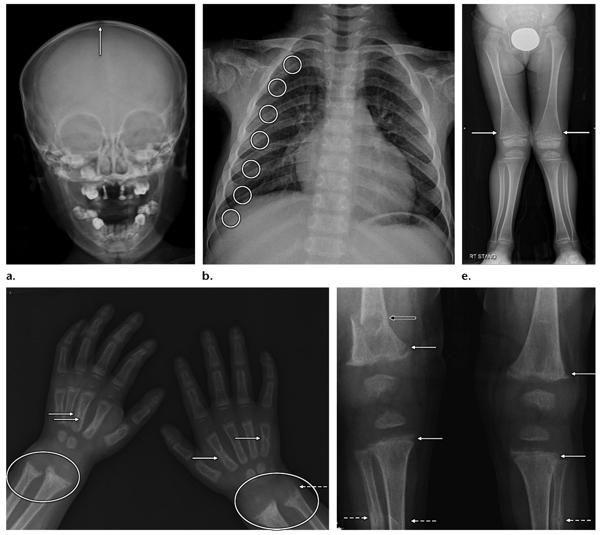
- 骨軟化症 osteomalacia
    - くる病と同じ病態によって発生する.
    - 骨端閉鎖前ではくる病と併存しうる.
    - 画像所見
        - 骨皮質に骨の長軸と直行する透過性の裂け目を生じる(偽骨折 looser zone).
- 副甲状腺機能亢進症
    - 長管骨: (1)骨膜下骨吸収, (2)軟骨下骨吸収, (3)褐色腫(brown tumor)
    - 頭蓋: salt and pepper appearance
    - 椎体: ラガージャージ脊椎(とくに二次性の場合)
    - 軟部組織: 軟部組織の石灰化.
- 腎性骨ジストロフィー
    - 骨軟化症(/くる病)と副甲状腺機能亢進症の病態が共存する.
    - これは腎のVitD変換酵素が働かなくなることによる腸管からのCa吸収障害と, 二次性副甲状腺機能亢進症の両者による.
- 骨Paget病
    - 

**こたえ**
- 2017-25: `腎性骨異栄養症 - 転移性石灰化`, `骨軟化症 - Looser’s zone (偽骨折)` 
- 2016-25: 
- 2015-28: 
- 2014-19: 
- 2012-16: 

### XTNb. 骨腫瘍
#### XTNb0. 骨腫瘍総論

[2019-21](http://www.radiology.jp/content/files/20190904_03.pdf#page=19)
20歳代の女性。右膝背側の痛みを主訴に来院した。右膝関節の単純X線写真の側面像を示す。可能性が最も高いのはどれか。1つ選べ。  
`類骨骨腫` `骨化性筋炎` `悪性リンパ腫` `傍骨性骨肉腫` `メロレオストーシス`  
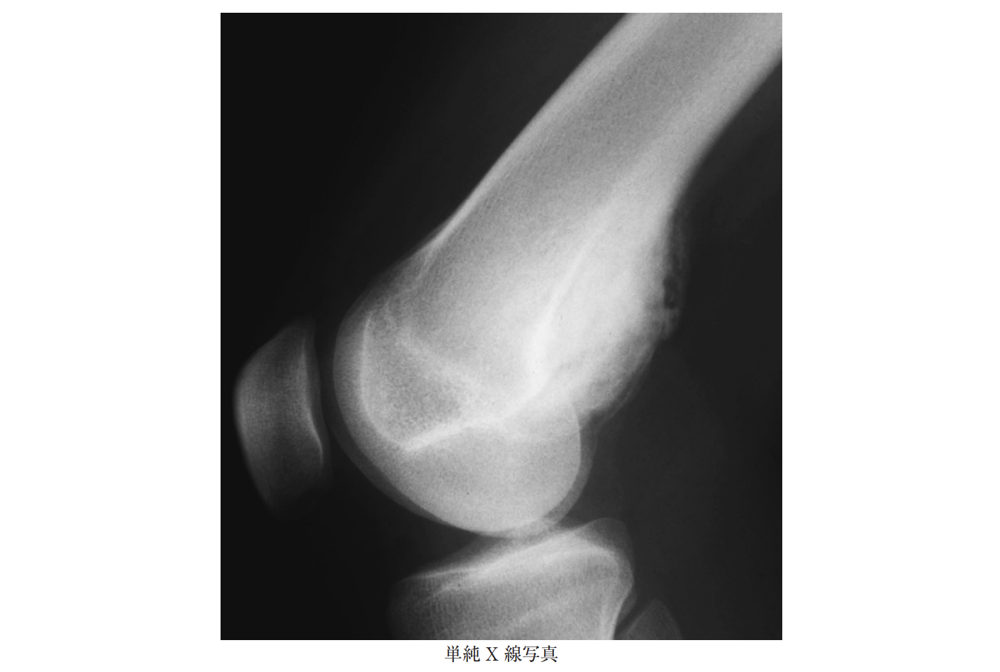

◎[2016-27](http://www.radiology.jp/content/files/20160825.pdf#page=9)
骨端に好発するのはどれか。1つ選べ。  
`骨肉腫` `内軟骨腫` `軟骨芽細胞腫` `非骨化性線維腫` `軟骨粘液線維腫`  

◎[2012-21](http://www.radiology.jp/content/files/2012_1s_exsam.pdf#page=7)
骨端に生じるのはどれか。1つ選べ。  
`Ewing肉腫` `悪性リンパ腫` `多発性骨髄腫` `軟骨芽細胞腫` `非骨化性線維腫`  

◎[2015-29](http://www.radiology.jp/content/files/20150821.pdf#page=10)
骨幹に好発するのはどれか。1つ選べ。  
`骨肉腫` `巨細胞腫` `Ewing肉腫` `軟骨芽細胞腫` `骨内ガングリオン`  

◎[2017-26](http://www.radiology.jp/content/files/20170904_2.pdf#page=10)
骨腫瘍と好発年齢との組み合わせとして**誤っている**のはどれか。1つ選べ。  
`軟骨肉腫 - 10～20歳`  
`Ewing 肉腫 - 5～20歳`  
`骨巨細胞腫 - 20～50歳`  
`軟骨芽細胞腫 - 10～20歳`  
`動脈瘤様骨囊腫 - 10～20歳`  

◎[2013-17](http://www.radiology.jp/content/files/2013_2s_exsam.pdf#page=6)
単純X線写真で孤在性骨病変が良性であることを示すのはどれか。2つ選べ。  
`硬化縁` `点状石灰化` `骨皮質肥厚` `地図状骨破壊` `浸透状骨破壊`  

【骨の所見の読み方】

- 部位を読む
    - 多くの骨腫瘍は骨幹端部に発生する.
    - 骨端に発生するものは少ない:
        - 軟骨芽細胞腫 chondroblastoma
        - 骨巨細胞腫 giant cell tumor
        - 骨内ガングリオン intraosseous ganglion cyst
    - 骨幹に発生するものも少ない:
        - 主に小円形細胞由来のもの
            - 悪性リンパ腫 malignant lymphoma
            - 形質細胞腫 plasma cell myeloma
            - Ewing肉腫 Ewing sarcoma
    - 大腿骨遠位部後方に発生: 傍骨性骨肉腫 parosteal osteosarcoma.
    - 大腿骨小転子に発生: 類骨骨腫 osteoid osteoma.
- 年齢を読む
    - ほとんどは若年に多い. 中高年に好発するものの代表例は**軟骨肉腫**.
        - 骨肉腫: 10代に多い.
        - 軟骨肉腫: **中高年に多い**.
        - Ewing肉腫: 20歳未満に多い.
        - 類骨骨腫: 5-25歳に多い.
        - 骨芽細胞腫: 10-30歳に多い.
        - 骨軟骨腫: 20歳以下に多い.
        - 内軟骨腫: 若年に多いが, **幅広い年代に出現しうる**.
        - 軟骨芽細胞腫: 若年に多い.
        - 単純性骨嚢腫: 20歳以下に多い.
        - 動脈瘤様骨嚢腫: 15-20歳以下に多い.
        - 骨巨細胞腫: 20-40代に多い.
- 辺縁と骨破壊像を読む
    - 良性病変: 正常部から異常部への移行が明瞭(=移行帯が狭い). これらは発育が緩徐であることを示す.
    - 悪性病変: 正常部から異常部への移行が不明瞭(=移行帯が広い). これらは発育が急速であることを示す.
- 骨破壊像のパターン
    - 地図状: 境界明瞭な辺縁をもつもの. 緩徐に発育する**良性病変**にみられる.
    - 虫食い状: 境界が不明瞭なもの. 急速浸潤する**悪性病変**にみられる.
    - 浸潤性: **小円形細胞腫瘍(Ewing肉腫やリンパ腫)に特徴的**.
    - 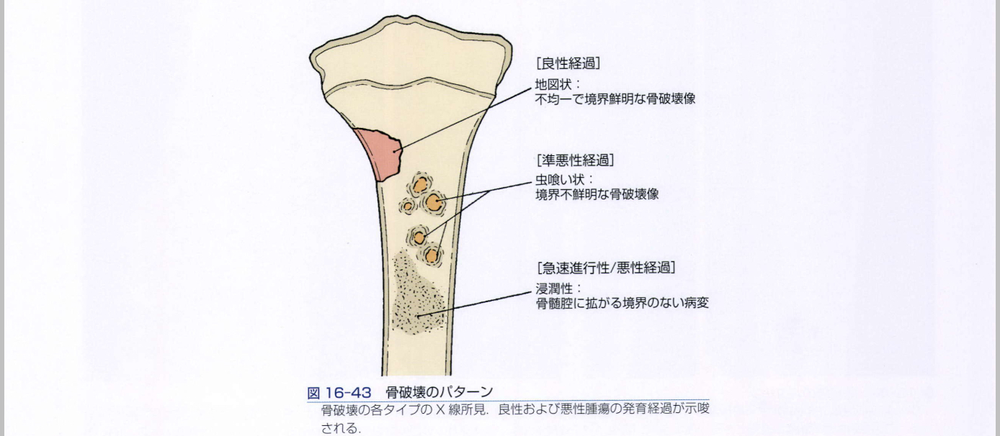
    - 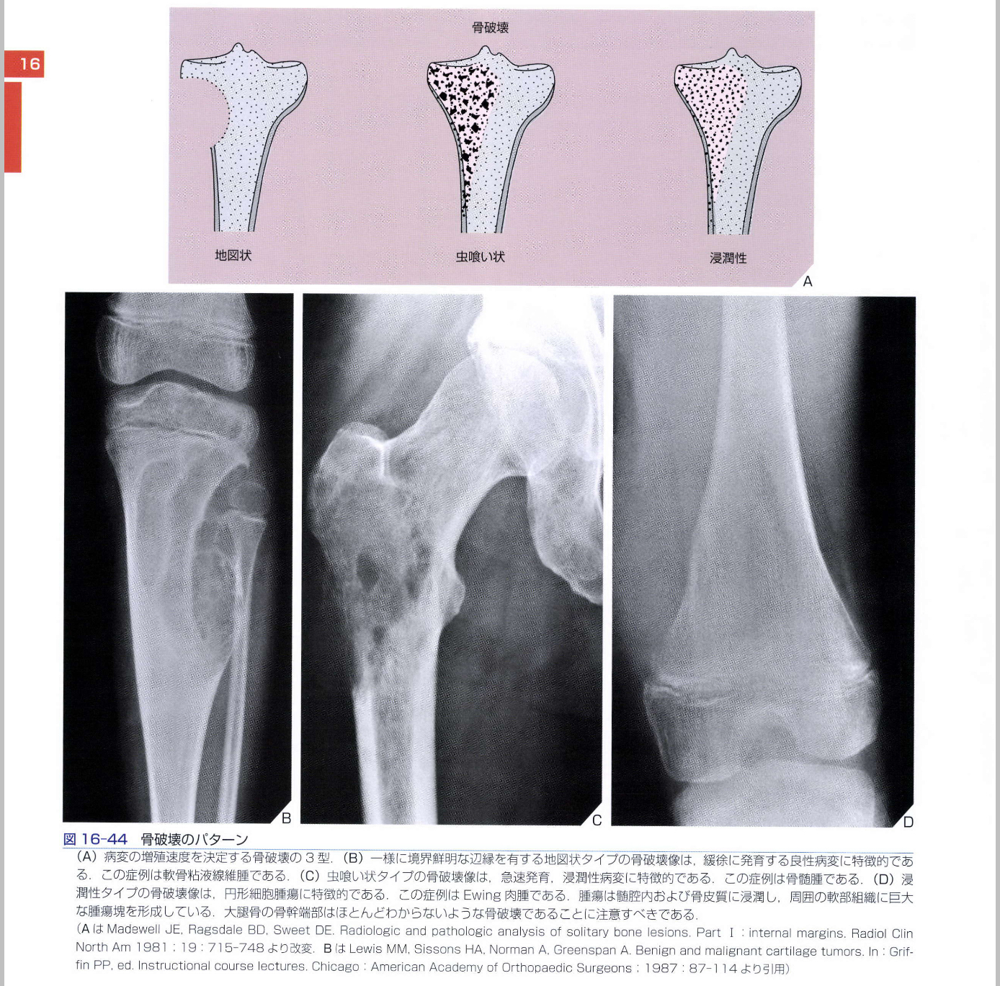
- 内部性状
    - 骨基質: ふわふわした綿毛様や雲状の陰影. 腫瘍性骨形成が疑われる. 典型例は骨肉腫.
    - 軟骨基質: リング状, カンマ状, ポップコーン状の陰影. 典型例は軟骨肉腫.

**こたえ**
- 2016-27: `軟骨芽細胞腫`
- 2012-21: `軟骨芽細胞腫`
- 2015-29: `Ewing肉腫`
- 2017-26: `軟骨肉腫 - 10～20歳`
- 2013-17: `硬化縁`, `地図状骨破壊` 

#### XTNb1. 原発性悪性骨腫瘍各論

◎[2019-29](http://www.radiology.jp/content/files/20190904_02.pdf#page=11)
Ewing肉腫について正しいものはどれか。2つ選べ。  
`高齢者に多い。`  
`地図状の骨破壊がみられる。`  
`小円形細胞腫瘍に分類される。`  
`骨外腫瘤を形成することが多い。`  
`長管骨に発生する場合は骨端に多い。`  

【悪性骨腫瘍】

- 骨肉腫 osteosarcoma
    - すべての原発性骨悪性腫瘍の20%を占める.
    - 10代に好発する.
    - 病理: 既存の海綿骨間を浸潤性に発育する. さまざまな程度でレース状の骨形成を伴う.
    - 分布: 骨幹端.
    - 画像:
        - 長管骨に溶骨像/造骨像が混在した腫瘤を形成する. 造骨のある部分は綿飴や雲のような外観. 
        - 骨膜反応を伴う. 放射状(sunburst)になったりCodman三角を呈したりする.
        
- 軟骨肉腫 chondrosarcoma
    - **中高年に好発する**.
    - 内軟骨腫や内軟骨腫症から悪性転化することがある.
    - 病理: 石灰化や嚢胞変性を伴う軟骨形成.
    - 分布: 骨幹端.
    - 画像:
        - リング状, カンマ状, ポップコーン状の石灰化像が髄内にみられる.
        - 反応性の骨皮質肥厚がみられる(endosteal scalopping).
        
- Ewing肉腫 Ewing sarcoma
    - 多くは20歳未満に生じる.
    - 病理: 未熟で未分化な細胞からなる. 小円形細胞腫瘍に分類される.
    - 分布: 骨幹.
    - 画像: 骨幹部に虫食い状〜浸潤性の溶骨像を生じる. 強い骨膜反応を伴う. 骨外腫瘤を伴うことも.
    
- 骨髄腫 myeloma
    - 
- アダマンチノーマ adamantinoma
- 脊索腫 chordoma

**こたえ**
- 2019-29: `小円形細胞腫瘍に分類される。`, `骨外腫瘤を形成することが多い。`  

#### XTNb2. 原発性良性骨腫瘍各論
#### XTNb3. 骨腫瘍類似性病変各論
[2018-29](http://www.radiology.jp/content/files/20180926_2.pdf#page=12)
線維性骨異形成について**誤っている**のはどれか。1つ選べ。  
`膨脹性発育を示す。`  
`時に悪性転化する。`  
`中年以降に発症する。`  
`溶骨性病変・すりガラス状陰影が混在する。`  
`筋肉内粘液腫を合併したものを Mazabraud 症候群と呼ぶ。`  

【良性骨腫瘍(1)】

- 骨に由来するもの
    - 骨腫 osteoma
        - 画像:
    - 類骨骨腫 osteoid osteoma
        - 疫学: 5-25歳の男性に多い.
        - 部位: 骨幹端部の骨皮質に多い.
        - 画像: 骨硬化像を伴うnidus.
    - 骨芽細胞腫 osteoblastoma
        - 疫学: 10-30歳の男性に多い.
        - 画像: 境界明瞭な溶骨像 + その中心に骨化像.
- 軟骨に由来するもの
    - 骨軟骨腫 osteochondroma
        - 疫学: 20歳以下に多い.
        - 良性骨腫瘍のなかでもっとも多い.
        - 画像: 骨表面から突出性に発育する骨性隆起性の良性軟骨形成性腫瘍.
    - 内軟骨腫 enchondroma
        - 疫学: 5歳〜高齢者まで幅広い年代に発生するが, 10代〜若年に多い.
        - 画像: 
        - 多発することがある. Ollier病, Maffucci症候群.
    - 内軟骨腫症 enchondromatosis
    - 多発性骨軟骨性外骨腫症 multiple osteocartilaginous exostoses
    - 傍骨性骨軟骨異型増生 bizarre parosteal osteochondromatous proliferation
    - 軟骨芽細胞腫 chondroblastoma
        - 疫学: 骨端線が閉じていない若年の男性に多い.
        - 分布: **骨端に発生する**.
        - 画像: 辺縁に骨硬化を伴う境界明瞭な限局性の溶骨像.
    - 軟骨粘液線維腫 chondromyxoid fibroma

【良性骨腫瘍(2)】

- 単純性骨嚢腫 simple bone cyst
    - 疫学: 80%は20歳以下に生じる.
    - 部位: 骨幹端に多い.
    - 画像: 境界明瞭な透亮像.
- 動脈瘤様骨嚢腫 aneurysmal bone cyst
    - 疫学: 15-20歳以下に多い.
    - 部位: 骨幹端に多い.
    - 画像: 膨張性発育を示す境界明瞭な透亮像.
- 非骨化性線維腫 non-ossifying fibroma
    - NF1患者に多発することがある. 
    - 分布: 骨幹端. **中央ではなく左右どちらかに偏って出現する**.
    - 画像: 境界明瞭な骨透亮像. 貝殻状の骨硬化縁を伴うこともある.
- 類腱線維腫 desmoplastic fibroma
- 骨巨細胞腫 giant cell tumor
    - 骨腫瘍のなかで6番目に多い. 良性腫瘍の23%にあたる.
    - ほとんどは成長軟骨板の閉鎖した成人に生じる. 20-40代に多い.
    - 分布: **骨幹端から骨端にまたがる**
    - 画像: 分葉状の溶骨像. soap and bubble appearance.
- 血管腫 hemangioma
- 骨内脂肪腫 intrassoues lipoma

【腫瘍類似性疾患】

- 線維性骨異形成症 fibrous dysplasia
    - 疫学: 20歳以下に多い.
    - 部位: 
    - 画像: 
    - McCune-Albright症候群で多発することがある.
- 骨線維性異形成症 osteofibrous dysplasia
- Langerhans細胞組織球症
    - 小児に多い.
    - 画像: (1) 頭蓋骨の抜き打ち像. (2) 顎骨の破壊性病変による浮遊歯(floating teeth). (3) 長管骨の骨透過性病変.
- Erdheim-Chester病
- 骨梗塞

**こたえ**
- 2018-29: `中年以降に発症する。`

#### XTNb4. 骨腫瘍総合問題

◎[2014-24](http://www.radiology.jp/content/files/1377.pdf#page=9)
単純X線写真で骨硬化像を示すことが**少ない**のはどれか。1つ選べ。  
`骨肉腫` `類骨骨腫` `骨巨細胞腫` `乳癌骨転移` `前立腺癌骨転移`  

◎[2012-20](http://www.radiology.jp/content/files/2012_1s_exsam.pdf#page=7)
骨髄浮腫を伴うことが**少ない**のはどれか。1つ選べ。  
`類骨骨腫` `内軟骨腫` `Brodie 膿瘍` `ストレス骨折` `軟骨芽細胞腫`  

◎[2017-28](http://www.radiology.jp/content/files/20170904_2.pdf#page=11)
骨腫瘤性病変のうち周囲に広範な浮腫性変化を伴いやすいのはどれか。2つ選べ。
`内軟骨腫` `骨軟骨腫` `類骨骨腫` `軟骨芽細胞腫` `線維性骨異形成`  

◎[2018-30](http://www.radiology.jp/content/files/20180926_2.pdf#page=12)
骨病変の単純X線写真所見で**誤っている**のはどれか。1つ選べ。  
`軟骨芽細胞腫は骨端部に多い。`  
`巨細胞腫は骨端線閉鎖前に多い。`  
`内軟骨腫は石灰化をしばしば来す。`  
`孤立性骨囊胞は骨中心性に発生する。`  
`線維性骨異形成症は骨折を伴った場合に骨膜反応を示す。`  

◎[2017-27](http://www.radiology.jp/content/files/20170904_2.pdf#page=11)
骨疾患と骨単純X線写真の所見との組合せとして**誤っている**のはどれか。1つ選べ。  
`骨肉腫 - 放射状骨膜反応（スピクラ）`  
`単純性骨囊腫 - fallen fragment sign`  
`転移性骨腫瘍 - 椎弓根（pedicle）サイン`  
`非骨化性線維腫 - Codman三角`  
`Langerhans細胞組織球症 - 頭蓋骨打ち抜き像`  

◎[2013-16](http://www.radiology.jp/content/files/2013_2s_exsam.pdf#page=6)
乳児の四肢骨に限局性溶骨性病変があり，骨膜反応を伴っている。可能性が高いのはどれか。1つ選べ。  
`骨肉腫` `Ewing肉腫` `非骨化性線維腫` `アダマンチノーマ` `Langerhans細胞組織球症`  

◎[2014-21](http://www.radiology.jp/content/files/1377.pdf#page=8)
単純X線写真において膨張性骨転移（expansile bone metastasis）をきたす悪性腫瘍として，頻度が最も高いのはどれか。1つ選べ。  
`胃癌` `膵癌` `腎癌` `胆囊癌` `膀胱癌`  

【主な骨腫瘍の所見まとめ】
    
|カテゴリ|病名|好発年齢|好発部位(長軸)|好発部位(短軸)|画像所見|付随所見|
|---|---|---|---|---|---|---|
|悪性骨腫瘍(骨由来)|骨肉腫 osteosarcoma|10代|骨幹端|?|**★綿や雲に似た腫瘍性造骨を伴う腫瘤**|強い骨膜反応(+). **成長軟骨板が浸潤を食い止めることも**|
|悪性骨腫瘍(軟骨由来)|軟骨肉腫 chondrosarcoma|**★中高年**|骨幹端|?|**★リング状, カンマ状, ポップコーン状の石灰化像**|-|
|悪性骨腫瘍(小円形細胞由来)|Ewing肉腫 Ewing sarcoma|20歳未満|**★骨幹**|?|**★浸潤性or虫食い状の溶骨像±骨外腫瘤**|-|
|悪性骨腫瘍(小円形細胞由来)|骨悪性リンパ腫 malignant lymphoma|?|?|?|?|-|
|悪性骨腫瘍(ほか)|骨髄腫/形質細胞腫 (plasma cell) myeloma|**★40-60歳**|**★骨幹**|?|多発する溶骨性病変|-|
|良性骨腫瘍(骨由来)|骨腫 osteoma|-|-|-|-|-|
||類骨骨腫 osteoid osteoma|5-25歳|骨幹端部の骨皮質|?|**★骨硬化像を伴うnidus**|**★強い骨髄浮腫(+)**|
||骨芽細胞腫 osteoblastoma|10-30歳|-|?|**★境界明瞭な溶骨像 + その中心に骨化像**|-|
|良性骨腫瘍(軟骨由来)|骨軟骨腫 osteochondroma|20歳以下|骨幹端の骨皮質|?|**★骨表面から突出性に発育する骨性隆起**|-|
||内軟骨腫 enchondroma|10-若年|?|?|?|-|
||軟骨芽細胞腫 chondroblastoma|若年|**★骨端**|?|辺縁に骨硬化を伴う境界明瞭な限局性の溶骨像|**★強い骨髄浮腫(+)**|
|良性骨腫瘍(ほか)|単純性骨嚢腫 simple bone cyst|20歳以下|骨幹端|?|境界明瞭な透亮像|骨折後に骨片が内部に浮遊(fallen fragment sign),気泡が上昇(rising bubble sign)|
||動脈瘤様骨嚢腫 aneurysmal bone cyst|15-20歳|骨幹端|?|膨張性発育を示す境界明瞭な透亮像|-|
||非骨化性線維腫 non-ossifying fibroma|?|骨幹端|?|境界明瞭な骨透亮像. 貝殻状の骨硬化縁を伴うこともある|-|
||骨巨細胞腫 giant cell tumor|20-40代|**★骨幹端〜骨端にまたがる**|?|分葉状の溶骨像(soap and bubble appearance)|-|
|腫瘍類似性疾患|線維性骨異形成 fibrous dysplasia|20歳以下|?|?|?|-|
||Langerhans細胞組織球症|小児|?|?|骨透過性病変|-|

**こたえ**
- 2014-24: `骨巨細胞腫`
- 2012-20: `内軟骨腫`
- 2017-28: `類骨骨腫`, `軟骨芽細胞腫`
- 2018-30: `巨細胞腫は骨端線閉鎖前に多い。`
- 2017-27: `非骨化性線維腫 - Codman三角`
- 2013-16: `Langerhans細胞組織球症`
- 2014-21: `腎癌`

### XTNs. 軟部腫瘍
◎[2019-30](http://www.radiology.jp/content/files/20190904_02.pdf#page=12)
MRIのT2＊強調像が診断に有用な疾患はどれか。1つ選べ。  
`樹脂状脂肪腫` `腫瘍状石灰化症` `足底線維腫症` `アキレス腱黄色腫` `色素性絨毛結節性滑膜炎`  

**こたえ**
- 2019-30: `色素性絨毛結節性滑膜炎`

### XTO. 先天性疾患
[2016-30](http://www.radiology.jp/content/files/20160825.pdf#page=10)
軟骨無形成症の画像所見として誤っているのはどれか。1 つ選べ。
a	 前頭部突出
b	 wormian bone
c	 骨幹端杯状変形
d	 腰椎椎弓間距離の狭小化
e	 小骨盤シャンパングラス様変形

[2015-30](http://www.radiology.jp/content/files/20150821.pdf#page=11)
軟骨無形成症として正しいのはどれか。1 つ選べ。
a	 ベル型胸郭
b	 膜様頭蓋骨
c	 出生時多発骨折
d	 近位長管骨短縮
e	 肋骨リボン様変形

### XTZ. 骨軟部画像診断ほか
[2019-26](http://www.radiology.jp/content/files/20190904_02.pdf#page=10)
骨幹端の帯状透亮像（lucent metaphyseal band）をきたす疾患はどれか。1 つ選べ。
a	 鉛中毒
b	 白血病
c	 軟骨無形成症
d	 被虐待児症候群
e	 低リン血症性くる病

[2015-26](http://www.radiology.jp/content/files/20150821.pdf#page=9)
腸脛靭帯症候群（iliotibial band friction syndrome）について正しいのはどれか。2 つ
選べ。
a	 陸上短距離選手に多い。
b	 矢状断像で所見がとらえやすい。
c	 overuse syndrome のひとつである。
d	 膝内側の痛みを訴えることが多い。
e	 脂肪抑制 T2 強調画像が診断に有用である。

[2015-27](http://www.radiology.jp/content/files/20150821.pdf#page=10)
関節疾患について正しいのはどれか。1 つ選べ。
a	 関節リウマチでは骨増殖を伴う。
b	 変形性関節症では骨粗鬆症をきたす。
c	 透析性脊椎関節症では脊椎強直をきたす。
d	 強直性脊椎炎では脊椎に靭帯骨棘を形成する。
e	 慢性結節性痛風では関節に紡錘状腫脹を認める。

[2013-19](http://www.radiology.jp/content/files/2013_2s_exsam.pdf#page=7)
外傷の既往がない患者で，感染を示唆するのはどの部位のガス像か。1 つ選べ。
a 椎間板
b 筋肉内
c 椎体内
d 仙腸関節
e 恥骨結合

## ほか総合問題
[2015-70](http://www.radiology.jp/content/files/20150821.pdf#page=24)
腹部腫瘍として石灰化を伴う可能性が低いのはどれか。1 つ選べ。
a	 子宮筋腫
b	 大腸癌肝転移
c	 副腎神経芽腫
d	 腎血管筋脂肪腫
e	 卵巣漿液性囊胞腺癌

### 多臓器疾患
#### 神経線維腫症
◎[2019-22](http://www.radiology.jp/content/files/20190904_02.pdf#page=9)
神経線維腫症1型で見られる頻度が最も**低い**のはどれか。1つ選べ。  
`星細胞腫` `視神経膠腫` `神経線維腫` `聴神経鞘腫` `過誤腫様病変`  

◎[2018-22](http://www.radiology.jp/content/files/20180926_2.pdf#page=9)
神経線維腫症1型に合併する頻度が最も**低い**のはどれか。1つ選べ。  
`髄膜腫` `視神経膠腫` `脊髄星細胞腫` `過誤腫様病変` `蔓状神経線維腫`  

◎[2015-21](http://www.radiology.jp/content/files/20150821.pdf#page=8)
神経線維腫症2型について正しいのはどれか。1つ選べ。  
`髄膜腫の頻度が高い。`  
`脊髄空洞症を合併する。`  
`蝶形骨の形成異常を伴う。`  
`皮膚神経線維腫を生じる。`  
`常染色体劣性遺伝である。`  

◎[2013-27](http://www.radiology.jp/content/files/2013_2s_exsam.pdf#page=9)
神経線維腫症II型に合併するのはどれか。2つ選べ。  
`髄膜腫` `上衣腫` `星細胞腫` `視神経膠腫` `神経線維腫`  

◎[2012-27](http://www.radiology.jp/content/files/2012_1s_exsam.pdf#page=9)
20歳代の男性に両側聴神経鞘腫を認めた。合併する可能性が高いのはどれか。2つ選べ。  
`上衣腫` `髄膜腫` `血管芽腫` `神経膠腫` `上衣下巨細胞星細胞腫`  

[2016-26](http://www.radiology.jp/content/files/20160825.pdf#page=9)
神経線維腫症1型（NF-1）で**認めない**のはどれか。1つ選べ。  
a	 肋骨変形
b	 脊椎側弯
c	 多発骨硬化
d	 脛骨偽関節
e	 蝶形骨形成異常

【神経線維腫症】

- NF1
    - 頭蓋内病変: 白質病変, 星細胞腫, 視神経膠腫, 神経線維腫
    - 皮膚病変の頻度が高い.
- NF2
    - 頭蓋内病変: 神経鞘腫, 髄膜腫
    - 脊髄病変: 髄膜腫, 上衣腫

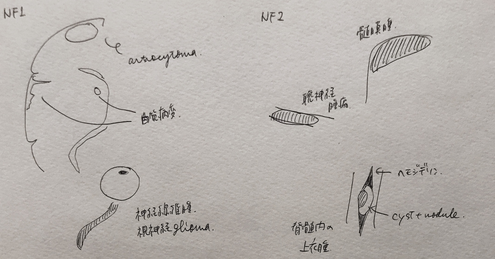    
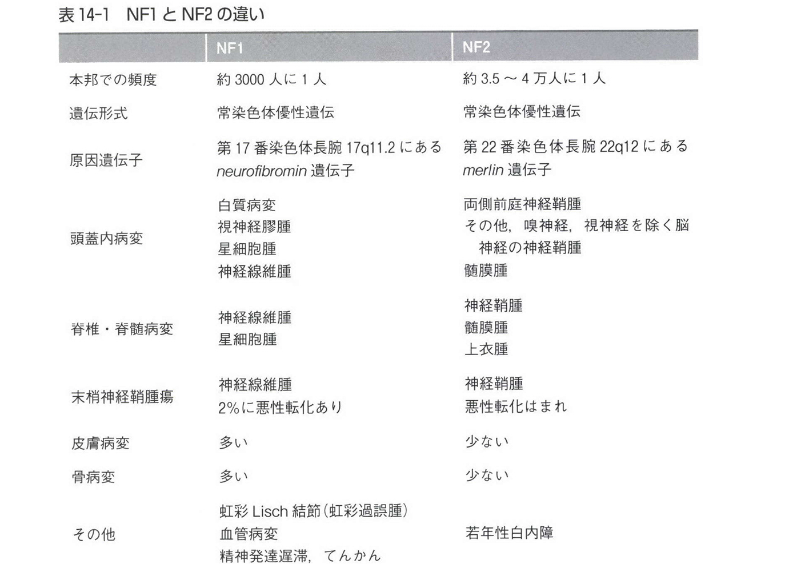
    
**こたえ**
- 2019-22: `聴神経鞘腫`
- 2018-22: `髄膜腫`
- 2015-21: `髄膜腫の頻度が高い。`
- 2013-27: `髄膜腫`, `上衣腫`
- 2012-27: `上衣腫`, `髄膜腫`

#### ほか
[2016-18](http://www.radiology.jp/content/files/20160825.pdf#page=6)
von Hippel-Lindau 病と関連するのはどれか。2 つ選べ。
a	 卵巣癌
b	 肝芽腫
c	 褐色細胞腫
d	 網膜血管芽腫
e	 中枢神経系悪性リンパ腫

[2014-53](http://www.radiology.jp/content/files/1377.pdf#page=19)
結節性硬化症に合併しないのはどれか。1 つ選べ。
a 脳皮質結節
b 心筋横紋筋腫
c 腎血管筋脂肪腫
d 膵漿液性囊胞腺腫
e 肺リンパ脈管筋腫症

[2013-55](http://www.radiology.jp/content/files/2013_2s_exsam.pdf#page=19)
IgG4 高値と関連が最も低いのはどれか。1 つ選べ。
a 間質性腎炎
b 仙腸関節炎
c 後腹膜線維症
d 慢性甲状腺炎
e 自己免疫性膵炎
