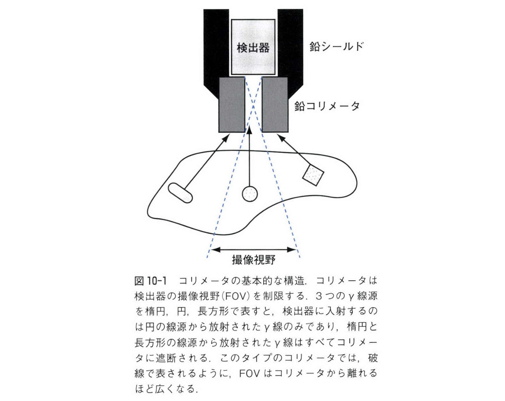
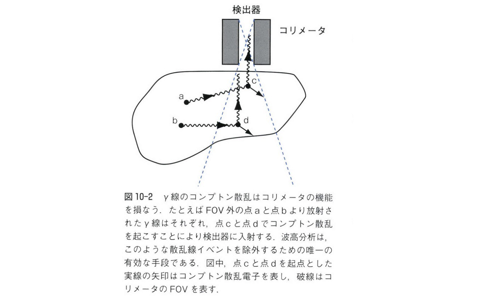
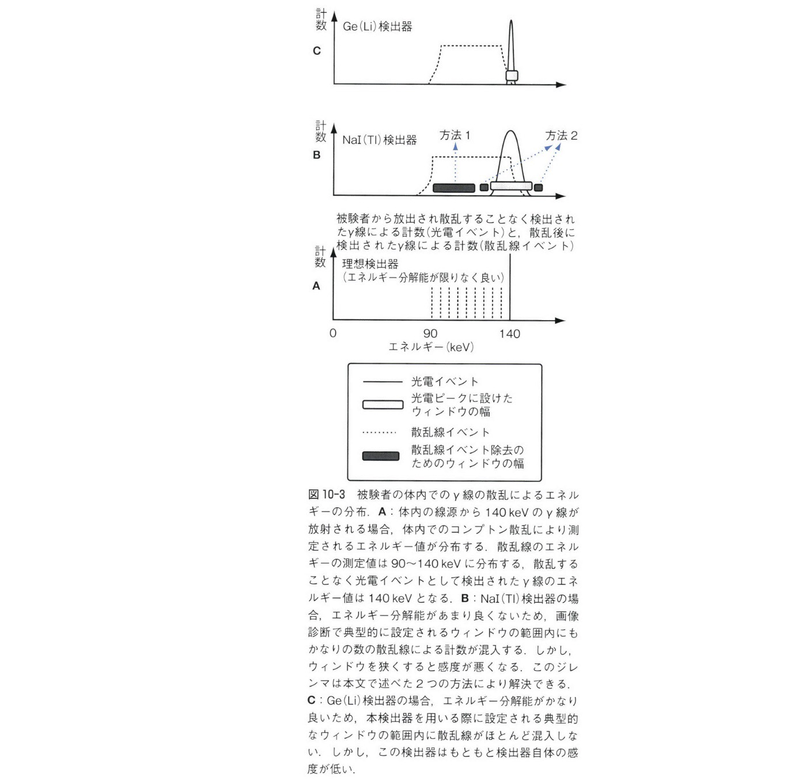
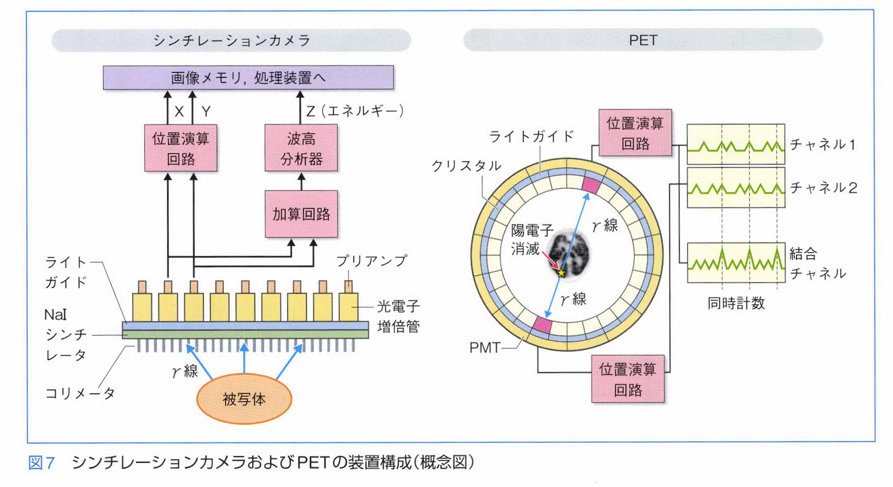
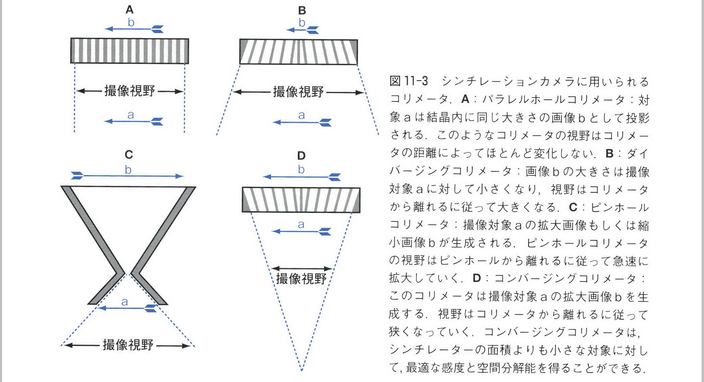
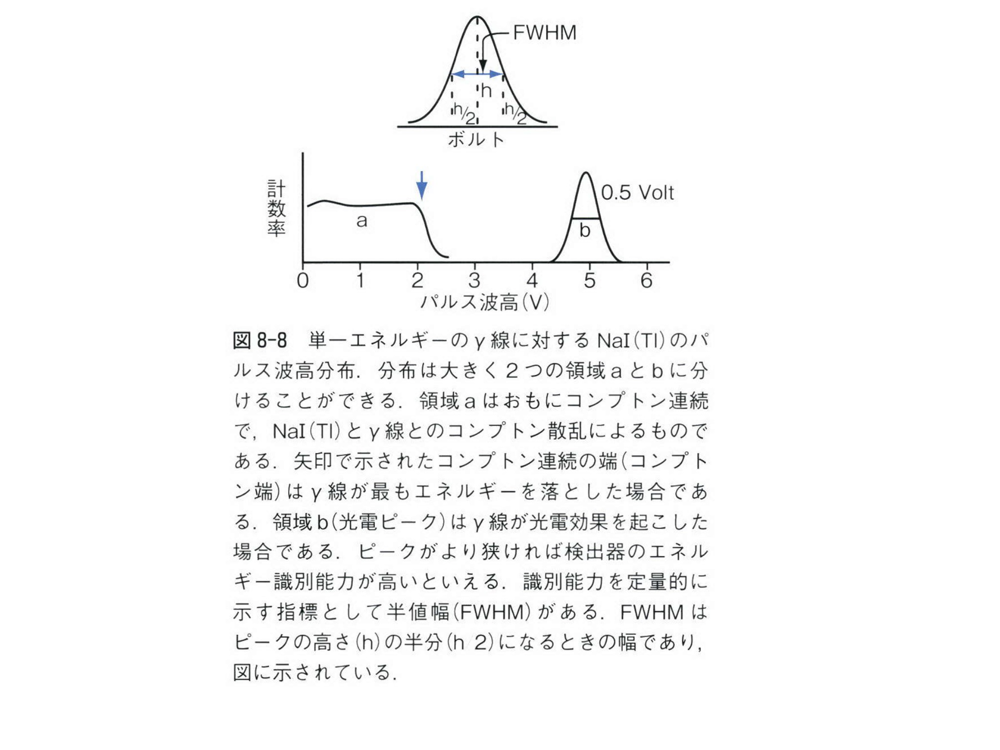
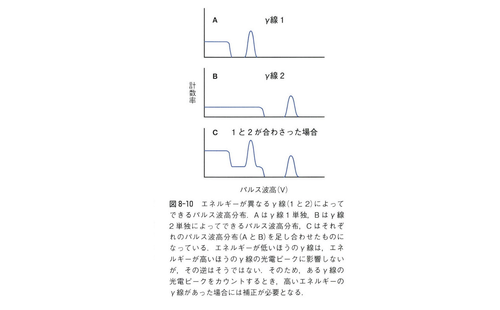
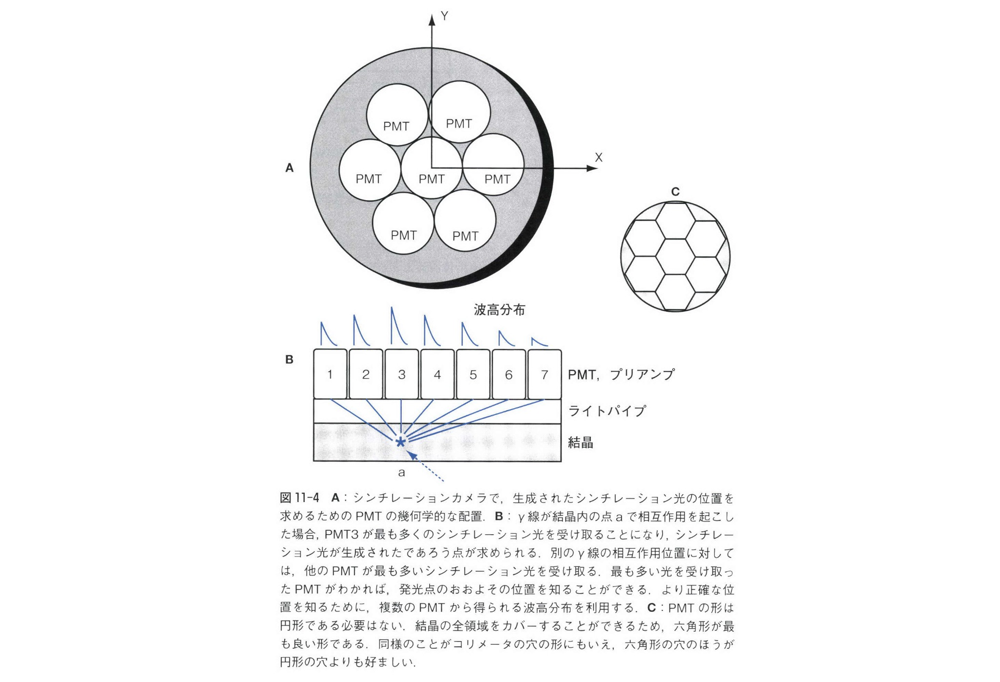

# Index
- [核医学総論](#核医学総論)
    - [放射性核種](#放射性核種) (13題)
    - [PETとSPECTの原理](#PETとSPECTの原理) (8題)(Complete!)
- [核医学各論](#核医学各論)
    - [FDG-PETとGaシンチグラフィ](#FDG-PETとGaシンチグラフィ) (14題)
    - [脳神経核医学](#脳神経核医学)
        - 脳血流シンチグラフィ (10題)
        - ドパミントランスポーターシンチグラフィとMIBGシンチグラフィ (9題)
        - 脳神経核医学ほか (2題)
    - [心臓核医学](#心臓核医学) (10題)
    - [肺換気血流シンチグラフィ](#肺換気血流シンチグラフィ) (5題)
    - [内分泌核医学](#内分泌核医学) (4題)
    - [異所性胃粘膜シンチグラフィ](#異所性胃粘膜シンチグラフィ) (2題)
    - [肝受容体シンチグラフィ](#肝受容体シンチグラフィ) (1題)
    - [腎シンチグラフィ](#腎シンチグラフィ) (5題)
    - [骨シンチグラフィ](#骨シンチグラフィ) (7題)
    - [センチネルリンパ節シンチグラフィ](#センチネルリンパ節シンチグラフィ) (2題)
    - [RI内用療法](#RI内用療法) (9題)
    - [核医学検査総合問題](#核医学検査総合問題)
        - 前処置 (4題)
        - 放射線医薬品の性質,投与,撮像 (12題)
        - 検査所見 (6題)

# 核医学総論
## 放射性核種
[2019-06](http://www.radiology.jp/content/files/20190904_02.pdf#page=3)
以下の核種で物理学的半減期が2番目に短いのはどれか。1つ選べ。
a	 60Co
b	 125I
c	 192Ir
d	 198Au
e	 226Ra

[2018-06](http://www.radiology.jp/content/files/20180926_2.pdf#page=3)
放射性同位元素の半減期について正しいのはどれか。1 つ選べ。
a	 生物学的半減期は体外への排出による。
b	 温度が高いと，物理学的半減期は短くなる。
c	 圧力が高いと，物理学的半減期は長くなる。
d	 半減期の 2 倍の時間が経過すると，放射能は 1/2 になる。
e	 実効半減期は物理学的半減期と生物学的半減期の積である。

[2018-71](http://www.radiology.jp/content/files/20180926_2.pdf#page=26)
物理的半減期が 24 時間以上の放射性核種はどれか。2 つ選べ。
a	 18F
b	 67Ga
c	 99mTc
d	 123I
e	 131I

[2018-72](http://www.radiology.jp/content/files/20180926_2.pdf#page=26)
ジェネレータで生成できる放射性核種はどれか。2 つ選べ。
a	 81mKr
b	 99mTc
c	 123I
d	 131I
e	 201Tl

[2017-71](http://www.radiology.jp/content/files/20170904_2.pdf#page=25)
核医学検査で用いられる核種とその物理学的半減期との組み合わせとして誤っている
のはどれか。1 つ選べ。
a	 13N　 　約 20 分
b	 18F　 　約 110 分
c	 123I　 　約 13 時間
d	 131I　 　約 8 日
e	 201Tl　 　約 3 日

[2016-04](http://www.radiology.jp/content/files/20160825.pdf#page=2)
放射線治療で使用される核種で半減期が 7 日間より短いのはどれか。2 つ選べ。
a	 60Co
b	 90Y
c	 125I
d	 192Ir
e	 198Au

[2016-71](http://www.radiology.jp/content/files/20160825.pdf#page=26)
 物理学的半減期が最も長い放射性同位元素はどれか。1 つ選べ。
a	 18F
b	 99mTc
c	 111In
d	 131I
e	 201Tl

[2015-01](http://www.radiology.jp/content/files/20150821.pdf#page=1)
放射性核種の崩壊の状況を表した図表を崩壊図と呼ぶ。β －崩壊は右下方への斜線で示
し，γ 崩壊は垂直下方への線で示す。α 崩壊，β ＋崩壊及び軌道電子捕獲は左斜線で示
す。これは，原子番号の大小を，直線座標での右左に対応させるためである。崩壊図を
示す。誤っているのはどれか。1 つ選べ。
a	 β 崩壊の後，原子量が 1 増える。
b	 カリウム 40 の半減期は 1.28×109 年である。
c	 軌道電子捕獲でカリウムがアルゴンになる。
d	 放出されるガンマ線のエネルギーは 1.46 MeV である。
e	 カリウム 40　100 Bq では，毎秒 89 個のベータ線が放出される。

[2015-71](http://www.radiology.jp/content/files/20150821.pdf#page=25)
 ジェネレータで生成される放射性同位元素はどれか。1 つ選べ。
a	 67Ga
b	 81mKr
c	 111In
d	 123I
e	 201Tl

[2014-71](http://www.radiology.jp/content/files/1377.pdf#page=25)
ある放射性医薬品の物理的半減期は 8 日で，生物的半減期は 2 日であった。
この薬剤の有効半減期はどれか。1 つ選べ。
a 0.625 日
b 1.6 日
c 2日
d 8日
e 10 日

[2014-72](http://www.radiology.jp/content/files/1377.pdf#page=25)
放射性核種として PET 検査に用いられるのはどれか。2 つ選べ。
a 13N
b 15O
c 89Sr
d 99mTc
e 123I

[2013-71](http://www.radiology.jp/content/files/2013_2s_exsam.pdf#page=24)
次の放射性同位元素の中で β 線を放出するのはどれか。2 つ選べ。
a 67Ga
b 90Y
c 99mTc
d 111In
e 131I

[2012-71](http://www.radiology.jp/content/files/2012_1s_exsam.pdf#page=24)
次の放射性同位元素の中で半減期が最も長いのはどれか。1 つ選べ。
a 11C
b 13N
c 99mTc
d 131I
e 201Tl

## PETとSPECTの原理

◎[2019-71](http://www.radiology.jp/content/files/20190904_02.pdf#page=25)
SPECTの定量性に**影響しない**のはどれか。1つ選べ。
`減弱` `散乱` `統計雑音` `空間分解能` `偶発同時係数`

◎[2019-72](http://www.radiology.jp/content/files/20190904_02.pdf#page=26)
PET 検査で測定するガンマ線のエネルギー（keV）はどれか。1つ選べ。  
`37` `74` `140` `511` `740` 

【in vivo放射線計測 (核医学のパワーテキスト10章)】

in vivo放射線計測の目的は摂取率測定と臓器イメージングの2種類ある
- 摂取率測定の例:
    - 静態計測 static organ uptake: 甲状腺の放射性ヨード摂取率測定
    - 動態計測 dynamic organ uptake: レノグラム, 心拍出量測定, 血流量測定
- 臓器イメージングの例:
    - static: 肝受容体シンチグラフィ
    
どちらも問題点はある程度共通している.  
問題点はコリメータ, 散乱, 吸収の3つある.  
さらに, 検出器と体内放射線源が離れているため, in vivoでの検出効率はin vitroよりも2-3桁ほど低下してしまうので, in vitroのようなμCi(kBq)単位の少量の放射能量では済まず, mCi(MBq)単位の放射能量が必要となる.

- 問題点1: コリメータ
    - 検出器のFOV外からの放射線を遮断することでFOVを制限できる.
    - 鉛もしくはタングステンを用いる.
        - 核医学で通常使用されるX線, γ線のエネルギー(<500keV)に対する減弱係数が高い
    - コリメータを広くすると感度は向上するが空間分解能は劣化する.
    - コリメータを狭くすると空間分解能は改善するが感度は低下する.
    - さらにコリメータにかかわらず放射線源が深い位置にあるほど空間分解能は劣化する.
    

- 問題点2: 散乱
    - 体内放射線源から放たれたX線やγ線は, 検出器に入射する前に生体のさまざまな物質と相互作用をきたす.
        - エネルギーが0.1MeV未満なら主に光電効果を生じる.
        - エネルギーが0.1MeV-10MeVなら主にコンプトン散乱を生じる.
        - エネルギーが1MeV以上なら主に電子対生成を生じる.
    - 核医学に使用するエネルギー帯のX線やγ線ではコンプトン散乱が主に生じる.
    - つまり, X線やγ線(入射光子)は生体物質中の電子と衝突して向きが変わる(散乱光子).
    - よって, X線やγ線が散乱した結果, 本来入射するはずのない位置の検出器に入射することがあり, これによって線源の位置が誤って測定されることがある. つまり, コリメータがFOV外からの光子線を遮断する本来の役目を果たせないことになる.
    - こうした誤測定を防ぐ方法として, エネルギー弁別による散乱線除去がある.
    - つまり, 本来体内放射線源が単一エネルギーの光子線しか発しないことがわかっているのであれば, それよりもエネルギーの低い光子線はコンプトン散乱を経て入射してきたノイズだと判定することができる.
        - たとえば, 140keVのγ線は1回コンプトン散乱を起こすとエネルギーが90-140keVに減少する.

- 問題点3: 吸収
    - 体内臓器については体表からの深さ, 形, 大きさについての事前情報があるわけではないため, 体内で起こるX線やγ線の吸収の補正は難しい
    - たとえ臓器内で放射能分布が均一であるとしても, それぞれのX線やγ線は異なる質と厚みをもった臓器を通過しているため, 吸収量がそれぞれ異なっている
    - このための対策としては, なるべく高エネルギーのX線やγ線を用いることが挙げられる
    - ただし, NaIシンチレーターの感度は逆にエネルギーが高くなると悪化するため, バランスをとってin vivo測定では100-300keVが実用的であるとされる
    
【PETの原理 (核医学のパワーテキスト14章)】

- 核種
    - 主な陽電子放出核種はC-11, N-13, O-15, F-18.
    - 陽電子はすぐに電子と結合して対消滅し, 511keVのエネルギーの2本のγ線をほぼ反対方向に放出する.
        - たとえばF-18から生じた陽電子の平均飛程はわずか0.22mm.
    - PETではこれら2つのγ線を1対の検出器で同時に検出する
- 真の同時計数
    - 2つの検出器でγ線が検出されたとき, その検出時間のインターバルが一定以下(たとえば10^-9秒以下)であれば同時計数とカウントする.
    - 検出時間のインターバルは同時計数回路によって調べる.
    - 同時計数回路は検出器のペアごとに用意する.
        - たとえば検出器がs1,...,s4の4つあった場合, 同時計数回路は(s1,s2),(s1,s3),(s1,s4),(s2,s3),(s2,s4),(s3,s4)の最大6つ用意できる.
- 偶発同時計数
    - 2つ対消滅A, Bが偶然ほぼ同時に起こり, Aからの消滅γ線の一端とBからの消滅γ線の一端が1組の検出器X, Yにほぼ同時に入射した場合, 線源が線分XY上にあるものと誤測定されてしまう.
    - これを防ぐには, 同時計数の分解時間を可能な限り短くすること.
- 散乱同時計数
    - γ線が患者生体内で散乱されたり, 検出器に当たって散乱されたりすると, 誤った位置から発されたものとして測定されてしまう.
    - これは先ほど述べたようにエネルギー弁別によって解決できる.
    - 検出器のエネルギー分解能が高いほどエネルギー弁別も容易になる.
    - このため, PETのシンチレータには高いエネルギー分解能をもつLSO, BGOなどを用いる.
- 吸収補正
    - PETはSPECTよりも吸収補正を正確に行うことができる.
    - 理由は, 検出器X, Yをむすぶ線分XY上のどの位置で生じた一対の消滅γ線A, Bに対しても, A, Bが吸収によって失ったエネルギーの大きさの合計はつねに一定となるため.

**こたえ**
- 2019-71: `偶発同時係数`
- 2019-72: `511`

◎[2016-76](http://www.radiology.jp/content/files/20160825.pdf#page=28)
ガンマカメラについて正しいのはどれか。1つ選べ。  
`ガンマ線線源を内蔵している。`  
`ガンマ線の検出に BGO を用いる。`  
`検出器がリング状に配列されている。`  
`Tc-99m の撮像には低エネルギー用コリメータを用いる。`  
`高分解能コリメータを用いると信号雑音比が向上する。`  

◎[2013-73](http://www.radiology.jp/content/files/2013_2s_exsam.pdf#page=25)
ガンマカメラの構成要素のうち，検査に応じて交換するのはどれか。1つ選べ。  
`コリメータ` `波高分析器` `シンチレータ` `位置計算回路` `光電子増倍管`  

◎[2014-73](http://www.radiology.jp/content/files/1377.pdf#page=25)
シンチレーションカメラと**関連がない**のはどれか。1つ選べ。  
`グリッド` `コリメータ` `シンチレータ` `光電子増倍管` `位置検出回路`  

◎[2014-74](http://www.radiology.jp/content/files/1377.pdf#page=26)
PET検査と**関連がない**のはどれか。1つ選べ。  
`SUV 値` `呼吸同期` `吸収補正` `同時計数回路` `二核種同時収集`  

◎[2012-73](http://www.radiology.jp/content/files/2012_1s_exsam.pdf#page=25)
核医学イメージング装置と**関連がない**のはどれか。1つ選べ。  
`コリメータ` `シンチレータ` `光電子増倍管` `波高分析回路` `イメージインテンシファイア`  

◎[2012-74](http://www.radiology.jp/content/files/2012_1s_exsam.pdf#page=25)
PET について正しいのはどれか。2つ選べ。  
`陽電子を検出する。`  
`SPECT より感度が低い。`  
`同時計数回路を用いる。`  
`2 核種同時収集が可能である。`  
`CT を用いて減弱補正を行うことができる。`  

【核医学装置 (核医学パワーテキスト8,10章)】

- PETにはPET装置, SPECTにはガンマカメラ(主にシンチレーションカメラ)を用いる.
    - PET装置は陽電子が消滅した際に放たれる2本の消滅放射線を検出する.
    - ガンマカメラはγ線を1本だけ出す単光子放出核種を検出する.
        - シンチレーションカメラは被験者周囲を円状に回転し, 複数の角度(64ポジション, 128ポジションなど)において一定時間ずつ複数回停止して測定を行う.
    

- ①コリメータ (SPECT装置にのみ存在)
    - 臓器の決まった部位のみからのγ線を検出器に到達させたい.
    - **コリメータは検査対象の臓器に応じて使い分ける**.
        - 画像化する臓器の大きさ = 検出器の大きさの場合: パラレルホールコリメータ
        - 画像化する臓器の大きさ > 検出器の大きさの場合: ダイバージングコリメータ
        - 画像化する臓器の大きさ < 検出器の大きさの場合: コンバージングコリメータ
        - 画像化する臓器の大きさ << 検出器の大きさの場合: ピンホールコリメータ
        - ちなみにパラレルホールコリメータ以外では面や角度の違いによって画像が局所的に拡大/縮小されて歪みが生じてしまう.
    - 

- ②シンチレータ (SPECT装置, PET装置両方に存在)
    - 蛍光作用(シンチレーション)を用いた放射線測定装置.
        - 入射したX線やγ線は, シンチレータ結晶と光電効果, コンプトン散乱, 対電子生成を通じて相互作用し, そのエネルギーをすべてシンチレータ結晶に落とす.
            - エネルギーが0.1MeV未満なら主に光電効果を生じる.
            - エネルギーが0.1MeV-10MeVなら主にコンプトン散乱を生じる.
            - エネルギーが1MeV以上なら主に電子対生成を生じる.            
    - 種類によって固有検出効率(阻止能), 吸収エネルギーあたりの発光量(発光効率), 発光するまでの時間(蛍光時間)などが異なる.
        - 固有検出効率は線源弱係数に依存している(つまり原子番号や密度など)
        - 発光量は検出器のエネルギー分解能を決める
        - 蛍光時間は不感時間を決める
    - シンチレータは透明な物質でなければならない(光が後の工程に届かなければ意味がない)
    - SPECTのためのシンチレータ
        - SPECTで主に利用するのはTc-99mから発生する**140keV**のγ線である.
        - 直径28cm〜51cmの大きな**円盤状の結晶**からなるシンチレータを用いる.
        - シンチレータの材質にはNaIに少量のTlを付加した**NaI(Tl)**を用いる.
            - 密度は3.67g/cm3, 実行原子番号は45で, **30-500keV**のX線やγ線の検出に適している.
            - 発光量はわずかに室温に依存するため, 室温によって応答がわずかに変化する.
        - ほかに臭化ランタン(LaBr3(Ce))シンチレータも開発されている. NaI(Tl)よりも阻止能が高く, 発光量も多い.
    - PETのためのシンチレータ
        - PETで利用するのは陽電子の消滅γ線であり, そのエネルギーは**511keV**である.
        - したがってNaI(Tl)シンチレータはその検出に適さない(検出効率がかなり落ちる).
        - かわりにゲルマニウム酸ビスマス(Bi4Ge3O12(**BGO**)), ケイ酸ガドリニウム(**GSO**), ケイ酸ルテチウム(Lu2SiO5:Ce(**LSO**))などを用いる.
            - ただしLuは存在比2.6%で放射性同位体Lu-176を含み, これは半減期が非常に長い(3.9x10^10年).
            
- ③光電子倍増管 (PMT) (SPECT装置, PET装置両方に存在)
    - 光を観測可能な電気信号に変換する装置.
        - シンチレータが放出する光は肉眼では確認できないほどわずかである.
        - 光が光電子倍増管の光電陰極(カソード)に当たると, 光電効果によって電子が飛び出す.
        - この電子が50-100Vの電圧によって加速され, 多数規則的に並べてある金属電極(ダイノード)に次々衝突していくことで二次電子が指数関数的に増大する.
        - 最終的には電子数は10^5-10^8倍にまで増幅される.
        - 最後にこれらの電子がアノードに流れることで電流を生じる.
        - しかし, これでもなお, 光電子倍増管の出力は数μAと小さいため, のちの工程で増幅している.

- ④波高分析器 (SPECT装置にのみ存在)
    - 電気信号の高さ(波高)は次のように決まる:
        - 波高 ∝ γ線エネルギー x 光への変換効率 x 光電子倍増管の増幅率 x 増幅器の利得
        - このうち「光への変換効率」はシンチレータの特性によって決まる.
        - このうち「光電子倍増管の増幅率」「増幅率の利得」は光電子倍増管の特性によって決まる.
        - したがって上記3つの条件が一定であれば波高はγ線エネルギーにのみ依存する.
    - これを利用すると, 波高を分析することによって特定のエネルギーのγ線のみを選別することができる.
        - 利点: SPECTにおいて, 散乱線がFOV外から入射してきた場合, そのエネルギーは本来のγ線のエネルギーよりも低いため, これを取り除くことができる.
        - 欠点: 正しくFOVから入射してきたγ線が, シンチレータ内において光電効果以外の相互作用を生じた場合, γ線のエネルギーが減少するため, これも取り除かれてしまう.
        - 
    - また, SPECTの場合は, 検出対象とするエネルギー帯を複数設けることによって**複数の核種について同時収集ができる**.
    - PETは消滅γ線のエネルギーが511keVで一定なので**複数の核種の同時収集はできない**.
        - 

- ⑤位置検出回路 (SPECT装置にのみ存在)
    - SPECT装置では, シンチレータから生じた光はさまざまな方向に飛んでいくため, そのままではシンチレータ内のどの位置で生じたのかがわからない.
    - このため, どの光電子倍増管がどれくらいエネルギーを受け取ったかという波高分布をもとに位置を逆算する.
    - しかしこの計算を行ってもなお, 実際のシンチレーション光の生成位置とはわずかな誤差が存在する(固有空間分解能).
    - 固有空間分解能は主にシンチレータ結晶の厚みに応じて大きくなるため, 感度が悪化しすぎない程度に薄い結晶を用いる.
    - 

- ⑥同時計数回路 (PET装置にのみ存在)

**こたえ**
- 2016-76: `Tc-99m の撮像には低エネルギー用コリメータを用いる。`
- 2013-73: `コリメータ`
- 2014-73: `グリッド`
- 2014-74: `二核種同時収集`
- 2012-73: `イメージインテンシファイア`
- 2012-74: `同時計数回路を用いる。`, `CT を用いて減弱補正を行うことができる。`  

# 核医学各論
## FDG-PETとGaシンチグラフィ
[2019-79](http://www.radiology.jp/content/files/20190904_02.pdf#page=28)
18F-FDG の集積について誤っているのはどれか。1 つ選べ。
a	 口蓋扁桃は生理的集積が多い。
b	 授乳期の乳房は集積が高くなる。
c	 小児の胸腺に生理的集積を認める。
d	 左反回神経麻痺では左声帯の集積が高くなる。
e	 寒冷刺激により褐色脂肪組織の集積は高くなる。

[2018-82](http://www.radiology.jp/content/files/20180926_2.pdf#page=30)
67Ga シンチグラフィで生理的集積を示さないのはどれか。1 つ選べ。
a	 大　脳
b	 涙　腺
c	 肝　臓
d	 腸　管
e	 骨　髄

[2018-83](http://www.radiology.jp/content/files/20180926_2.pdf#page=30)
18F-FDG PET において有意な集積亢進を呈しにくいのはどれか。1 つ選べ。
a	 甲状腺腫
b	 下垂体腺腫
c	 線維性骨異形成
d	 耳下腺多形腺腫
e	 膵管内乳頭粘液性腺腫

[2017-83](http://www.radiology.jp/content/files/20170904_2.pdf#page=30)
疾患として18F-FDG の集積が亢進することが最も少ないのはどれか。1 つ選べ。
a	 悪性黒色腫
b	 Warthin 腫瘍
c	 甲状腺未分化癌
d	 細気管支肺胞上皮癌
e	 びまん性大細胞型 B 細胞リンパ腫

[2017-84](http://www.radiology.jp/content/files/20170904_2.pdf#page=30)
 FDG PET の保険適用として正しいのはどれか。2 つ選べ。
a	 認知症の原因疾患の鑑別
b	 腫瘍マーカー高値の症例のスクリーニング
c	 悪性リンパ腫患者における化学療法の治療効果判定
d	 心臓サルコイドーシス患者で炎症部位の診断が必要とされる場合
e	 早期胃がん患者で他の検査や画像診断で病期診断が確定できない場合

[2017-82](http://www.radiology.jp/content/files/20170904_2.pdf#page=29)
臓器として18F-FDG の明瞭な集積が見られた場合に病的である可能性が最も高いのは
どれか。1 つ選べ。
a	 眼　筋
b	 口蓋扁桃
c	 膵　臓
d	 大　腸
e	 子宮内膜

[2016-74](http://www.radiology.jp/content/files/20160825.pdf#page=27)
FDG-PET で生理的集積を認めにくい臓器はどれか。1 つ選べ。
a	 脳
b	 胃
c	 骨　髄
d	 脾　臓
e	 胆　囊

[2016-84](http://www.radiology.jp/content/files/20160825.pdf#page=30)
 FDG-PET について正しいのはどれか。2 つ選べ。
a	 高血糖下では，脳の生理的集積が低下する。
b	 尿管が描出された場合は，尿路上皮癌の可能性が高い。
c	 18F-FDG を注射する前に，排尿を済ませておく必要がある。
d	 高インスリン状態では，腫瘍病変の描出が不明瞭になる傾向がある。
e	 悪性病変の SUV 値は，1 時間後と比べて 2 時間後で低下することが多い。

[2015-80](http://www.radiology.jp/content/files/20150821.pdf#page=28)
サルコイドーシスで認められる67Ga シンチグラムのサインはどれか。2 つ選べ。
a	 stripe sign
b	 panda sign
c	 lambda sign
d	 lollipop sign
e	 Westermark sign

[2015-83](http://www.radiology.jp/content/files/20150821.pdf#page=29)
FDG-PET 検査について誤っているのはどれか。1 つ選べ。
a	 扁桃と喉頭には生理的集積が多い。
b	 高血糖患者では癌の集積が高くなる。
c	 検査前に絶食と排尿，安静が必要である。
d	 SUV 値の高いものは悪性の可能性が高い。
e	 高分化型肝細胞癌では高集積を示さない症例が多い。

[2014-75](http://www.radiology.jp/content/files/1377.pdf#page=26)
FDG-PET/CT 検査にて，FDG 投与前に行うと PET 画像に悪影響を及ぼす可能性があ
るのはどれか。2 つ選べ。
a 会話
b 飲水
c インスリン皮下注
d 生理用食塩水の点滴静注
e バルーンカテーテルの留置

[2013-83](http://www.radiology.jp/content/files/2013_2s_exsam.pdf#page=28)
FDG-PET について正しいのはどれか。1 つ選べ。
a 保険適用は腫瘍診断に限られる。
b SUV 値には画像再構成条件が影響する。
c 18F-FDG の有効半減期は約 6 時間である。
d 18F-FDG は脱リン酸化されて細胞内に蓄積する。
e インスリン投与による低血糖状態では腫瘍集積が増加する。

[2012-81](http://www.radiology.jp/content/files/2012_1s_exsam.pdf#page=27)
18F-FDG PET が適応とならないのはどれか。1 つ選べ。
a 早期胃癌の検出
b 甲状腺癌の転移の検出
c 大腸癌術後再発の評価
d 子宮頸癌の進行度の評価
e 悪性リンパ腫の治療効果判定

[2012-82](http://www.radiology.jp/content/files/2012_1s_exsam.pdf#page=28)
18F-FDG PET で生理的集積を認めないのはどれか。1 つ選べ。
a 喉頭
b 胃
c 胆囊
d 精巣
e 骨髄

## 脳神経核医学
### X6JC. 脳血流シンチグラフィ
[2019-74](http://www.radiology.jp/content/files/20190904_02.pdf#page=26)
投与後に脳集積が速やかに生じて一定になる放射性医薬品はどれか。1 つ選べ。
a	 18F-FDG
b	 99mTc-ECD
c	 111In-DTPA
d	 123I-IMP
e	 123I-ioflupane

[2019-75](http://www.radiology.jp/content/files/20190904_02.pdf#page=27)
脳潅流圧が緩徐に低下した場合，はじめに起きるのはどれか。1 つ選べ。
a	 脳血液量の増加
b	 脳血流量の減少
c	 脳糖代謝率の低下
d	 平均通過時間の短縮
e	 脳酸素消費率の低下

[2019-76](http://www.radiology.jp/content/files/20190904_02.pdf#page=27)
 中枢神経疾患の核医学検査について誤っているのはどれか。1 つ選べ。
a	 Lewy 小体型認知症では後頭葉の脳血流低下がみられる。
b	 Alzheimer 型認知症では脳内にアミロイド蓄積がみられる。
c	 進行性核上性麻痺では心臓の 123I-MIBG 集積の低下がみられる。
d	 Lewy 小体型認知症では線条体の 123I-ioflupane 集積の低下がみられる。
e	 Alzheimer 型認知症では頭頂側頭連合野と後部帯状回の脳血流の低下がみられる。

[2018-79](http://www.radiology.jp/content/files/20180926_2.pdf#page=29)
脳循環について正しいのはどれか。1 つ選べ。
a	 血圧の上昇に応じて脳血流が増加する。
b	 大脳皮質梗塞では，対側視床の血流が低下する。
c	 脳灌流圧低下では，細動脈の血管抵抗が増加する。
d	 動脈血二酸化炭素分圧が上昇すると脳血流は低下する。
e	 Misery perfusion の領域では，脳酸素摂取率（OEF）が上昇する。

[2016-77](http://www.radiology.jp/content/files/20160825.pdf#page=28)
脳血流シンチグラフィで使用される 3 種類の放射性医薬品の性質について正しいのは
どれか。1 つ選べ。
a	 99mTc-ECD はぜいたく灌流部位において高集積を示す。
b	 99mTc-HM-PAO は標識後 30 分以上経過してから投与する。
c	 123I-IMP は投与直後に多くが肺に取り込まれた後，しだいに脳に移行する。
d	 てんかん発作時の局所脳血流の評価に最も優れているのは123I-IMP である。
e	 局所脳血流量と集積との直線性が最も優れているのは99mTc-HM-PAO である。

[2014-78](http://www.radiology.jp/content/files/1377.pdf#page=27)
放射性医薬品として脳血流 SPECT に用いられるのはどれか。2 つ選べ。
a 99mTc-MDP
b 99mTc-ECD
c 99mTc-GSA
d 99mTc-MIBI
e 99mTc-HMPAO

[2014-80](http://www.radiology.jp/content/files/1377.pdf#page=28)
脳血流 SPECT を用いた統計画像解析について誤っているのはどれか。1 つ選べ。
a 高集積部も認識できる。
b 認知症の鑑別に有用である。
c 解剖学的標準化により個人差を低減している。
d 広範な脳梗塞症例でも正しい解析が可能である。
e 脳表に Z スコアを投影した解析画像がよく用いられる。

[2014-81](http://www.radiology.jp/content/files/1377.pdf#page=28)
脳血流シンチグラフィにおいて楔前部や後部帯状回の集積が低下するのはどれか。
2 つ選べ。
a Alzheimer 病
b 進行性核上性麻痺
c 前頭側頭型認知症
d 皮質基底核変性症
e Lewy 小体型認知症

[2013-74](http://www.radiology.jp/content/files/2013_2s_exsam.pdf#page=25)
脳血流 SPECT について正しいのはどれか。1 つ選べ。
a 脳出血では病変部が高集積となる。
b 脳腫瘍周囲の浮腫領域では血流が低下する。
c 変性性認知症では脳萎縮と脳血流低下が一致する。
d 部分てんかんの非発作時には焦点の血流が増加する。
e 広範囲の大脳半球梗塞では同側小脳半球の血流が低下する。

[2013-75](http://www.radiology.jp/content/files/2013_2s_exsam.pdf#page=25)
後頭葉の血流低下がみられるのはどれか。2 つ選べ。
a Alzheimer 病
b Parkinson 病
c 進行性核上性麻痺
d 皮質基底核変性症
e Lewy 小体型認知症

### X6Js. ドパミントランスポーターシンチグラフィとMIBGシンチグラフィ
[2018-78](http://www.radiology.jp/content/files/20180926_2.pdf#page=28)
正しいのはどれか。2 つ選べ。
a	 123I-ioflupane SPECT において本態性振戦では線条体の集積が低下する。
b	 123I-MIBG 心シンチグラフィにおいて Parkinson 病では左室集積が低下する。
c	 123I-ioflupane SPECT において Alzheimer 型認知症では線条体の集積が低下する。
d	 123I-ioflupane SPECT において Lewy 小体型認知症では線条体の集積が低下する。
e	 123I-MIBG 心シンチグラフィにおいて進行性核上性麻痺では左室集積が低下する。

[2017-78](http://www.radiology.jp/content/files/20170904_2.pdf#page=28)
123I-ioflupane SPECT で線条体の集積低下がみられることが多い疾患はどれか。
2 つ選べ。
a	 本態性振戦
b	 前頭側頭型認知症
c	 皮質基底核変性症
d	 Lewy 小体型認知症
e	 Alzheimer 型認知症

[2016-78](http://www.radiology.jp/content/files/20160825.pdf#page=28)
123I-ioflupane 脳 SPECT について正しいのはどれか。1 つ選べ。
a	 主に視床に集積する。
b	 加齢とともに集積が低下する。
c	 主にドーパミン受容体の分布を反映している。
d	 症状の強い側と同側に画像で集積低下が見られることが多い。
e	 びまん性に集積低下が見られた場合は，Alzheimer 型認知症が考えやすい。

[2015-75](http://www.radiology.jp/content/files/20150821.pdf#page=26)
ドーパミントランスポーターの SPECT 製剤はどれか。1 つ選べ。
a	 99mTc-ECD
b	 99mTc-HMPAO
c	 123I-IMP
d	 123I-ioflupane
e	 123I-iomazenil

[2014-79](http://www.radiology.jp/content/files/1377.pdf#page=27)
ドーパミントランスポーター製剤はどれか。1 つ選べ。
a 99mTc-DTPA
b 99mTc-O4-
c 123I-IMP
d 123I-ioflupane
e 123I-iomazenil

[2016-80](http://www.radiology.jp/content/files/20160825.pdf#page=29)
123I-MIBG 交感神経シンチグラフィで，心不全の症例で見られる頻度が高いのはどれか。
2 つ選べ。
a	 肝集積の減少
b	 肺野集積の減少
c	 心/縦隔比の減少
d	 左室前壁の集積増加
e	 心筋からの洗い出し率の増加

[2014-85](http://www.radiology.jp/content/files/1377.pdf#page=29)
123I-MIBG によるシンチグラフィが適応でないのはどれか。1 つ選べ。
a 心不全
b 神経芽腫
c パーキンソン病
d クッシング症候群
e Lewy 小体型認知症

[2012-77](http://www.radiology.jp/content/files/2012_1s_exsam.pdf#page=26)
123I-MIBG について正しいのはどれか。1 つ選べ。
a 心不全で心縦隔比が上昇する。
b 心不全で洗い出し率が低下する。
c カテコールアミン受容体と結合する。
d アセチルコリンと同様の動態を示す。
e パーキンソン病で心集積が低下する。

[2012-80](http://www.radiology.jp/content/files/2012_1s_exsam.pdf#page=27)
123I-MIBG が集積しないのはどれか。1 つ選べ。
a 神経芽腫
b 神経鞘腫
c カルチノイド
d 褐色細胞腫
e 甲状腺髄様癌

### X6JZ. 脳神経核医学ほか

[2017-77](http://www.radiology.jp/content/files/20170904_2.pdf#page=27)
検査項目として SPECT で評価できないのはどれか。1 つ選べ。
a	 酸素代謝
b	 脳血液量
c	 脳血流量
d	 ドーパミントランスポータ
e	 中枢性ベンゾジアゼピン受容体

[2012-75](http://www.radiology.jp/content/files/2012_1s_exsam.pdf#page=25)
放射性医薬品と評価対象との組み合わせで正しいのはどれか。1 つ選べ。
a 99mTc-ECD ――――――――脳酸素代謝率
b 99mTc-HMPAO ――――――脳腫瘍悪性度
c 111In-DTPA ―――――――てんかん焦点
d 123I-IMP ―――――――――内頸動脈内膜剥離術後の過灌流
e 123I-iomazenil―――――――脳血液量

## 心臓核医学
[2019-77](http://www.radiology.jp/content/files/20190904_02.pdf#page=27)
心筋血流イメージング剤としての 201TlCl と 99mTc 標識製剤との比較で正しいのはどれ
か。1 つ選べ。
a	 心筋停留性は 201Tl の方が高い。
b	 核種の物理学的半減期は 201Tl の方が短い。
c	 心筋の初回循環抽出率は 99mTc 製剤の方が高い。
d	 減弱によるアーチファクトは 99mTc 製剤の方が出やすい。
e	 運動負荷から撮影開始までの時間は 99mTc 製剤の方が長い。

[2019-78](http://www.radiology.jp/content/files/20190904_02.pdf#page=28)
123I-MIBG を用いた心臓の核医学検査で正しいのはどれか。1 つ選べ。
a	 201TlCl との 2 核種同時収集が可能である。
b	 重症の心不全では洗い出し率が低下する。
c	 心臓の副交感神経機能を反映した画像が得られる。
d	 重症の僧帽弁閉鎖不全症では肺野の集積が低くなる。
e	 重症の拡張型心筋症では心縦隔比（H/M 比）が上昇する。

[2018-80](http://www.radiology.jp/content/files/20180926_2.pdf#page=29)
 負荷心筋血流シンチグラフィが最も有用なのはどれか。1 つ選べ。
a	 拡張型心筋症の予後予測
b	 心アミロイドーシスの診断
c	 不整脈原性右室心筋症の診断
d	 急性心筋梗塞治療前の責任冠動脈の同定
e	 慢性虚血性心疾患の血行再建術の適用決定

[2015-77](http://www.radiology.jp/content/files/20150821.pdf#page=27)
 SPECT/PET の心筋製剤に関する組み合わせとして正しいのはどれか。1 つ選べ。
a	 13N-ammonia 心筋血流
b	 15O-water 心筋酸素代謝
c	 18F-FDG 心筋脂肪酸代謝
d	 99mTc-PYP 心筋血流
e	 99mTc-sestamibi 心筋アミノ酸代謝

[2017-79](http://www.radiology.jp/content/files/20170904_2.pdf#page=28)
SPECT による安静時の心筋血流と心筋脂肪酸代謝の同時評価において，疾患として血流/代謝ミスマッチを呈する頻度が高いのはどれか。1 つ選べ。
a	 拡張型心筋症
b	 肥大型心筋症
c	 大動脈弁狭窄症
d	 陳旧性心筋梗塞
e	 僧帽弁閉鎖不全症

[2017-80](http://www.radiology.jp/content/files/20170904_2.pdf#page=29)
心筋 SPECT に用いる放射性医薬品として，安静時投与の遅延像にて心筋バイアビリ
ティを評価するのはどれか。1 つ選べ。
a	 99mTc-MIBI
b	 99mTc-tetrofosmin
c	 123I-BMIPP
d	 123I-MIBG
e	 201TlCl

[2016-81](http://www.radiology.jp/content/files/20160825.pdf#page=29)
安静時の SPECT 像で心筋血流と心筋脂肪酸代謝を評価する際の，血流・代謝ミスマッ
チについて正しいのはどれか。1 つ選べ。
a	 集積低下範囲は代謝画像よりも血流画像で広い。
b	 拡張型心筋症よりも肥大型心筋症で高頻度に見られる。
c	 虚血性心不全よりも非虚血性心不全で高頻度に見られる。
d	 急性心筋梗塞よりも陳旧性心筋梗塞で高頻度に見られる。
e	 不安定狭心症よりも安定労作性狭心症で高頻度に見られる。

[2015-78](http://www.radiology.jp/content/files/20150821.pdf#page=27)
心疾患として123I-BMIPP 心筋 SPECT が評価に有用なのはどれか。2 つ選べ。
a	 虚血性心筋症
b	 拡張型心筋症
c	 透析心筋障害
d	 心アミロイドーシス
e	 心サルコイドーシス

[2013-76](http://www.radiology.jp/content/files/2013_2s_exsam.pdf#page=26)
1 回の投与で心筋の負荷時一過性虚血を診断するのはどれか。1 つ選べ。
a 13NH3 アンモニア
b 82Rb 塩化ルビジウム
c 99mTc-MIBI
d 99mTc-tetrofosmin
e 201Tl 塩化タリウム

[2014-83](http://www.radiology.jp/content/files/1377.pdf#page=29)
アデノシンの使用が禁忌でないのはどれか。1 つ選べ。
a 気管支喘息
b 胸部大動脈瘤
c III 度房室ブロック
d ジピリダモールの併用
e カフェインを含む飲食物

## 肺換気血流シンチグラフィ

[2019-83](http://www.radiology.jp/content/files/20190904_02.pdf#page=29)
肺血流シンチグラフィが有用なのはどれか。2 つ選べ。
a	 肺結核の診断
b	 肺高血圧症の鑑別診断
c	 間質性肺炎の活動性評価
d	 肺血栓塞栓症の経過観察
e	 慢性閉塞性肺疾患の鑑別診断

[2014-84](http://www.radiology.jp/content/files/1377.pdf#page=29)
99mTc-MAA による肺血流シンチグラムにて脳が描出された。可能性が最も高いのはどれ
か。1 つ選べ。
a 肝硬変
b 髄膜腫
c 脳出血
d 肺気腫
e 肺血栓塞栓症

[2016-79](http://www.radiology.jp/content/files/20160825.pdf#page=29)
 肺換気・血流シンチグラフィについて正しいのはどれか。1 つ選べ。
a	 気管支喘息発作時には血流低下は見られない。
b	 血流画像で脳が描出された場合に左右シャントを疑う。
c	 換気検査に使用する81mKr の物理学的半減期はおよそ 13 時間である。
d	 血流画像の集積分布は放射性医薬品投与時の体位の影響を受ける。
e	 血流検査に使用する99mTc-MAA の粒子径は肺毛細血管の内径よりも小さい。

[2015-76](http://www.radiology.jp/content/files/20150821.pdf#page=27)
肺換気・血流シンチグラフィに関して正しいのはどれか。2 つ選べ。
a	 換気・血流ミスマッチは肺塞栓症に特異的である。
b	 大動脈炎症候群では高率に血流異常がみられる。
c	 慢性閉塞性肺疾患では換気・血流ともに低下する。
d	 81mKr による換気シンチグラフィでブラは欠損とならない。
e	 99mTc-MAA による血流シンチグラフィは肺内シャントでは禁忌である。

[2012-76](http://www.radiology.jp/content/files/2012_1s_exsam.pdf#page=26)
換気・血流マッチ欠損（matched defect）を示すのはどれか。2 つ選べ。
a Behçet 病
b 高安動脈炎
c 気管支閉鎖症
d 慢性閉塞性肺疾患
e 慢性肺血栓塞栓症

## 内分泌核医学
[2019-80](http://www.radiology.jp/content/files/20190904_02.pdf#page=28)
ソマトスタチン受容体の核医学検査について正しいものはどれか。1 つ選べ。
a	 薬剤を投与約 1 時間後に撮影する。
b	 本邦では陽電子放出核種が主に使われている。
c	 消化管由来の神経内分泌腫瘍に特異的に集積する。
d	 分化度の低い腫瘍においてより強く集積する傾向がある。
e	 ソマトスタチンアナログ製剤の治療効果予測に有用である。

[2019-81](http://www.radiology.jp/content/files/20190904_02.pdf#page=29)
腫瘍と使用する放射性医薬品の組み合わせで誤っているのはどれか。1 つ選べ。
a	 甲状腺癌　 131I-NaI
b	 悪性リンパ腫　 18F-FDG
c	 副甲状腺腫　 99mTc-MIBI
d	 褐色細胞腫　 131I-adosterol
e	 神経内分泌腫瘍　 111In-pentetreotide

[2013-79](http://www.radiology.jp/content/files/2013_2s_exsam.pdf#page=27)
副甲状腺シンチグラフィについて正しいのはどれか。1 つ選べ。
a 99mTc-HSA-D を用いる。
b 標準的な投与量は約 37 MBq である。
c 副甲状腺腺腫では洗い出しが遅延する。
d 副甲状腺機能亢進症の有無の診断に用いる。
e 放射性医薬品静注 6 時間後と 24 時間後に撮像する。

[2013-80](http://www.radiology.jp/content/files/2013_2s_exsam.pdf#page=27)
副腎皮質シンチグラフィで最も明瞭な高集積がみられるのはどれか。1 つ選べ。
a 副腎癌
b 褐色細胞腫
c 肺癌の副腎転移
d 副腎腺腫によるクッシング症候群
e 副腎過形成による原発性アルドステロン症

## 異所性胃粘膜シンチグラフィ
[2018-84](http://www.radiology.jp/content/files/20180926_2.pdf#page=30)
異所性胃粘膜シンチグラフィに使用する放射性医薬品を投与した 30 分後に全身像を撮
像した場合，陽性描画されないのはどれか。1 つ選べ。
a	 唾液腺
b	 甲状腺
c	 胃
d	 腎　臓
e	 大　腸

[2015-81](http://www.radiology.jp/content/files/20150821.pdf#page=28)
異所性胃粘膜シンチグラフィで用いる放射性医薬品はどれか。1 つ選べ。
a	 99mTc-DMSA
b	 99mTc-DTPA
c	 99mTc-HMDP
d	 99mTc-HSAD
e	 99mTc-pertechnetate

## 肝受容体シンチグラフィ

[2012-79](http://www.radiology.jp/content/files/2012_1s_exsam.pdf#page=27)
肝受容体シンチグラフィについて正しいのはどれか。2 つ選べ。
a 99mTc-phytate を静注する。
b 胆囊機能や胆道の通過性を評価する。
c 肝予備能低下で心プールの描出が持続する。
d 定量的指標として HH15 や LHL15 が用いられる。
e 用いる放射性医薬品は肝の Kupffer 細胞に取り込まれる。

## 腎シンチグラフィ
[2019-84](http://www.radiology.jp/content/files/20190904_02.pdf#page=30)
フロセミド負荷腎動態シンチグラフィが手術適応評価に有用な疾患はどれか。1つ選べ。
a	 腎結核
b	 腎細胞癌
c	 下部尿管結石
d	 腎血管性高血圧
e	 腎盂尿管移行部狭窄

[2017-81](http://www.radiology.jp/content/files/20170904_2.pdf#page=29)
放射性医薬品として糸球体濾過率の計測に使用されるのはどれか。1 つ選べ。
a	 99mTc-PMT
b	 99mTc-DMSA
c	 99mTc-DTPA
d	 99mTc-MAG3
e	 99mTc-pertechnetate

[2016-82](http://www.radiology.jp/content/files/20160825.pdf#page=30)
99mTc-DMSA を用いて行う腎シンチグラフィで正しいのはどれか。1 つ選べ。
a	 腎血漿流量を測定できる。
b	 糸球体濾過率を測定できる。
c	 利尿剤負荷の併用が診断に有用である。
d	 SPECT 撮像が腎瘢痕の評価に有用である。
e	 放射性医薬品投与直後から撮像を開始する。

[2013-77](http://www.radiology.jp/content/files/2013_2s_exsam.pdf#page=26)
腎動態シンチグラフィによる分腎機能測定に通常用いられるのはどれか。2 つ選べ。
a 体重
b 動態像の排泄相
c 腎臓の深さの実測値
d 動脈血中放射能濃度
e 投与前後のシリンジの画像

[2012-78](http://www.radiology.jp/content/files/2012_1s_exsam.pdf#page=26)
次の放射性医薬品の中で腎臓の検査に使用されるのはどれか。2 つ選べ。
a 99mTc-DMSA
b 99mTc-DTPA
c 99mTc-MAA
d 99mTc-MIBI
e 99mTc-PMT

## 骨シンチグラフィ

[2019-82](http://www.radiology.jp/content/files/20190904_02.pdf#page=29)
骨シンチグラフィ全身像で左右対称性の骨集積増加を示す疾患はどれか。2 つ選べ。
a	 肝肺症候群
b	 多発性骨髄腫
c	 肥厚性骨関節症
d	 甲状腺機能低下症
e	 副甲状腺機能亢進症

[2018-81](http://www.radiology.jp/content/files/20180926_2.pdf#page=29)
骨シンチグラフィで集積異常が見られないことが多いのはどれか。1 つ選べ。
a	 大腿骨頭壊死
b	 人工関節の loosening
c	 悪性リンパ腫の骨浸潤
d	 胃癌のびまん性骨転移
e	 ビスホスホネートによる顎骨壊死

[2016-83](http://www.radiology.jp/content/files/20160825.pdf#page=30)
3 相骨シンチグラフィに関して誤っているのはどれか。1 つ選べ。
a	 骨相撮像前に排尿させる。
b	 99mTc 標識リン酸化合物を使用する。
c	 放射性医薬品は急速静注で投与する。
d	 血液プール相は放射性医薬品投与 1 時間後に撮像する。
e	 骨相は通常の骨シンチグラフィと同様のタイミングで撮像する。

[2015-79](http://www.radiology.jp/content/files/20150821.pdf#page=28)
 骨シンチグラムの画像に影響するのはどれか。1 つ選べ。
a	 腎不全
b	 心不全
c	 造影 MRI
d	 食事摂取
e	 検査前日の運動

[2014-76](http://www.radiology.jp/content/files/1377.pdf#page=26)
骨シンチグラフィにおいて空間分解能の向上に最も有用なのはどれか。1 つ選べ。
a 撮像直前の排尿
b ガンマカメラの患者への近接
c 放射性医薬品の投与量の増量
d 中エネルギー用コリメータの使用
e 放射性医薬品投与後の待ち時間の延長

[2013-81](http://www.radiology.jp/content/files/2013_2s_exsam.pdf#page=27)
骨シンチグラフィの検査方法について正しいのはどれか。1 つ選べ。
a 撮像前に排尿する。
b 検査前は絶飲食とする。
c SPECT を追加すると放射線被ばくが増加する。
d 放射性医薬品を投与して約 30 分後に撮像する。
e 使用する放射性核種の半減期は約 3 時間である。

[2013-82](http://www.radiology.jp/content/files/2013_2s_exsam.pdf#page=28)
骨シンチグラフィで偽陰性になることが多いのはどれか。1 つ選べ。
a 骨肉腫
b 類骨骨腫
c 多発性骨髄腫
d 乳癌の骨転移
e 前立腺癌の骨転移

## センチネルリンパ節シンチグラフィ
[2012-83](http://www.radiology.jp/content/files/2012_1s_exsam.pdf#page=28)
センチネルリンパ節シンチグラフィについて正しいのはどれか。1 つ選べ。
a 腫瘍の内部に放射性医薬品を注射する必要がある。
b 転移リンパ節をガンマプローブで検出する手法である。
c 粒子の大きい放射性医薬品の方がリンパ節に停滞しやすい。
d リンパ節転移が高度の方がセンチネルリンパ節の診断精度は高い。
e 2 個以上検出された場合には腫瘍に近い方をセンチネルリンパ節と定義する。

[2015-82](http://www.radiology.jp/content/files/20150821.pdf#page=29)
センチネルリンパ節シンチグラフィに用いられる放射性医薬品はどれか。2 つ選べ。
a	 18F-FDG
b	 99mTc-MAA
c	 99mTc-phytate
d	 99mTc-スズコロイド
e	 201TlCl

## RI内用療法
[2019-85](http://www.radiology.jp/content/files/20190904_02.pdf#page=30)
甲状腺悪性腫瘍において放射性ヨウ素内用療法が適応となるのはどれか。2 つ選べ。
a	 髄様癌
b	 乳頭癌
c	 濾胞癌
d	 リンパ腫
e	 未分化癌

[2018-85](http://www.radiology.jp/content/files/20180926_2.pdf#page=31)
RI 内用療法において誤っているのはどれか。1 つ選べ。
a	 89Sr はベータ線放出核種である。
b	 甲状腺癌の RI 内用療法は131I-NaI カプセルを内服する。
c	 甲状腺癌術後のアブレーションは入院が必要である。
d	 Basedow 病の治療に用いられる核種の物理的半減期は約 8 日である。
e	 CD20陽性の悪性リンパ腫に対するRI内用療法では予め111In標識抗体でイメージン
グする。

[2017-85](http://www.radiology.jp/content/files/20170904_2.pdf#page=30)
89Sr を用いた内用療法として正しいのはどれか。1 つ選べ。
a	 骨転移のない前立腺癌に適応がある。
b	 主としてアルファ線が治療効果に寄与する。
c	 治療前の骨シンチグラフィの施行は必須である。
d	 アルカリフォスファターゼの値を考慮して投与量を調節する。
e	 投与後数日で見られる疼痛の増悪は治療抵抗性の指標となる。

[2016-85](http://www.radiology.jp/content/files/20160825.pdf#page=31)
89Sr を用いた内用療法で正しいのはどれか。2 つ選べ。
a	 経口投与できる。
b	 ガンマ線による治療である。
c	 治療室への入院は必須ではない。
d	 核種の物理学的半減期はおよそ 50 時間である。
e	 適応となるためには，骨シンチグラムで陽性像を示すことが必須である。

[2015-84](http://www.radiology.jp/content/files/20150821.pdf#page=29)
放射性同位元素として内用療法に用いるのはどれか。1 つ選べ。
a	 81mKr
b	 90Y
c	 99mTc
d	 123I
e	 201Tl

[2015-85](http://www.radiology.jp/content/files/20150821.pdf#page=30)
甲状腺癌の外来131I アブレーションについて正しいのはどれか。1 つ選べ。
a	 肺転移のある症例が適応になる。
b	 骨転移のある症例が適応になる。
c	 甲状腺術前に行うのが効果的である。
d	 前処置に rhTSH を用いることができる。
e	 1,850 MBq を投与することができる。

[2013-84](http://www.radiology.jp/content/files/2013_2s_exsam.pdf#page=28)
骨転移の疼痛緩和に用いられる放射性核種はどれか。1 つ選べ。
a 89Sr
b 90Y
c 99mTc
d 111In
e 131I

[2012-84](http://www.radiology.jp/content/files/2012_1s_exsam.pdf#page=28)
131I の甲状腺癌への集積に影響を及ぼさないのはどれか。1 つ選べ。
a 食餌
b 高 TSH 血症
c MRI 造影剤の投与
d ヨード造影剤の投与
e 甲状腺ホルモン剤の投与

[2012-85](http://www.radiology.jp/content/files/2012_1s_exsam.pdf#page=29)
RI 内用療法に用いられる放射性核種はどれか。2 つ選べ。
a 60Co
b 89Sr
c 90Y
d 111In
e 123I

## 核医学検査総合問題
### 前処置
[2018-77](http://www.radiology.jp/content/files/20180926_2.pdf#page=28)
検査と前処置の組み合わせで誤っているのはどれか。1 つ選べ。
a	 腎動態シンチグラフィ　 　水負荷
b	 甲状腺123I シンチグラフィ　 　ヨード制限
c	 消化管出血シンチグラフィ　 　飲水制限
d	 薬剤負荷心筋血流 SPECT　 　カフェイン制限
e	 18F-FDG-PET　 　激しい運動の禁止

[2016-72](http://www.radiology.jp/content/files/20160825.pdf#page=26)
核医学検査と前処置との組合せで正しいのはどれか。2 つ選べ。
a	 FDG-PET 食事制限
b	 骨シンチグラフィ 撮像前の水負荷
c	 腎動態シンチグラフィ 水分制限
d	 アデノシン負荷心筋血流 SPECT カフェイン摂取制限
e	 131I-アドステロールシンチグラフィ ヨード制限

[2014-77](http://www.radiology.jp/content/files/1377.pdf#page=27)
核医学検査において検査前絶食が望ましいのはどれか。1 つ選べ。
a 67Ga シンチグラフィ
b 201Tl 心筋シンチグラフィ
c 99mTc-MDP 骨シンチグラフィ
d 123I-NaI 甲状腺シンチグラフィ
e 123I-IMP 脳血流シンチグラフィ

[2012-72](http://www.radiology.jp/content/files/2012_1s_exsam.pdf#page=24)
検査と前処置との組み合わせで正しいのはどれか。1 つ選べ。
a 18F-FDG PET ―――――――――――――下剤投与
b 99mTc-MAG3 腎動態シンチグラフィ――――飲 水
c 99mTc-ECD 脳血流 SPECT ――――――――ヨードブロック
d 201Tl 安静時心筋 SPECT―――――――――カフェイン禁止
e ガリウムシンチグラフィ ――――――――絶 食

### 放射線医薬品の性質,投与,撮像
[2018-73](http://www.radiology.jp/content/files/20180926_2.pdf#page=27)
放射性医薬品を静脈内に投与しないのはどれか。1 つ選べ。
a	 18F-FDG-PET
b	 骨シンチグラフィ
c	 骨髄シンチグラフィ
d	 消化管出血シンチグラフィ
e	 センチネルリンパ節シンチグラフィ

[2018-76](http://www.radiology.jp/content/files/20180926_2.pdf#page=28)
放射性医薬品の集積機序について正しいものはどれか。1 つ選べ。
a	 123I は甲状腺内で有機化される。
b	 201Tl は受動拡散で取り込まれる。
c	 99mTc-GSA は肝 Kupffer 細胞で貪食される。
d	 99mTc-ECD は血液脳関門を ATP 依存性に通過する。
e	 18F-FDG はグルタミン酸トランスポータを介して取り込まれる。

[2017-72](http://www.radiology.jp/content/files/20170904_2.pdf#page=26)
 静脈に投与されない放射性医薬品はどれか。1 つ選べ。
a	 67Ga-citrate
b	 99mTc-DMSA
c	 99mTc-MAG3
d	 111In-DTPA
e	 123I-BMIPP

[2017-73](http://www.radiology.jp/content/files/20170904_2.pdf#page=26)
放射性医薬品と検査項目との組み合わせとして正しいのはどれか。2 つ選べ。
a	 99mTc-GSA　 　アシアロ糖タンパク質受容体
b	 99mTc-HM-PAO　 　心筋血流
c	 99mTc-MAA　 　肺血流
d	 123I-BMIPP　 　アミノ酸代謝
e	 123I-iomazenil　 　ドーパミン受容体

[2017-74](http://www.radiology.jp/content/files/20170904_2.pdf#page=26)
放射性医薬品としてダイナミック撮像に用いられる頻度が最も低いのはどれか。
1 つ選べ。
a	 67Ga-citrate
b	 99mTc-MAG3
c	 99mTc-MDP
d	 99mTc-pertechnetate
e	 123I-IMP

[2017-75](http://www.radiology.jp/content/files/20170904_2.pdf#page=27)
放射性医薬品として投与件数あたりの副作用発生頻度が最も高いのはどれか。1つ選べ。
a	 18F-FDG
b	 99mTc-HMDP
c	 123I-iomazenil
d	 123I-MIBG
e	 131I-adosterol

[2016-75](http://www.radiology.jp/content/files/20160825.pdf#page=27)
生理食塩水で希釈し，ゆっくりと静脈内に投与する必要がある放射性医薬品はどれか。
1 つ選べ。
a	 123I-IMP
b	 123I-MIBG
c	 123I-BMIPP
d	 123I-FP-CIT
e	 131I-adosterol

[2015-73](http://www.radiology.jp/content/files/20150821.pdf#page=26)
放射性医薬品と成人における投与量との組み合わせとして適切でないのはどれか。1 つ
選べ。
a	 18F-FDG 185 MBq
b	 99mTc-DMSA 185 MBq
c	 99mTc-HMDP 740 MBq
d	 123I-IMP 185 MBq
e	 131I-アドステロール 185 MBq

[2015-74](http://www.radiology.jp/content/files/20150821.pdf#page=26)
健常人で有効半減期が最も短い放射性医薬品はどれか。1 つ選べ。
a	 99mTc-MAA
b	 99mTc-MDP
c	 99mTc-PMT
d	 99mTc-MAG3
e	 99mTc-DTPA-HSA

[2018-75](http://www.radiology.jp/content/files/20180926_2.pdf#page=27)
検査と放射性医薬品投与後の撮像開始時間の組み合わせで正しいのはどれか。2つ選べ。
a	 18F-FDG-PET　 　4 時間
b	 骨シンチグラフィ　 　3 時間
c	 67Ga 腫瘍シンチグラフィ　 　2 時間
d	 123I 甲状腺シンチグラフィ　 　24 時間
e	 123I-MIBG 心臓シンチグラフィ　 　24 時間

[2016-73](http://www.radiology.jp/content/files/20160825.pdf#page=27)
核医学検査と放射性医薬品を投与してから撮像を開始するまでの時間との組み合わせ
で正しいのはどれか。1 つ選べ。
a	 67Ga-citrate による腫瘍シンチグラフィ 3 時間
b	 99mTc-GSA による肝シンチグラフィ 30 分
c	 123I-ioflupane による脳 SPECT 15 分
d	 123I-MIBG による副腎シンチグラフィ 6 時間
e	 131I-adosterol による副腎シンチグラフィ 24 時間

[2013-85](http://www.radiology.jp/content/files/2013_2s_exsam.pdf#page=29)
核医学検査と負荷に用いる薬剤との組合せで誤っているのはどれか。1 つ選べ。
a 脳血流 SPECT ――――――――― アセタゾラミド
b 心筋血流 SPECT ―――――――― カプトプリル
c 腎動態シンチグラフィ ――――― フロセミド
d 唾液腺シンチグラフィ ――――― ビタミン C
e 副腎皮質シンチグラフィ ―――― デキサメサゾン

### 検査所見
[2019-73](http://www.radiology.jp/content/files/20190904_02.pdf#page=26)
放射性医薬品と病変部が陽性描画される疾患の組み合わせはどれか。1 つ選べ。
a	 99mTc-DMSA 　腎瘢痕
b	 99mTc-MAA 　肺血栓塞栓症
c	 99mTc-pertechnetate 　耳下腺多形腺腫
d	 99mTc-PYP 　心アミロイドーシス
e	 201TlCl 　心サルコイドーシス

[2017-76](http://www.radiology.jp/content/files/20170904_2.pdf#page=27)
 疾患として99mTc-pertechnetate が診断に有用ではないのはどれか。1 つ選べ。
a	 Basedow 病
b	 Meckel 憩室
c	 Warthin 腫瘍
d	 Sjögren 症候群
e	 心アミロイドーシス

[2015-72](http://www.radiology.jp/content/files/20150821.pdf#page=25)
放射性医薬品に関する組み合わせとして誤っているのはどれか。1 つ選べ。
a	 99mTc-MAA 肺血流
b	 99mTc-MAG3 腎血漿流量
c	 99mTc-phytate 肝受容体
d	 123I-MIBG 心臓交感神経
e	 201TlCl 心筋血流

[2014-82](http://www.radiology.jp/content/files/1377.pdf#page=28)
疾患と放射性医薬品との組み合わせとして適切なのはどれか。2 つ選べ。
a 褐色細胞腫 ――――――――131I-adosterol
b 転移性骨腫瘍 ―――――――99mTc-O4-
c Hodgkin リンパ腫 ―――――90Y-iburitumomab tiuxetan
d 先天性胆道閉鎖症 ―――――99mTc-PMT
e 副甲状腺機能亢進症 ――――99mTc-MIBI

[2013-78](http://www.radiology.jp/content/files/2013_2s_exsam.pdf#page=26)
正常者で投与後に胆囊が描出されることが多いのはどれか。2 つ選べ。
a 99mTcO4－
b 99mTc-MIBI
c 99mTc-PMT
d 99mTc-HSA-D
e 99mTc-スズコロイド

[2018-74](http://www.radiology.jp/content/files/20180926_2.pdf#page=27)
放射線安全管理について正しいのはどれか。1 つ選べ。
a	 18F-FDG の放射線防護には X 線防護衣が有効である。
b	 β 線の遮蔽には厚さ 10 mm 程度のアクリル板を用いる。
c	 重症患者の場合は一般病棟で放射性医薬品を投与してよい。
d	 90Y-イブリツモマブチウキセタンは一般病棟入院患者に投与できない。
e	 未使用の99mTc 標識放射性医薬品は十分減衰してから医療廃棄物として廃棄する。

**こたえ**

