# Index
- [放射線と安全](#放射線と安全)
    - [人体への影響](#人体への影響(§安全1-1))(16題)
    - [被曝管理](#被曝管理)(29題)
        - [放射線防護の考え方, 被曝の種類](#放射線防護の考え方と被曝の種類(安全§2-4-1,レジセミ7)) (7題)
        - [線量の単位, 確率的影響](#線量の単位と確率的影響(安全§2-4-2)) (6題)
        - [線量限度](#線量限度(安全§2-4-3-1,レジセミ7)) (3題)
        - [線量測定装置](#線量測定装置) (2題)
        - [医療現場での放射線安全管理](#医療現場での放射線安全管理) (3題)
        - [医療現場での被曝低減策](#医療現場での被曝低減策) (8題)
- [放射線治療総論](#放射線治療総論) (73題)
    - [放射線治療の安全](#放射線治療の安全(§2-13-8)) (8題)
    - [臓器レベルの放射線生物学](#臓器レベルの放射線生物学(§2-13-5))(3題)(Complete!)
    - [組織レベルの放射線生物学](組織レベルの放射線生物学(§2-13-4))(7題)(Complete!)
    - [細胞レベルの放射線生物学](#細胞レベルの放射線生物学(§2-13-3,3-1-1,安全1-2))(3題)(Complete!)
    - [放射線に対する反応モデル](#放射線に対する反応モデル(§2-13-7))(9題)(Complete!)
    - [分割照射](#分割照射(§3-8))(3題)(Complete!)
    - [LET, RBE, OER, 線量率効果](#LET,RBE,OER,線量率効果(§3-1-12,14,15,16,17,18))(8題)(Complete!)
    - [放射線物理学](#放射線物理学)(9題)
    - [治療計画](#治療計画)(10題)
    - [照射法](#照射法)(10題)
    - [腫瘍学](#腫瘍学)(3題)
- [放射線治療各論](#放射線治療各論) (113題)
    - [乳癌](#乳癌)(10題)(Complete!)
    - [肺癌](#肺癌)(14題)(Complete!)
    - [食道癌](#食道癌)(10題)(Complete!)
    - [頭頸部癌](#頭頸部癌)(14題)(3/14)
    - [下部消化管腫瘍](#下部消化管腫瘍)(3題)
    - [子宮頸癌](#子宮頸癌)(7題)(Complete!)
    - [前立腺癌](#前立腺癌)(9題)(8/9)
    - [脳腫瘍](#脳腫瘍)(8題)
    - [造血器腫瘍](#造血器腫瘍)(8題)
    - [小児腫瘍](#小児腫瘍)(3題)
    - [緩和照射](#緩和照射)(8題)
    - [放射線治療まとめ](#放射線治療まとめ)(19題)
    

# 放射線と安全
## 人体への影響(§安全1-1)
### 急性放射線症候群(§安全1-1-2-6) 

◎[2019-01](http://www.radiology.jp/content/files/20190904_02.pdf#page=2)
全身被ばく12Gyの10日後に死亡した場合, 最も可能性が高い死因はどれか。1つ選べ。  
`肝不全` `腎不全` `骨髄抑制` `消化管障害` `中枢神経障害`

◎[2017-03](http://www.radiology.jp/content/files/20170904_2.pdf#page=2)
半数致死線量を照射した場合に最も起こりやすいのはどれか。1つ選べ。  
`骨髄死` `心臓死` `腸管死` `肺臓死` `中枢神経死`

◎[2016-05](http://www.radiology.jp/content/files/20160825.pdf#page=2)
数Gyの全身被ばくで死亡する場合に主たる原因となる放射線障害部位はどれか。1つ選べ。  
`心` `脳` `肺` `骨髄` `腸管`

◎[2015-05](http://www.radiology.jp/content/files/20150821.pdf#page=2)
全身照射後に無治療の場合，30日以内に約50％が死亡する線量はどれか。1つ選べ。  
`1Gy` `4Gy` `12Gy` `24Gy` `40Gy`

◎[2018-01](http://www.radiology.jp/content/files/20180926_2.pdf#page=2)
3Gyの全身被ばく後, 数時間以内に出現する可能性が最も高い症状はどれか。1つ選べ。  
`悪心` `下痢` `高熱` `頭痛` `意識障害`

◎[2013-11](http://radiology.jp/content/files/2013_2s_exsam.pdf#page=4)
急性放射線症候群の前駆症状**でない**のはどれか。1つ選べ。  
`嘔吐` `下痢` `発熱` `掻痒感` `意識混濁`

急性放射線症候群は, 短時間で大量の放射線被曝が全身または比較的広い部分で起こったときにみられる一連の症状である.
症状および障害は受けた線量によって異なる.

- 中枢神経死: 20Gy以上被曝した数日以内に死亡. 脳血管透過性亢進による脳浮腫が原因.
- 腸死: 6〜20Gy被曝した1〜2週間後に死亡. 腸粘膜上皮の崩壊による下痢, 脱水, 体液喪失, 電解質異常などによって複合的に全身状態が悪化する.
- 骨髄障害: 2〜6Gy被曝した1ヶ月後以内に死亡. 白血球と血小板の減少による感染と出血による.

また, 放射線の半致死線量とは, 通常は「全身照射30日後に50%の個体が死亡する線量」によって定義され(LD50/30), ヒトの場合は**2.5Gy〜4.5Gy**である.

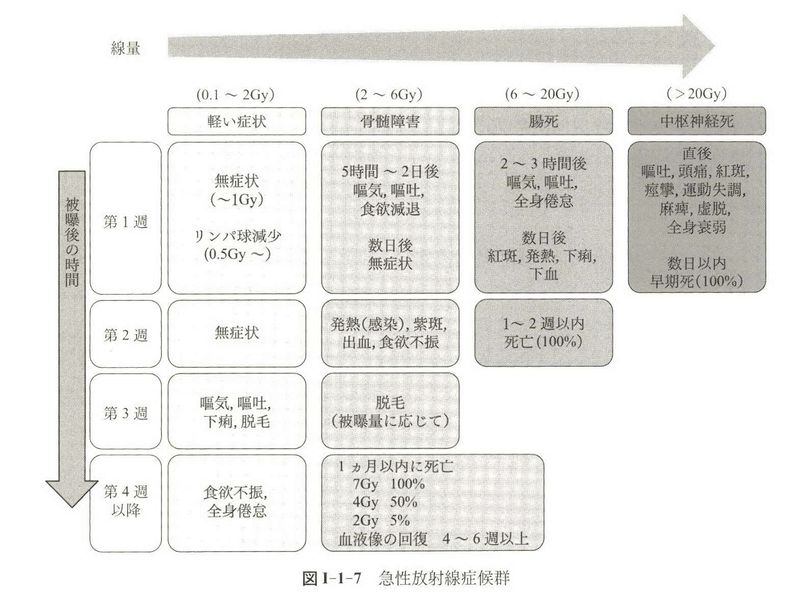

**こたえ**
- 2019-01: `消化管障害`
- 2017-03: `骨髄死`
- 2016-05: `骨髄`
- 2015-05: `4Gy`
- 2018-01: `悪心`
- 2013-11: `掻痒感`が誤り

### 確率的影響と確定的影響(§安全1-1-1),しきい値(§安全1-1-2-4,7,8,9,10,11,1-1-4)

#### 確率的影響と確定的影響

◎[2014-09](http://www.radiology.jp/content/files/1377.pdf#page=4)
電離放射線の人体への影響として正しいのはどれか。1つ選べ。  
`発癌は確定的影響である。`  
`不妊は確率的影響である。`  
`白内障発生は確率的影響である。`  
`発癌の悪性度は線量に依存する。`  
`確率的影響に明確なしきい値は存在しない。` 

◎[2017-10](http://www.radiology.jp/content/files/20170904_2.pdf#page=5)
放射線による胎児への影響として確率的影響と考えられているのはどれか。2つ選べ。  
`流産` `形態異常` `遺伝的影響` `精神発達遅滞` `小児がん発生`

◎[2012-09](http://www.radiology.jp/content/files/2012_1s_exsam.pdf#page=3)
放射線の確定的影響で正しいのはどれか。2つ選べ。  
`回復現象が認められる。`  
`発症に性差が認められる。`  
`遺伝子の突然変異が原因である。`  
`被曝線量が増加するとリスクが増す。`  
`精神発達遅滞は確定的影響の1つである。`  

【有害事象のまとめ】

- 急性反応(早期影響): 被曝から1時間後〜数週間後に生じる.
    - 例: 嘔吐, 脱毛, 皮膚紅斑, 出血, 白血球減少, 放射線宿酔, 不妊, 胎児精神遅滞など.
- 後期反応(晩発影響): 数ヶ月後以降に生じる.
    - 例: 白内障.
- 確定的影響: 細胞死をエンドポイントとする影響.
    - リスクは線量とともに増加する. 
    - しきい値が存在する. **5年以内に1〜5%の患者に障害を生じる線量がしきい値と定義されている(放射線治療の場合)**.
    - 重篤度は線量に依存する.
- 確率的影響: DNA修復ミスによる突然変異を起点とする影響.
    - **発癌もしくは遺伝的影響の2種類ある**.
    - リスクは線量とともに増加する. 
    - しきい値は存在しない. 
    - 重篤度は線量に依存しない.

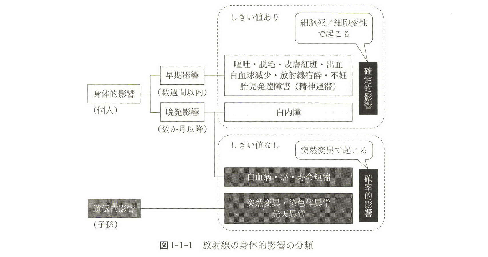

**こたえ**
- 2014-09: `確率的影響に明確なしきい値は存在しない。` 
- 2017-10: `遺伝的影響`, `小児がん発生`
- 2012-09: `被曝線量が増加するとリスクが増す。`,  `精神発達遅滞は確定的影響の1つである。` 

#### 急性被曝のしきい値

◎[2013-15](http://www.radiology.jp/content/files/2013_2s_exsam.pdf#page=5)
放射線の確定的影響（組織障害反応）の指標である「しきい線量」は，放射線治療患者の場合，何%に障害が出現する線量か。1つ選べ。  
`0.5～1％` `1～5％` `5～25％` `25～50％` `50％`  

◎[2019-10](http://www.radiology.jp/content/files/20190904_02.pdf#page=5)
全身被ばくによる急性放射線障害のうち，しきい線量が1Gy以下のものはどれか。2つ選べ。  
`嘔吐` `消化管障害` `造血機能低下` `女性永久不妊` `皮膚水疱形成`  

◎[2018-14](http://www.radiology.jp/content/files/20180926_2.pdf#page=7)
しきい線量と確定的影響の組み合わせについて**誤っている**のはどれか。1つ選べ。  
`0.5Gy 広範囲の照射で造血能低下`  
`1Gy 男性の一時的不妊`  
`3Gy 皮膚紅斑`  
`4Gy 一時的脱毛`  
`6Gy 女性の永久不妊`  

◎[2019-12](http://www.radiology.jp/content/files/20190904_02.pdf#page=5)
胎児被ばくによる精神発達遅滞のしきい線量はどれか。1つ選べ。  
`10～20 mGy` `50～60 mGy` `70～80 mGy` `100～200 mGy` `300～400 mGy`

◎[2016-09](http://www.radiology.jp/content/files/20160825.pdf#page=3)
放射線の人体影響（妊婦，胎児）について正しいのはどれか。1つ選べ。  
`胎児被ばくを理由とした人工妊娠中絶は違法である。`  
`放射線被ばくでは胎児の精神発達遅滞は発症しない。`  
`胎児の形態異常のしきい線量は10～20mGyである。`  
`妊娠前の卵巣の被ばくで胎児の発がんリスクは増大する。`  
`妊婦の放射線被ばく直後のナトリウム摂取は胎児影響の低減作用がある。`

◎[2015-10](http://www.radiology.jp/content/files/20150821.pdf#page=4)
高線量の被ばくは胎児の精神発達遅滞の危険性を高める。曝露時の妊娠月数として，この恐れが最も高いのはどれか。1つ選べ。  
`1か月` `3か月` `5か月` `8か月` `10か月`  

【急性被曝後の確定的影響のしきい値】

- 1. 造血器の影響
    - 0.5Gyの**全身被曝**で造血機能が低下する.
    - 1.5Gy以上の**全身被曝**では生命の危機の可能性があり, 2Gy〜6Gyの全身被曝では骨髄死に至る.
- 2. 男性生殖腺の影響
    - 0.15Gy以上急性被曝すると, 精母細胞の一部が死ぬため一時不妊となる. ただし精子は死なないため精子の寿命(約6週間)のあいだは潜伏期間となる.
    - 3.5〜6Gy以上急性被曝すると, 精子自体も死にはじめる. また, 精母細胞がすべて死滅すると永久不妊となる.
- 3. 女性生殖腺の影響
    - 0.65Gy以上急性被曝すると, 第二次卵母細胞から卵子への成熟が一時的に阻害されるため, その間は一時不妊となる.
        - 一時不妊から回復した際, 染色体障害はそのまま持ち込まれるため, 胎児の遺伝的異常の原因となる.
    - 20代では6〜7Gy以上, 40歳では2〜3Gy以上急性被曝すると, 第二次卵母細胞や卵子がすべて死滅するため永久不妊となる.
- 4. 水晶体の影響
    - 0.5Gy以上急性被曝すると, 水晶体上皮が損傷を受け, それが水晶体の後嚢に移動することで水晶体混濁が生じる.
    - 5Gy以上急性被曝すると, 放射線白内障となる.
- 5. 消化管の影響
    - 6〜10Gy以上急性被曝すると, 小腸のクリプト幹細胞が死滅し, クリプトが再生困難となるため, 粘膜上皮の剥離, 萎縮, 潰瘍が生じる. その後, 体液や電解質の喪失, リンパ組織の破壊, 腸内細菌の侵入を通じて, 下痢, 下血, 敗血症が生じる.
- 6. 皮膚の影響
    - 2Gy以上急性被曝すると, 表皮毛細血管が障害されて拡張し, 一過性の初期紅斑が生じる.
    - 第1度: 3Gy以上急性被曝すると, 脱毛が生じる.
    - 第2度: 6Gy以上急性被曝すると, 2週間後から紅斑が出現し, 約1ヶ月つづく. 乾性皮膚炎が生じる.
    - 第3度: 20Gy以上急性被曝すると, 上皮や皮下に水疱が現れ, 水疱が破れると皮下組織が直接露出する.
    - 第4度: 30Gy以上急性被曝すると, びらんや潰瘍を生じる. 上皮の基底膜は消失し, 薄い上皮が皮下組織に直接密着した状態となり, 外からの刺激に弱くなる.
- 7. 胎児への影響
    - 着床前期(受胎0〜2週): 0.1Gy以上急性被曝すると, 胚死亡となり死産となる. 母親自身も妊娠に気づかないので誰も知らない死産となる.
    - 器官形成期(2〜8週): 0.1Gy以上急性被曝すると, その時にちょうど原基が形成されており感受性の高い臓器に対応した奇形が発生する.
    - 胎児期(8〜25週): 0.1Gy以上急性被曝すると, 発育遅延(←臓器や組織の成長の阻害)や精神発達遅滞(←大脳皮質の神経細胞の形成は25週までつづくため)となる.
        - 大脳皮質の形成障害や精神発達遅滞については特に8〜15週が高リスク.

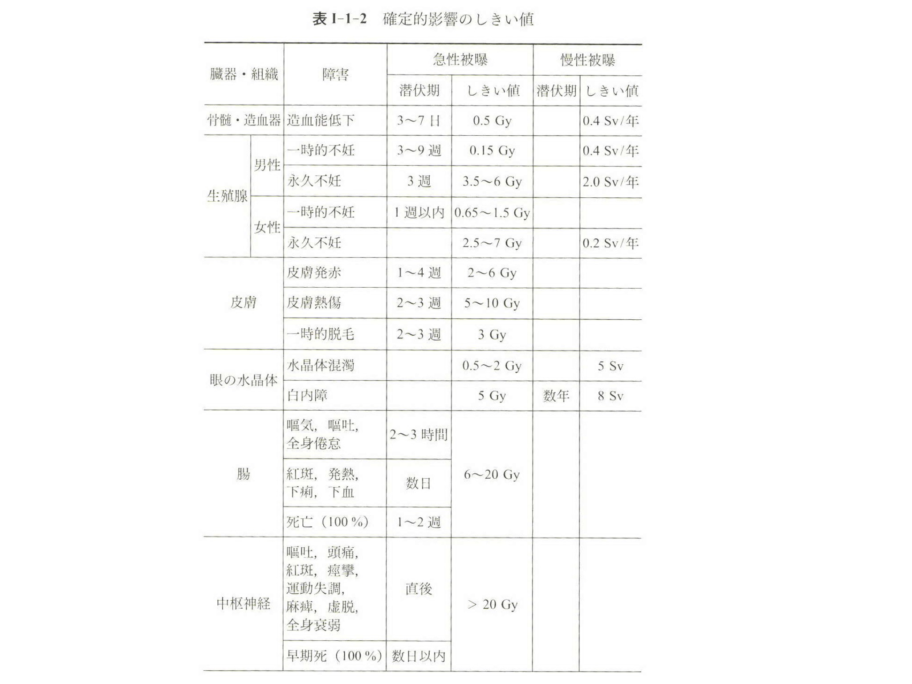

**こたえ**
- 2013-15: `1～5％`
- 2019-10: `嘔吐`,`造血機能低下`
- 2018-14: `1Gy 男性の一時的不妊`が誤り
- 2019-12: `100～200 mGy` 
- 2016-09: `妊娠前の卵巣の被ばくで胎児の発がんリスクは増大する。`
- 2015-10: `3か月`

### 確率的影響と二次がん(§安全1-1-3)

[2012-10](http://www.radiology.jp/content/files/2012_1s_exsam.pdf#page=4)
放射線による発がんについて正しいのはどれか。1つ選べ。  
`自然放射線量が高い地域の住民の発がん率は高い。`  
`放射線誘発がんで潜伏期間が最も短い腫瘍は乳癌である。`  
`白血病の発生は放射線被ばく後 15 年以上経過してから増加する。`  
`放射線による遺伝的影響はこれまでにヒトでは確認されていない。`  
`放射線誘発がんは他の原因による発がんと組織学的に識別可能である。` 

**こたえ**

## 被曝管理
### 放射線防護の考え方と被曝の種類(安全§2-4-1,レジセミ7)
◎[2019-13](http://www.radiology.jp/content/files/20190904_02.pdf#page=6)
放射線診療の正当化に該当するのはどれか。1つ選べ。  
`検査の適応の判断`  
`適切な放射線量の判断`  
`最新の装置での検査実施`  
`定期的な職員教育の実施`  
`充分な数のスタッフの配置`  

◎[2018-15](http://www.radiology.jp/content/files/20180926_2.pdf#page=7)
CT検査において防護の正当化に該当する行為はどれか。1つ選べ。  
`単純CTを省略する。`  
`適応のあることを確認する。`  
`年齢に合わせて線量を調節する。`  
`診断参考レベル以下の線量とする。`  
`automatic exposure control（AEC）を用いた撮影をする。`  

◎[2013-14](http://www.radiology.jp/content/files/2013_2s_exsam.pdf#page=5)
放射線被ばくの分類で**誤っている**のはどれか。1つ選べ。  
`医師が医療行為で被ばく ――――――――――――――― 職業被ばく`  
`癌患者が放射線治療で被ばく ――――――――――――― 医療被ばく`  
`患者の検査時に介護者が被ばく ―――――――――――― 職業被ばく`  
`原子力発電所の職員が業務で被ばく ―――――――――― 職業被ばく`  
`妊娠女性が業務で被ばくした場合の胎児の被ばく ―――― 公衆被ばく`  

◎[2018-12](http://www.radiology.jp/content/files/20180926_2.pdf#page=6)
病院に出入りする人のうち公衆被ばくに含めるのはどれか。2つ選べ。  
`見舞客` `患者家族` `納品業者` `患者介護者` `健常志願者`  

◎[2014-11](http://www.radiology.jp/content/files/1377.pdf#page=5)
医療被ばくについて正しいのはどれか。1つ選べ。  
`線量限度が設けられている。`  
`放射線治療による被ばくを含む。`  
`原子力災害による被ばくを含む。`  
`自然放射線による被ばくを含む。`  
`日本ではおおよそ年間1mSvである。`  

◎[2019-08](http://www.radiology.jp/content/files/20190904_02.pdf#page=4)
自然放射線による被ばくについて正しいのはどれか。2つ選べ。  
`内部被ばくより外部被ばくが多い。`  
`外部被ばくで，大地からの被ばくは地域による差がない。`  
`宇宙線による外部被ばくは，高度が高いほど寄与が小さい。`  
`世界平均で，自然放射線による年間被ばくは 2.4 mSv 程度である。`  
`日本人の内部被ばくでは，吸入よりも食物摂取による被ばくが多い。`  

◎[2017-05](http://www.radiology.jp/content/files/20170904_2.pdf#page=3)
日本人男性の体内放射能はどの程度か。1つ選べ。  
`7 Bq` `70 Bq` `700 Bq` `7,000 Bq` `70,000 Bq`  

【ICRP勧告の基本】

- ICRP勧告と日本の法令
    - 国際放射線防護委員会 (International Commission on Radiological Protection: ICRP) の勧告が世界に広く受け入れられている.
- 日本の法令
    - 2019年9月に **放射性同位元素等の規制に関する法律(通称RI法)** が施行されている.
    - 2020年4月に **医療法施行規則が改正** されている. 
    - このため 2020年現在では, **日本の法令と仕組みは ICRP 2007年勧告に基づいている**.
- そもそも放射線防護の対象となるか?
    - 人間の被曝量が制御できる場合だけが放射線防護の対象となる.
        - 放射線源が制御できる場合: 人工の放射線源, 放射線発生装置を使用している場合など.
        - 放射線源が制御できない場合: 航空機乗務員の飛行中の宇宙線による被曝など.
        - その他, 人間がふつうに日常生活を送っている際の通常レベルの自然放射線による被曝は防護の対象とならない(規制除外).
            - これは, 防護にかけるコストがその利益に見合わないという理由による.
- 行為と介入の原則
    - ICRP勧告では"行為"とは被曝線量を増加させる人間活動をいう.
    - ICRP勧告では"介入"とは被曝線量を減少させる人間活動をいう.
    - 行為の原則
        - 行為の正当化: 行為に伴う放射線影響の損害を相殺するのに十分なメリットがなければ行ってはならない.
        - 防護の最適化: 被曝線量, 被曝人数, 被曝可能性を, 合理的に達成できる限り低く保つ(ALARA: as low as reasonably achievable).
        - 個人の線量限度: ある個人が受ける線量に上限値を設ける.
    - 介入
        - 介入の正当化: 介入による利益が, 介入による損害よりも大きくなければならない.
        - 介入の最適化: 介入のかたち, 規模, 期間は線量低減の正味の便益が最大となるように決定する.
- 被曝の種類
    - 職業被曝: 職業上利用する人工放射線源からの被曝. (ただし, 航空機や宇宙飛行に関連する職業では自然放射線源からの被曝も含める)
    - 医療被曝: 診断や治療による患者の被曝, 医学研究の被験者の被曝, 患者の介護者の被曝. (医療従事者の被曝は職業被曝に含める)
    - 公衆被曝: 上記以外のすべて.
        - なお, 後述するが, 公衆被曝の線量限度は自然放射線による被曝のレベルとつりあっていない.
        - 自然放射線による実効線量の世界平均は2.4mSv/年
        - このうち空気中のラドン壊変生成核種の吸入によるものが1.4mSv/年, それ以外のものが1mSv/年

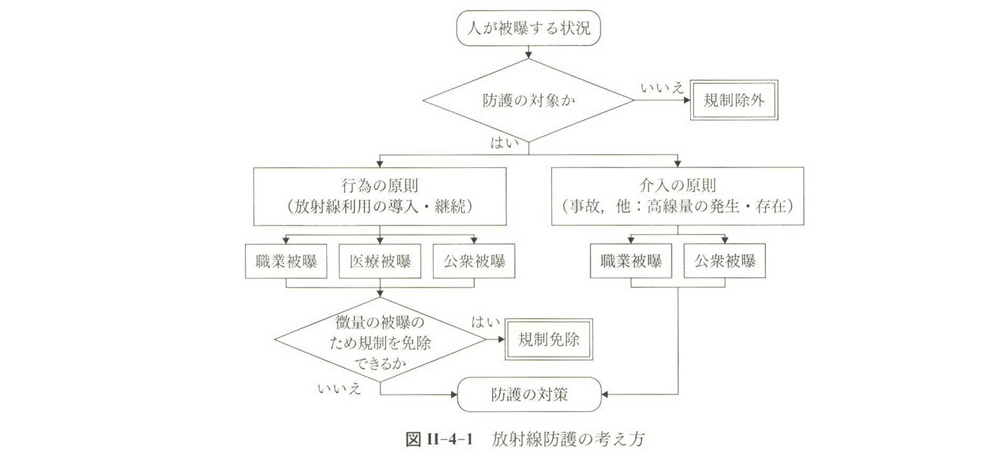
**こたえ**
- 2019-13: `検査の適応の判断`
- 2018-15: `適応のあることを確認する。`
- 2013-14: `患者の検査時に介護者が被ばく ―――――――――――― 職業被ばく` が誤り
- 2018-12: `見舞客`, `患者家族` 
- 2014-11: `放射線治療による被ばくを含む。`
- 2019-08: `世界平均で，自然放射線による年間被ばくは 2.4 mSv 程度である。`, `日本人の内部被ばくでは，吸入よりも食物摂取による被ばくが多い。`  
- 2017-05: `7,000 Bq`

### 線量の単位と確率的影響(安全§2-4-2)
◎[2015-02](http://www.radiology.jp/content/files/20150821.pdf#page=1)
高エネルギー放射線4.2Gyを水500gに照射した際の温度上昇は何度か。1つ選べ。ただし，吸収線量の単位はGy＝J/kg，1cal＝4.2Jなので，4.2Gy＝4.2J/kg＝1.0 cal/kgとする。1calは水1cm^3の温度を1℃上昇させる熱量である。
`2℃` `1℃` `0.5℃` `1/1000℃` `0.5/1000℃`  

◎[2014-12](http://www.radiology.jp/content/files/1377.pdf#page=5)
Sv（シーベルト）**以外**の単位を用いる評価量はどれか。2つ選べ。  
`吸収線量` `実効線量` `線量限度` `等価線量` `放射能量` 

◎[2013-13](http://www.radiology.jp/content/files/2013_2s_exsam.pdf#page=5)
エックス線の放射線加重係数の値はどれか。1つ選べ。  
`0.01` `0.05` `0.1` `1.0` `2.0`

◎[2016-12](http://www.radiology.jp/content/files/20160825.pdf#page=4)
実測では**求められない**のはどれか。1つ選べ。  
`実効線量` `放射能量` `吸収線量` `入射皮膚表面線量` `dose length product（DLP）` 

◎[2019-11](http://www.radiology.jp/content/files/20190904_02.pdf#page=5)
放射線被ばくによる発がんリスクが最も高い臓器はどれか。1つ選べ。  
`乳房` `肝臓` `膀胱` `卵巣` `子宮`  

◎[2016-10](http://www.radiology.jp/content/files/20160825.pdf#page=4)
放射線被ばくによる発がんリスクについて正しいのはどれか。1つ選べ。  
`Bergonie-Tribondeau の計算式を用いてリスク評価をする。`  
`組織加重係数は甲状腺よりも乳腺のほうが大きな値である。`  
`放射線防護上は70歳までの発がんへの寄与でリスクを検討する。`  
`総線量が同じなら複数回の被ばくも一回被ばくもリスクは等しい。`  
`同一実効線量でも外部被ばくのほうが内部被ばくよりリスクは高い。`  

【線量の種類と単位】

- 物理量
    - 吸収線量: 放射線を吸収した物質が放射線から得たエネルギー量. 物質1kgが1Jを吸収するような線量を1Gyと定義する (**1Gy = 1J/kg**).
    - 吸収線量率: 単位時間あたりの吸収線量. **1Gy/hr = 1J/kg/hr**.
- 防護量
    - 等価線量: 放射線の種類とエネルギーによる生体への影響の違いを考慮するために**放射線加重係数をかけたもの**. J/kgでも測れるが特別な単位として**Svを用いる**.
        - 等価線量 HT = 放射線加重係数 wR × 平均吸収線量 DT.
        - 主な放射線荷重係数の値
            - 日本の法令では, 2020年現在ではICRP 2007年勧告の値を採用するため, 以下のようになる:
                - 光子線と電子線は1
                - 陽子線は2
                - 重粒子線は20
                - 中性子線はエネルギーによって異なる
    - 実効線量: 各臓器への影響を考慮するために**各臓器の等価線量に組織加重係数をそれぞれかけて重み付き和をとったもの**. やはりSvを用いる.
        - 実効線量 ET = Σ 組織加重係数 wTi × その組織の等価線量 HTi.
        - 組織加重係数は1Svあたりの癌の発生率および思い遺伝的障害発生による損害の算定値によって定められている.
        - 日本の法令では, 2020年現在ではICRP 2007年勧告の値を採用するため, 以下のようになる:
            - 赤色骨髄, 肺, 乳房, 胃, 結腸が0.12
            - 生殖腺が0.08
            - 甲状腺, 食道, 肝臓, 膀胱が0.04
            - 骨表面, 脳, 唾液腺, 皮膚が0.01
            - 残りのすべての組織の合算が0.12
- 実用量
    - 測定が簡単で, かつ測定結果が防護量よりも大きい値になることが保証されている線量を実用量とよぶ.
    - モニタリングを実用量で行うことによって, 簡単かつ安全なモニタリングが可能になる.
        - 外部被曝のモニタリング
            - エリアモニタリング: 空間線量を1cm線量当量と70μm線量当量によって管理する.
            - 個人モニタリング: 個人線量当量によって管理する.
                - 男性は胸部に, 妊娠可能な女性は腹部に装着する.
        - 内部被曝のモニタリング
            - エリアモニタリング: 空気中濃度, 水中濃度, 表面濃度によって管理する.
            - 個人モニタリング: ホールボディカウンタ, バイオアッセイなどの測定結果によって管理する.

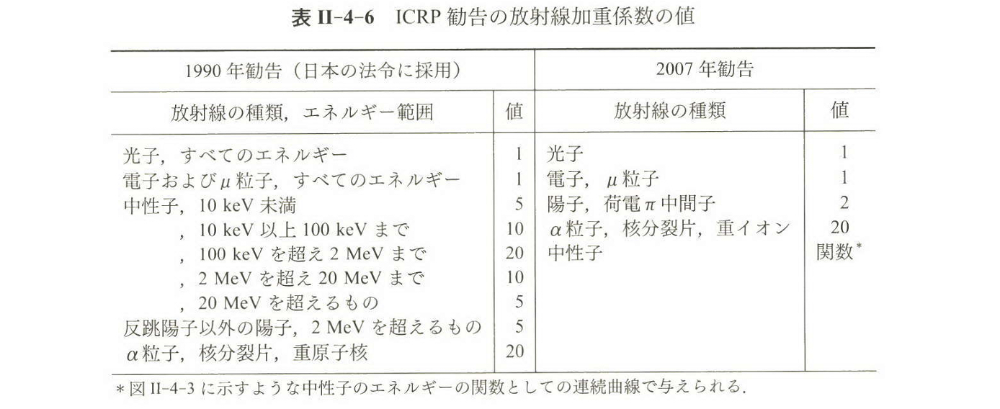
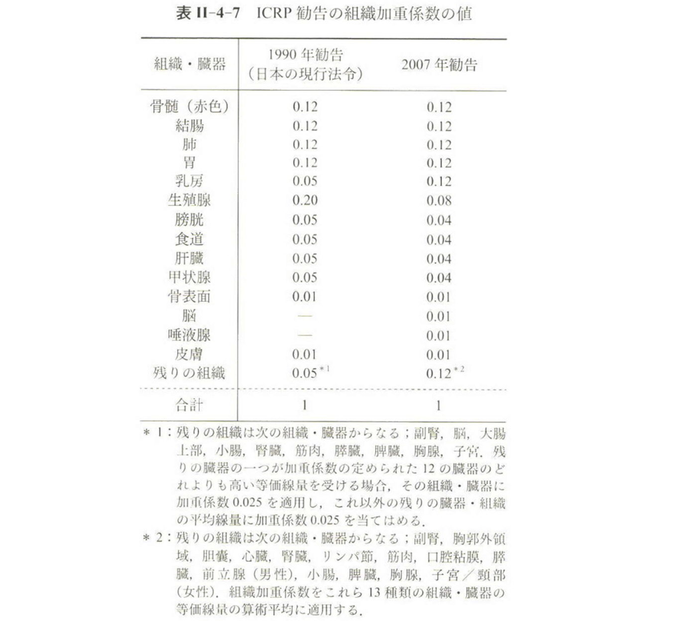

【内部被曝の線量評価】

- 内部被曝の場合は長年にわたって被曝がつづくが, 放射線防護上は**その線量の合計を初年度にまとめて被曝するものとして計算する**.
- ただし, 線量の合計の対象となるのは**成人は50年間, 小児は核種摂取から70歳になるまで**.

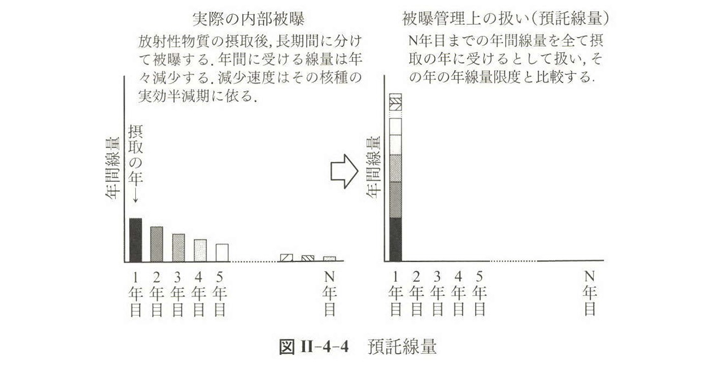

**こたえ**
- 2015-02: `1/1000℃`
- 2014-12: `吸収線量`, `放射能量` 
- 2013-13: `1.0`
- 2016-12: `実効線量`
- 2019-11: `乳房` 
- 2016-10: `組織加重係数は甲状腺よりも乳腺のほうが大きな値である。`  

### 線量限度(安全§2-4-3-1,レジセミ7)

◎[2019-09(改題)](http://www.radiology.jp/content/files/20190904_02.pdf#page=4)
職業被ばくの線量限度について**誤っている**のはどれか。1つ選べ。  
`実効線量限度は5年間で100mSvである。`  
`妊娠期間中の内部被ばくの実効線量限度は1mSvである。`  
`皮膚の等価線量限度は年間500mSvである。`  
`水晶体の等価線量限度は年間50mSvである。`  
`内部被ばくの実効線量限度は年間5mSvである。`  

◎[2018-11(改題)](http://www.radiology.jp/content/files/20180926_2.pdf#page=6)
妊娠を申告した放射線科医師への対応として適切なのはどれか。2つ選べ。  
`IVR業務を免除する。`  
`特殊健康診断を実施する。`  
`本人の体調に合わせて業務を調整する。`  
`個人線量計の計測期間を2週間毎に変更する。`  
`出産までの内部被ばくの実効線量が1mSv以下になるよう管理する。`  

◎[2013-12](http://www.radiology.jp/content/files/2013_2s_exsam.pdf#page=4)
放射線診療従事者の管理で，男性と妊娠可能な女性とで**異なる**のはどれか。1つ選べ。  
`健康診断の項目` `教育訓練の項目` `線量集計の間隔` `一日の作業時間` `作業環境管理方法` 

【線量限度(ICRP2007年勧告による)】

- 医療被曝には線量限度は設定されていない.
- 公衆被曝の線量限度:
    - 実効線量は**1mSv/年以下**.
    - 水晶体の等価線量は15mSv/年以下.
    - 皮膚の等価線量は50mSv/年以下.
- 職業被曝の線量限度:
    - 実効線量は**50mSv/年以下 かつ 100mSv/5年以下**.
    - 水晶体の等価線量も**50mSv/年以下 かつ 100mSv/5年以下**..
    - 皮膚の等価線量は500mSv/年以下.
- 女性の職業被曝の線量限度(日本独自の規定):
    - 妊娠可能な女性の場合, 実効線量を**5mSv/3ヶ月に引き下げる**.
    - 妊婦の場合, 腹部表面の等価線量を**妊娠期間全体を通じて計2mSvまでに制限する**.
    - 妊婦の場合, 内部被曝の実効線量を**妊娠期間全体を通じて計1mSvまでに制限する**.
    - なお, 妊娠したことを申し出たときから出産までを妊娠期間として取り扱う.
    - 個人線量計の測定間隔(通常は1ヶ月ごと)を変更する必要はない.

**こたえ**
- 2019-09: `内部被ばくの実効線量限度は年間5mSvである。`
- 2018-11: `本人の体調に合わせて業務を調整する。`, `出産までの内部被ばくの実効線量が1mSv以下になるよう管理する。`
- 2013-12: `線量集計の間隔` (測定間隔は同じだが集計間隔は異なる)

### 線量測定装置
◎[2017-06](http://www.radiology.jp/content/files/20170904_2.pdf#page=3)
エックス線の測定器について，吸収線量を測定するのに適した装置とエネルギー測定に適した装置との組み合わせとして正しいのはどれか。1つ選べ。  
`GM 検出器 - 電離箱線量計`  
`GM 検出器 - シンチレーション検出器`  
`電離箱線量計 - GM 検出器`  
`電離箱線量計 - シンチレーション検出器`  
`シンチレーション検出器 - GM 検出器`  

◎[2016-01](http://www.radiology.jp/content/files/20160825.pdf#page=1)
放射線の蛍光作用を用いる検出器はどれか。1つ選べ。  
`GM 計数管` `NaI 検出器` `比例計数管` `電離箱線量計` `半導体検出器`  

【線量測定装置】

- 線量測定装置にはまず何を測定したいかによって2つにわかれる.
    - 放射線の種類, 個数, エネルギーを測定するもの.
    - 吸収線量を測定するもの.   
- そして, 利用している原理によって3つにわかれる.
    - 電離作用を利用するもの: 小さなエネルギーの放射線に対しては利用できない?
    - 励起作用を利用するもの: 小さなエネルギーの放射線に対しても利用できる?

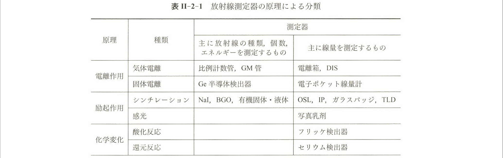

- 気体の電離作用を利用した測定器
    - 原理: 高電圧を印加した空間に気体を充填しておく. そこに放射線が当たった際の電離によって生じた荷電粒子を回路に流すことで, 電流の大きさから入射放射線に関する情報を得ることができる.
    - 電圧と性状: 陽極に印加する電圧の大きさによって種類とその性状が規定される.
        - 再結合領域: 電圧が小さいため, 生じた荷電粒子がすべて電流測定装置へと回収されない.
        - 電離箱領域: 十分な電圧があり, 生じた荷電粒子がすべて電流測定装置へと回収される. この間は印加電圧によって回収されるイオン対の数は変化しない.
        - 比例計数管領域: さらに電圧が大きくなると, 加速された荷電粒子がさらに二次電離を引き起こす. この時点で吸収線量は正しく測定できなくなる. 回収されるイオン対の数は印加電圧に比例する.
        - 境界領域: 回収されるイオン対の数が印加電圧に比例しなくなりはじめる領域.
        - GM計数管領域: さらに電圧が大きくなるとなだれ式に電離が起き, さらに紫外線が生じることによって中性ガスも電離されるようになり, 回収されるイオン対の数がかなり大きくなる. もはや印加電圧には比例しない.
        - 連続放電領域: 極端に印加電圧が大きくなると荷電粒子の入射に関係なくつねにコロナ放電が起こる.
        - 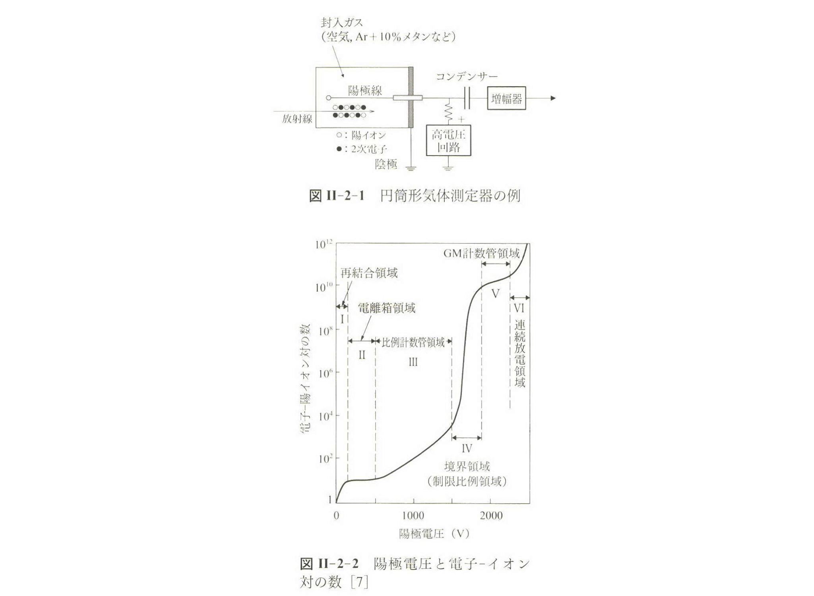
    - 種類:
        - 電離箱: 吸収線量を測定可能.
        - 比例計数管: エネルギーを測定可能.
        - GM計数管: エネルギーを測定可能.
            - 入射放射線のエネルギーに関係なく, 1-5Vの電圧パルスを発生するため, これによって計数が可能.
            - ただし次の放射線が入線してもパルスが現れない不感時間が存在するため, 数え落としがかなり多い.
                - X線やγ線については0.1-1%しか計測できない. β線については比較的計数効率は比較的高い.

- 固体の電離作用を利用した測定器
    - Ge半導体検出器など.

- シンチレーション計数装置
    - 原理: 入射放射線が結晶シンチレータにエネルギーを与えるとそれに応じた光子が発生する. この微弱な光を電流に変換して取り出す.
    - 種類:
        - X線, γ線の測定にはタリウム活性化ヨウ化ナトリウムシンチレータ(NaI(Tl))をよく用いる.
        - ほか, 医療用PETにはフッ化バリウム(BaF2)なども使用されている.
    - 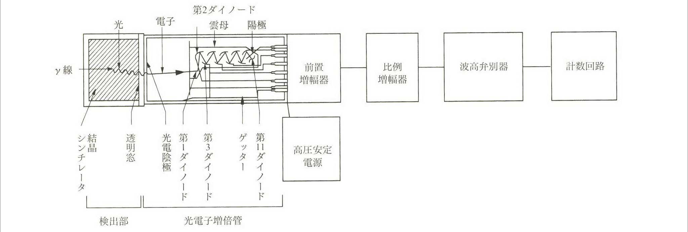

**こたえ**
- 2017-06: `電離箱線量計 - GM 検出器`
- 2016-01: `NaI 検出器`

### 医療現場での放射線安全管理
[2015-13](http://www.radiology.jp/content/files/20150821.pdf#page=5)
放射線と遮蔽体との組み合わせとして，**適切でない**のはどれか。1つ選べ。  
`アルファ線 - 紙`  
`ベータ線 - アルミ板`  
`ガンマ線 - 鉛`  
`エックス線 - 水`  
`中性子線 - パラフィン`  

[2018-74](http://www.radiology.jp/content/files/20180926_2.pdf#page=27)
放射線安全管理について正しいのはどれか。1つ選べ。  
`F-18-FDG の放射線防護には X 線防護衣が有効である。`  
`β 線の遮蔽には厚さ 10 mm 程度のアクリル板を用いる。`  
`重症患者の場合は一般病棟で放射性医薬品を投与してよい。`  
`Y-90-イブリツモマブチウキセタンは一般病棟入院患者に投与できない。`  
`未使用のTc-99m標識放射性医薬品は十分減衰してから医療廃棄物として廃棄する。`  

[2013-72](http://www.radiology.jp/content/files/2013_2s_exsam.pdf#page=24)
放射線管理区域内で禁止されて**いない**のはどれか。1つ選べ。  
`排尿` `化粧` `喫煙` `昼食摂取` `缶コーヒー摂取`  

### 医療現場での被曝低減策

[2014-13](http://www.radiology.jp/content/files/1377.pdf#page=5)
小児の腹部CTにおける被ばく低減策として**誤っている**のはどれか。1つ選べ。  
`管電流を下げる。`  
`管電圧を下げる。`  
`スキャン範囲を限定する。`  
`ピッチファクターを小さくする。`  
`Automatic Exposure Control（AEC）を活用する。`  

[2015-12]
妊婦が放射線検査を受けた場合，胎児被ばく線量が最も高いのはどれか。1つ選べ。
`注腸造影`  
`頭部単純CT`  
`骨盤単純CT`  
`胸部X線撮影`  
`腰椎単純X線撮影（正，側2方向）`  

[2016-13](http://www.radiology.jp/content/files/20160825.pdf#page=5)
小児の腹部CTにおける被ばく低減策として正しいのはどれか。2つ選べ。  
`管電流を下げる。`  
`管電圧を上げる。`  
`ピッチファクターを大きくする。`  
`AEC（automatic exposure control）を使用しない。`  
`寝台（クレードル）をガントリーの中心より低くする。`  

[2017-09](http://www.radiology.jp/content/files/20170904_2.pdf#page=5)
IVRにおける患者皮膚線量の低減策として正しいのはどれか。2つ選べ。  
`照射野を絞る。`  
`透視時間を短くする。`  
`拡大透視を多用する。`  
`パルス透視を高レートにする。`  
`X線管球と患者の距離を近づける。`  

[2017-11](http://www.radiology.jp/content/files/20170904_2.pdf#page=5)
CT検査を受ける患者の被ばく低減に有用なのはどれか。2つ選べ。  
`電圧を上げる。`  
`電流を上げる。`  
`多相撮影を推奨する。`  
`ガントリーの中心に患者を置く。`  
`撮影範囲を必要最小限にする。`  

[2018-13]
IVRで従事者の被ばく線量低減に効果的な手法はどれか。1つ選べ。  
`拡大透視の使用`  
`撮影回数の減少`  
`2管球装置の使用`  
`透視線量率の低減`  
`手指線量計の装着`  

[2019-70](http://www.radiology.jp/content/files/20190904_02.pdf#page=25)
IVR 時の患者被ばく線量の低減に有用な方法はどれか。2 つ選べ。
a	 照射野をできるだけ絞る。
b	 透視の pulse rate を下げる。
c	 検出器を患者から遠ざける。
d	 DSA の frame rate を上げる。
e	 拡大透視をできるだけ用いる。

[2016-68](http://www.radiology.jp/content/files/20160825.pdf#page=25)
 IVR で患者被ばくを低減する方法として適切なのはどれか。2 つ選べ。
a	 パルス透視を用いる。
b	 アームを斜位にする。
c	 付加フィルターを薄くする。
d	 X 線管球を患者に近づける。
e	 X 線受像器をできるだけ患者に近づける。
e	 ファイバードコイルではコイルの逸脱防止のためにファイバーが付けられている。

# 放射線治療総論
## 放射線治療の安全(§2-13-8)
### 耐容線量

◎[2018-02](http://www.radiology.jp/content/files/20180926_2.pdf#page=2)
通常分割で**臓器全体**が照射された場合の耐容線量（TD5/5：5年間で5％）が最も低いのはどれか。1つ選べ。  
`脳` `肺` `肝臓` `小腸` `脊髄` 

◎[2015-08](http://www.radiology.jp/content/files/20150821.pdf#page=3)
通常分割照射で **臓器全体(両側性の場合は両方)** が照射された場合，重篤な晩発障害を基準にすると耐容線量が最も低いのはどれか。1つ選べ。  
`脳` `心` `肝` `腎` `膀胱`  

◎[2014-07](http://www.radiology.jp/content/files/1377.pdf#page=3)
通常分割照射における小腸（**体積1/3**）の耐容線量（TD5/5）はどれか。1つ選べ。  
`20 Gy` `30 Gy` `40 Gy` `50 Gy` `60 Gy` 

[2016-88](http://www.radiology.jp/content/files/20160825.pdf#page=32)
臓器の照射体積および TD5/5（Gy）と障害との組み合わせとして**誤っている**のはどれか。1つ選べ。
`脳（1/3，60 Gy） 脳壊死`  
`食道（1/3，60 Gy） 食道潰瘍`  
`肝臓（1/3，50 Gy） 慢性肝炎`  
`卵巣（全体，10 Gy） 不　妊`  
`脊髄（5～10 cm，50 Gy） 脊髄壊死`  

【耐容線量】

放射線治療の際には総線量が耐容線量をオーバーしないように計画を行う.  
耐容線量とはあくまで分割照射の総線量に対するものであり, 一回の急性被曝に対する**しきい値とはまったく別物**であることに注意.  
耐容線量は次のように2段階あるが, 最小LD5/5を上回らないように治療計画を立てるのが一般的.  
- 最小LD5/5: 照射後5年以内の有害事象発症率が5%以下の線量
- 最大LD50/5: 照射後5年以内の有害事象発症率が50%以下の線量

耐容線量の対象に設けられている有害事象は, 急性被曝に対するしきい値の確定的影響と同じものもあれば, 異なるものもある.  

主な臓器の耐容線量は以下のとおり. 特徴としては以下のようなものがある:
- 直列臓器では耐容線量は体積によってあまり変化しないが, **並列臓器では耐容線量が体積とおおむね反比例する**.
- 体積1/3の耐容線量が小さい臓器は, 水晶体(10Gy), 網膜と肺(45Gy), 視神経と視交叉と小腸と肝(50Gy).
- 体積3/3の耐容線量が小さい臓器は, 水晶体(10Gy), 肺(17.5Gy), 腎(23Gy), 肝(30Gy)など.

注意: **放射線治療計画ガイドラインの第1章と第12章に掲載されている耐容線量では有害事象の内容が異なる部分がある.**

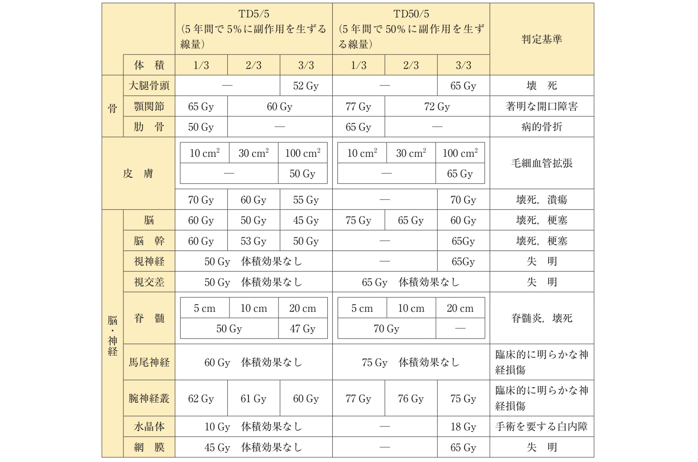
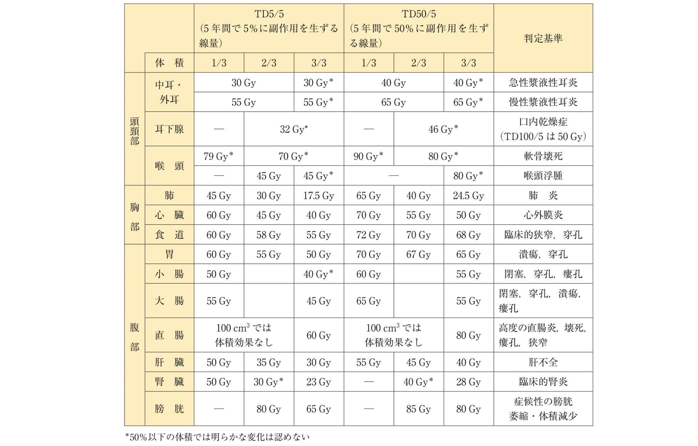

**こたえ**
- 2018-02: `肺`
- 2015-08: `腎`
- 2014-07: `50 Gy`

### 照射後の有害事象一般
[2019-86](http://www.radiology.jp/content/files/20190904_02.pdf#page=30)
全身照射後の最も早期に起こる反応はどれか。1つ選べ。  
`下痢` `脱毛` `肺炎` `口内炎` `耳下腺腫脹`

[2018-88](http://www.radiology.jp/content/files/20180926_2.pdf#page=32)
骨盤部位の放射線治療に伴う消化管有害事象で正しいのはどれか。2つ選べ。  
`小腸より大腸に多い。`
`イレウスは晩期に多い。`
`直腸潰瘍は早期に多い。`
`化学療法併用で増強しない。`
`強度変調放射線治療の使用で減少できる。`

[2016-102](http://www.radiology.jp/content/files/20160825.pdf#page=37)
放射線照射後の消化管有害反応で正しいのはどれか。2つ選べ。  
`早期反応として下痢がある。`  
`晩期反応として腸閉塞がある。`  
`早期反応として蛋白漏出性胃腸症がある。`  
`晩期反応は小腸より大腸で起こりやすい。`  
`早期反応には副腎皮質ステロイドを使用する。`

[2015-105](http://www.radiology.jp/content/files/20150821.pdf#page=36)
放射線脊髄症について正しいのはどれか。1つ選べ。  
`照射後3か月以内に発症することが多い。`  
`脊髄線量 60 Gy 未満での発症はまれである。`  
`照射される脊髄の長さは発症率に影響する。`  
`照射期間中に休止期間が入ると発症率は低下する。`  
`総線量が同じであれば発症率は分割回数に影響されない。`

## 臓器レベルの放射線生物学(§2-13-5)
◎[2018-87](http://www.radiology.jp/content/files/20180926_2.pdf#page=31)
直列臓器はどれか。2つ選べ。  
`肺` `胃` `肝臓` `腎臓` `視神経`

◎[2015-87](http://www.radiology.jp/content/files/20150821.pdf#page=30)
放射線治療における並列臓器はどれか。2つ選べ。  
`気管` `肺` `肝臓` `直腸` `脊髄`

◎[2013-87](http://www.radiology.jp/content/files/2013_2s_exsam.pdf#page=29)
放射線治療の施行において直列臓器として考えるのはどれか。2つ選べ。  
`肺` `肝臓` `小腸` `腎臓` `脊髄`

**こたえ**
- 2018-87: `胃`, `視神経`
- 2015-87: `肺`, `肝臓`
- 2013-87: `小腸`, `脊髄`

## 組織レベルの放射線生物学(§2-13-4)
◎[2013-07](http://www.radiology.jp/content/files/2013_2s_exsam.pdf#page=3)
放射線治療に影響する4R**でない**のはどれか。1つ選べ。  
`Repair` `Repopulation` `Redistribution` `Recombination` `Reoxygenation`

◎[2017-04](http://www.radiology.jp/content/files/20170904_2.pdf#page=3)
分割照射で抗腫瘍効果の増強が期待できるのはどれか。2つ選べ。  
`再増殖`  
`再酸素化`  
`亜致死損傷の修復`  
`細胞周期の再分布`  
`DNA二重鎖切断の修復` 

◎[2014-94](http://www.radiology.jp/content/files/1377.pdf#page=32)
放射線感受性が比較的高いのはどれか。2つ選べ。  
`甲状腺未分化癌` `網膜悪性黒色腫` `上顎洞腺様囊胞癌` `上咽頭リンパ上皮腫` `中咽頭低分化扁平上皮癌`  

◎[2016-08](http://www.radiology.jp/content/files/20160825.pdf#page=3)
放射線感受性の腫瘍はどれか。2つ選べ。  
`胚腫` `膠芽腫` `腎細胞癌` `甲状腺乳頭癌` `Hodgkinリンパ腫` 

◎[2015-88](http://www.radiology.jp/content/files/20150821.pdf#page=31)
放射線感受性が高いのはどれか。2つ選べ。  
`膠芽腫` `胚細胞腫` `神経芽腫` `平滑筋肉腫` `聴神経鞘腫`  

◎[2012-87](http://www.radiology.jp/content/files/2012_1s_exsam.pdf#page=29)
放射線感受性が最も高いのはどれか。1つ選べ。  
`腺癌` `骨肉腫` `Ewing肉腫` `扁平上皮癌` `悪性黒色腫`  

◎[2017-86](http://www.radiology.jp/content/files/20170904_2.pdf#page=31)
放射線感受性が最も**低い**のはどれか。1つ選べ。  
`精上皮腫` `甲状腺乳頭癌` `乳腺乳頭腺管癌` `胃マルトリンパ腫` `子宮頸部扁平上皮癌`  

組織の放射線感受性は, 構成する細胞に依存している. 組織は構成細胞によって次のように分類でき, それぞれ放射線感受性が異なる.

- H型組織: 幹細胞〜成熟細胞すべてを含む組織. 常に細胞分裂を繰り返しており放射線感受性がもっとも高い.
    - 例: **皮膚, 腸上皮, 精巣, 骨髄など**.
    - 母細胞がもっとも感受性が高く, 母細胞から細胞死が始まる. 分化した娘細胞はそれほど感受性は高くない.
    - つまり精子細胞は精母細胞より放射線抵抗性なので, 不妊はただちには起こらず, 精母細胞の供給不足を遠因として一定期間後に顕在化する.
- H-Fハイブリッド型組織: H型とF型(下記)の特徴を併せもつもの.
    - 例: **腎尿細管上皮, 唾液腺, 甲状腺上皮など**.
- F型組織: 通常は分裂しないG0期にあるが, 何らかの障害を受けるとG1期から分裂周期に入り再生する潜在能力をもつもの.
    - 例: **肝臓**.
- 非分裂組織
    - 例: **神経細胞, 心筋細胞**.
    - これは神経や心臓がまったく放射線の影響を受けないことを意味しない.
    - なぜなら神経膠細胞や血管内皮細胞は分裂能を有するので, 組織障害はこれらを介して生じるため.
    
なお, **横紋筋肉腫を除いた小児悪性腫瘍は全般的に放射線感受性が高い**.
- Ewing肉腫, Wilms腫瘍, 神経芽腫, 網膜芽細胞腫
    
また, 分割照射の場合には次の4Rが影響する. 実質を構成する細胞群にみられる現象であることに留意する. また, reoxygenation以外は正常組織にも起こる.
- repair
    - SLDR(亜致死損傷回復:sublethal damage recovery), PLDR(潜在的致死損傷回復: potentially lethal damage recovery).
- redistribution
    - 各細胞周期の割合.
    - バラバラな周期の細胞からなる病巣に照射すると, まず感受性の高い周期にあたる細胞が多く死滅する.
    - 生き残った細胞はG2期に進むが, ここで線量に応じてしばらく進行が止まるためG2期の細胞が蓄積される(G2 block).
    - その後, G2 blockにあった細胞はいっせいにM期に進むため, 次の照射でこれらをまとめて死滅させることができる.
- repopulation
    - 各細胞の実質胞巣内での解剖学的位置.
- reoxygenation
    - 各細胞の再酸素化. 照射によって病巣表面の酸素化細胞が死ぬとその深部の無酸素細胞が酸素化される.

**こたえ**
- 2013-07: `Recombination` が誤り
- 2017-04: `再酸素化`, `細胞周期の再分布`
- 2014-94: `上咽頭リンパ上皮腫`, `中咽頭低分化扁平上皮癌`
- 2016-08: `胚腫`, `Hodgkinリンパ腫`
- 2015-88: `胚細胞腫`, `神経芽腫`
- 2012-87: `Ewing肉腫`
- 2017-86: `甲状腺乳頭癌`

## 細胞レベルの放射線生物学(§2-13-3,3-1-1,安全1-2)
◎[2013-05](http://www.radiology.jp/content/files/2013_2s_exsam.pdf)
放射線感受性が高い細胞周期はどれか。2つ選べ。 `M期` `G0期` `S期の後半` `G1期の前半` `G1期からS期への移行期`

細胞死をエンドポイントとして放射線感受性をみた場合, **G1期の後半とM期**に放射線感受性がもっとも高い.

- G0期: 細胞周期から抜けている状態.
- G1期: DNA合成のための酵素などを準備している状態.
- S期: DNA合成を行っている状態.
- G2期: 有糸分裂のための微小管などを合成している状態.
- M期: 有糸分裂を行っている状態.

**こたえ**
- 2013-05: `M期`, `G1期からS期への移行期`

◎[2012-01](http://www.radiology.jp/content/files/2012_1s_exsam.pdf#page=1)
放射線による細胞死について**誤っている**のはどれか。1つ選べ。  
`増殖死と間期死とに分類される。`  
`アポトーシスとネクローシスとに分類される。`  
`増殖死では巨細胞形成や細胞融合がみられる。`  
`間期死では照射後数回の細胞分裂後に死に至る。`  
`リンパ球でみられる高感受性間期死はアポトーシスである。`

細胞の死に方は間期死, 増殖死の2通りにわけられる.
- 間期死: 分裂期を経ない死に方. **アポトーシスによる**.
    - DNA損傷を認識したセンター蛋白質がエフェクター蛋白質にその情報を伝え, エフェクター蛋白質が細胞死を引き起こす.
    - 通常, ただちに生じる.
- 増殖死: 分裂期を通過する死に方. 分裂崩壊, オートファジー, **老化様増殖停止**などがある.
    - 老化様増殖停止: DNA損傷を認識したセンター蛋白質がエフェクター蛋白質にその情報を伝え, エフェクター蛋白質が細胞周期を永久に停止させる.
        - この場合, 細胞は正常な形もしくは巨細胞や多核細胞などの形をとって存在しており, 代謝も営んでいるが, 増殖能はない.
    - 通常, 照射後に細胞周期ぶんの時間が経過してから生じる.
- どちらが起こるのかは細胞, 組織, 臓器によって異なる.
    - **白血球系細胞, 神経細胞はアポトーシスを起こす.**
    - **ほとんどの上皮細胞や間質細胞は老化様増殖停止を起こす. ただし消化管上皮細胞はアポトーシスを起こす.**

**こたえ**
- 2012-01: `間期死では照射後数回の細胞分裂後に死に至る。`が誤り

◎[2013-06](http://www.radiology.jp/content/files/2013_2s_exsam.pdf#page=2)
癌抑制遺伝子p53の代表的な機能はどれか。2つ選べ。  
`細胞周期の停止`  
`細胞生存の促進`  
`細胞増殖の促進`  
`細胞のアポトーシス誘導`  
`細胞のネクローシス誘導`  

p53遺伝子はDNA損傷刺激を受けた細胞で活性化して細胞周期をG1およびG2/M期で停止させ, その間にDNAを修復を促すことでDNAに変異が入ることを防ぐ.  
さらに, 修復しきれない細胞にアポトーシスを誘導して排除することで, 遺伝子の変異を防ぐ.

**こたえ**
- 2013-06: `細胞周期の停止`, `細胞のアポトーシス誘導`

## 放射線に対する反応モデル(§2-13-7)

### ヒット論・ターゲット論(§2-13-7-1)

◎[2018-03](http://www.radiology.jp/content/files/20180926_2.pdf#page=2)
分割照射において亜致死損傷からの回復に必要な時間はどれか。1つ選べ。  
`数秒間` `数分間` `数時間` `数日間` `数月間`

◎[2019-02](http://www.radiology.jp/content/files/20190904_02.pdf#page=2)
照射間における亜致死損傷からの回復（SLDR）が大きい場合について正しいのはどれか。1つ選べ。  
`照射から約6時間後に回復が始まる。`
`分割法による照射効果の差は小さい。`
`回復が乏しい場合よりも細胞生存率は低下する。`
`2回目照射後の生存曲線の形状は初回照射後と同様になる。`
`高LET放射線照射後は低LETに比して回復がさらに大きくなりやすい。`

細胞死をエンドポイントとした理論にはいくつか種類がある.

【ヒット論・ターゲット論と2要素モデル】
DNA(=ターゲット)に放射線が当たって二重鎖切断が起これば(=ヒット)細胞が死ぬと仮定した理論.  
ヒットが起こる確率はPoisson分布に従うため, 線量が増えると死亡率は指数関数的に増加する. 生存率は, Poisson分布において0回ヒットする確率であるから, exp(-αD)の形になる.  
ただし, 高LET放射線と低LET放射線では異なるモデル化を採用している.  
高LET放射線の場合, DNAは一発で修復不可能なほど損傷されると考え, 1ヒットでただちに細胞は死ぬ(1標的1ヒット). よって片対数グラフで直線のグラフとなる.  
低LET放射線の場合, n個のターゲットをすべてヒットしたときに細胞が死ぬという多重標的1ヒットの理論を用いている. よって, **単位時間あたりの損傷が少なければSLDR(亜致死損傷回復:sublethal damage recovery)により細胞は死を免れる場合もあるため, 片対数グラフに肩ができる.**  
なお, **亜致死損傷回復は照射から4〜6時間後には完了する.**  

ちなみに, 低LET放射線については, 多重標的1ヒットの理論は低線量の場合に現実とそぐわないので, 1標的1ヒットと多重標的1ヒットの2要素をあわせた2要素モデルも提唱されている.

**こたえ**
- 2018-03: `数時間`
- 2019-02: `2回目照射後の生存曲線の形状は初回照射後と同様になる。`

### LQモデル(§2-13-7-2)

◎[2013-03](http://www.radiology.jp/content/files/2012_1s_exsam.pdf#page=1)
直線―2次曲線モデル（LQモデル）について**誤っている**のはどれか。1つ選べ。
`α/βの単位はGyである。`
`後期反応のα/βは早期反応に比して小さい。`
`1本の放射線で2本鎖切断が生じる確率は線量の2乗に比例するとした。`
`致死障害は2本鎖切断であり単鎖切断では致死に至らないとしたモデルである。`
`細胞の生残曲線を多標的1ヒットのみで説明するには低線量の部分に無理があるため提唱された。`

◎[2017-02](http://www.radiology.jp/content/files/20170904_2.pdf#page=2)
LQモデルで，1回の照射線量をd，照射回数をnとした場合，照射効果を表す式はどれか。1つ選べ。
`n(α+βd)`
`n(αd+βd)`
`n(αd+β^2d)`
`n(αd+βd^2)`
`n(d+α/β d^2)`

【LQモデル(Linear-Quadratic Model)】
ヒット論・ターゲット論では放射線1本で一気に二本鎖切断が起こった場合しか考えていなかった.  
しかし, 実際には線量が多ければ, 単鎖切断が2回つづけて起こって結果的に二本鎖切断となるような場合も増えてくると考えられる.  
そこで, DNAの2本鎖の切断を, 1回の二重鎖切断によるものと2回の単鎖切断によるものにわけ, 両者を考慮したのがLQモデルとなる.  
やはり線量が増えると細胞の死亡率は指数関数的に増加していくようになっているが, 2回の単鎖切断については指数部分は線量の2乗に比例する.生存率は **exp(-αD-βD^2)** で表される.  

この式からわかるように, Dの増加にしたがって2回の単鎖切断による細胞死のほうが優勢になってくる.  
α, βは組織によってそれぞれ異なっているが, その指標の一つとして**「1回の二重鎖切断の確率＝2回の単鎖切断の確率」となる線量の大きさ**をもって特徴量とするものがある.  
この線量はα/βと等しい(単位はGy). 単に"alpha beta"などとよばれる.

**こたえ**
- 2013-03: `1本の放射線で2本鎖切断が生じる確率は線量の2乗に比例するとした。` が誤り
- 2017-02: `n(αd+βd^2)`

◎[2018-04](http://www.radiology.jp/content/files/20180926_2.pdf#page=4)
腫瘍と正常組織におけるα/β 比(LQモデル)の関係で，寡分割照射が薦められる組み合わせはどれか。1つ選べ。  
`(腫瘍のα/β,正常組織のα/β)=(2,2),(2,3),(3,2),(3,3),(4,3)`

◎[2014-06](http://www.radiology.jp/content/files/1377.pdf#page=3)
放射線治療で起こりうる有害事象でα/β比（LQモデル）が大きいのはどれか。2つ選べ。  
`脱毛` `咽頭炎` `脳壊死` `白内障` `腎硬化症`

【α/β比の臨床的意味】
**α/β比は照射後の組織の回復にかかわる指標である**.  
あるターゲット(細胞/組織/臓器)とエンドポイント(障害/死亡)に対して生存率曲線を描くと, 
- 曲線の肩が大きい場合, LQモデルをフィッティングするとα/β比は小さくなる. 
- 曲線の肩が小さい場合, LQモデルをフィッティングするとα/β比は大きくなる. 

さらに, 曲線の肩が大きいということは亜致死損傷からの回復が見込めるということでもある.
したがって, 「**あるターゲットとエンドポイントの組に対し, α/βが小さいほど, 照射後の回復がより期待できる**」ということになる.  
そして, 一般的に **正常組織のα/βは小さく, 腫瘍のα/βは大きい**.

【同じエンドポイント・異なるターゲットに対するα/βの定性的比較】
正常組織と腫瘍のα/βをそれぞれ比べれば最適な分割回数を決定することができる. なぜなら,
- **α/β比が 正常組織 < 腫瘍 ならば, 正常組織の回復力に期待して, 分割回数を多くしたほうがよい**
- **α/β比が 正常組織 > 腫瘍 ならば, 腫瘍に再増殖の隙を与えないために, 分割回数を少なくしたほうがよい**
ことがいえるためである.

ちなみに, α/β比が高い組織を「**急性反応型組織**」, α/βが低い組織を「**晩期障害型組織**」とよぶ.  
- 急性反応型組織: 口腔粘膜, 骨髄, 皮膚, ほとんどの悪性腫瘍などのようにturn overの速い組織があてはまる.
- 晩期障害型組織: 脳, 脊髄, 肝臓, 腎臓, 肺などのようにturn overが遅いか, または全く起きない組織があてはまる.

【異なるエンドポイント・異なるターゲットに対するα/βの定性的比較】

放射線に対するさまざまな反応において, エンドポイントもターゲットも異なっているが, 概ね次のような傾向がある.
- 放射線治療に対する早期反応(急性障害)についてモデルフィッティングを行うと, α/βは大きくなる. 
    - 早期反応(急性障害)とは照射中〜照射後数ヶ月以内に生じる反応のこと.
    - 例: 粘膜炎, 皮膚炎, 骨髄抑制, 下痢など
- 放射線治療に対する晩期反応(晩期障害)についてモデルフィッティングを行うと, α/βは小さくなる.
    - 晩期反応(晩期障害)とは照射後6ヶ月〜数年後にはじめて生じる反応のこと.
    - 例: 皮膚潰瘍, 肺線維症, 腎不全, 放射線脊髄症など

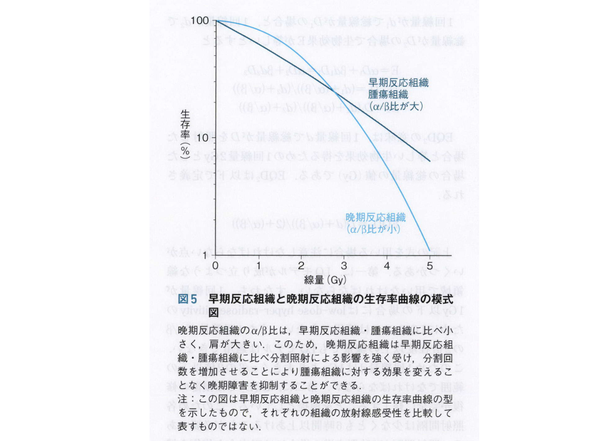

まとめ
||低α/β|高α/β|
|---|---|---|
|亜致死損傷からの回復力|高い|低い|
|組織のturn over|少ない|多い|
|組織の類型|晩期障害型組織|急性反応型組織|
|腫瘍に対する分割回数|減らす|増やす|
|腫瘍に対する1回線量|増やす|減らす|

**こたえ**
- 2018-04: `(腫瘍のα/β,正常組織のα/β)=(2,3)`
- 2014-06: `脱毛`, `咽頭炎` (早期障害を選べばよい)
- 2015-07: `前立腺癌（腺癌）`

◎[2015-07](http://www.radiology.jp/content/files/20150821.pdf#page=3)
LQモデルにおける α/β 比が小さいとされている腫瘍はどれか。1つ選べ。
`乳癌（腺癌）` `前立腺癌（腺癌）` `肺癌（扁平上皮癌）` `頭頸部癌（扁平上皮癌）` `子宮頸癌（扁平上皮癌）`

α/βの小さい腫瘍とは, 要するにturn overが少なく正常組織と似た性質を示す腫瘍のことである.  
α/βの小さい腫瘍の例:
- 前立腺癌, 悪性黒色腫, 聴神経腫瘍, 頭蓋底腫瘍, 髄膜腫, 下垂体腫瘍, 転移性脳腫瘍, 転移性脊髄腫瘍

**こたえ**

◎[2019-04](http://www.radiology.jp/content/files/20190904_02.pdf#page=3)
2Gy等価線量換算値（EQD2）の比較で，照射効果の大小関係が正しいのはどれか。2つ選べ。ただし，LQモデルにおけるα/β比は2と仮定する。  
`20Gy/4fr < 24Gy/12fr`  
`20Gy/5fr < 22Gy/11fr`  
`20Gy/8fr < 20Gy/10fr`  
`20Gy/10fr < 24Gy/12fr`  
`20Gy/20fr < 18Gy/9fr`  

◎[2016-07](http://www.radiology.jp/content/files/20160825.pdf#page=3)
正常組織の晩期反応が最も大きいのはどれか。1つ選べ。ただし，LQモデルにおけるα/β比は3で，照射期間の相違は無視できると仮定する。  
`30Gy/6回` `30Gy/10回` `30Gy/12回` `30Gy/15回` `30Gy/20回`

【2Gy等価線量換算値(EQD2)】  
1回線量をd, 照射回数をnとしたとき, その照射効果が1回2Gyで照射したときの総線量いくつ分に相当するかを計算することができる.  
計算式は EQD2 = d * n * (d + α/β) / (2 + α/β).  

ただし, EQD2の使用にあたっては以下の制約がある.  
- 1回線量は1Gy以上, かつα/βの2倍以下でなければならない.
- 各照射間隔は6時間以上空いていなければならない.  
- 比較する照射法の総治療期間は等しくなければならない.

**こたえ**
- 2019-04: `20Gy/10fr < 24Gy/12fr`, `20Gy/20fr < 18Gy/9fr`  
- 2016-07: `30Gy/6回`

## 分割照射(§3-8)

◎[2017-01](http://www.radiology.jp/content/files/20170904_2.pdf#page=1)
加速過分割照射で使われている分割線量（1回線量）はどれか。1つ選べ。  
`1.0 Gy` `1.5 Gy` `2.0 Gy` `2.5 Gy` `3.0 Gy` 

◎[2014-08](http://www.radiology.jp/content/files/1377.pdf#page=4)
通常分割照射と比較した場合，加速過分割（多分割）照射で正しいのはどれか。1つ選べ。  
`総線量が多い。`  
`1回線量が多い。`  
`照射日数が多い。`  
`照射期間が短い。`  
`照射回数が少ない。`  

放射線治療計画においては晩期障害をいかに抑えるかがもっとも重要である.  
晩期障害こそが回復しにくく治療が困難であるためである.  

一般に, α/βの大きい腫瘍(ほとんどの腫瘍)については, 1回線量を減らしてかわりに回数を多くする.
逆に, α/βの小さい腫瘍(turn overが少なく正常組織と似た性質を示す腫瘍)については, 1回線量を多くしてかわりに回数を減らす.

- 過分割照射 Hyperfractionation
    - たとえば「1回2Gyで1日1回照射を25日間」を, 「1回1.1〜1.2Gyで1日2回照射を12.5日間」などにする.
    - 1回あたりの線量を落として正常組織への影響を減らすかわりに, 分割回数を増やすことで, 結果として総線量を増やせる.
- 加速分割照射 Accelerated fractionation
    - たとえば「1回2Gyで1日1回照射を25日間」を, 「1回2Gyで1日2回照射を12.5日間」などにする.
    - 1回あたりの線量を落とさないもの.
    - きわめて増殖の速い腫瘍を対象に行うが, 急性障害が強く出るため適応となるケースは少ない.
- 加速過分割照射 Accelerated hyperfractionation
    - たとえば「1回2Gyで1日1回照射を25日間」を, 「1回1.6Gyで1日2回照射を12.5日間, ただし前半と後半に1週間の休止期間をおく」などにする.
    - 加速分割照射を, 急性障害の緩和を狙って改変したもの.
- 寡分割照射 Hypofractionation
    - 1回線量を2Gy以上として分割回数を減らす方法.
    

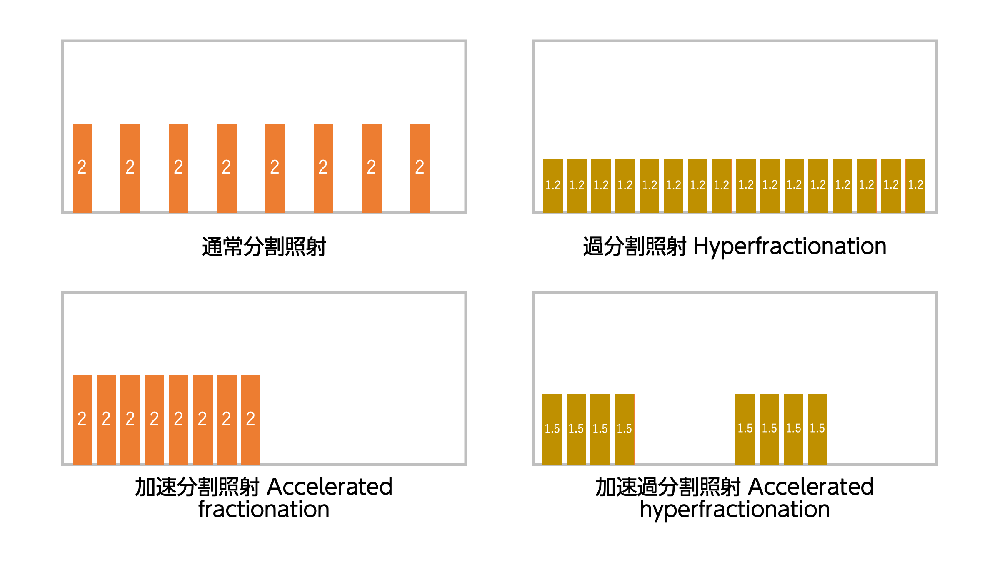

**こたえ**
- 2017-01: `1.5 Gy`
- 2014-08: `照射期間が短い。`

[2013-08](http://www.radiology.jp/content/files/2013_2s_exsam.pdf#page=3)
エックス線の放射線治療における分割照射のメリットとして**誤っている**のはどれか。1つ選べ。  
`治療可能比を上昇させる。`  
`腫瘍細胞の加速再増殖を抑える。`  
`腫瘍組織における再酸素化を促す。`  
`正常細胞の亜致死障害からの回復を促す。`  
`腫瘍組織における細胞周期の再分布を促す。` 

## LET,RBE,OER,線量率効果(§3-1-12,14,15,16,17,18)

◎[2013-02](http://www.radiology.jp/content/files/2013_2s_exsam.pdf#page=1)
高LET（線エネルギー付与）放射線はどれか。2つ選べ。  
`γ線`  `電子線`  `陽子線`  `中性子線`  `炭素イオン線`  

◎[2012-02](http://www.radiology.jp/content/files/2012_1s_exsam.pdf#page=1)
LETについて**誤っている**のはどれか。1つ選べ。  
`陽子線は低LET放射線である。`  
`高LET放射線では線量率効果は小さい。`  
`生物学的効果比(RBE)はLETに比例する。`  
`高LET放射線のDNA損傷は直接作用が主体である。`  
`高LET放射線では低LET放射線より酸素効果が小さい。`  

◎[2012-04](http://www.radiology.jp/content/files/2012_1s_exsam.pdf#page=2)
放射線生物学について**誤っている**のはどれか。1つ選べ。  
`細胞周期のうちS期にある細胞は放射線感受性が高い。`  
`LETとは飛跡上の一定距離当たりで付与するエネルギーのことである。`  
`高LET放射線は低LET放射線に比してDNAの二重鎖切断を起こしやすい。`  
`有酸素状態にある腫瘍細胞と比較して，低酸素状態にある腫瘍細胞はX線照射に対する感受性が低い。`  
`同等の生物学的効果を及ぼす線量がX線6Gy，炭素線2Gyであれば，炭素線の生物学的効果比
(RBE)は3である。`  

◎[2014-05](http://www.radiology.jp/content/files/1377.pdf#page=3)
エックス線と比較した場合に高LET放射線の特徴で正しいのはどれか。2つ選べ。  
`酸素効果が大きい。`  
`生存曲線の肩が大きい。`  
`直接作用が主体である。`  
`細胞周期依存性が低い。`  
`組織内で散乱しながら進行する。` 

◎[2016-06](http://www.radiology.jp/content/files/20160825.pdf#page=2)
治療に用いられている高LET放射線の特徴をX線と比較した記述で正しいのはどれか。1つ選べ。  
`酸素効果が小さい。`  
`間接作用の比率が高い。`  
`生存曲線に大きな肩ができる。`  
`組織内で散乱しながら進行する。`  
`分割照射における修復は同程度である。`  

◎[2019-03](http://www.radiology.jp/content/files/20190904_02.pdf#page=2)
治療に使われている重粒子線をX線と比較した場合に正しいのはどれか。2つ選べ。  
`酸素効果比（OER）が大きい。`  
`細胞周期の影響を受けやすい。`  
`組織間で感受性の差が小さい。`  
`線エネルギー付与（LET）が低い。`  
`生物学的効果比（RBE）が大きい。` 

◎[2015-06](http://www.radiology.jp/content/files/20150821.pdf#page=3)
治療に使われている放射線で生物学的効果比（RBE）が最も大きいのはどれか。1つ選べ。  
`炭素線` `電子線` `陽子線` `ガンマ線` `エックス線` 

◎[2012-05](http://www.radiology.jp/content/files/2012_1s_exsam.pdf#page=2)
酸素効果について正しいのはどれか。1つ選べ。  
`高LET放射線ではOERは2～3程度である。`  
`OERは酸素分圧が高くなればなるほど高くなる。`  
`放射線照射後に酸素濃度を高めるとOERが高くなる。`  
`照射時の組織の酸素分圧によって効果の大きさが決まる。`  
`高LET放射線では低LET放射線にくらべ酸素効果が大きい。`  

【線エネルギー付与(LET: Linear Energy Transfer)】

荷電粒子が物質中を通過する際の単位飛程あたりのエネルギー損失を表し, keV/μmで表す.  
基本的には重いほど大きい. なお, 電荷をもたない放射線であっても, 中性子線を高LET放射線に, X線やγ線などのを低LET放射線に慣習的に含める.  

- **核分裂生成物 > 低原子番号の原子核 > α線 > 中性子線 (ここまで高LET) > (ここから低LET) 陽子線, 電子線, X線, γ線**
- 実は中性子のほうが陽子の1.008倍重い.

【線量率効果】

低LET放射線は, 総線量が同じでも分割回数を増やすほどに生物学的効果が小さくなる.  
これは, ぎりぎり細胞死を免れるような程度のDNA損傷が次の照射までの間に回復されてしまうことにより説明できる.

【生物学的効果(RBE: Relative Biological Effectiveness)】

たとえ吸収線量の総量が同一であっても, それがもたらす生物学的効果はLET, 線量, 治療期間, 線量率, 分割回数などによりさまざまである.  
しかし, 異なる放射線照射どうしを基準放射線との比をとることによって相対的に比較することは可能であり, その比をRBEとよぶ.  
基準放射線には通常はX線が用いられる.  
**RBEは「基準放射線量÷対象の放射線量」によって計算する**. つまり, 1/3の線量で済んでしまう場合は生物学的効果は3倍となる.

なお, RBEはLETが大きいほど大きい傾向にあるが, 完全に比例するわけではなく, 下図のように**LETが大き過ぎるとRBEはむしろ低下する**.  
これは, 粒子線治療の際に無限に大きな核子を使うのではなく炭素線が使われている説明にもなろう.

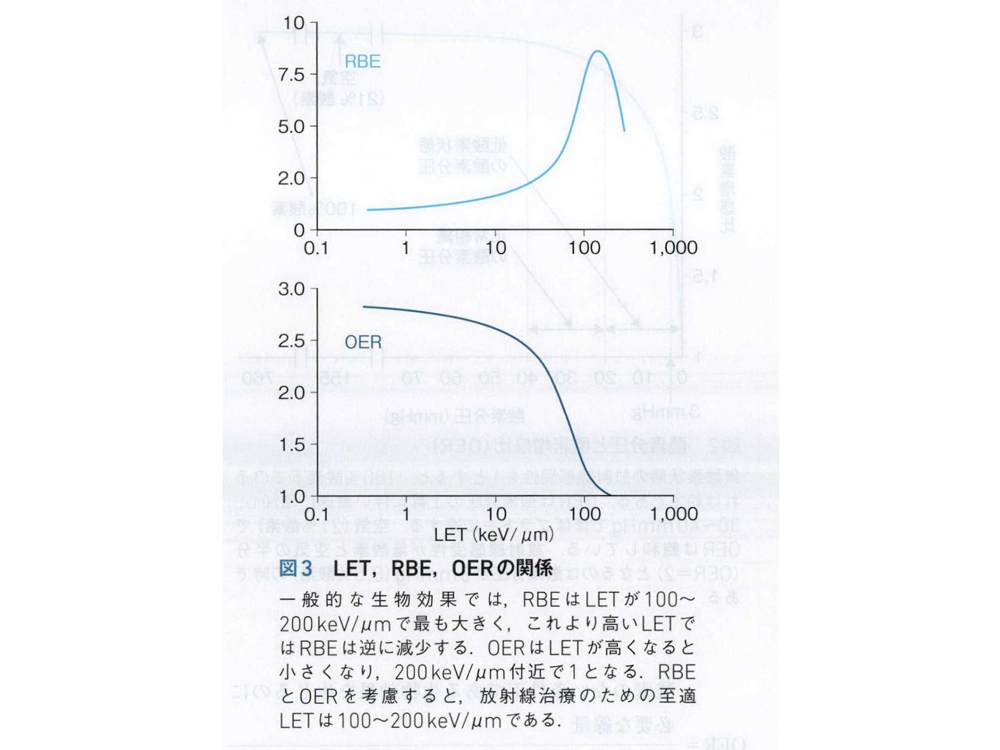

【酸素効果と酸素効果比(OER: Oxygen Enhancement Ratio)】

酸素の存在下では放射線の生物学的効果が大きくなる. これを酸素効果とよぶ.  
**OERは「酸素なしの場合の線量÷酸素ありの場合の線量」によって計算する**. つまり, 酸素があれば酸素がない場合の1/3の線量で済んでしまう場合, 酸素効果比は3倍となる.  
酸素効果は放射線の間接作用が増加することによるものなので, 直接作用が中心となる高LET放射線については酸素効果は小さい.

なお, 組織酸素分圧に応じてOERは下図のように変化する. 正常組織の酸素分圧は20〜40mmHgで, この時点ですでにOERは約3でプラトーに達している.  
したがって,OERを高めるためにさらに酸素分圧を上げようとする試みにはおそらく意味はない.

また, OERはあくまで照射時の酸素分圧に依存するため, **照射後に酸素分圧を上げることに意味はない**.

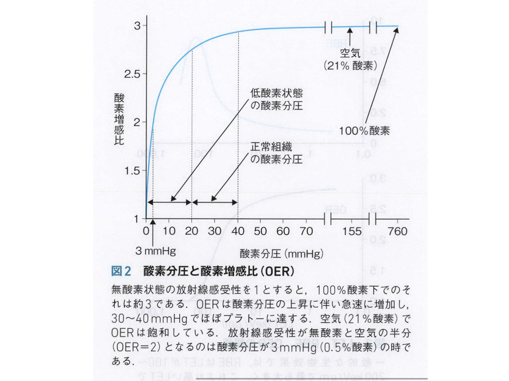

**こたえ**
- 2013-02: `炭素イオン線`, `中性子線`
- 2012-02: `生物学的効果比(RBE)はLETに比例する。`が誤り
- 2012-04: `細胞周期のうちS期にある細胞は放射線感受性が高い。` が誤り
- 2014-05: `直接作用が主体である。`, `細胞周期依存性が低い。`
- 2016-06: `酸素効果が小さい。`
- 2019-03: `組織間で感受性の差が小さい。`, `生物学的効果比（RBE）が大きい。` 
- 2015-06: `炭素線`
- 2012-05: `照射時の組織の酸素分圧によって効果の大きさが決まる。` 

## 放射線物理学
### 放射線の種類(§4-1-2)
◎[2018-05](http://www.radiology.jp/content/files/20180926_2.pdf#page=3)
非荷電放射線はどれか。2つ選べ。  
`α線` `β線` `γ線` `陽子線` `中性子線` 

◎[2013-01](http://www.radiology.jp/content/files/2013_2s_exsam.pdf#page=1)
荷電粒子線はどれか。2つ選べ。  
`α線` `β線` `γ線` `X線` `中性子線`  

◎[2012-06](http://www.radiology.jp/content/files/2012_1s_exsam.pdf#page=2)
電離放射線について**誤っている**のはどれか。1つ選べ。  
`粒子線と電磁波がある。`  
`電子線は電磁波である。`  
`粒子線は波動性と粒子性を持つ。`  
`荷電粒子は直接電離放射線である。`  
`ガンマ線は可視光線に比べて波長が短い。` 

【放射線の種類】

- 放射線 radiation: 放射状に広がる電磁波および粒子全般を指す.
    - 電離放射線 ionizing radiation: 物質をイオン化させる作用をもつ放射線.
        - 直接電離放射線(荷電放射線): それ自体が電荷をもつもの. 標的物質にある軌道電子とのあいだのクーロン力によって電離させる.
            - 電子線, 陽子線, 炭素線など.
        - 間接電離放射線(非荷電放射線): それ自体は電荷をもたないが, 荷電粒子を二次的に放出させることができ, その二次電子を通じてエネルギーを付与する.
            - X線, γ線, 中性子線.
        - 粒子放射線: それ自体が質量をもつ放射線.
            - 中性子線, 電子線, 陽子線, 炭素線など.
        - 電磁放射線: それ自体が質量をもたない放射線.
            - X線, γ線.
    - 非電離放射線 non ionizing radiation: 電離作用をもたない放射線.
        - 例: 可視光, 赤外線, マイクロ波, 電波など.

【X線とγ線の違い】

- X線とγ線はその発生起源によって呼び分ける.
    - X線: 電子が関与して発生した光子線.
    - γ線: 原子核崩壊によって発生した光子線.
    

**こたえ**
- 2018-05: `γ線`, `中性子線` 
- 2013-01: `α線`, `β線` 
- 2012-06: `電子線は電磁波である。` 

### 光子と物質の相互作用(§4-1-3)
◎[2014-04](http://www.radiology.jp/content/files/1377.pdf#page=2)
図はエックス線のエネルギーによる相互作用の確率を示している。A，B，C はそれぞれどの反応を示しているか。適切な組み合わせを1つ選べ。  
`光電効果 - 電子対生成 - コンプトン効果`  
`光電効果 - コンプトン効果 - 電子対生成`  
`電子対生成 - 光電効果 - コンプトン効果`  
`電子対生成 - コンプトン効果 - 光電効果`  
`コンプトン効果 - 光電効果 - 電子対生成`  

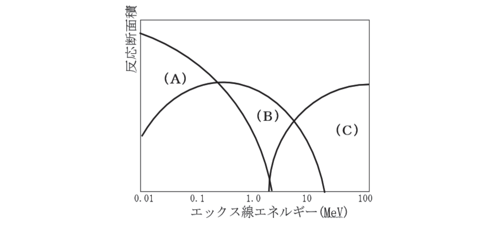

◎[2017-08](http://www.radiology.jp/content/files/20170904_2.pdf#page=4)
コンプトン効果の模式図を示す。A, BおよびCの組み合わせとして正しいのはどれか。1つ選べ。  
`入射光子, 散乱電子, 反跳光子`  
`入射光子, 反跳電子, 散乱光子`  
`入射電子, 散乱光子, 反跳電子`  
`入射電子, 反跳光子, 散乱電子`  
`入射光子, 散乱電子, 反跳光子`  

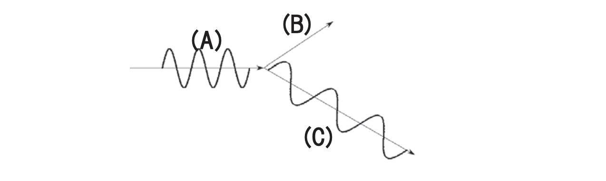

【光子と物質の相互作用】

光子のもつエネルギーの大きさによって物質とのあいだに生じる相互作用は異なる.

- 光電効果
    - 入射光子のもつエネルギーがやや小さいときに起こる (<0.1MeV).
    - 入射光子は自身のエネルギーをすべて軌道電子に与え, **入射光子自身は消失**する.
    - エネルギーを与えられた軌道電子は電子殻外に飛び出していく. 空位になった軌道には外殻から電子が移動してくる. その際, エネルギー準位の差分のエネルギーをもった**特性X線**が発生する.
- コンプトン効果
    - 入射光子のもつエネルギーがやや大きいときに起こる (主に0.1-10MeV).
        - ここから分かるように, 放射線治療に使用される光子エネルギー帯では, 光子の起こす相互作用のほぼすべてがコンプトン効果からなる.
    - 入射光子は軌道電子と衝突して電子殻外に放出させる(**反跳電子**).
    - 光子のもつエネルギーは減ってはいるがまだ残っており, 進行方向を変えて先に進む(**散乱光子**).
    - 反跳電子と散乱光子の速度は, エネルギー保存則と運動量保存則により決定される.
- 電子対生成
    - 入射光子のもつエネルギーがかなり大きいときに起こる (主に1MeV以上).
    - 入射光子が原子核近傍を通過する際, 原子核のクーロン場との相互作用によって一対の電子と陽電子が生成され, 入射光子自身は消滅する.
    
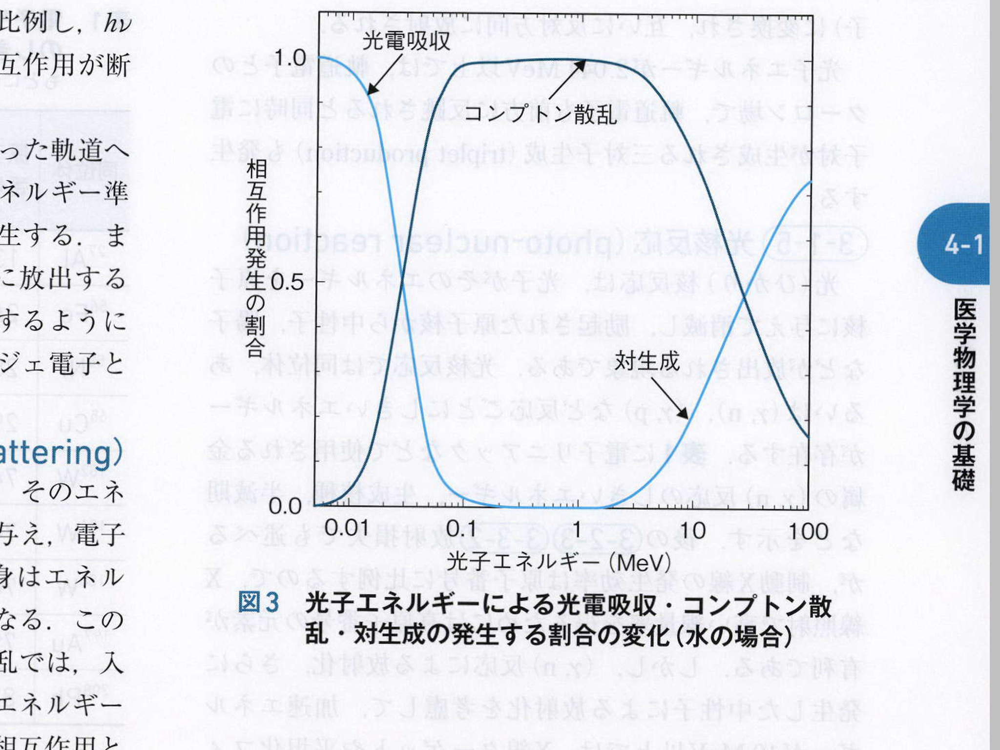

**こたえ**
- 2014-04: `光電効果 - コンプトン効果 - 電子対生成` 
- 2017-08: `入射光子, 反跳電子, 散乱光子` 

### 放射線の深部特徴(§4-3,4,8)
◎[2016-86](http://www.radiology.jp/content/files/20160825.pdf#page=31)
10MV X線の深部線量百分率曲線はどれか。1つ選べ。 `ア`  `イ` `ウ` `エ` `オ`
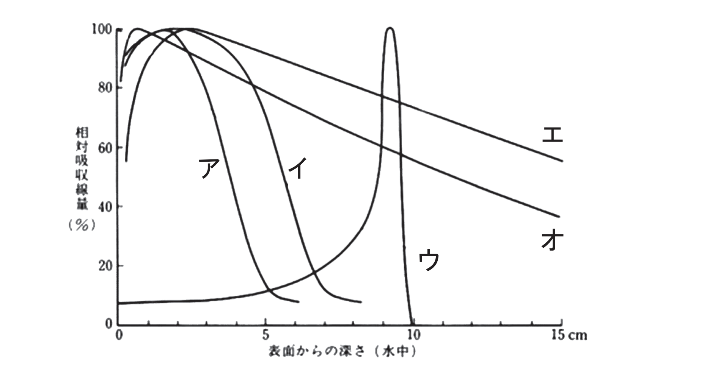

◎[2015-03](http://www.radiology.jp/content/files/20150821.pdf#page=2)
Braggピークを有する放射線はどれか。2つ選べ。  
`陽子線` `ベータ線` `アルファ線` `高エネルギーX線` `高エネルギー電子線`  

【光子線(X線, γ線)の深部特徴】

- 光子線には**ビルドアップ領域**が存在する.
    - 光子線が人体に与えるエネルギーは深さとともにしだいに減衰する.
    - しかし, 光子線が人体に与えるエネルギーのピークは深さゼロの地点とは限らない.
    - これは, X線によって発生した電子(一次電子)がさらに別の電離を引き起こし(二次電子), 雪崩のように電子が増え, ある一定の深さにおいて上限に達することによる.
- ビルドアップ領域は**X線のエネルギーを高めるほど深く, 照射野を広げるほど浅くなる**.
    - 照射野を広げるほど浅くなるのは二次電子の数が増えることによって深さあたりのエネルギーの消費が増すため.

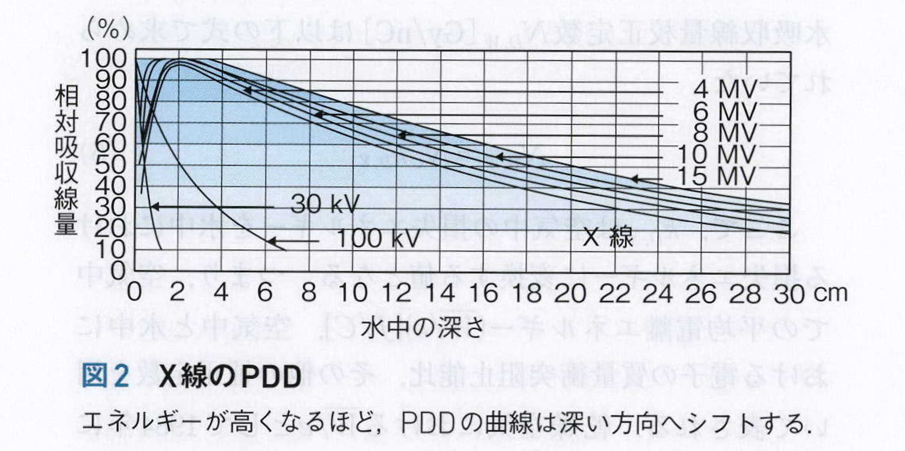

【電子線の深部特徴】

- 電子線にも**ビルドアップ領域**が存在する.
- PDD (深部線量百分率曲線) は光子線ではへの字型を描くのに対して, 電子線では鞍型になる.

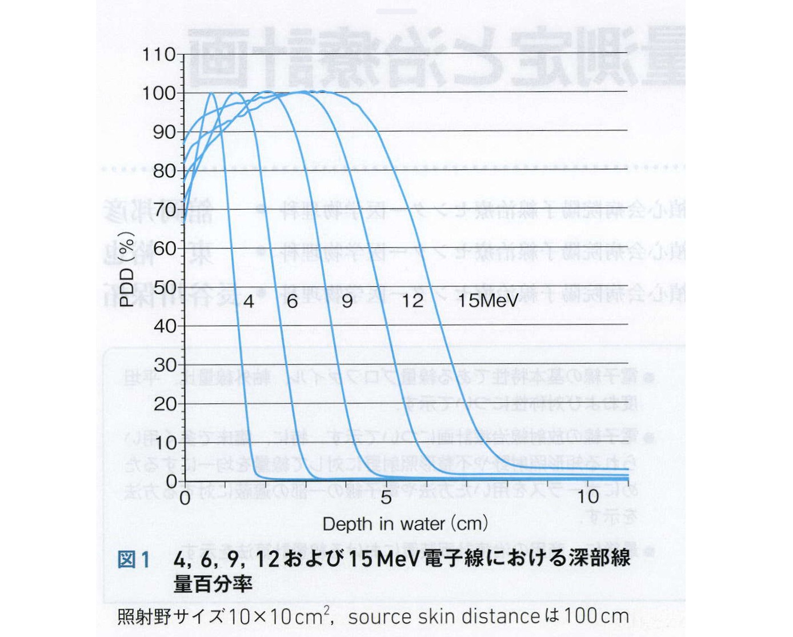

【陽子線の深部特徴】

- 陽子線は物質中で停止する寸前に高いエネルギーを付与する物理特性をもっている. このような深部線量分布を**ブラッグピーク**とよぶ.
- α線, 炭素線など, 陽子をふくむ他の粒子放射線もブラッグピークを有している.
- したがって, ブラッグピークの位置が腫瘍の位置に合うように陽子線や炭素線の運動エネルギーを調節すると, 標的病変に集中した治療が可能となる.
    - 例えば患者体内で30cm深にある腫瘍に陽子線を照射するときは220MeVほどの運動エネルギーを持たせるとよい.

**こたえ**
- 2016-86: `エ`
- 2015-03: `陽子線`, `アルファ線`
- 2015-13: 

### 放射線発生装置(§4-2)
[2014-01](http://www.radiology.jp/content/files/1377.pdf#page=1)
図はエックス線発生装置を示している。エックス線発生過程の説明文の括弧に入る用語の組み合わせとして正しいのはどれか。1つ選べ。  
1．フィラメントから（A）が放出される。  
2．（A）が高電圧により加速され（B）に衝突する。  
3．エックス線が発生する。  

`熱電子 - カソード`  
`熱電子 - ターゲット`  
`陽電子 - 陽極`  
`自由電子 - アノード`  
`自由電子 - 陰極`  

## 治療計画

### 治療計画の手順 (§)
◎[2016-89](http://www.radiology.jp/content/files/20160825.pdf#page=32)
3次元放射線治療計画の実施項目を示す。3番目に行うのはどれか。1つ選べ。  
`線量計算` `DVHの確認` `治療計画用CT撮影` `標的，正常組織の輪郭入力` `X線エネルギーと照射ビームの設定`  

**こたえ**
- 2016-89: `X線エネルギーと照射ビームの設定`

### 治療体積 (§6-1)
◎[2016-87](http://www.radiology.jp/content/files/20160825.pdf#page=32)
すべての位置誤差が含まれるのはどれか。2つ選べ。  
`Treated volume（TV）` `Gross tumor volume（GTV）` `Internal target volume（ITV）` `Clinical target volume（CTV）` `Planning target volume（PTV）`  

◎[2015-86](http://www.radiology.jp/content/files/20150821.pdf#page=30)
理学所見でも決定しうるのはどれか。1つ選べ。  
`臨床標的体積（CTV）` `内的標的体積（ITV）` `計画標的体積（PTV）` `肉眼的腫瘍体積（GTV）` `計画的リスク臓器体積（PRV）`  

◎[2014-86](http://www.radiology.jp/content/files/1377.pdf#page=30)
放射線治療での標的体積の設定として正しいのはどれか。2つ選べ。  
`触診上の腫瘍範囲を肉眼的腫瘍体積（GTV）に設定した。`  
`PET/CTの腫瘍集積範囲を臨床標的体積（CTV）に設定した。`  
`術後予防照射では臨床標的体積（CTV）から照射野を設定した。`  
`腫瘍臓器の蠕動による移動範囲を臨床標的体積（CTV）に含めた。`  
`腫瘍の呼吸性移動範囲を計画標的体積（PTV）の外側に追加した。`  

◎[2012-86](http://www.radiology.jp/content/files/2012_1s_exsam.pdf#page=29)
放射線治療計画で定義される体積のうち最も大きいのはどれか。1つ選べ。  
`治療体積（TV）` `臨床標的体積（CTV）` `内的標的体積（ITV）` `計画標的体積（PTV）` `肉眼的腫瘍体積（GTV）`  

【インターナルマージンとセットアップマージン】

- インターナルマージン
    - 生理的な動きや変化を考慮したマージン.
    - 心拍動, 呼吸性変動, 膀胱容量の変化, 直腸ガスの変化, 嚥下による動きなど.
    - CTV + インターナルマージン = ITV.
- セットアップマージン
    - 外部の座標系のずれを考慮したマージン.
    - 患者位置の変化, 装置の機械的な不確実性, 線量測定の不確実性, CTやシミュレーターから治療装置へ移行する際のセットアップエラー, 人的エラーなど.
    - ITV + セットアップマージン = PTV.
    
【計画標的体積(PTV), 治療体積(TV), 原体指数(Conformity Index (CI))】
- TVはPTVに一致するとは限らない.
- Reference pointに対する**処方線量の95%以上が実際に当たった範囲**の体積をTVと定義する.
- つまり, やや低い線量が当たっている領域もTVには含まれるため, 一般的に**TVはPTVより大きい**.
- CIとは, PTVがすべて治療体積に含まれていた場合に, PTVの体積に対する治療体積の比率 (=必ず値は1以下になる. 治療体積に無駄が少ないほど値が大きい).

**こたえ**
- 2016-87: `Treated volume（TV）`, `Planning target volume（PTV）`  
- 2015-86: `肉眼的腫瘍体積（GTV）`
- 2014-86: `触診上の腫瘍範囲を肉眼的腫瘍体積（GTV）に設定した。`, `術後予防照射では臨床標的体積（CTV）から照射野を設定した。`
- 2012-86: `治療体積（TV）`

###  ビームの入れ方 (§)
[2014-95](http://www.radiology.jp/content/files/1377.pdf#page=33)
上顎洞癌の前方・側方からの4MV X線直交2門照射の線量分布を示す。
線量分布を是正する方法として有用なのはどれか。1つ選べ。

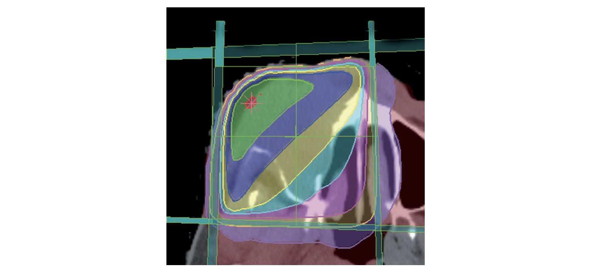

a 10 MV X 線の使用
b 線量評価点の変更
c ビーム間ウェイトの調整
d ウェッジフィルターの使用
e 5～10 mm の皮膚ボーラスの使用

## 照射法
### 体幹部定位放射線治療(SBRT)(§6-7,8,9)
◎[2016-90](http://www.radiology.jp/content/files/20160825.pdf#page=33)
定位放射線照射の適応となるのはどれか。2つ選べ。  
`乳癌` `膵癌` `肝細胞癌` `子宮頸癌` `聴神経腫瘍`  

◎[2014-91](http://www.radiology.jp/content/files/1377.pdf#page=31)
原発巣に対して体幹部定位放射線治療が適応となるのはどれか。2つ選べ。  
`乳癌` `声門癌` `直腸癌` `肝細胞癌` `非小細胞肺癌`  

◎[2013-89](http://www.radiology.jp/content/files/2013_2s_exsam.pdf#page=30)
定位放射線照射の適応に**最もなりにくい**のはどれか。1つ選べ。  
`膠芽腫` `肝細胞癌` `転移性肺癌` `転移性脳腫瘍` `非小細胞肺癌`  

【体幹部定位放射線療法 (SBRT: Stereotactic Body Radiation Therapy)】

- 多門照射によって線量集中性を高めることにより, 1回線量を増大させる照射法.
- なお, 保険適応となるためには, 照射中心の固定精度が**体幹部では5mm以内, 頭部では2mm以内**である必要がある.
- SBRTの主な適応は以下のとおり:
    - 原発性の**非小細胞肺癌(NSCLC)**で, 直径5cm以内かつ転移がない
        - 小細胞肺癌(SCLC)は広汎に進展しており, 照射野を広くとる必要があるため, 適応とならない
    - 転移性肺癌で, 直径5cm以内かつ3個以内かつ他病巣がない
    - 肝細胞癌で, 直径5cm以内かつ転移がない
    - 大腸癌肝転移で, 3個以内かつ他病巣がない
    - 脊椎転移
    - 聴神経腫瘍
    - 限局性前立腺癌
- SBRTについて報告はあるがエビデンスが十分でないもの:
    - 膵癌
    - 腎癌
    - 孤立性リンパ節転移, 副腎転移
    
 【定位手術的照射 (SRS: Stereotactic Radiation Surgery)】
 
 - 定位放射線療法で, 特に1回線量を極限まで増大させて1回のみの照射で治療を終える方法. 

**こたえ**
- 2016-90: `肝細胞癌`, `聴神経腫瘍`
- 2014-91: `肝細胞癌`, `非小細胞肺癌`  
- 2013-89: `膠芽腫`

### IMRT(§4-6)
◎[2019-89](http://www.radiology.jp/content/files/20190904_02.pdf#page=31)
強度変調放射線治療(IMRT)で必要な条件はどれか。1つ選べ。  
`前向き治療計画` `非同一平面の照射` `1mm以内の位置精度` `2方向以上の透視可装置` `線束強度を変化させた3種類以上のビーム`  

◎[2017-89](http://www.radiology.jp/content/files/20170904_2.pdf#page=32)
強度変調放射線治療(IMRT)として**誤っている**のはどれか。1つ選べ。  
`回転照射で行える。` `固定多門照射で行える。` `逆方向治療計画を用いる。` `線量処方はアイソセンターで行う。` `症例毎に物理的検証が必要である。`  

【強度変調放射線治療 (IMRT: Intensity-Modulated Radiation Therapy)】

- IMRTの歴史
    - 日本では2006年に先進医療として承認され, 2010年に限局性固形悪性腫瘍に対し保険適用となった.    
    - なお, 日本では保険適応とするためには**強度変調した3門以上の照射**を行うことが必要.
    - 位置精度はIMRTの保険適応の条件には含まれていない(SBRTの保険適応の条件には含まれる).
- IMRTの特徴
    - 逆方向治療計画 inverse planning を行う照射法 (=実現したい三次元線量分布から, 照射する線束を逆算する).
    - 空間的・時間的に強度変調をほどこした線束を利用する.
    - IMRTの処方線量は, アイソセンターの線量ではなくD95の線量とする(つまりPTVの容積の95%を包含する線量).
- IMRTの種類
    - SMLC-IMRT: マルチリーフコリメータを静止させたまま照射し, 次に照射をOFFにして変形する, を繰り返す
    - DMLC-IMRT: 照射をつねにONにしたままマルチリーフコリメータを連続的に動かす
    - VMAT(強度変調回転放射線治療: Volumetric-Modulated Arc Therapy): DMLC-IMRTをさらにガントリを回転させながら行う.
- IMRTの線量検証
    - 治療開始前にかならず線量検証を行う. つまりIMRT治療計画の計算線量と測定線量が許容範囲内で一致することを確認する.
    - 線量検証には評価点線量検証と線量分布検証の2種類ある.
   
**こたえ**
- 2019-89: `線束強度を変化させた3種類以上のビーム`
- 2017-89: `線量処方はアイソセンターで行う。`

### IGRT(§4-11)
[2018-86](http://www.radiology.jp/content/files/20180926_2.pdf#page=31)
画像誘導放射線治療(IGRT)で正しいのはどれか。1つ選べ。  
`週1回施行する。`  
`CTV縮小が可能となる。`  
`呼吸性移動臓器に適用できない。`  
`X線を用いた治療時取得画像が必要である。`  
`治療時取得画像と治療計画時画像の照合中心の誤差を5mm以内とする。`  

 

【画像誘導放射線治療 (IGRT: Image-Guided Radiation Therapy)】
 
- 毎回の照射前に患者位置照合画像を取得し, 治療計画で決定した照射中心を照射時に可能なかぎり再現するための照合技術.
- IGRTが保険適応となるためには, 治療計画時と照射時の3次元的な空間再現性が**5mm以内**であることが必要.

**こたえ**
- 2018-86: `治療時取得画像と治療計画時画像の照合中心の誤差を5mm以内とする。`

### 密封小線源治療, RI内用療法

◎[2014-92](http://www.radiology.jp/content/files/1377.pdf#page=32)
密封小線源治療の永久挿入療法に用いられるのはどれか。2つ選べ。  
`Sr-89` `I-125` `Cs-137` `Ir-192` `Au-198`

◎[2013-92](http://www.radiology.jp/content/files/2013_2s_exsam.pdf#page=31)
疾患とその治療に用いる線源の組み合わせで正しいのはどれか。2つ選べ。  
`舌 癌 ―――――― Sr-89`  
`甲状腺癌 ―――― I-123`  
`前立腺癌 ―――― I-125`  
`骨転移 ――――― Cs-137`  
`子宮頸癌 ―――― Ir-192`  

◎[2012-85](http://www.radiology.jp/content/files/2012_1s_exsam.pdf#page=29)
RI 内用療法に用いられる放射性核種はどれか。2つ選べ。  
`Co-60` `Sr-89` `Y-90` `In-111` `I-123`

◎[2019-88](http://www.radiology.jp/content/files/20190904_02.pdf#page=31)
低線量率照射はどれか。1つ選べ。  
`Co-60 腔内照射` `I-125 組織内照射` `定位放射線治療` `ホウ素中性子捕捉療法` `強度変調放射線治療（IMRT）`  

【密封小線源治療】

- 線量率による分類とその核種
    - 低線量率(LDR): 0.4〜2Gy/hr
        - 永久刺入: 前立腺癌にI-125, 口腔癌にAu-198
        - モールド治療: 歯肉癌にAu-198 (線源を埋め込んだ義歯状の治療器具を使用)
    - 高線量率(HDR): 12Gy/hr以上
        - 一時刺入: 子宮頸癌,前立腺癌,舌癌にIr-192
- RI内用療法
    - I-131内服: 分化型甲状腺癌, Basedow病
    - Sr-89静注: 骨転移
    - Ra-223静注: 骨転移 (**唯一α線を放出する核種**. ほかはすべてβ線を放出)
    - Y-90静注: 悪性リンパ腫
- 核種の選択の考え方
    - 現在では半減期が日単位のものしか基本的に用いない.

**こたえ**
- 2014-92: `I-125`, `Au-198`
- 2013-92: `前立腺癌 ―――― 125I`, `子宮頸癌 ―――― 192Ir`
- 2012-85: `Sr-89`, `Y-90`
- 2019-88: `I-125 組織内照射`

## 腫瘍学
### 癌とウイルス
◎[2013-86](http://www.radiology.jp/content/files/2013_2s_exsam.pdf#page=29)
HPV (Human Papillomavirus) がその発症と関連する腫瘍はどれか。2つ選べ。  
`上咽頭癌` `中咽頭癌` `肝細胞癌` `子宮頸癌` `Burkittリンパ腫`

◎[2016-92](http://www.radiology.jp/content/files/20160825.pdf#page=33)
悪性腫瘍とウイルスとの組み合わせとして**関連が乏しい**のはどれか。1つ選べ。  
`肝細胞癌 - HCV（Hepatitis C virus）`  
`中咽頭癌 - EBV（Epstein-Barr virus）`  
`子宮頸癌 - HPV（Human Papilloma virus）`  
`胃 MALT リンパ腫 - Helicobacter pylori`  
`脳原発悪性リンパ腫 - HIV（Human Immunodeficiency virus）`  

【癌とウイルスとの関連】

- 上咽頭癌: 非角化型扁平上皮癌がもっとも高頻度で, そのほぼ100%がEBV関連. 次に多いのは角化型扁平上皮癌.
- 中咽頭癌: 日本では中咽頭癌の4割がHPV関連. HPV関連のほうがそうでないものより予後はよい.
- Burkittリンパ腫: EBVが発症に関与する.  
- 中枢神経系原発悪性リンパ腫(PCNSL): HIVによる免疫抑制患者に発症することが多い.  

**こたえ**
- 2013-86: `中咽頭癌`, `子宮頸癌` 
- 2016-92: `中咽頭癌 - EBV（Epstein-Barr virus）`

### ほか
[2019-87](http://www.radiology.jp/content/files/20190904_02.pdf#page=31)
UICC TNM分類第8版で正しいのはどれか。2つ選べ。  
`小児腫瘍は対象にならない。`  
`疾患ごと予後因子の記載がある。`  
`原発巣が評価不可能な場合 T0 に分類する。`  
`進展度の決定に迷った場合低い方を採用する。`  
`治療前の臨床病期は治療経過をもとに修正する。`  

【UICC TNM分類について】

**こたえ**
- 2019-87: `疾患ごと予後因子の記載がある。`, `進展度の決定に迷った場合低い方を採用する。`

# 放射線治療各論
## 乳癌
### 乳房温存術後照射 (§7-34,35) 
◎[2019-99](http://www.radiology.jp/content/files/20190904_02.pdf#page=35)
乳房温存療法の放射線治療で正しいのはどれか。2つ選べ。  
`照射野の皮膚発汗が低下する。`  
`非浸潤性乳管癌では省略してよい。`  
`全乳房接線照射で腋窩は含まれない。`  
`左側乳癌で虚血性心疾患は増加しない。`  
`非浸潤性乳管癌では生存率は向上しない。`  

◎[2018-95](http://www.radiology.jp/content/files/20180926_2.pdf#page=34)
乳房温存術後の放射線治療で**誤っている**のはどれか。1つ選べ。  
`全乳房照射を行う。`   
`4MVのX線を用いる。`  
`非浸潤性乳管癌には省略してよい。`  
`腋窩リンパ節転移例で所属リンパ節照射を行う。`  
`腫瘍床ブースト照射の併用で乳房内再発が減少する。`  

◎[2017-99](http://www.radiology.jp/content/files/20170904_2.pdf#page=35)
乳房温存照射として正しいのはどれか。2つ選べ。  
`GTVは腫瘍床である。`  
`非浸潤癌は適応である。`  
`寡分割照射法は用いない。`  
`乳癌死の絶対リスクが低下する。`  
`術前化学療法で病理学的CRとなった場合は必要ない。`  

◎[2016-99](http://www.radiology.jp/content/files/20160825.pdf#page=36)
乳房温存術後照射で正しいのはどれか。2つ選べ。  
`50Gy/25回/5週を用いる。`  
`非浸潤癌では適応外である。`  
`同側腋窩リンパ節をCTVに含める。`  
`線量分布の改善にfield in field法が有用である。`  
`手術単独と比較して生存率の向上には寄与しない。`  

◎[2014-98](http://www.radiology.jp/content/files/1377.pdf#page=34)
pN0乳癌乳房温存術後の放射線治療について正しいのはどれか。1つ選べ。  
`化学療法を同時併用する。`  
`非浸潤性乳管癌は照射の適応である。`  
`同側傍胸骨リンパ節領域にも照射する。`  
`同側鎖骨上窩リンパ節領域にも照射する。`  
`10MV以上の高エネルギーX線で照射する。` 

◎[2013-98](http://www.radiology.jp/content/files/2013_2s_exsam.pdf#page=33)
乳癌cT1cN0M0で乳房温存術を施行したところ，腋窩リンパ節転移を4個認めた。術後照射における臨床標的体積（CTV）として適切なのはどれか。1つ選べ。  
`乳房のみ`  
`乳房，同側腋窩リンパ節`  
`乳房，同側胸骨傍リンパ節`  
`乳房，同側鎖骨上窩リンパ節`  
`乳房，同側鎖骨上窩リンパ節，同側腋窩リンパ節`  

◎[2012-97](http://www.radiology.jp/content/files/2012_1s_exsam.pdf#page=33)
乳癌に対する乳房温存術後の放射線治療として正しいのはどれか。1つ選べ。  
`全乳房照射は予後の改善に寄与しない。`  
`傍胸骨リンパ節転移が疑われる場合には手術切除が原則である。`  
`術後病理検査で断端陰性の場合には術後腫瘍床への局所照射のみで良い。`  
`腋窩リンパ節転移が4個以上の場合には同側鎖骨上窩への照射が必要である。`  
`センチネルリンパ節生検で陽性の場合には腋窩郭清後に腋窩への照射が必要である。`  

    
【乳房放射線治療の実際(1): 非浸潤癌】

- 適応, 効果, 照射法
    - 基本的に**早期浸潤癌に準ずる**.
    - DCISに対して乳房温存術を行い, 断端陰性であった場合, **放射線治療が必要(推奨グレードA)**.
        - **乳房内局所再発を低下させる** ことが4つのRCTにおいて示された.
        - **死亡率の低下は確認されていない**.
        - 全乳房接線照射. 4〜6MV X線を用いる. 1回線量は1.8〜2Gy, 総線量は45〜50Gy.
    - DCISに対して乳房温存術を行い, 断端陽性であった場合, **放射線治療が必要(推奨グレードA)**.
        - **乳房内局所再発を低下させる**.
        - 全乳房接線照射 50Gy/25Fr を行ったあと, 電子線ブースト照射を 10Gy/5Fr 追加する.
        

【乳房放射線治療の実際(2): 早期浸潤癌に対する温存療法後】

- 手術について
    - リンパ節の扱い
        - DCISでは, センチネルリンパ節生検は不要.
        - 浸潤癌では, cN0症例ならばセンチネルリンパ節生検を行う.
            - 転移陰性なら郭清を省略できる.
            - 微小転移であっても郭清を省略できる.
            - マクロ転移の場合は, 術後放射線治療を行う場合は郭清を省略できる. 乳房切除単独の場合は郭清を行う.

- 所属リンパ節転移のない場合
    - 適応
        - 早期浸潤癌に対して乳房温存術を行った場合, リンパ節転移陰性なら, 原則的に**放射線治療が必要**.
        - 乳房内の肉眼的病巣を外科的に切除しても, 乳管内進展や乳房内多発による微小な遺残病巣は残っている.
        - したがって, 微小な遺残病巣の根絶のために放射線治療は必要.
        - 手術単独の場合, 2cmのフリーマージンをとって切除しても42%の症例で遺残病変が存在する.
    - 効果
        - 局所再発防止に対する寄与
            - 顕微鏡的な残存腫瘍のおよそ2/3が制御可能.
            - 残りの1/3は放射線抵抗性であり, 放射線療法を行っても局所再発を完全に予防することはできない.
            - つまり, 放射線治療によって, **局所再発の相対リスクは約1/3になり, 絶対リスクは(非照射の局所再発リスク)×2/3だけ減少する.**
            - よって, 放射線治療による絶対リスクの減少の大きさは, もともとの局所再発リスクに依存する.
            - 復習: 絶対リスク, 相対リスク, リスク比
                - 絶対リスク   : p(イベント発生|母集団) のこと.
                - 絶対リスク差 : p(イベント発生|母集団1) - p(イベント発生|母集団2) のこと.
                - 相対リスク   : p(イベント発生|母集団1) / p(イベント発生|母集団2) のこと.
        - 生存率に対する寄与
            - 局所再発例を4例減らすごとに**乳癌死を1例減らす**ことができる.
            - ただし, もともと局所再発リスクが10%以上なければ生存率向上に結びつかないとの意見もあり, あらゆる患者に生存率向上が期待できるとは限らない.

- 所属リンパ節転移がある場合
    - 適応
        - 腋窩リンパ節転移が4個以上ある場合, **同側鎖骨上窩リンパ節領域への照射が必要**.
        - ただし, 近年では腋窩リンパ節転移が1〜3個の場合でも同側鎖骨上窩リンパ節領域への照射が勧められる.
    - 効果
        - 局所制御率, 所属リンパ節制御率が改善する
    - 照射法
        - 傍胸骨リンパ節領域については, 画像的/病理学的に転移が確認されていない場合は照射の意義についてのエビデンスに乏しい.

【寡分割照射を行ってよい場合】
- 乳房温存術後では, 以下の3条件をみたせば42.56Gy/16Frへの寡分割に変更してよい.
    - 50歳以上
    - 全身化学療法を行っていない
    - pT1N0M0 もしくは pT2N0M0 (=病巣が5cm以下)

【まとめ】
- 乳房温存術後の放射線治療は, 非浸潤癌であっても浸潤癌であっても局所再発率を低下させる.
- 一方, **生存率向上は浸潤癌でしか確認されていない**.
- 腋窩リンパ節転移陽性の場合は, **同側鎖骨上窩リンパ節領域に対して照射を行う**.

**こたえ**
- 2019-99: `照射野の皮膚発汗が低下する。`, `非浸潤性乳管癌では生存率は向上しない。` 
- 2018-95: `非浸潤性乳管癌には省略してよい。` が誤り
- 2017-99: `非浸潤癌は適応である。`, `乳癌死の絶対リスクが低下する。`  
- 2016-99: `50Gy/25回/5週を用いる。`, `線量分布の改善にfield in field法が有用である。`
- 2014-98: `非浸潤性乳管癌は照射の適応である。`
- 2013-98: `乳房，同側鎖骨上窩リンパ節`
- 2012-97: `腋窩リンパ節転移が4個以上の場合には同側鎖骨上窩への照射が必要である。`

◎[2019-98](http://www.radiology.jp/content/files/20190904_02.pdf#page=34)
乳癌温存手術後に全乳房照射を考慮してよいのはどれか。1つ選べ。  
`活動性SLE` `活動性強皮症` `活動性関節リウマチ` `Li-Fraumeni症候群` `仰臥位で患側上肢挙上不能`  

◎[2016-98](http://www.radiology.jp/content/files/20160825.pdf#page=35)
乳房温存術後照射を**避けるべき**併存症はどれか。2つ選べ。  
`掌蹠角化症` `尋常性ざ瘡` `尋常性乾癬` `全身性強皮症` `色素性乾皮症`  

    
【温存乳房に対する放射線治療の禁忌】
- 妊娠中.
- 患側乳房に対して放射線治療の既往がある.
- 仰臥位で患側上肢を挙上できない.
- 膠原病のうち, 活動性の強皮症もしくはSLEを合併している.
    - 皮膚や軟部組織に対する有害事象が高度であるため.
- 放射線療法による二次癌のリスクが極めて高い疾患を合併している(色素性乾皮症, Li Fraumeni症候群など).

**こたえ**
- 2019-98: `活動性関節リウマチ`
- 2016-98: `全身性強皮症`, `色素性乾皮症`

### 乳房切除術後照射 (§7-36)

[2015-97](http://www.radiology.jp/content/files/20150821.pdf#page=34)
右乳癌乳房切除術後，浸潤性乳管癌 腫瘍径3cm，腋窩リンパ節転移4個陽性であった。術後照射範囲として正しいのはどれか。1つ選べ。  
`右胸壁`  
`右腋窩リンパ節領域`  
`右胸壁，右鎖骨上リンパ節領域`  
`右鎖骨上リンパ節領域，右内胸リンパ節領域`  
`右胸壁，右鎖骨上リンパ節領域，右内胸リンパ節領域`  

## 肺癌
### ステージング (§7-26)
◎[2019-97](http://www.radiology.jp/content/files/20190904_02.pdf#page=34)
原発性肺癌IIIA期はどれか（ただし記載ない部位の進展はないものとする）。2つ選べ。  
`原発と同側別肺葉内の副腫瘍結節`  
`胸膜結節かつ同側肺門リンパ節転移`  
`心膜浸潤かつ同側縦隔リンパ節転移`  
`充実成分径1cmかつ同側鎖骨上窩リンパ節転移`  
`肺門まで連続する無気肺かつ気管分岐下リンパ節転移`  

【肺癌のStaging】

- **非小細胞肺癌と小細胞肺癌では同一のTNM分類を用いる(違いはない)**.

- 充実成分径によるT因子
    - Tis: 上皮内癌
    - T1: 3cm以下 (T1a: 1cm以下, T1b: 1cmを超え2cm以下, T1c: 2cmを超え3cm以下)
    - T2a: 3cmを超え4cm以下 (ただし後述する条件を満たす場合は大きさを問わない)
    - T2b: 4cmを超え5cm以下 (ただし後述する条件を満たす場合は大きさを問わない)
    - T3: 5cmを超え7cm以下 (ただし後述する条件を満たす場合は大きさを問わない)
    - T4: 7cmを超える (ただし後述する条件を満たす場合は大きさを問わない)
- 進展範囲によるT因子
    - 末梢側への進展
        - T1: 胸膜浸潤なし
        - T2: 臓側胸膜まで浸潤あれば大きさによらずT2
        - T3: 壁側胸膜または胸壁まで浸潤あれば大きさによらずT3
    - 中枢側への進展
        - T1: 主気管支に及んでいない
        - T2: 主気管支に及ぶが気管分岐部には及んでいなければ大きさによらずT2
        - T4: 気管分岐部に及んでいれば大きさによらずT4
    - 副腫瘍結節
        - T3: 不連続な副腫瘍結節が同一肺葉内にあれば大きさによらずT3
        - T4: 不連続な副腫瘍結節が同側の異なる肺葉内にあれば大きさによらずT4
    - 他臓器浸潤
        - T3: 心膜, 横隔神経のいずれかに浸潤していれば大きさによらずT3
        - T4: 心臓大血管, 縦隔, 食道, 反回神経, 横隔膜, 椎体のいずれかに浸潤していれば大きさによらずT4
    - ほか
        - T2: 肺門まで連続する部分的もしくは一側全体の無気肺もしくは閉塞性肺炎があれば大きさによらずT2
- N因子
    - N1: 同側肺門リンパ節までの転移
    - N2: 同側縦隔リンパ節または気管分岐部リンパ節までの転移
    - N3: 他の領域リンパ節 (対側縦隔, 対側肺門, 左右いずれかの前斜角筋, 左右いずれかの鎖骨上窩) までの転移
- M因子
    - M1a: 対側肺内の副腫瘍結節, 胸膜結節, 悪性胸水, 悪性心嚢水
    - M1b: 肺以外に遠隔転移があり, 単発である (1臓器かつ病変が1個)
    - M1c: 肺以外に遠隔転移があり, 多発している (病変が複数ある)
- Staging
    - Stage IA: T1N0M0
    - Stage IB: T2aN0M0
    - Stage IIA: T2bN0M0
    - Stage IIB: T1-2N1M0 または T3N0M0
    - Stage IIIA: T1-2N2M0 または T3N1M0 または T4N0-1M0
    - Stage IIIB: T1-2N3M0 または T3N2M0 または T4N2M0
    - Stage IIIC: T3-4N3M0
    - Stage IVA: M1a-b
    - Stage IVB: M1c

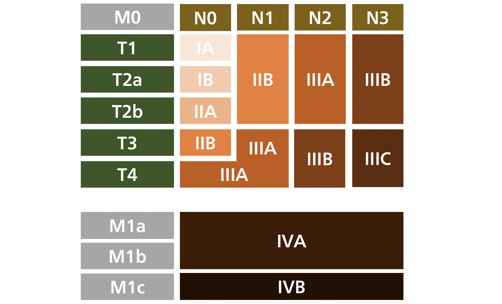

**こたえ**
- 2019-97: `原発と同側別肺葉内の副腫瘍結節`, `肺門まで連続する無気肺かつ気管分岐下リンパ節転移`

### 体幹部定位放射線照射 (§7-28)

◎[2018-104](http://www.radiology.jp/content/files/20180926_2.pdf#page=37)
原発性肺癌の定位放射線治療で正しいのはどれか。1つ選べ。  
`肺門リンパ節をCTVに含める。`  
`早期有害事象に肋骨骨折がある。`  
`腫瘍径3cm以内がよい適応である。`  
`腺癌では扁平上皮癌より線量増加する。`  
`肺門型には48Gy/4回/1～2週を用いる。`  

◎[2016-97](http://www.radiology.jp/content/files/20160825.pdf#page=35)
末梢型IA期非小細胞肺癌の定位放射線治療として**誤っている**のはどれか。1つ選べ。  
`放射線単独治療である。`  
`X線エネルギーは高いほどよい。`  
`線量分割に48Gy/4回を用いる。`  
`画像誘導放射線治療を併用する。`  
`重篤な合併症に致死的放射線肺炎がある。`  

◎[2012-94](http://www.radiology.jp/content/files/2012_1s_exsam.pdf#page=32)
肺癌の定位照射が原則適応に**ならない**部位はどこか。1つ選べ。  
`肺尖部`  `肺底部`  `肺門部`  `胸壁近接部`  `葉間胸膜部`  

- 定位放射線治療とは?
    - 多門照射にすることで線量集中性を高める照射法. これにより1回線量を増やすことができる.
    - 多門照射にするため照射時間が長くなる. また, 照射中心の固定精度をより高めることが要求される (三次元方向で5mm以内).

【原発性非小細胞肺癌(NSCLC)に対する体幹部定位放射線治療】

- 適応
    - 充実成分径5cm以内, かつ内科的理由などにより手術が困難な症例.
        - つまり stage 2A以下 (=T1-2bN0M0).
        - 原則的には末梢側肺癌が適応となる.
        - 肺門部型であっても適応となることはあるが, 大線量が食道, 気管, 血管などに照射される可能性が高い場合は照射適応にならないこともある.
- 体積
    - 原発巣をGTVかつCTVに設定し, 呼吸変動を考慮してPTVを設定する.
    - なお, **呼吸移動は上肺野よりも下肺野のほうが大きい**.
- 線量
    - 末梢型の場合: **48Gy/4Fr**, 45-54Gy/3Fr, 60Gy/5-8Frなど
    - 肺門型の場合は分割回数を多くする: **60Gy/8Fr** (JROSG10-1による線量決定試験における線量)など
    - 組織型によって線量を変えることは現在のところ行われていない.
- 有害事象
    - 放射線肺臓炎
        - もっとも頻度が高い.
        - 照射終了後2〜6ヶ月目に出現することが多い.
        - 大部分は画像上に変化が出たとしても無症状か, 軽度の咳嗽, 微熱にとどまり, 投薬不要
        - ただし, **背景に間質性肺疾患がある場合は致死的となるリスクが高い**ので注意.
    - ほか
        - 致死的な喀血, 致死的な食道潰瘍の報告がある.
    
【転移性肺癌に対する体幹部定位放射線治療】

- 適応
    - 直径5cm以内かつ3個以内であり, かつこれ以外に転移巣がない症例.

**こたえ**
- 2018-104: `腫瘍径3cm以内がよい適応である。`  
- 2016-97: `X線エネルギーは高いほどよい。`  
- 2012-94: `肺門部` 

### 非小細胞肺癌に対する根治照射 (§7-27)

◎[2018-105](http://www.radiology.jp/content/files/20180926_2.pdf#page=37)
右肺上葉扁平上皮癌T2N3M0に対して根治的化学放射線療法を計画した。正しいのはどれか。2つ選べ。  
`両側肺門をCTVに含める。`  
`肺V20を30%以内に設定する。`  
`74Gy/37回/7.5週まで治療を行う。`  
`下葉原発より体内標的体積が小さい。`  
`放射線単独治療より1回線量を減らす。`  

[2017-97](http://www.radiology.jp/content/files/20170904_2.pdf#page=34)
III期非小細胞肺癌の化学放射線療法として正しいのはどれか。2つ選べ。  
`肺野の腫瘤は定位照射の適応である。`  
`線量計算に不均質補正を必要としない。`  
`CRが得られれば予防的全脳照射を行う。`  
`60Gy/30回/6週が標準的線量分割である。`  
`腫瘍の呼吸性移動の把握に4D-CTを用いる。`  

◎[2016-96](http://www.radiology.jp/content/files/20160825.pdf#page=35)
IIIB期非小細胞肺癌の根治的化学放射線療法で照射野に**含めるべきでない**のはどれか。1つ選べ。  
`対側縦隔`  `対側肺門`  `気管分岐部`  `同側鎖骨上窩`  `対側鎖骨上窩`  

◎[2015-96](http://www.radiology.jp/content/files/20150821.pdf#page=33)
切除不能III期非小細胞肺癌に対する同時化学放射線療法の一般的な5年生存率はどれか。1つ選べ。  
`10％以下`  `15～25％`  `30～40％`  `45～55％`  `60％以上`  

◎[2014-97](http://www.radiology.jp/content/files/1377.pdf#page=34)
非小細胞肺癌に対する根治的放射線治療について正しいのはどれか。2つ選べ。  
`T3N1M0では縦隔リンパ節をCTVに含める。`  
`腺癌より扁平上皮癌の方が治療成績が良い。`  
`分子標的療法を併用すると治療成績が向上する。`  
`末梢型T1N0M0では肺門リンパ節をCTVに含める。`  
`同時併用化学放射線療法は順次併用療法よりも有害事象が多い。`  

◎[2012-95](http://www.radiology.jp/content/files/2012_1s_exsam.pdf#page=32)
非小細胞肺癌の放射線治療について正しいのはどれか。1つ選べ。  
`局所進行癌では化学療法を順次併用する。`  
`末梢型I期には強度変調放射線治療を行う。`  
`Pancoast腫瘍は根治照射の適応とならない。`  
`局所制御された場合は全脳予防照射の適応がある。`  
`対側肺門リンパ節転移のあるIIIb期は根治照射の適応とならない。`  

【原発性非小細胞肺癌(NSCLC)に対する根治照射】

- 適応のまとめ
    - 基本的には「stage4でない」「手術ができない」症例が根治照射の適応となる.
    - stage 1 (=T1N0M0, T2aN0M0)
        - 耐術能がなければ**RT単独**
            - 末梢型ならば, もしくは中枢側でも可能そうであれば定位放射線治療
    - stage 2A (=T2bN0M0)
        - 耐術能がなければ**RT単独**
            - 末梢型ならば, もしくは中枢側でも可能そうであれば定位放射線治療
    - stage 2B (=T3N0M0, T1-2N1M0)
        - 耐術能がない or 切除不能なら**RT単独もしくは化学放射線療法**
    - stage 3A, 3B, 3C (=T1-2N2-3M0, T3N1-3M0, T4N0-3M0)
        - 以下の3点をすべてみたす場合にのみ, **化学放射線療法もしくはRT単独**
            - 手術ができない.
            - 対側肺門リンパ節転移がない.
            - 同側の他の肺葉に肺内転移がない.
        - 基本的な考え方としては「腫瘍の存在範囲をすべて照射野内に含めることができ, かつ正常組織への影響を許容範囲内に収められる」.

【体幹部定位照射が適応とならない原発性非小細胞肺癌(NSCLC)に対する根治照射】

- 治療方針
    - 切除不能なstage3: 化学療法が可能であれば, **プラチナ製剤をふくむ化学療法と, できれば同時併用する (CCRT)**.
        - カルボプラチン+ドセタキセル(CP療法)との併用がスタンダード.
        - EGFR-TKIなどの分子標的薬はまだ臨床試験の段階なので避けたほうがよい.
        - 同時併用すると順次併用よりも生存期間は増すが, 急性有害事象の頻度も高くなる.
- 体積
    - GTV:
        - 肺癌原発巣 + CTにて短径1cm以上の腫大リンパ節
        - 短径1cm未満だがFDG-PET陽性の腫大リンパ節を含めるかどうかは総合的に判断する
    - CTV:
        - 原発巣について: GTV周囲の5〜10mm.
            - 注: 腺癌では潜在的な浸潤範囲が扁平上皮癌にくらべて広い.
        - 予防的リンパ節照射(ENI): 同側肺門, 気管分岐下リンパ節, 上縦隔リンパ節までを含める. **対側肺門リンパ節は含めてはならない!!**
            - 注: 扁平上皮癌の場合: **順次性にリンパ節転移する**ので所属リンパ節領域のみでよいことが多い.
            - 注: 腺癌の場合: **skipしたリンパ節転移がみられる場合がある**ので照射範囲は症例ごとに考慮する必要がある.
            - なお, 予防的リンパ節照射を省くかわりに線量を増やす病巣部照射野 (Involved Field (IF)) も検討されているが, まだ検討段階にすぎない.
    - PTV: CTV + 5〜10mm
    - 治療計画: 両側の正常肺 (つまりGTV以外の部分) において20Gy以上照射される体積 (V20) が**35%以下**となるように計画する.
- 線量
    - 線質: 6〜10MVのX線
    - 照射法: 3D-CRT (IMRTはエビデンスが集積していない)
    - 線量:
        - 化学放射線療法の場合, **60/30Fr〜66Gy/33Fr**. RT単独の場合, **少なくとも60Gy/30Fr, ただし74Gyまでは増やさないこと**.
        - 脊髄の耐容線量を考慮し, **40-44Gyに達した段階で照射野を小さくし**, 脊髄が照射野から外れるようにする.
        - 以前, 予防的リンパ節照射を省くかわりに線量を74Gy/37Frまでに増やす試験が行われたが, 有意に予後が悪かったため推奨されていない.
- 有害事象
    - 放射線肺臓炎: V20が重症度と相関する.
    - 心臓: 40Gy以上照射されると組織学的な変化が生じる. ただし, 心臓の1/3を超えない範囲であれば60Gy照射されても臨床的に問題となることは稀.
    - 放射線脊髄症: 脊髄の耐容線量は**50Gy/25Fr未満**.
- 効果
    - Stage3非小細胞肺癌に対して根治的CCRTを行った場合, **2年生存率は45〜60%, 5年生存率は15〜25%**.
    - なお, 腺癌と扁平上皮癌の違いによる生存率については, 少なくとも教科書には掲載されていない.

**こたえ**
- 2018-105: `肺V20を30%以内に設定する。`, `下葉原発より体内標的体積が小さい。`
- 2017-97: `60Gy/30回/6週が標準的線量分割である。`, `腫瘍の呼吸性移動の把握に4D-CTを用いる。` 
- 2016-96: `対側肺門`
- 2015-96: `15～25％`
- 2014-97: `T3N1M0では縦隔リンパ節をCTVに含める。`, `同時併用化学放射線療法は順次併用療法よりも有害事象が多い。`
- 2012-95: `対側肺門リンパ節転移のあるIIIb期は根治照射の適応とならない。`

### 小細胞肺癌に対する根治照射 (§7-30)

◎[2014-96](http://www.radiology.jp/content/files/1377.pdf#page=33)
限局型小細胞肺癌に対する放射線治療法として推奨されるのはどれか。1つ選べ。  
`寡分割照射`  
`導入化学療法`  
`体幹部定位放射線治療`  
`30Gy/10回/2週 の予防的全脳照射`  
`CDDP+VP-16療法との早期同時併用`  

◎[2013-97](http://www.radiology.jp/content/files/2013_2s_exsam.pdf#page=33)
小細胞肺癌の予防的全脳照射として推奨されるのはどれか。1つ選べ。  
`20Gy/5Fr/1週`  `25Gy/10Fr/2週`  `30Gy/10Fr/2週`  `37.5Gy/15Fr/3週`  `40Gy/20Fr/4週`  

【小細胞肺癌(SCLC)に対する根治照射】

- 限局型と進展型
    - 限局型(LD-SCLC): 病変が片肺, 縦隔リンパ節, 鎖骨上窩リンパ節に限局するもの.
        - SCLCの20〜30%を占める.
    - 進展型(ED-SCLC): 病変が上記よりも広範囲に進展しているもの.
        - SCLCの70〜80%を占める.

- 治療方針と適応のまとめ
    - LD-SCLC
        - Stage 1 (T1-2aN0M0): 手術+術後化学療法が標準治療であり, 放射線治療は行われない.
        - Stage 2以上: **化学放射線療法が標準治療**. 初回治療でCRまたはほぼCRが得られた場合は**予防的全脳照射(PCI)**を追加する.
            - **シスプラチン+エトポシドを同時併用する(CCRT)**.
    - ED-SCLC
        - 胸部放射線療法はあまり行われていない.
        - 予防的全脳照射(PCI)も, ED-SCLCに対しては無効であることが臨床試験によって証明されたため, 行わないことが推奨されている.

- 原発巣
    - 体積
        - GTV:
            - 肺癌原発巣 + CTにて短径1cm以上の腫大リンパ節
            - 短径1cm未満だがFDG-PET陽性の腫大リンパ節も**含める**
        - CTV:
            - 原発巣について: GTV周囲の5〜10mm (CTV initial).
                - 加速過分割照射の場合は30Gy, 通常分割照射の場合は40Gyを過ぎたあたりでGTV+0〜5mmに縮小させる(CTV boost).
                - 変更するのは脊髄を保護するため.
            - 予防的リンパ節照射(ENI): 同側肺門, 気管周囲〜気管気管支〜気管分岐下リンパ節までを含める. **対側肺門リンパ節は含めてはならない!!**
                - 上縦隔リンパ節, 鎖骨上窩リンパ節に転移があれば当該領域もふくめる.
        - PTV: CTV + 5〜10mm
        - 治療計画: 両側の正常肺 (つまりGTV以外の部分) において20Gy以上照射される体積 (V20) が**35%以下**となるように計画する.
    - 線量
        - 線質: 6〜10MV X線
        - 照射法: 前後対向二門で開始し, CTV boostに変える際に脊髄を避けて斜入照射にきりかえる.
        - 線量: 加速過分割照射を行う. つまり**1回1.5Gy照射を1日2回ずつ行い, 45Gy/30Fr/3週**とする.
            - ただし, 通常分割照射に変えて総線量を増やす(66Gy/33Fr)臨床試験も行われ, 今後選択肢となる可能性がある.
    - 有害事象
    - 効果

- 体積(PCI)
    - 体積
        - GTV: なし
        - CTV: 脳全体. C2椎体下縁までを含める.
    - 線量
        - 線質: 4〜6MV X線
        - 照射法: 左右対向2門
        - 線量: **25Gy/10Fr**

**こたえ**
- 2014-96: `CDDP+VP-16療法との早期同時併用`
- 2013-97: `25Gy/10Fr/2週`

### 肺癌放射線治療のまとめ

◎[2019-96](http://www.radiology.jp/content/files/20190904_02.pdf#page=34)
肺癌の病状と放射線治療法の組み合わせで**誤っている**のはどれか。1つ選べ。  
`I期非小細胞肺癌 : 体幹部定位放射線治療`  
`限局期小細胞肺癌 : 予防的全脳照射`  
`進展型小細胞肺癌 : 加速過分割照射`  
`III期非小細胞肺癌 : 不均質補正法`  
`単発(2cm)脳転移 : 定位放射線治療`  

◎[2015-95](http://www.radiology.jp/content/files/20150821.pdf#page=33)
肺癌放射線治療の線量分割として正しいのはどれか。2つ選べ。  
`小細胞癌予防的全脳照射 25Gy/10回/2週`  
`小細胞癌脳転移全脳照射 45Gy/15回/3週`  
`III期非小細胞癌根治照射 50.4Gy/28回/5.5週`  
`限局型小細胞癌根治照射 60Gy/40回/4週 (1日2回)`  
`I期非小細胞癌定位放射線照射 48Gy/4回/1週`  

【肺癌放射線治療まとめ】
- NSCLC Stage 1-2A 末梢型に対する体幹部定位照射: **48Gy/4Fr**
- NSCLC Stage 3に対する根治的CCRT: **60Gy/30Fr +カルボプラチン+ドセタキセル(CP療法)**
- LD-SCLC Stage 2以上に対する根治的CCRT: **45Gy/30Fr (加速過分割照射, 1回1.5Gyを1日2回)**
- LD-SCLC Stage 2以上に対するPCI: **25Gy/10Fr**
- 脳転移(3cm以下かつ4個以下): **定位照射+全脳照射 大きさにより 30Gy/3Fr 〜 40Gy/10Fr**
- 脳転移(3cmを超えるまたは5個以上): **全脳照射 30Gy/10Fr**

**こたえ**
- 2019-96: `進展型小細胞肺癌 : 加速過分割照射`
- 2015-95: `小細胞癌予防的全脳照射 25Gy/10回/2週`, `I期非小細胞癌定位放射線照射 48Gy/4回/1週`

## 食道癌
### 食道癌の疫学(§7-39)

◎[2015-98](http://www.radiology.jp/content/files/20150821.pdf#page=34)
食道癌について正しいのはどれか。2つ選べ。  
`頭頸部癌との重複が多い。`  
`好発部位は胸部下部食道である。`  
`本邦では腺癌が60%以上を占める。`  
`主気管支浸潤は左主気管支に多い。`  
`リンパ節転移の頻度は深達度粘膜固有層で 10～15％である。`  

【食道癌の疫学】

- 好発部位
    - **胸部中部食道**にもっとも多い(51.6%).
    - つづいて胸部下部食道(24.2%) > 胸部上部食道(13.4%) > 腹部食道(4.5%) > 頸部食道(4.0%) の順.
- 組織型
    - 扁平上皮癌が93%を占める.
- 組織学的深達度
    - 粘膜(m) < 粘膜下層(sm) < 筋層(pm) < 外膜(a) の4段階にわかれる.
- 隣接臓器への浸潤
    - 食道は漿膜をもたないため, 隣接臓器に浸潤しやすい.
    - さらに, 食道の隣接臓器には気管, 肺, 心臓, 大血管などの重要臓器が多い.
- リンパ節転移
    - 食道癌ではリンパ節転移の頻度がかなり高く, **粘膜下層にとどまる癌(sm癌)であっても50%近くにリンパ節転移が存在する**.
- 重複癌
    - 同時性では7%, 同時性と異時性をあわせると20%に重複がんがみられる.
    - 胃癌, 大腸癌, 頭頸部癌との重複が多い.

**こたえ**
- 2015-98: `頭頸部癌との重複が多い。`, `主気管支浸潤は左主気管支に多い。`

### 食道癌のステージングと治療方針(§7-39,40,41)

◇[2016-101](http://www.radiology.jp/content/files/20160825.pdf#page=36)
食道癌（UICC TNM 分類，第8版）で領域リンパ節として**分類されない**のはどれか。1つ選べ。
`頸　部` `縦　隔` `噴門部` `鎖骨上窩` `腹部大動脈周囲`  

◎[2018-94](http://www.radiology.jp/content/files/20180926_2.pdf#page=34)
胸部食道癌（扁平上皮癌）で化学放射線療法が標準治療であるのはどれか。1つ選べ。  
`T1aN0M0，深達度m3，長径3cm`   
`T1bN0M0，深達度sm2，長径3cm`   
`T2N1M0，長径5cm`   
`T3N0M0，長径6cm`   
`T3N1M0，長径5cm`   

◎[2019-94](http://www.radiology.jp/content/files/20190904_02.pdf#page=33)
食道癌の同時化学放射線療法でシスプラチンと併用する薬剤はどれか。1つ選べ。  
`5-FU`  `カペシタビン`  `セツキシマブ`  `マイトマイシン C`  `テガフール，ギメラシル，オテラシルカリウム（S1 Ⓡ）`  

【食道癌のステージング(食道癌取り扱い規約)】

- 早期癌, 表在型, 進行癌
    - 早期食道癌: 深達度が粘膜上皮〜粘膜固有層〜粘膜筋板までの食道癌(m癌). リンパ節転移の有無は問わない.
    - 表在型食道癌: 深達度が粘膜下層までの食道癌(m癌〜sm癌). リンパ節転移の有無は問わない.
    - 進行食道癌: 深達度が固有筋層以深の食道癌(pm癌〜a癌). リンパ節転移の有無は問わない.

- 食道癌取扱い規約第11版のT因子
    - T1a: 深達度が粘膜上皮〜粘膜固有層〜粘膜筋板までの食道癌(m癌).
        - T1a-EP: 深達度が粘膜上皮.
        - T1a-LPM: 深達度が粘膜固有層.
        - T1a-MM: 深達度が粘膜筋板.
    - T1b: 深達度が粘膜下層の食道癌(sm癌).
        - T1b-SM1: 粘膜下層の上1/3にまで浸潤.
        - T1b-SM2: 粘膜下層の中1/3にまで浸潤.
        - T1b-SM3: 粘膜下層の下1/3にまで浸潤.
    - T2: 深達度が固有筋層の食道癌(pm癌).
    - T3: 深達度が食道外膜の食道癌(a癌).
    - T4: 周囲組織に浸潤する食道癌.
    
- 食道癌取扱い規約第11版のN因子
    - N1: 第1群リンパ節にまで転移がある.
    - N2: 第2群リンパ節にまで転移がある.
    - N3: 第3群リンパ節にまで転移がある.
    - N4: 第4群リンパ節にまで転移がある.
    
- 食道癌取扱い規約第11版のM因子
    - M1: 遠隔転移がある.

- 食道癌取扱い規約第11版のステージング
    - Stage0: T0-T1aN0M0 (=粘膜内にとどまる食道癌でリンパ節転移がないもの)
    - Stage1: T1bN0M0 (=粘膜下層にとどまる食道癌でリンパ節転移がないもの)
    - Stage4A: N4M0 or T4bM0
    - Stage4B: M1

- UICC TNM 第8版での領域リンパ節
    - 原発部位にかかわらず, 腹腔動脈リンパ節や頸部食道傍リンパ節をふくむ食道のリンパ流領域にあるリンパ節であるが, **鎖骨上リンパ節は含まない**.

【食道癌の治療方針】

- ESD/EMRの適応
    - 粘膜上皮まで (T1a-EP): リンパ節転移の可能性が非常に低いため, **ESD/EMR単独療法の適応**.
    - 粘膜固有層まで (T1a-LPM): リンパ節転移の可能性が非常に低いため, **ESD/EMR単独療法の適応**.
    - 粘膜筋板に達する (T1a-MM): リンパ節転移の可能性はあるため, ESD/EMR単独療法の相対適応.
    - 粘膜下層に達するが, 浸潤深さがわずか(200um未満): リンパ節転移の可能性はあるため, ESD/EMR単独療法の相対適応.
    - **粘膜下層に達し, 浸潤深さが200umを超える**: 50%程度の例でリンパ節転移が存在するため, **進行癌に準じた治療**を行う. ESD/EMR後にこの浸潤深であることが判明した場合, **手術もしくはCCRTを追加**する.

- 治療方針, 適応
    - 次の条件に当てはまれば, **すべての症例が根治照射の適応**となりうる.
        - 表在癌(粘膜癌)で, EMR単独療法の適応にならない症例(=追加治療が必要な症例), もしくはそもそもEMRの適応にならない症例
        - 局所進行癌で, かつ遠隔転移がない
    - 具体的な治療方針は以下のとおり:
        - 表在癌
            - EMR後, 粘膜下層に浸潤があることが判明した場合, 原則追加手術を行う. (ただし, 今後CRTが手術にかわる可能性もある)
        - 局所進行癌 (Stage 2-3)
            - 手術適応があれば, **術前Chemo→手術が標準治療**. (ただし, 術前CCRT→手術も臨床試験が進行中である)
            - 手術適応がなければ, CCRTが標準治療.
        - 遠隔転移例
            - 基本的にはChemoを行うが, CCRTが適応になることもある.
        - 術後再発例
            - CCRTを行う.
    - CCRTを行う場合, 化学療法のレジメンは**シスプラチン+フルオロウラシル(CDDP+5-FU)**を用いる.

**こたえ**
- 2016-101: `鎖骨上窩`
- 2018-94: `T1bN0M0，深達度sm2，長径3cm` 
- 2019-94: `5-FU` 

### 食道癌の放射線治療の実際(§7-40,41)

◎[2016-100](http://www.radiology.jp/content/files/20160825.pdf#page=36)
食道癌の根治的化学放射線療法で正しいのはどれか。1つ選べ。  
`肺の DVH を評価する。`  
`照射期間中に適宜休止期間を設ける。`  
`分子標的薬の同時併用が推奨される。`  
`腔内照射で追加照射を行うことが多い。`  
`至適線量は 70Gy/35回/7週 程度である。`  

◎[2015-99](http://www.radiology.jp/content/files/20150821.pdf#page=34)
局所進行食道癌の化学放射線療法として推奨されるのはどれか。1つ選べ。  
`照射休止期間の設定`  
`腔内照射での追加照射`  
`分子標的薬の同時併用`  
`治療期間中のステント留置`  
`処方線量 50～60 Gy/25～33 回/5～6.5 週`  

◎[2013-96](http://www.radiology.jp/content/files/2013_2s_exsam.pdf#page=32)
食道癌に対する化学放射線療法で**誤っている**のはどれか。1つ選べ。  
`心臓の晩期有害事象が問題となる。`  
`食道ステント留置後は穿孔リスクが高い。`  
`I期症例では手術と同等の治療成績が期待できる。`  
`手術補助療法として術後に用いるのが標準である。`  
`併用化学療法剤はシスプラチン, 5FUの組み合わせが標準である。`  

◎[2012-96](http://www.radiology.jp/content/files/2012_1s_exsam.pdf#page=32)
食道癌の放射線治療について正しいのはどれか。2つ選べ。  
`頸部食道癌は強度変調放射線治療の良い適応である。`  
`根治的化学放射線療法では 66Gy/33回を超えて照射する。`  
`心臓の有害事象は前後対向 2門照射より 4門照射 で減弱する。`  
`化学放射線療法ではシスプラチンとドセタキセルの併用が標準である。`  
`II, III 期に対する化学放射線療法の治療成績は手術療法と同等である。`  

◎[2017-98](http://www.radiology.jp/content/files/20170904_2.pdf#page=35)
食道癌の根治的化学放射線療法（処方線量 60Gy/30回/6週）として**適切でない**のはどれか。1つ選べ。  
`肺の V20Gy が 50％`  
`肺の最大線量が 62Gy`  
`PTV の平均線量が 60Gy`  
`PTV の最低線量が 57Gy`  
`脊髄の最大線量が 35Gy`  

◎[2014-99](http://www.radiology.jp/content/files/1377.pdf#page=34)
50歳代の男性。切除不能胸部食道癌（T4N1M0 扁平上皮癌）に対して根治的化学放射線療法を行った。標準的な5年全生存率に最も近いのはどれか。1つ選べ。  
`1％` `5％` `10％` `20％` `40％`  

【食道癌の放射線治療の実際】

- 体積
    - GTV: 
        - 原発巣: 食道造影, CTなどによりGTV-primaryを決定する.
        - リンパ節: 短径5mm以上のリンパ節転移をGTV-nodalとして含める.
    - CTV:
        - 原発巣: 病巣の頭尾方向にマージンをとる.
        - リンパ節予防: T1a(=粘膜内にとどまる)の場合はコンセンサスは確立されていない. T1b以上の場合は1群〜2群リンパ節への照射を検討する.
        - リンパ節転移: リンパ節転移が存在する場合には CTV-nodal = GTV-nodal とする.
    - PTV: 呼吸瀬性
- 線量
    - 線質: 6MeV以上のX線
    - 照射法: 
        - 頸部食道癌: 多門照射やIMRTなどを使用する.
        - 胸部食道癌: 前後対向2門. ただし心臓への線量を軽減したい場合は多門照射にすることもある.
    - 線量:
        - 頸部食道癌: 単独照射なら 60-70Gy/30-35Fr, CCRTなら 50-60Gy/25-30Fr
        - 胸部食道癌: 単独照射なら 60-70Gy/30-35Fr, CCRTなら 60Gy/30Fr
- 有害事象
    - 頸部食道癌:
        - 急性期有害事象: 放射性食道炎は必発.
        - 晩期有害事象: 食道潰瘍, 食道穿孔, 瘻孔形成, 食道狭窄, 放射性脊髄炎など.
    - 胸部食道癌:
        - 急性期有害事象: 放射性食道炎は必発. ほか, 放射性皮膚炎や放射性肺臓炎など.
        - 晩期有害事象:
            - 食道潰瘍, 食道気管支瘻, 食道狭窄
            - 甲状腺機能低下症
            - 心臓障害
            - 胸水貯留 (胸膜炎による)
- 効果
    - ESD/EMRを行い, 粘膜下層に200um以上深達していた食道癌(T1b)に対しては, リンパ節転移再発に対する**「追加手術」と「追加CCRT」の治療成績は同等**である.
    - 手術可能な局所進行癌に対しては, **「術前chemo+手術」と比較した「根治的CCRT」「術前CCRT+手術」の優劣は明らかではない**.
    - 治療成績は,
        - 頸部食道癌: 3年生存率は切除可能なStage2-3で67%.
        - 胸部食道癌: 5年生存率はStage1で56%, 切除可能なStage2-3で29%, 切除不能なT4-M1で19%.
- ほか
    - CCRTにおいて**照射の休止期間は原則的に設けない**.
    - 腔内照射はCCRTが普及したため現在ではほとんど選択肢となることがない.

**こたえ**
- 2016-100: `肺の DVH を評価する。`
- 2015-99: `処方線量 50～60 Gy/25～33 回/5～6.5 週`  
- 2013-96: `手術補助療法として術後に用いるのが標準である。`
- 2012-96: `頸部食道癌は強度変調放射線治療の良い適応である。`, `心臓の有害事象は前後対向 2門照射より 4門照射 で減弱する。` 
- 2017-98: `肺の V20Gy が 50％`
- 2014-99: `20％`

## 頭頸部癌
### 咽頭癌
[2015-94](http://www.radiology.jp/content/files/20150821.pdf#page=33)
中咽頭癌 T2N2bM0 の化学放射線療法の晩期有害事象として最も頻度が高いのはどれか。1つ選べ。  
`粘膜潰瘍` `皮膚潰瘍` `顎骨壊死` `軟骨壊死` `唾液腺障害`  

[2013-93](http://www.radiology.jp/content/files/2013_2s_exsam.pdf#page=31)
広範な頸部リンパ節転移を有する上咽頭癌患者に白金製剤併用の化学放射線療法で治療した。半年後, 洗顔時に背中から両腕へ電撃痛が出現した。最も考えられるのはどれか。1 つ選べ。  
`Kernig 徴候` `Horner 徴候` `Lhermitte 徴候` `Garcin 症候群` `Pancoast 症候群`  

[2013-95](http://www.radiology.jp/content/files/2013_2s_exsam.pdf#page=32)
上咽頭癌 T3N1M0 で臨床標的体積（CTV）に含む**必要がない**のはどれか。1つ選べ。  
`斜台` `前頭洞` `翼口蓋窩` `副神経リンパ節領域` `鎖骨上窩リンパ節領域`  

[2012-93](http://www.radiology.jp/content/files/2012_1s_exsam.pdf#page=31)
咽頭癌の放射線治療の有害事象として頻度が**低い**のはどれか。1つ選べ。  
`白内障` `味覚障害` `嚥下障害` `唾液腺障害` `甲状腺機能低下症`  

【咽頭癌の概要】

- ウイルスとの関連
    - 上咽頭癌: 非角化型扁平上皮癌がもっとも高頻度で, そのほぼ100%がEBV関連. 次に多いのは角化型扁平上皮癌.
    - 中咽頭癌: 日本では中咽頭癌の4割がHPV関連. HPV関連のほうがそうでないものより予後はよい.

【咽頭癌の治療方針】

- 上咽頭癌: 
    - 解剖学的に手術が難しいため, 治療法はほぼCCRT一択となる.
    - T1N0M0のみRT単独も適応あり.
- 中咽頭癌: 
    - p16(-)(≒HPV関連でない)の場合:
        - Stage0: 外科的切除.
        - Stage1-2: RT単独または外科的切除.
        - Stage3-4A: CCRTまたは外科的切除. ただしT1-2N1M0に限ってRT単独も可.
        - Stage4B: 手術可能なら外科的切除, 不可能ならCCRT.
    - p16(+)(≒HPV関連)の場合:
        - Stage0: 外科的切除.
        - Stage1: CCRTまたはRT単独または外科的切除.
        - Stage2: CCRTまたは外科的切除.
        - Stage3: 手術可能なら外科的切除, 不可能ならCCRT.
- 下咽頭癌:
    - 喉頭温存が可能であれば: 原則的に根治的CCRT. 頸部郭清や救済手術を追加する場合もある. Stage1-2ならRT単独のことも. 
    - 喉頭温存は不可能だが手術は可能ならば: 根治手術. 断端陽性 or リンパ節節外浸潤陽性の場合は術後CCRTを追加.

**こたえ**

### 喉頭癌
◎[2017-94](http://www.radiology.jp/content/files/20170904_2.pdf#page=33)
早期声門癌（T1N0M0）の根治的放射線治療における標準的 CTV はどれか。1つ選べ。  
`患側声帯` `声帯全体` `喉頭全体` `喉頭全体と患側頸部リンパ節領域` `喉頭全体と両側頸部リンパ節領域`  

◎[2012-92](http://www.radiology.jp/content/files/2012_1s_exsam.pdf#page=31)
I期喉頭癌の放射線治療として適切なのはどれか。1つ選べ。  
`術前照射が標準治療である。`  
`総線量 80Gy/40回を用いる。`  
`1回線量は 2～2.4Gy を使用する。`  
`治療中に 1週間以上の休止期間をおく。`  
`抗癌剤との同時併用療法が標準である。`  

◎[2018-93](http://www.radiology.jp/content/files/20180926_2.pdf#page=33)
声門上部癌（喉頭癌）T2N0M0 の根治的放射線治療の晩期有害事象で最も頻度が**低い**のはどれか。1つ選べ。  
`頸動脈狭窄` `喉頭軟骨壊死` `口腔粘膜潰瘍` `甲状腺機能低下` `耳下腺機能低下`  

【Stage1-2喉頭癌の治療】

- ステージング
    - Stage 1: T1N0M0
    - Stage 2: T2N0M0
- 治療方針
    - Stage 1-2: いずれも**RT単独**で治療可能.
- 体積
    - 声門部癌T1N0M0: CTV primary=声門全体. リンパ節への照射は不要.
        - いわゆるbox照射を用いる. 5x5-6x6cmの矩形の照射野とする.
    - 声門部癌T2N0M0: CTV primary=声門全体+声門上部+声門下部. 頸部リンパ節にもCTV prophylacticとして照射する.
        - box照射を喉頭ファイバーの所見を参考に拡大する.
    - 声門上部癌T1-2N0M0, 声門下部癌T1-2N0M0: CTV primary=GTV+声帯+微視的病変. 頸部リンパ節にもCTV prophylacticとして照射する.
        - 45-50Gy照射した段階でCTV primaryのみに照射野を縮小する.
    - 頸部リンパ節への照射は上記いずれも**両側のLevel 2, 3, 4a, 6b**を対象とする.
        - Level 2: 上内深頸リンパ節
        - Level 3: 中内深頸リンパ節
        - Level 4a: 下内深頸リンパ節
        - Level 6b: 喉頭前/気管前/傍気管リンパ節
- 線量
    - T1N0M0: 60Gy/25Fr(1回2.4Gy) or 66Gy/33Fr(1回2Gy)
    - T2N0M0: 64.8Gy/27Fr(1回2.4Gy) or 70Gy/35Fr(1回2Gy)
- 有害事象
    - 急性期: 嗄声, 咽頭痛, 咳嗽, 皮膚炎
        - 耳下腺が照射野に入った場合は口腔乾燥症をきたすことがある
    - 晩期: 甲状腺機能低下症
- 効果
    - 5年局所制御率は60%以上.

**こたえ**
- 2017-94: `声帯全体`
- 2012-92: `1回線量は 2～2.4Gy を使用する。`
- 2018-93: `頸動脈狭窄`

### 鼻腔NK/T細胞リンパ腫
[2015-92](http://www.radiology.jp/content/files/20150821.pdf#page=32)
鼻腔 NK/T 細胞リンパ腫の放射線治療として最も有効なのはどれか。1つ選べ。  
`放射線単独治療`  
`CHOP 後の放射線治療`  
`DeVIC 後の放射線治療`  
`R-CHOP 後の放射線治療`  
`DeVIC と放射線治療の同時併用`  

### 甲状腺癌
[2019-85](http://www.radiology.jp/content/files/20190904_02.pdf#page=30)
甲状腺悪性腫瘍において放射性ヨウ素内用療法が適応となるのはどれか。2つ選べ。  
`髄様癌` `乳頭癌` `濾胞癌` `リンパ腫` `未分化癌`  

[2017-96](http://www.radiology.jp/content/files/20170904_2.pdf#page=34)
甲状腺癌の放射性ヨード内用療法として**誤っている**のはどれか。1つ選べ。  
`甲状腺全摘後に行う。`  
`髄様癌は適応である。`  
`多発肺転移は適応である。`  
`治療の2週間前からヨード制限食を開始する。`  
`サイログロブリン値が腫瘍残存状態と相関する。`  

[2015-85](http://www.radiology.jp/content/files/20150821.pdf#page=30)
甲状腺癌の外来131I アブレーションについて正しいのはどれか。1 つ選べ。
a	 肺転移のある症例が適応になる。
b	 骨転移のある症例が適応になる。
c	 甲状腺術前に行うのが効果的である。
d	 前処置に rhTSH を用いることができる。
e	 1,850 MBq を投与することができる。

[2012-84](http://www.radiology.jp/content/files/2012_1s_exsam.pdf#page=28)
I-131の甲状腺癌への集積に影響を**及ぼさない**のはどれか。1つ選べ。  
`食餌` `高TSH血症` `MRI造影剤の投与` `ヨード造影剤の投与` `甲状腺ホルモン剤の投与`  

[2012-90](http://www.radiology.jp/content/files/2012_1s_exsam.pdf#page=30)
分化型甲状腺癌の I-131 内用療法において治療効果を生じるのはどれか。1つ選べ。  
`アルファ線` `ベータ線` `ガンマ線` `エックス線` `中性子線`  

### 頭頸部癌に対する放射線治療まとめ
[2019-93](http://www.radiology.jp/content/files/20190904_02.pdf#page=33)
一般に鎖骨上窩リンパ節の照射が**不要**なのはどれか。1つ選べ。  
`上咽頭癌 (上壁) T1N0M0`  
`上咽頭癌 (側壁) T3N0M0`  
`p16 陽性中咽頭癌 (側壁) T2N2M0`  
`喉頭癌 (喉頭蓋) T2N0M0`  
`下咽頭癌 (梨状陥凹) T3N0M0`  

[2017-95](http://www.radiology.jp/content/files/20170904_2.pdf#page=34)
進行頭頸部癌の放射線治療の併用薬剤として有効なのはどれか。1つ選べ。  
`ソラフェニブ`  
`クリゾチニブ`  
`セツキシマブ`  
`ベバシズマブ`  
`トラスツズマブ`  

[2016-95](http://www.radiology.jp/content/files/20160825.pdf#page=34)
頭頸部癌の治療計画で**適切でない**のはどれか。1つ選べ。  
`線量評価点を咽頭腔に設置`  
`治療計画 CT 画像取得前の歯科受診`  
`治療計画 CT 画像と PET 画像の fusion`  
`体重減少による輪郭変化に対する再計画`  
`歯冠アーチファクトの密度補正後の治療計画`  

## 子宮頸癌
◎[2014-102](http://www.radiology.jp/content/files/1377.pdf#page=35)
子宮頸癌の放射線治療に関する組み合わせとして正しいのはどれか。2つ選べ。  
`子宮腔内に留置 ――――――――――――――オボイド`  
`腔内照射との併用 ―――――――――――――中央遮蔽照射`  
`腔内照射単独治療 ―――――――――――――IB 期症例`  
`骨盤浸潤に対する線量指標 ―――――――――A 点`  
`リモートアフタローディングシステム ――――Ir-192` 

◎[2019-100](http://www.radiology.jp/content/files/20190904_02.pdf#page=35)
子宮頸癌に全骨盤照射 30.6Gy/17回/3.4週 後に腔内照射を4回投与するとき腔内照射の1 回線量(A点)で適切なのはどれか。1つ選べ。  
`3Gy` `4Gy` `5Gy` `6Gy` `7Gy`  

◎[2018-97](http://www.radiology.jp/content/files/20180926_2.pdf#page=35)
子宮頸癌で正しいのはどれか(病期はFIGO分類)。2つ選べ。  
`根治放射線治療で妊孕性が温存できる。`  
`原発巣の進展範囲は MRI で評価してよい。`  
`ⅣA 期は同時化学放射線療法が第一選択である。`  
`CT で有意な傍大動脈リンパ節腫大はⅣB 期である。`  
`IB1 期の根治的放射線治療の 5 年生存率は約 60% である。`  

◎[2017-104](http://www.radiology.jp/content/files/20170904_2.pdf#page=37)
子宮頸癌の放射線治療として正しいのはどれか。2つ選べ。  
`中央遮蔽の幅を 4 cm とした。`  
`全骨盤照射の総線量を 60 Gy とした。`  
`CT 画像を基に腔内照射の治療計画を施行した。`  
`腟浸潤がないので閉鎖リンパ節を CTV から外した。`  
`腔内照射の代わりに強度変調放射線治療（IMRT）を用いた。`  

◎[2016-103](http://www.radiology.jp/content/files/20160825.pdf#page=37)
子宮頸癌の放射線治療で正しいのはどれか。2つ選べ。  
`腔内照射用線源にIr-192を用いる。`  
`Ib期の根治照射は腔内照射単独で行う。`  
`腔内照射では子宮腔内にオボイドを挿入する。`  
`腔内照射のB点は閉鎖リンパ節線量の指標である。`  
`Ib期根治照射の治療成績は5年生存率で70％程度である。`  

◎[2013-99](http://www.radiology.jp/content/files/2013_2s_exsam.pdf#page=33)
子宮頸癌 IIB 期（FIGO）の放射線治療で**適切でない**のはどれか。1つ選べ。  
`腔内照射を併用する。`  
`晩期有害事象として膀胱出血がある。`  
`広汎子宮全摘術後に術後照射を行う。`  
`放射線治療前に導入化学療法を行う。`  
`化学放射線療法と手術の治療成績はほぼ同等である。`  

◎[2015-102](http://www.radiology.jp/content/files/20150821.pdf#page=35)
子宮頸癌の放射線治療成績に最も**影響しない**のはどれか。1つ選べ。  
`組織型` `腫瘍径` `体部内膜浸潤` `骨盤リンパ節転移` `血中ヘモグロビン値`  

【子宮頸癌のステージング (FIGO 2018)】

- FIGO 1: 子宮頸部に限局
    - FIGO 1A: 浸潤癌であって, 病巣が肉眼で確認できず組織学的にのみ診断でき, かつ間質浸潤の深さが5mm未満
        - FIGO 1A1: 間質浸潤の深さが3mm以内.
        - FIGO 1A2: 間質浸潤の深さが3mmをこえるが5mm未満.
    - FIGO 1B: 浸潤癌であって, 病巣が肉眼で確認でき, 間質浸潤の深さが5mm以上であり, かつ子宮頸部に限局するもの
        - FIGO 1B1: 最大径が2cm未満.
        - FIGO 1B2: 最大径が2cm以上4cm未満.
        - FIGO 1B3: 最大径が4cmを超える.
- FIGO 2: 子宮頸部をこえるが, 骨盤壁や膣壁下1/3には達していない
    - FIGO 2A: 膣壁浸潤があるが子宮傍組織浸潤はない
        - FIGO 2A1: 最大径が4cm未満.
        - FIGO 2A2: 最大径が4cm以上.
    - FIGO 2B: 子宮傍組織浸潤がある
- FIGO 3: がん浸潤が骨盤壁にまで達しており腫瘍塊と骨盤壁との間にcancer free spaceを残さない, もしくは膣壁下1/3に達する, もしくは骨盤-傍大動脈にリンパ節転移がある
    - FIGO 3A: 膣壁下1/3に達するが, 骨盤壁には達しない
    - FIGO 3B: 骨盤壁に達する, もしくは明らかな水腎症や無機能腎がある
    - FIGO 3C: 原発巣の性状にかかわらず, 骨盤リンパ節もしくは傍大動脈リンパ節に転移がある.
        - FIGO 3C1: 骨盤リンパ節に転移があるが傍大動脈リンパ節に転移がない.
        - FIGO 3C2: 傍大動脈リンパ節に転移がある.
- FIGO 4: 膀胱や直腸の粘膜に浸潤する, もしくは小骨盤腔をこえて広がる.
    - FIGO 4A: 膀胱や直腸の粘膜に浸潤する
    - FIGO 4B: 小骨盤腔をこえて広がる
        
【子宮頸癌の放射線治療(根治治療)】

- 治療方針
    - 手術適応は**傍組織浸潤がなく, 腫瘍径が4cm未満であり, リンパ節転移がない症例**.
    - **FIGO 4Aまで根治療法の対象**となる.
        - FIGO 1-2でかつ病巣のサイズが4cmまでの場合, **RT単独は広汎子宮全摘術(±補助療法)と同等の治療成績**のため, どちらも選択肢となる.
            - つまり FIGO 1B1, 1B2, 2A1のいずれか.
        - FIGO 1-2でかつ病巣のサイズが4cm以上もしくは傍組織浸潤がある場合, RT単独は手術に劣るが, **CCRTなら広汎子宮全摘術(±補助療法)と同等の治療成績**のため, どちらも選択肢となる.
            - つまり FIGO 1B3, 2A2のいずれか.
        - FIGO 2B: 基本的に**根治的CCRT**で治療するが, ガイドラインによっては広汎子宮全摘術(±補助療法)も選択肢となる.
        - FIGO 3, 4A: **根治的CCRT**で治療する. 手術適応はない.
        - CCRTの際のレジメンには**シスプラチン**を用いる.

- 放射線治療の実際
    - **必ず外部照射と腔内照射を併用する. 腔内照射単独で治療することはない.**
    - **総治療期間が伸びるほど予後が悪くなる**ことが示されているため, なるべく休止期間をおかず, 全体の治療期間が短くなるようにする.
    - 基本的に外部照射(週5回)を先に開始する. 腔内照射が可能なほど病巣が縮小してきたら腔内照射(週1-2回)を並行して追加する.
    - ただし外部照射と腔内照射は同日には行わないこと.
    - 外部照射に対しては, スケジュールの途中で**中央遮蔽**を追加する.
    - 体積:
        - 外部照射
            - GTV: 原発巣 + 転移リンパ節
            - CTV: 骨盤領域全体
                - ただし傍大動脈リンパ節に転移が疑われる場合は傍大動脈リンパ節領域を追加する(CTV extended).
        - 腔内照射
    - 照射法:
        - 外部照射: 6MV以上のX線. 直交4門照射. IMRTは標準治療ではない.
        - 腔内照射: 
    - 線量:
        - ステージによって外部照射(全骨盤), 外部照射(中央遮蔽), 腔内照射の線量は変更する.
            - FIGO 1B1, 1B2, 2A1:
                - 20Gy/10Fr(全骨盤) + 30Gy/15Fr(中央遮蔽) + 24Gy/4Fr(腔内照射A点線量)
            - FIGO 1B3, 2A2, 2B, 3: 
                - 30Gy/15Fr(全骨盤) + 20Gy/10Fr(中央遮蔽) + 24Gy/4Fr(腔内照射A点線量)
                - 40Gy/20Fr(全骨盤) + 10Gy/5Fr(中央遮蔽) + 18Gy/3Fr(腔内照射A点線量)
            - FIGO 4A: 
                - 40Gy/20Fr(全骨盤) + 10Gy/5Fr(中央遮蔽) + 18Gy/3Fr(腔内照射A点線量)
                - 50Gy/25Fr(全骨盤) +  0Gy(中央遮蔽) + 12Gy/2Fr(腔内照射A点線量)
    - 効果:
        - 5年生存率は FIGO 1,2,3,4Aで 80-90%, 60-80%, 40-60%, 10-20%
    - 有害事象:
        - 
        - 晩期: 直腸炎/下血, 膀胱炎/膀胱出血, 小腸障害(下痢, 腸閉塞)

【子宮頸癌に対する腔内照射の実際】

- Ir-192を用いたRALSによるHDRを行う.
- 子宮腔内にタンデムアプリケータをおき, 子宮口外にオボイドアプリケータをおく.
- A点: 外子宮口からタンデムに直交する方向に2cm進んだ点. 腫瘍に対する処方線量はA点で測る.
- B点: A点から体軸に直交する方向に5cm進んだ点. 閉鎖リンパ節に対する線量はB点で測る.

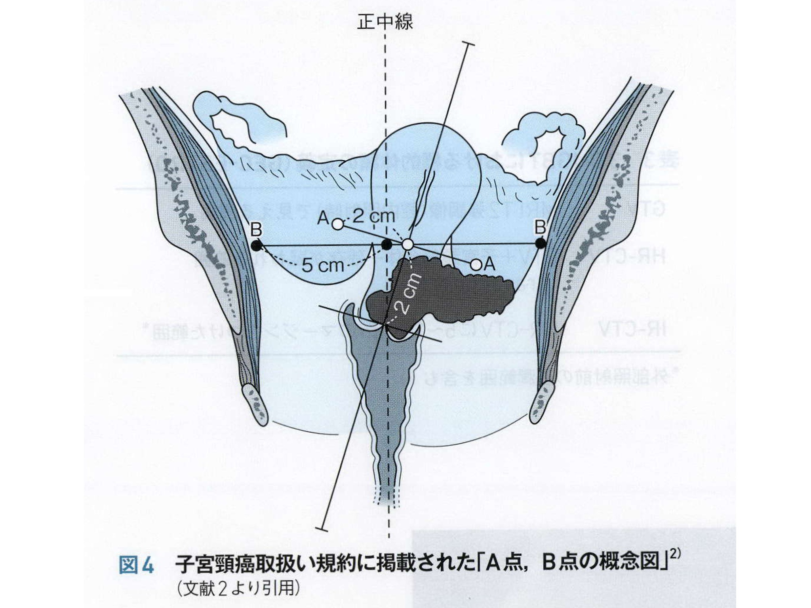

【子宮頸癌の放射線治療(術後照射)】

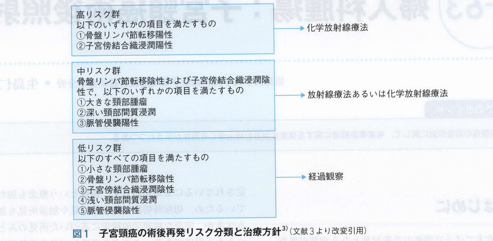

**こたえ**
- 2014-102: `腔内照射との併用 ――中央遮蔽照射`, `リモートアフタローディングシステム ――Ir-192`
- 2019-100: `6Gy`
- 2018-97: `原発巣の進展範囲は MRI で評価してよい。`, `ⅣA 期は同時化学放射線療法が第一選択である。`
- 2017-104: `中央遮蔽の幅を 4 cm とした。`, `CT 画像を基に腔内照射の治療計画を施行した。`
- 2016-103: `腔内照射用線源にIr-192を用いる。`, `腔内照射のB点は閉鎖リンパ節線量の指標である。`
- 2013-99: `放射線治療前に導入化学療法を行う。`
- 2015-102: `体部内膜浸潤` 

## 前立腺癌
### 前立腺癌の治療方針(§7-56,レジセミ7)

◎[2018-103](http://www.radiology.jp/content/files/20180926_2.pdf#page=37)
60歳代，男性，PS1。前立腺癌（初診時 PSA 9.4 ng/ml，Gleason score 4+3=7，cT1cN0M0）と診断。正しいのはどれか。2つ選べ。  
`監視療法` `前立腺全摘術` `I-125永久挿入療法` `外部照射と2年間のホルモン療法` `前立腺全摘術と6ヶ月間のホルモン療法`  

×[2014-101](http://www.radiology.jp/content/files/1377.pdf#page=35)
60 歳代の男性。前立腺癌（T3bN0M0，Gleason スコア＝4＋5，初診時 PSA 18.2 ng/ml）の治療法として正しいのはどれか。2つ選べ。  
`陽子線治療` `内分泌単独療法` `前立腺全摘出術` `強度変調放射線治療` `I-125 永久挿入療法単独治療`  

【前立腺癌の放射線治療】

- ステージング
    - UICC TNM
        - T因子
            - T1: 触知できず画像診断でも検出できない前立腺癌
                - T1a: 組織学的に切除組織の5%以下に偶発的に発見
                - T1b: 組織学的に切除組織の5%以上に偶発的に発見
                - T1c: 針生検により確認
            - T2: 前立腺に限局
                - T2a: 片葉の1/2以内にとどまる
                - T2b: 片葉の1/2を超えて広がるが, 片葉にとどまる
                - T2c: 両葉に広がる
            - T3: 前立腺被膜を超える
                - T3a: 被膜外進展
                - T3b: 精嚢に浸潤
            - T4: 精嚢以外の隣接臓器に浸潤または固定
        - N因子
            - N1: リンパ節転移あり
        - M因子
            - M1: 遠隔転移あり
        - ステージ
            - Stage1: T1-2aN0M0
            - Stage2: T2b-cN0M0
            - Stage3: T3-4N0M0
            - Stage4: N1 or M1
            
- 前立腺癌リスク分類
    - D'Amico分類
        - 低リスク: T1-2a かつ GS<=6 かつ PSA<=10ng/mL
        - 高リスク: T2c以上 または GS 8以上 または PSA>20ng/mL
        - 中リスク: 上記以外

- 放射線治療後のPSA再発の定義
    - PSA nadirから2.0ng/mL以上上昇(Phoenix定義)

- 治療方針(縦断, 前立腺癌診療ガイドライン2016より)
    - 手術の適応
        - 前立腺に限局する癌で, 低〜中間リスク群に推奨されるが, 高リスク群にも適応がある
        - 中間〜高リスク群には**拡大リンパ節郭清**を行う. 外腸骨, 内腸骨, 閉鎖リンパ節を郭清する.
        - リンパ節郭清を行う場合はかならず拡大リンパ節郭清とし, 限局リンパ節郭清とはしない.
        - 術後療法は:
            - **前立腺に限局していれば不要**.
            - 局所進行癌でT3N0M0の場合は放射線治療を追加.
            - リンパ節転移陽性例の場合はホルモン療法を追加(ホルモン療法+放射線治療の追加は推奨グレードが下がる).
    
- 治療方針(横断)
    - 前立腺に限局する癌 (=T1-2N0M0 =Stage1-2)
        - ごく早期もしくは他治療が難しい場合: 監視療法 or 内分泌療法単独
            - ちなみに監視療法とは3〜6ヶ月ごとのPSA測定と直腸診に加えて1〜3年ごとに前立腺生検を行うことをいう.
        - 上記の例外でなければ
            - 低リスク群: **前立腺全摘術単独 or 外部照射単独 or LDR単独 or HDR単独 **
            - 中間リスク群: **前立腺全摘術単独 or 外部照射+短期間ホルモン療法(4ヶ月) ± LDR or HDR単独**
            - 高リスク群: **前立腺全摘術単独 or 外部照射+長期間ホルモン療法(2年) ± HDR**
    - 局所進行癌 (=T3-4N0M0 =Stage3)
        - 原則的に **外部照射+ホルモン療法**
        - 手術によって局所進行癌であることが判明した場合は, **前立腺全摘術+放射線治療**
        - ただし拡大手術や小線源治療でも良好な成績は報告されている
    - 所属リンパ節転移例 (=TanyN1M0)
        - 日本では根治不能と判断し, **ホルモン療法単独**の適応
        - 手術によってリンパ節転移陽性であることが判明した場合は, **前立腺全摘術+ホルモン療法**
        - ただし局所への放射線療法の併用の有効性が示唆されている

**こたえ**
- 2018-103: `前立腺全摘術`, `I-125永久挿入療法` 

### 前立腺癌の放射線治療の実際(§7-55,56,57,58)

◎[2015-101](http://www.radiology.jp/content/files/20150821.pdf#page=35)
前立腺癌に対する根治的放射線治療として**適応でない**のはどれか。1つ選べ。  
`Ir-192組織内照射` `3次元原体照射` `定位手術的照射` `I-125永久挿入療法` `強度変調放射線治療`  

◎[2013-100(改題)](http://www.radiology.jp/content/files/2013_2s_exsam.pdf#page=34)
前立腺癌T2N0M0に対する放射線治療として**適切でない**のはどれか。1つ選べ。  
`体幹部定位照射`  `強度変調放射線治療`  `高線量率組織内照射`  `定位手術的照射`  `密封小線源永久挿入療法`  

◎[2017-105](http://www.radiology.jp/content/files/20170904_2.pdf#page=37)
前立腺癌の強度変調放射線治療（IMRT）として正しいのはどれか。2つ選べ。  
`排尿直後に施行する。`  
`低リスク例には用いない。`  
`直腸線量の低減に有用である。`  
`高リスク例ではホルモン療法を併用する。`  
`晩期直腸出血は治療後10年が発症のピークとなる。` 

◎[2016-104](http://www.radiology.jp/content/files/20160825.pdf#page=37)
前立腺癌の根治的外照射後の晩期有害事象として最も頻度が**低い**のはどれか。1つ選べ。  
`尿道狭窄` `直腸潰瘍` `恥骨骨折` `性機能障害` `出血性膀胱炎`  

◎[2019-101](http://www.radiology.jp/content/files/20190904_02.pdf#page=35)
前立腺癌の組織内照射で用いるのはどれか。2つ選べ。  
`Sr-89` `I-125` `I-131` `Ir-192` `Ra-223`  

◎[2019-102](http://www.radiology.jp/content/files/20190904_02.pdf#page=36)
前立腺癌の永久挿入密封小線源治療の晩期有害事象で頻度が最も**低い**のはどれか。1つ選べ。  
`直腸出血` `膀胱出血` `尿道狭窄` `勃起不全` `無精子症`  

?[2012-99](http://www.radiology.jp/content/files/2012_1s_exsam.pdf#page=33)
前立腺癌の放射線治療について正しいのはどれか。2つ選べ。  
`低リスク群ではホルモン療法を併用する。`  
`術後のPSA再発に対しては全骨盤照射を行う。`  
`治療に関連した尿失禁の頻度は5％以下である。`  
`高リスク群は I-125 永久挿入療法の良い適応である。`  
`I-125 永久挿入療法後 1年以内に死亡した場合には前立腺を摘出する。`  

【前立腺癌の放射線治療の実際】

- 外部照射
    - 体積
        - GTV: 設定することは少ない (理由は画像検査で同定できないT1c例が多い, どちらにせよ前立腺全体を照射する, の2つある)
        - CTV:
            - 低〜中間リスク群: 前立腺全体 + 精嚢基部
            - 中間〜高リスク群: 前立腺全体 + 精嚢(近位1/2〜全体)
            - ちなみにリンパ節転移に対する予防的照射はこれまで有効性が示されていない.
        - PTV: 5mm〜15mmマージン(直腸との兼ね合いで部分的に小さめのマージンに設定したりする)
    - 線量
        - 前立腺癌では基本的に高線量を投与する.
        - 低〜中間リスク群: **70-76Gy/35-38Fr**
        - 高リスク群: **72-78Gy/36-39Fr**
        - ちなみに体幹部定位放射線治療(SBRT)も**2016年から限局性前立腺癌に限って保険適応になっている**.
    - 有害事象
        - 急性期:
            - 尿路系有害事象が多く, 40〜80%に出現する (頻尿, 尿勢低下, 排尿時痛)
            - ほか, 頻便, 排便時痛, 排便時出血などの消化管症状も出現しうる.
        - 晩期:
            - 直腸出血. 照射終了後6ヶ月〜3年に多い (こちらはIMRT+IGRTを行うとかなり低減できる)
            - 尿路系有害事象. 照射終了後5年をすぎてから発生することもある (このためむしろこちらの方がこれからの時代は問題となりうる)

- 術後PSA再発に対する救済放射線治療
    - 基本的に腫瘍床に64〜68Gy程度照射する.
    - リンパ節への予防的照射の意義は明らかになっていない.

- 低線量率(LDR)密封小線源療法
    - 治療方針
        - 低リスク群: LDR単独
        - 中間リスク群: LDR±外部照射 (しかしLDR単独にシフトしつつある)
        - 高リスク群: LDR+外部照射
    - 線源
        - I-125を用いる.
- 高線量率(HDR)小線源療法
    - 治療方針
        - 低リスク群: HDR単独
        - 中間リスク群: HDR±外部照射 (しかしHDR単独にシフトしつつある)
        - 高リスク群: HDR+外部照射
    - 線源,線量,回数
        - Ir-192を用いる.
        - 臨床試験ごとにさまざまであり一定していない.

**こたえ**
- 2015-101: `定位手術的照射` が誤り
- 2013-100: `定位手術的照射` が誤り
- 2017-105: `直腸線量の低減に有用である。`, `高リスク例ではホルモン療法を併用する。`
- 2016-104: `恥骨骨折`
- 2019-101: `I-125`, `Ir-192`
- 2019-102: `無精子症`

## 下部消化管腫瘍
[2019-103](http://www.radiology.jp/content/files/20190904_02.pdf#page=36)
肛門癌の放射線治療で誤っているのはどれか。1 つ選べ。
a	 肛門温存率は約 30％である。
b	 晩期有害事象に便失禁がある。
c	 鼠径リンパ節を CTV に含める。
d	 54 Gy/30 回/6 週で線量処方する。
e	 併用化学療法は 5-FU＋マイトマイシン C である。

[2018-99](http://www.radiology.jp/content/files/20180926_2.pdf#page=35)
肛門癌化学放射線療法に用いる薬剤はどれか。1 つ選べ。（TS1 Ⓡはテガフール・ギメラ
シル・オテラシルカリウムである）
a	 TS1 Ⓡ+ ゲムシタビン
b	 TS1 Ⓡ+ シスプラチン
c	 5-FU+ シスプラチン
d	 5-FU+ カルボプラチン
e	 5-FU+ マイトマイシン C

[2014-100](http://www.radiology.jp/content/files/1377.pdf#page=35)
肛門浸潤のない cT3N1M0 下部直腸癌に対する術前照射で，照射野に通常含めないリ
ンパ節領域はどれか。1 つ選べ。
a 閉鎖リンパ節
b 内腸骨リンパ節
c 外腸骨リンパ節
d 仙骨前リンパ節
e 傍直腸リンパ節

## 造血器腫瘍
### 胃MALTリンパ腫
[2019-104](http://www.radiology.jp/content/files/20190904_02.pdf#page=36)
Ⅰ期胃MALTリンパ腫の放射線治療で正しいのはどれか。2つ選べ。
a	 R-CHOP 後に行う。
b	 空腹時に照射を行う。
c	 呼吸性移動対策を行う。
d	 40 Gy/20 回/4 週で照射する。
e	 CTV に十二指腸下行脚を含める。

[2017-100](http://www.radiology.jp/content/files/20170904_2.pdf#page=35)
胃マルトリンパ腫の放射線治療に伴う有害事象として頻度が最も低いのはどれか。
1 つ選べ。
a	 肝障害
b	 幽門狭窄
c	 放射線宿酔
d	 胃粘膜障害
e	 放射線肺臓炎

[2015-100](http://www.radiology.jp/content/files/20150821.pdf#page=35)
除菌治療無効の I 期胃原発 MALT リンパ腫に対する放射線単独治療の 5 年生存率とし
て適切なのはどれか。1 つ選べ。
a	 30%
b	 45%
c	 60%
d	 75%
e	 90%

[2014-103](http://www.radiology.jp/content/files/1377.pdf#page=36)
ピロリ除菌療法抵抗性の胃 MALT リンパ腫 IEA 期に対する放射線治療の線量分割として標準的なのはどれか。1 つ選べ。
a 4 Gy/2 回/0.5 週
b 10 Gy/2 回/0.5 週
c 20 Gy/10 回/2 週
d 30.6 Gy/17 回/3.5 週
e 39.6 Gy/22 回/4.5 週

### Hodgkinリンパ腫 / Non-Hodgkinリンパ腫

[2018-98](http://www.radiology.jp/content/files/20180926_2.pdf#page=35)
限局期の Hodgkin リンパ腫（低リスク群）の放射線治療で正しいのはどれか。1 つ選
べ。
a	 化学療法を同時併用する。
b	 併用療法に R-CHOP を用いる。
c	 線量分割を 20～30 Gy/10～15 回/2～3 週とする。
d	 標準的な治療後の 5 年生存率は約 70～80％である。
e	 照射野は治療開始前に病変が存在したリンパ節領域とする。

[2012-98](http://www.radiology.jp/content/files/2012_1s_exsam.pdf#page=33)
IA 期びまん性大細胞型 B 細胞リンパ腫の治療として正しいのはどれか。2 つ選べ。
a 放射線単独治療
b リツキシマブ単独治療
c CHOP 3 コース後に放射線治療
d リツキシマブおよび CHOP 6 コース
e リツキシマブおよび CHOP 3 コース後に放射線治療

### 白血病

[2017-103](http://www.radiology.jp/content/files/20170904_2.pdf#page=36)
白血病の骨髄破壊性全身照射として誤っているのはどれか。1 つ選べ。
a	 線量率は 1 Gy/分で行う。
b	 急性有害事象に耳下腺炎がある。
c	 線量分割は 12 Gy/6 回/3 日で行う。
d	 晩期有害事象に間質性肺炎がある。
e	 造血幹細胞移植の前処置として行われる。

### 造血器腫瘍に対する放射線治療まとめ

[2017-102](http://www.radiology.jp/content/files/20170904_2.pdf#page=36)
放射線単独治療が標準治療なのはどれか。1 つ選べ。
a	 鼻腔 NK 細胞リンパ腫Ⅰ期
b	 脳びまん性大細胞型 B 細胞リンパ腫
c	 球結膜ろ胞辺縁帯 B 細胞リンパ腫Ⅰ期
d	 精巣びまん性大細胞型 B 細胞リンパ腫Ⅰ期
e	 口蓋扁桃びまん性大細胞型 B 細胞リンパ腫Ⅰ期

## 脳腫瘍
[2019-92](http://www.radiology.jp/content/files/20190904_02.pdf#page=32)
頭蓋内胚細胞腫瘍の中で放射線治療を用いることが少ないのはどれか。1 つ選べ。
a	 胚腫
b	 奇形腫
c	 絨毛癌
d	 胎児性癌
e	 卵黄囊腫瘍

[2018-91](http://www.radiology.jp/content/files/20180926_2.pdf#page=33)
播種のない脳腫瘍の放射線治療で照射範囲を最も大きく設定するのはどれか。1つ選べ。
a	 上衣腫
b	 膠芽腫
c	 胚細胞腫
d	 乏突起膠腫
e	 脳原発悪性リンパ腫

[2017-92](http://www.radiology.jp/content/files/20170904_2.pdf#page=33)
頭蓋内胚腫（germinoma）として正しいのはどれか。1 つ選べ。
a	 若年発症は少ない。
b	 10 年生存率は約 80％である。
c	 化学療法で CR の場合には放射線治療を省略する。
d	 化学療法で PR の場合の標準的照射範囲は全脳全脊髄である。
e	 化学療法後の標準的投与線量は 24 Gy/12 回/2.5 週程度である。

[2017-93](http://www.radiology.jp/content/files/20170904_2.pdf#page=33)
髄芽腫術後の照射法として正しいのはどれか。1 つ選べ。
a	 局所照射
b	 全脳照射
c	 全脳室照射
d	 拡大局所照射
e	 全脳全脊髄照射

[2016-94](http://www.radiology.jp/content/files/20160825.pdf#page=34)
全脳全脊髄照射を標準治療として行うのはどれか。1 つ選べ。
a	 髄膜腫
b	 上衣腫
c	 髄芽腫
d	 星細胞腫
e	 胚細胞腫

[2015-91](http://www.radiology.jp/content/files/20150821.pdf#page=32)
脳原発悪性リンパ腫の放射線治療として最も適切なのはどれか。1 つ選べ。
a	 放射線単独治療
b	 ABVD 後の放射線治療
c	 腫瘍摘出後の放射線治療
d	 メトトレキサート後の放射線治療
e	 R-CHOP による化学放射線同時併用療法

[2013-94](http://www.radiology.jp/content/files/2013_2s_exsam.pdf#page=32)
成人の星細胞腫（WHO Grade 2）の術後照射で一般に用いられるのはどれか。1 つ選べ。
a 30Gy/10Fr/2週
b 40Gy/20Fr/4週
c 50Gy/25Fr/5週
d 60Gy/30Fr/6週
e 70Gy/35Fr/7週

[2012-91](http://www.radiology.jp/content/files/2012_1s_exsam.pdf#page=31)
髄芽腫に対する適切な治療法の組み合わせはどれか。1 つ選べ。
a 手術＋拡大局所照射
b 拡大局所照射＋全身化学療法
c 全脳全脊髄照射＋全身化学療法
d 手術＋拡大局所照射＋全身化学療法
e 手術＋全脳全脊髄照射＋全身化学療法

## 小児腫瘍
[2016-105](http://www.radiology.jp/content/files/20160825.pdf#page=38)
術後 9 日以内に照射を開始すべき小児腫瘍はどれか。1 つ選べ。
a	 肝芽腫
b	 神経芽腫
c	 Wilms 腫瘍
d	 横紋筋肉腫
e	 Ewing 肉腫関連腫瘍

[2015-104](http://www.radiology.jp/content/files/20150821.pdf#page=36)
 小児がんの根治的放射線治療として正しいのはどれか。2 つ選べ。
a	 10 年間無病生存で経過観察を終了する。
b	 集学的治療の一環として放射線治療を行う。
c	 陽子線治療を用いると二次発がんのリスクは高くなる。
d	 白血球 1000 未満に減少した場合は放射線治療を休止する。
e	 脊椎の一部が照射される場合はその椎体全体を照射野に含める。

[2014-104](http://www.radiology.jp/content/files/1377.pdf#page=36)
小児がんの放射線治療について誤っているのはどれか。1 つ選べ。
a 総線量を少なくする。
b 分割回数を少なくする。
c 陽子線治療が有効である。
d 骨成長を勘案して治療計画を立てる。
e 晩期合併症について長期経過観察が必要である。

## 緩和照射
### 骨転移
[2015-103](http://www.radiology.jp/content/files/20150821.pdf#page=36)
骨転移の放射線治療として誤っているのはどれか。1 つ選べ。
a	 有痛性骨転移では鎮痛剤を併用する。
b	 30 Gy/10 回/2 週は標準的な線量分割法の 1 つである。
c	 上部頸椎転移では前後対向 2 門照射が標準的である。
d	 脊髄圧迫症状がある場合には緊急照射の適応である。
e	 長管骨の切迫骨折では予防的固定術後の照射を検討する。

[2014-105](http://www.radiology.jp/content/files/1377.pdf#page=36)
脊髄圧迫症状を伴う骨転移について誤っているのはどれか。1 つ選べ。
a 緊急照射の適応である。
b 前駆症状として疼痛が多い。
c 責任病巣としては腰椎が多い。
d 30 Gy/10 回の照射は有効である。
e 放射線治療にステロイド薬投与を併用する。

[2012-100](http://www.radiology.jp/content/files/2012_1s_exsam.pdf#page=34)
骨転移の放射線治療について正しいのはどれか。2つ選べ。
`疼痛改善率は 70～80％ 程度である。`  
`疼痛緩和効果が最大となるのは照射直後である。`  
`放射線抵抗性の腫瘍の骨転移では適応にならない。`  
`溶骨性病変の骨再生には治療終了後数ヶ月以上必要である。`  
`8Gy1回照射は30Gy10回照射と比較して疼痛緩和効果に劣る。`  

### 脳転移
[2018-92](http://www.radiology.jp/content/files/20180926_2.pdf#page=33)
転移性脳腫瘍で正しいのはどれか。2 つ選べ。
a	 最も多い原発巣は肺癌である。
b	 37.5 Gy/15 回/3 週で全脳照射を行う。
c	 非小細胞肺癌に予防的全脳照射を行う。
d	 全脳照射の認知機能障害は早期に多い。
e	 定位放射線照射と全脳照射は併用しない。

[2015-90](http://www.radiology.jp/content/files/20150821.pdf#page=31)
脳転移の治療として誤っているのはどれか。1 つ選べ。
a	 癌性髄膜炎に全脳照射を行う。
b	 4.5 cm の孤発性腫瘍に開頭腫瘍摘出術を行う。
c	 全脳照射の照射範囲には眼球後半部を含める。
d	 全脳照射の線量分割に 30 Gy/10 回/2 週を用いる。
e	 腫瘍数 3 個で最大径 2 cm の各病変に定位手術的照射を行う。

### 緊急照射
[2018-100](http://www.radiology.jp/content/files/20180926_2.pdf#page=36)
緊急放射線治療の対象はどれか。2 つ選べ。
a	 多発脳転移
b	 癌性胸膜炎
c	 腫瘍内出血
d	 上大静脈症候群
e	 腫瘍性脊髄圧迫

[2012-89](http://www.radiology.jp/content/files/2012_1s_exsam.pdf#page=30)
緩和照射の適応として緊急性が高いのはどれか。2 つ選べ。
a 癌性胸水による呼吸困難
b 骨転移による病的骨幹骨折
c 子宮頸癌による腫瘍性出血
d 腫瘍性脊髄圧迫による麻痺
e 神経芽腫肝転移の急速増大

### 緩和照射まとめ
[2019-105](http://www.radiology.jp/content/files/20190904_02.pdf#page=37)
緩和的放射線治療の病巣と治療内容の組み合わせで一般的でないのはどれか。1 つ選
べ。
a	 胸椎転移　 8 Gy/1 回/1 日
b	 肋骨転移　 20 Gy/5 回/1 週
c	 胃癌の腫瘍出血　 30 Gy/10 回/2 週
d	 肺癌の気管狭窄　 36 Gy/6 回/1.2 週
e	 大腸癌骨盤再発　 50 Gy/25 回/5 週

## 放射線治療まとめ
[2018-102](http://www.radiology.jp/content/files/20180926_2.pdf#page=36)
断端陰性でも術後照射を必要とする可能性が高いのはどれか。1 つ選べ。
a	 肺癌
b	 直腸癌
c	 食道癌
d	 下咽頭癌
e	 子宮体癌

[2018-101](http://www.radiology.jp/content/files/20180926_2.pdf#page=36)
術後照射の処方線量が最も少ないのはどれか。1 つ選べ。
a	 髄芽腫
b	 神経芽腫
c	 Wilms 腫瘍
d	 Ewing 肉腫
e	 横紋筋肉腫

[2018-96](http://www.radiology.jp/content/files/20180926_2.pdf#page=34)
鼠径リンパ節領域を CTV に設定するのはどれか。1 つ選べ。
a	 腟癌
b	 膀胱癌
c	 直腸癌
d	 肛門癌
e	 子宮頸癌

[2018-89](http://www.radiology.jp/content/files/20180926_2.pdf#page=32)
疾患と照射法の組み合わせを示す。総処方線量が最も高いのはどれか。1 つ選べ。
a	 乳房温存術後　 　寡分割照射
b	 肺転移　 　定位放射線治療
c	 脳転移　 　定位手術的照射
d	 脊椎転移　 　前後対向 2 門照射
e	 前立腺癌　 　強度変調放射線治療

[2017-90](http://www.radiology.jp/content/files/20170904_2.pdf#page=32)
疾患と放射線治療との組み合わせとして**誤っている**のはどれか。1 つ選べ。
a	 下咽頭癌　 　強度変調放射線治療
b	 胃癌多発脳転移　 　全脳照射
c	 食道癌脊椎転移　 　体幹部定位照射
d	 乳癌乳房温存術後　 　乳房接線照射
e	 限局型小細胞肺癌　 　予防的全脳照射

[2017-91](http://www.radiology.jp/content/files/20170904_2.pdf#page=32)
処方線量が通常分割照射で 60 Gy 以上となるのはどれか。2 つ選べ。
a	 髄芽腫の根治照射
b	 直腸癌の術前照射
c	 下咽頭癌の根治照射
d	 前立腺癌の術後照射
e	 肛門管癌の根治照射

[2017-101](http://www.radiology.jp/content/files/20170904_2.pdf#page=36)
疾患と治療法との組合わせとして正しいのはどれか。1 つ選べ。
a	 食道癌　 　根治的化学放射線療法
b	 肝臓癌　 　術後化学放射線療法
c	 膵臓癌　 　体幹部定位放射線治療
d	 直腸癌　 　根治的化学放射線療法
e	 肛門管癌　 　術前化学放射線療法

[2016-93](http://www.radiology.jp/content/files/20160825.pdf#page=34)
化学放射線療法の適応となるのはどれか。2 つ選べ。
a	 膠芽腫
b	 胃癌Ⅰ期
c	 喉頭癌Ⅰ期
d	 肺癌ⅢB 期
e	 前立腺癌Ⅱ期

[2016-91](http://www.radiology.jp/content/files/20160825.pdf#page=33)
疾患と照射法との組み合わせとして誤っているのはどれか。1 つ選べ。
a	 上咽頭癌 全頸部照射
b	 子宮頸癌 全骨盤照射
c	 頸部食道癌 強度変調放射線治療
d	 乳癌単発脳転移 定位手術的照射
e	 甲状腺未分化癌 131I 内用療法

[2015-89](http://www.radiology.jp/content/files/20150821.pdf#page=31)
根治的放射線治療において，疾患と機能温存が可能な臓器との組み合わせとして誤って
いるのはどれか。1 つ選べ。
a	 T3N1 上咽頭癌 唾液腺
b	 T3N0 下咽頭癌 喉頭
c	 T4aN0 上顎洞癌 眼球
d	 T1b2N0 子宮頸癌 卵巣
e	 T4N1 肛門癌 肛門

[2014-87](http://www.radiology.jp/content/files/1377.pdf#page=30)
全身状態および各臓器機能に問題がない患者において放射線単独治療の適応となるのはどれか。2つ選べ。
a 上咽頭癌 II 期
b 中咽頭扁桃癌 I 期
c 小細胞肺癌 IB 期
d 非小細胞肺癌 IIIB 期
e 子宮頸癌 IB 1 期

[2014-88](http://www.radiology.jp/content/files/1377.pdf#page=30)
局所進行癌における術前化学放射線療法が局所制御に有効なのはどれか。2 つ選べ。
a 膵癌
b 直腸癌
c 子宮頸癌
d 肛門管癌
e Pancoast 型肺癌

[2014-89](http://www.radiology.jp/content/files/1377.pdf#page=31)
疾患と放射線治療の照射法との組み合わせとして誤っているのはどれか。1 つ選べ。
a 上咽頭癌 ――――――――――強度変調放射線治療
b 口腔癌 ―――――――――――モールド小線源治療
c 乳 癌 ―――――――――――接線照射
d 前立腺癌 ――――――――――高線量率組織内照射
e 皮膚 T 細胞リンパ腫 ――――全身照射（TBI）

[2014-90](http://www.radiology.jp/content/files/1377.pdf#page=31)
治療法と適応疾患との組み合わせとして誤っているのはどれか。1 つ選べ。
a 炭素線治療 ――――――骨肉腫
b 予防的全脳照射 ――――非小細胞肺癌
c 89Sr 治療 ――――――――骨転移
d 131I 内用療法 ――――――甲状腺乳頭癌
e 192Ir 腔内照射 ――――――子宮頸癌

[2014-93](http://www.radiology.jp/content/files/1377.pdf#page=32)
疾患と放射線治療の照射法との組み合わせとして誤っているのはどれか。1 つ選べ。
a 髄膜腫 ―――――――――――――局所照射
b 膠芽腫 ―――――――――――――拡大局所照射
c 聴神経腫瘍 ―――――――――――定位放射線照射
d 頭蓋内胚細胞腫 ―――――――――全脳室照射
e 中枢神経原発悪性リンパ腫 ――――全中枢神経系照射

[2013-88](http://www.radiology.jp/content/files/2013_2s_exsam.pdf#page=30)
過分割照射法が適応となるのはどれか。1 つ選べ。
a 膠芽腫
b 上咽頭癌
c 前立腺癌
d 小細胞肺癌
e 胃悪性リンパ腫

[2013-90](http://www.radiology.jp/content/files/2013_2s_exsam.pdf#page=30)
臨床病期 III 期の放射線治療成績が最も不良なのはどれか。1 つ選べ。
a 膵癌
b 下咽頭癌
c 子宮頸癌
d 小細胞肺癌
e 非小細胞肺癌

[2013-91](http://www.radiology.jp/content/files/2013_2s_exsam.pdf#page=31)
放射線単独で根治的治療を行う場合に総線量が最も少ないのはどれか。1 つ選べ。
a 喉頭癌
b 肺腺癌
c 前立腺癌
d 子宮頸癌
e 松果体胚細胞腫

[2012-88](http://www.radiology.jp/content/files/2012_1s_exsam.pdf#page=30)
根治的化学放射線療法の適応となるのはどれか。2 つ選べ。
a 食道癌
b 直腸癌
c 肝細胞癌
d 肛門管癌
e 胃 MALT リンパ腫
