# 放射線と安全
## 人体への影響 (§安全1-1)
### 急性放射線症候群 (§安全1-1-2-6) 

◎[2019-01](http://www.radiology.jp/content/files/20190904_02.pdf#page=2)
全身被ばく12Gyの10日後に死亡した場合, 最も可能性が高い死因はどれか。1つ選べ。  
`肝不全` `腎不全` `骨髄抑制` `消化管障害` `中枢神経障害`

◎[2017-03](http://www.radiology.jp/content/files/20170904_2.pdf#page=2)
半数致死線量を照射した場合に最も起こりやすいのはどれか。1つ選べ。  
`骨髄死` `心臓死` `腸管死` `肺臓死` `中枢神経死`

◎[2016-05](http://www.radiology.jp/content/files/20160825.pdf#page=2)
数Gyの全身被ばくで死亡する場合に主たる原因となる放射線障害部位はどれか。1つ選べ。  
`心` `脳` `肺` `骨髄` `腸管`

◎[2015-05](http://www.radiology.jp/content/files/20150821.pdf#page=2)
全身照射後に無治療の場合，30日以内に約50％が死亡する線量はどれか。1つ選べ。  
`1Gy` `4Gy` `12Gy` `24Gy` `40Gy`

◎[2018-01](http://www.radiology.jp/content/files/20180926_2.pdf#page=2)
3Gyの全身被ばく後, 数時間以内に出現する可能性が最も高い症状はどれか。1つ選べ。  
`悪心` `下痢` `高熱` `頭痛` `意識障害`

◎[2013-11](http://radiology.jp/content/files/2013_2s_exsam.pdf#page=4)
急性放射線症候群の前駆症状**でない**のはどれか。1つ選べ。  
`嘔吐` `下痢` `発熱` `掻痒感` `意識混濁`

急性放射線症候群は, 短時間で大量の放射線被曝が全身または比較的広い部分で起こったときにみられる一連の症状である.
症状および障害は受けた線量によって異なる.

- 中枢神経死: 20Gy以上被曝した数日以内に死亡. 脳血管透過性亢進による脳浮腫が原因.
- 腸死: 6〜20Gy被曝した1〜2週間後に死亡. 腸粘膜上皮の崩壊による下痢, 脱水, 体液喪失, 電解質異常などによって複合的に全身状態が悪化する.
- 骨髄障害: 2〜6Gy被曝した1ヶ月後以内に死亡. 白血球と血小板の減少による感染と出血による.

また, 放射線の半致死線量とは, 通常は「全身照射30日後に50%の個体が死亡する線量」によって定義され(LD50/30), ヒトの場合は**2.5Gy〜4.5Gy**である.

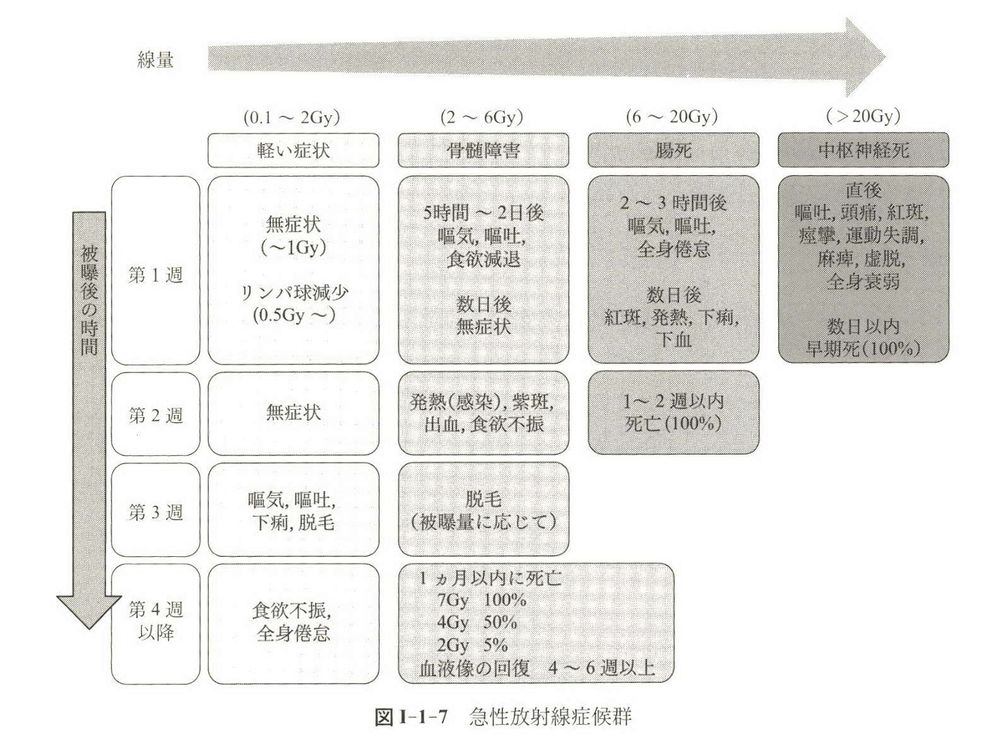

**こたえ**
- 2019-01: `消化管障害`
- 2017-03: `骨髄死`
- 2016-05: `骨髄`
- 2015-05: `4Gy`
- 2018-01: `悪心`
- 2013-11: `掻痒感`が誤り

### 確率的影響と確定的影響 (§安全1-1-1), しきい値 (§安全1-1-2-4,7,8,9,10,11,1-1-4)

##### 確率的影響と確定的影響

◎[2014-09](http://www.radiology.jp/content/files/1377.pdf#page=4)
電離放射線の人体への影響として正しいのはどれか。1つ選べ。  
`発癌は確定的影響である。`  
`不妊は確率的影響である。`  
`白内障発生は確率的影響である。`  
`発癌の悪性度は線量に依存する。`  
`確率的影響に明確なしきい値は存在しない。` 

◎[2017-10](http://www.radiology.jp/content/files/20170904_2.pdf#page=5)
放射線による胎児への影響として確率的影響と考えられているのはどれか。2つ選べ。  
`流産` `形態異常` `遺伝的影響` `精神発達遅滞` `小児がん発生`

◎[2012-09](http://www.radiology.jp/content/files/2012_1s_exsam.pdf#page=3)
放射線の確定的影響で正しいのはどれか。2つ選べ。  
`回復現象が認められる。`  
`発症に性差が認められる。`  
`遺伝子の突然変異が原因である。`  
`被曝線量が増加するとリスクが増す。`  
`精神発達遅滞は確定的影響の1つである。`  

【有害事象のまとめ】

- 急性反応(早期影響): 被曝から1時間後〜数週間後に生じる.
    - 例: 嘔吐, 脱毛, 皮膚紅斑, 出血, 白血球減少, 放射線宿酔, 不妊, 胎児精神遅滞など.
- 後期反応(晩発影響): 数ヶ月後以降に生じる.
    - 例: 白内障.
- 確定的影響: 細胞死をエンドポイントとする影響.
    - リスクは線量とともに増加する. 
    - しきい値が存在する. **5年以内に1〜5%の患者に障害を生じる線量がしきい値と定義されている(放射線治療の場合)**.
    - 重篤度は線量に依存する.
- 確率的影響: DNA修復ミスによる突然変異を起点とする影響.
    - **発癌もしくは遺伝的影響の2種類ある**.
    - リスクは線量とともに増加する. 
    - しきい値は存在しない. 
    - 重篤度は線量に依存しない.

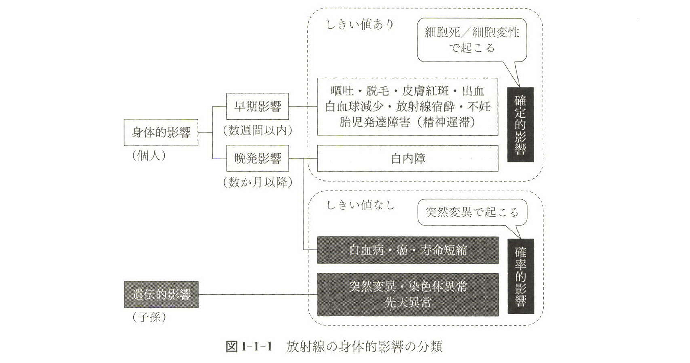

**こたえ**
- 2014-09: `確率的影響に明確なしきい値は存在しない。` 
- 2017-10: `遺伝的影響`, `小児がん発生`
- 2012-09: `被曝線量が増加するとリスクが増す。`,  `精神発達遅滞は確定的影響の1つである。` 

##### 急性被曝のしきい値

◎[2013-15](http://www.radiology.jp/content/files/2013_2s_exsam.pdf#page=5)
放射線の確定的影響（組織障害反応）の指標である「しきい線量」は，放射線治療患者の場合，何%に障害が出現する線量か。1つ選べ。  
`0.5～1％` `1～5％` `5～25％` `25～50％` `50％`  

◎[2019-10](http://www.radiology.jp/content/files/20190904_02.pdf#page=5)
全身被ばくによる急性放射線障害のうち，しきい線量が1Gy以下のものはどれか。2つ選べ。  
`嘔吐` `消化管障害` `造血機能低下` `女性永久不妊` `皮膚水疱形成`  

◎[2018-14](http://www.radiology.jp/content/files/20180926_2.pdf#page=7)
しきい線量と確定的影響の組み合わせについて**誤っている**のはどれか。1つ選べ。  
`0.5Gy 広範囲の照射で造血能低下`  
`1Gy 男性の一時的不妊`  
`3Gy 皮膚紅斑`  
`4Gy 一時的脱毛`  
`6Gy 女性の永久不妊`  

◎[2019-12](http://www.radiology.jp/content/files/20190904_02.pdf#page=5)
胎児被ばくによる精神発達遅滞のしきい線量はどれか。1つ選べ。  
`10～20 mGy` `50～60 mGy` `70～80 mGy` `100～200 mGy` `300～400 mGy`

◎[2016-09](http://www.radiology.jp/content/files/20160825.pdf#page=3)
放射線の人体影響（妊婦，胎児）について正しいのはどれか。1つ選べ。  
`胎児被ばくを理由とした人工妊娠中絶は違法である。`  
`放射線被ばくでは胎児の精神発達遅滞は発症しない。`  
`胎児の形態異常のしきい線量は10～20mGyである。`  
`妊娠前の卵巣の被ばくで胎児の発がんリスクは増大する。`  
`妊婦の放射線被ばく直後のナトリウム摂取は胎児影響の低減作用がある。`

◎[2015-10](http://www.radiology.jp/content/files/20150821.pdf#page=4)
高線量の被ばくは胎児の精神発達遅滞の危険性を高める。曝露時の妊娠月数として，この恐れが最も高いのはどれか。1つ選べ。  
`1か月` `3か月` `5か月` `8か月` `10か月`  

【急性被曝後の確定的影響のしきい値】

- 1. 造血器の影響
    - 0.5Gyの**全身被曝**で造血機能が低下する.
    - 1.5Gy以上の**全身被曝**では生命の危機の可能性があり, 2Gy〜6Gyの全身被曝では骨髄死に至る.
- 2. 男性生殖腺の影響
    - 0.15Gy以上急性被曝すると, 精母細胞の一部が死ぬため一時不妊となる. ただし精子は死なないため精子の寿命(約6週間)のあいだは潜伏期間となる.
    - 3.5〜6Gy以上急性被曝すると, 精子自体も死にはじめる. また, 精母細胞がすべて死滅すると永久不妊となる.
- 3. 女性生殖腺の影響
    - 0.65Gy以上急性被曝すると, 第二次卵母細胞から卵子への成熟が一時的に阻害されるため, その間は一時不妊となる.
        - 一時不妊から回復した際, 染色体障害はそのまま持ち込まれるため, 胎児の遺伝的異常の原因となる.
    - 20代では6〜7Gy以上, 40歳では2〜3Gy以上急性被曝すると, 第二次卵母細胞や卵子がすべて死滅するため永久不妊となる.
- 4. 水晶体の影響
    - 0.5Gy以上急性被曝すると, 水晶体上皮が損傷を受け, それが水晶体の後嚢に移動することで水晶体混濁が生じる.
    - 5Gy以上急性被曝すると, 放射線白内障となる.
- 5. 消化管の影響
    - 6〜10Gy以上急性被曝すると, 小腸のクリプト幹細胞が死滅し, クリプトが再生困難となるため, 粘膜上皮の剥離, 萎縮, 潰瘍が生じる. その後, 体液や電解質の喪失, リンパ組織の破壊, 腸内細菌の侵入を通じて, 下痢, 下血, 敗血症が生じる.
- 6. 皮膚の影響
    - 2Gy以上急性被曝すると, 表皮毛細血管が障害されて拡張し, 一過性の初期紅斑が生じる.
    - 第1度: 3Gy以上急性被曝すると, 脱毛が生じる.
    - 第2度: 6Gy以上急性被曝すると, 2週間後から紅斑が出現し, 約1ヶ月つづく. 乾性皮膚炎が生じる.
    - 第3度: 20Gy以上急性被曝すると, 上皮や皮下に水疱が現れ, 水疱が破れると皮下組織が直接露出する.
    - 第4度: 30Gy以上急性被曝すると, びらんや潰瘍を生じる. 上皮の基底膜は消失し, 薄い上皮が皮下組織に直接密着した状態となり, 外からの刺激に弱くなる.
- 7. 胎児への影響
    - 着床前期(受胎0〜2週): 0.1Gy以上急性被曝すると, 胚死亡となり死産となる. 母親自身も妊娠に気づかないので誰も知らない死産となる.
    - 器官形成期(2〜8週): 0.1Gy以上急性被曝すると, その時にちょうど原基が形成されており感受性の高い臓器に対応した奇形が発生する.
    - 胎児期(8〜25週): 0.1Gy以上急性被曝すると, 発育遅延(←臓器や組織の成長の阻害)や精神発達遅滞(←大脳皮質の神経細胞の形成は25週までつづくため)となる.
        - 大脳皮質の形成障害や精神発達遅滞については特に8〜15週が高リスク.

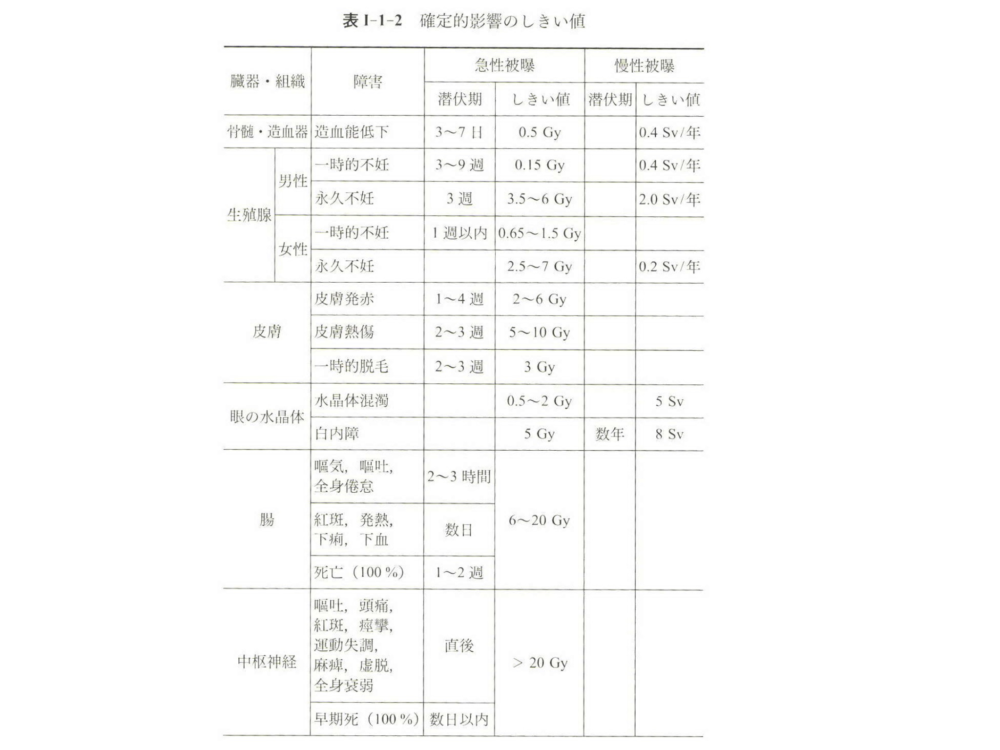

**こたえ**
- 2013-15: `1～5％`
- 2019-10: `嘔吐`,`造血機能低下`
- 2018-14: `1Gy 男性の一時的不妊`が誤り
- 2019-12: `100～200 mGy` 
- 2016-09: `妊娠前の卵巣の被ばくで胎児の発がんリスクは増大する。`
- 2015-10: `3か月`

### 確率的影響と二次がん(§安全1-1-3)

[2019-11](http://www.radiology.jp/content/files/20190904_02.pdf#page=5)
放射線被ばくによる発がんリスクが最も高い臓器はどれか。1つ選べ。  
`乳房` `肝臓` `膀胱` `卵巣` `子宮`  

[2016-10](http://www.radiology.jp/content/files/20160825.pdf#page=4)
放射線被ばくによる発がんリスクについて正しいのはどれか。1つ選べ。  
`Bergonie-Tribondeau の計算式を用いてリスク評価をする。`  
`組織加重係数は甲状腺よりも乳腺のほうが大きな値である。`  
`放射線防護上は70歳までの発がんへの寄与でリスクを検討する。`  
`総線量が同じなら複数回の被ばくも一回被ばくもリスクは等しい。`  
`同一実効線量でも外部被ばくのほうが内部被ばくよりリスクは高い。`  

[2012-10](http://www.radiology.jp/content/files/2012_1s_exsam.pdf#page=4)
放射線による発がんについて正しいのはどれか。1つ選べ。  
`自然放射線量が高い地域の住民の発がん率は高い。`  
`放射線誘発がんで潜伏期間が最も短い腫瘍は乳癌である。`  
`白血病の発生は放射線被ばく後 15 年以上経過してから増加する。`  
`放射線による遺伝的影響はこれまでにヒトでは確認されていない。`  
`放射線誘発がんは他の原因による発がんと組織学的に識別可能である。` 

**こたえ**

# 放射線治療総論
## 放射線治療の安全 (§2-13-8)
### 耐容線量

◎[2018-02](http://www.radiology.jp/content/files/20180926_2.pdf#page=2)
通常分割で**臓器全体**が照射された場合の耐容線量（TD5/5：5年間で5％）が最も低いのはどれか。1つ選べ。  
`脳` `肺` `肝臓` `小腸` `脊髄` 

◎[2015-08](http://www.radiology.jp/content/files/20150821.pdf#page=3)
通常分割照射で **臓器全体(両側性の場合は両方)** が照射された場合，重篤な晩発障害を基準にすると耐容線量が最も低いのはどれか。1つ選べ。  
`脳` `心` `肝` `腎` `膀胱`  

◎[2014-07](http://www.radiology.jp/content/files/1377.pdf#page=3)
通常分割照射における小腸（**体積1/3**）の耐容線量（TD5/5）はどれか。1つ選べ。  
`20 Gy` `30 Gy` `40 Gy` `50 Gy` `60 Gy` 

[2016-88](http://www.radiology.jp/content/files/20160825.pdf#page=32)
臓器の照射体積および TD5/5（Gy）と障害との組み合わせとして**誤っている**のはどれか。1つ選べ。
`脳（1/3，60 Gy） 脳壊死`  
`食道（1/3，60 Gy） 食道潰瘍`  
`肝臓（1/3，50 Gy） 慢性肝炎`  
`卵巣（全体，10 Gy） 不　妊`  
`脊髄（5～10 cm，50 Gy） 脊髄壊死`  

【耐容線量】

放射線治療の際には総線量が耐容線量をオーバーしないように計画を行う.  
耐容線量とはあくまで分割照射の総線量に対するものであり, 一回の急性被曝に対する**しきい値とはまったく別物**であることに注意.  
耐容線量は次のように2段階あるが, 最小LD5/5を上回らないように治療計画を立てるのが一般的.  
- 最小LD5/5: 照射後5年以内の有害事象発症率が5%以下の線量
- 最大LD50/5: 照射後5年以内の有害事象発症率が50%以下の線量

耐容線量の対象に設けられている有害事象は, 急性被曝に対するしきい値の確定的影響と同じものもあれば, 異なるものもある.  

主な臓器の耐容線量は以下のとおり. 特徴としては以下のようなものがある:
- 直列臓器では耐容線量は体積によってあまり変化しないが, **並列臓器では耐容線量が体積とおおむね反比例する**.
- 体積1/3の耐容線量が小さい臓器は, 水晶体(10Gy), 網膜と肺(45Gy), 視神経と視交叉と小腸と肝(50Gy).
- 体積3/3の耐容線量が小さい臓器は, 水晶体(10Gy), 肺(17.5Gy), 腎(23Gy), 肝(30Gy)など.

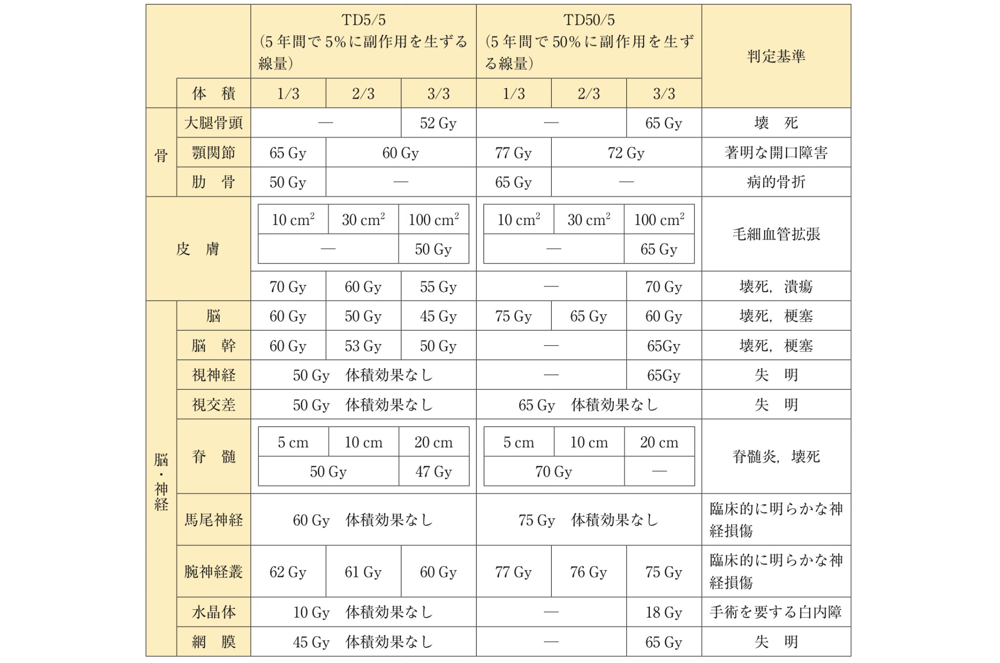
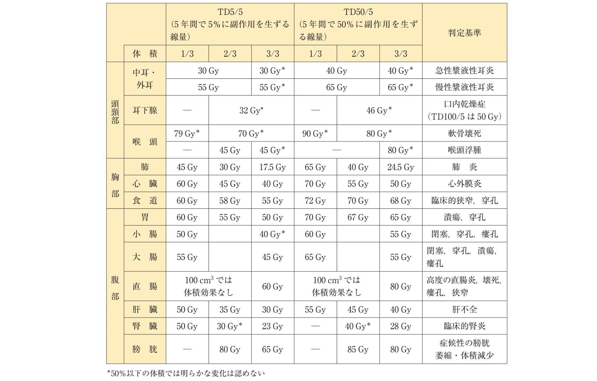

**こたえ**
- 2018-02: `肺`
- 2015-08: `腎`
- 2014-07: `50 Gy`

### 照射後の有害事象一般
[2019-86](http://www.radiology.jp/content/files/20190904_02.pdf#page=30)
全身照射後の最も早期に起こる反応はどれか。1つ選べ。  
`下痢` `脱毛` `肺炎` `口内炎` `耳下腺腫脹`

[2018-88](http://www.radiology.jp/content/files/20180926_2.pdf#page=32)
骨盤部位の放射線治療に伴う消化管有害事象で正しいのはどれか。2つ選べ。  
`小腸より大腸に多い。`
`イレウスは晩期に多い。`
`直腸潰瘍は早期に多い。`
`化学療法併用で増強しない。`
`強度変調放射線治療の使用で減少できる。`

[2016-102](http://www.radiology.jp/content/files/20160825.pdf#page=37)
放射線照射後の消化管有害反応で正しいのはどれか。2つ選べ。  
`早期反応として下痢がある。`  
`晩期反応として腸閉塞がある。`  
`早期反応として蛋白漏出性胃腸症がある。`  
`晩期反応は小腸より大腸で起こりやすい。`  
`早期反応には副腎皮質ステロイドを使用する。`

[2015-105](http://www.radiology.jp/content/files/20150821.pdf#page=36)
放射線脊髄症について正しいのはどれか。1つ選べ。  
`照射後3か月以内に発症することが多い。`  
`脊髄線量 60 Gy 未満での発症はまれである。`  
`照射される脊髄の長さは発症率に影響する。`  
`照射期間中に休止期間が入ると発症率は低下する。`  
`総線量が同じであれば発症率は分割回数に影響されない。`

## 臓器レベルの放射線生物学 (§2-13-5)

◎[2018-87](http://www.radiology.jp/content/files/20180926_2.pdf#page=31)
直列臓器はどれか。2つ選べ。  
`肺` `胃` `肝臓` `腎臓` `視神経`

◎[2015-87](http://www.radiology.jp/content/files/20150821.pdf#page=30)
放射線治療における並列臓器はどれか。2つ選べ。  
`気管` `肺` `肝臓` `直腸` `脊髄`

◎[2013-87](http://www.radiology.jp/content/files/2013_2s_exsam.pdf#page=29)
放射線治療の施行において直列臓器として考えるのはどれか。2つ選べ。  
`肺` `肝臓` `小腸` `腎臓` `脊髄`

**こたえ**
- 2018-87: `胃`, `視神経`
- 2015-87: `肺`, `肝臓`
- 2013-87: `小腸`, `脊髄`

## 組織レベルの放射線生物学 (§2-13-4)
◎[2013-07](http://www.radiology.jp/content/files/2013_2s_exsam.pdf#page=3)
放射線治療に影響する4R**でない**のはどれか。1つ選べ。  
`Repair` `Repopulation` `Redistribution` `Recombination` `Reoxygenation`

◎[2017-04](http://www.radiology.jp/content/files/20170904_2.pdf#page=3)
分割照射で抗腫瘍効果の増強が期待できるのはどれか。2つ選べ。  
`再増殖`  
`再酸素化`  
`亜致死損傷の修復`  
`細胞周期の再分布`  
`DNA二重鎖切断の修復` 

組織の放射線感受性は, 構成する細胞に依存している. 組織は構成細胞によって次のように分類でき, それぞれ放射線感受性が異なる.

- H型組織: 幹細胞〜成熟細胞すべてを含む組織. 常に細胞分裂を繰り返しており放射線感受性がもっとも高い.
    - 例: **皮膚, 腸上皮, 精巣, 骨髄など**.
    - 母細胞がもっとも感受性が高く, 母細胞から細胞死が始まる. 分化した娘細胞はそれほど感受性は高くない.
    - つまり精子細胞は精母細胞より放射線抵抗性なので, 不妊はただちには起こらず, 精母細胞の供給不足を遠因として一定期間後に顕在化する.
- H-Fハイブリッド型組織: H型とF型(下記)の特徴を併せもつもの.
    - 例: **腎尿細管上皮, 唾液腺, 甲状腺上皮など**.
- F型組織: 通常は分裂しないG0期にあるが, 何らかの障害を受けるとG1期から分裂周期に入り再生する潜在能力をもつもの.
    - 例: **肝臓**.
- 非分裂組織
    - 例: **神経細胞, 心筋細胞**.
    - これは神経や心臓がまったく放射線の影響を受けないことを意味しない.
    - なぜなら神経膠細胞や血管内皮細胞は分裂能を有するので, 組織障害はこれらを介して生じるため.
    
また, 分割照射の場合には次の4Rが影響する. 実質を構成する細胞群にみられる現象であることに留意する. また, reoxygenation以外は正常組織にも起こる.
- repair
    - SLDR(亜致死損傷回復:sublethal damage recovery), PLDR(潜在的致死損傷回復: potentially lethal damage recovery).
- redistribution
    - 各細胞周期の割合.
    - バラバラな周期の細胞からなる病巣に照射すると, まず感受性の高い周期にあたる細胞が多く死滅する.
    - 生き残った細胞はG2期に進むが, ここで線量に応じてしばらく進行が止まるためG2期の細胞が蓄積される(G2 block).
    - その後, G2 blockにあった細胞はいっせいにM期に進むため, 次の照射でこれらをまとめて死滅させることができる.
- repopulation
    - 各細胞の実質胞巣内での解剖学的位置.
- reoxygenation
    - 各細胞の再酸素化. 照射によって病巣表面の酸素化細胞が死ぬとその深部の無酸素細胞が酸素化される.

**こたえ**
- 2013-07: `Recombination` が誤り
- 2017-04: `再酸素化`, `細胞周期の再分布`

## 細胞レベルの放射線生物学 (§2-13-3, 3-1-1, 安全1-2)
◎[2013-05](http://www.radiology.jp/content/files/2013_2s_exsam.pdf)
放射線感受性が高い細胞周期はどれか。2つ選べ。 `M期` `G0期` `S期の後半` `G1期の前半` `G1期からS期への移行期`

細胞死をエンドポイントとして放射線感受性をみた場合, **G1期の後半とM期**に放射線感受性がもっとも高い.

- G0期: 細胞周期から抜けている状態.
- G1期: DNA合成のための酵素などを準備している状態.
- S期: DNA合成を行っている状態.
- G2期: 有糸分裂のための微小管などを合成している状態.
- M期: 有糸分裂を行っている状態.

**こたえ**
- 2013-05: `M期`, `G1期からS期への移行期`

◎[2012-01](http://www.radiology.jp/content/files/2012_1s_exsam.pdf#page=1)
放射線による細胞死について**誤っている**のはどれか。1つ選べ。  
`増殖死と間期死とに分類される。`  
`アポトーシスとネクローシスとに分類される。`  
`増殖死では巨細胞形成や細胞融合がみられる。`  
`間期死では照射後数回の細胞分裂後に死に至る。`  
`リンパ球でみられる高感受性間期死はアポトーシスである。`

細胞の死に方は間期死, 増殖死の2通りにわけられる.
- 間期死: 分裂期を経ない死に方. **アポトーシスによる**.
    - DNA損傷を認識したセンター蛋白質がエフェクター蛋白質にその情報を伝え, エフェクター蛋白質が細胞死を引き起こす.
    - 通常, ただちに生じる.
- 増殖死: 分裂期を通過する死に方. 分裂崩壊, オートファジー, **老化様増殖停止**などがある.
    - 老化様増殖停止: DNA損傷を認識したセンター蛋白質がエフェクター蛋白質にその情報を伝え, エフェクター蛋白質が細胞周期を永久に停止させる.
        - この場合, 細胞は正常な形もしくは巨細胞や多核細胞などの形をとって存在しており, 代謝も営んでいるが, 増殖能はない.
    - 通常, 照射後に細胞周期ぶんの時間が経過してから生じる.
- どちらが起こるのかは細胞, 組織, 臓器によって異なる.
    - **白血球系細胞, 神経細胞はアポトーシスを起こす.**
    - **ほとんどの上皮細胞や間質細胞は老化様増殖停止を起こす. ただし消化管上皮細胞はアポトーシスを起こす.**

**こたえ**
- 2012-01: `間期死では照射後数回の細胞分裂後に死に至る。`が誤り

◎[2013-06](http://www.radiology.jp/content/files/2013_2s_exsam.pdf#page=2)
癌抑制遺伝子p53の代表的な機能はどれか。2つ選べ。  
`細胞周期の停止`  
`細胞生存の促進`  
`細胞増殖の促進`  
`細胞のアポトーシス誘導`  
`細胞のネクローシス誘導`  

p53遺伝子はDNA損傷刺激を受けた細胞で活性化して細胞周期をG1およびG2/M期で停止させ, その間にDNAを修復を促すことでDNAに変異が入ることを防ぐ.  
さらに, 修復しきれない細胞にアポトーシスを誘導して排除することで, 遺伝子の変異を防ぐ.

**こたえ**
- 2013-06: `細胞周期の停止`, `細胞のアポトーシス誘導`

## 放射線に対する反応モデル (§2-13-7)

### ヒット論・ターゲット論 (§2-13-7-1)

◎[2018-03](http://www.radiology.jp/content/files/20180926_2.pdf#page=2)
分割照射において亜致死損傷からの回復に必要な時間はどれか。1つ選べ。  
`数秒間` `数分間` `数時間` `数日間` `数月間`

◎[2019-02](http://www.radiology.jp/content/files/20190904_02.pdf#page=2)
照射間における亜致死損傷からの回復（SLDR）が大きい場合について正しいのはどれか。1つ選べ。  
`照射から約6時間後に回復が始まる。`
`分割法による照射効果の差は小さい。`
`回復が乏しい場合よりも細胞生存率は低下する。`
`2回目照射後の生存曲線の形状は初回照射後と同様になる。`
`高LET放射線照射後は低LETに比して回復がさらに大きくなりやすい。`

細胞死をエンドポイントとした理論にはいくつか種類がある.

【ヒット論・ターゲット論と2要素モデル】
DNA(=ターゲット)に放射線が当たって二重鎖切断が起これば(=ヒット)細胞が死ぬと仮定した理論.  
ヒットが起こる確率はPoisson分布に従うため, 線量が増えると死亡率は指数関数的に増加する. 生存率は, Poisson分布において0回ヒットする確率であるから, exp(-αD)の形になる.  
ただし, 高LET放射線と低LET放射線では異なるモデル化を採用している.  
高LET放射線の場合, DNAは一発で修復不可能なほど損傷されると考え, 1ヒットでただちに細胞は死ぬ(1標的1ヒット). よって片対数グラフで直線のグラフとなる.  
低LET放射線の場合, n個のターゲットをすべてヒットしたときに細胞が死ぬという多重標的1ヒットの理論を用いている. よって, **単位時間あたりの損傷が少なければSLDR(亜致死損傷回復:sublethal damage recovery)により細胞は死を免れる場合もあるため, 片対数グラフに肩ができる.**  
なお, **亜致死損傷回復は照射から4〜6時間後には完了する.**  

ちなみに, 低LET放射線については, 多重標的1ヒットの理論は低線量の場合に現実とそぐわないので, 1標的1ヒットと多重標的1ヒットの2要素をあわせた2要素モデルも提唱されている.

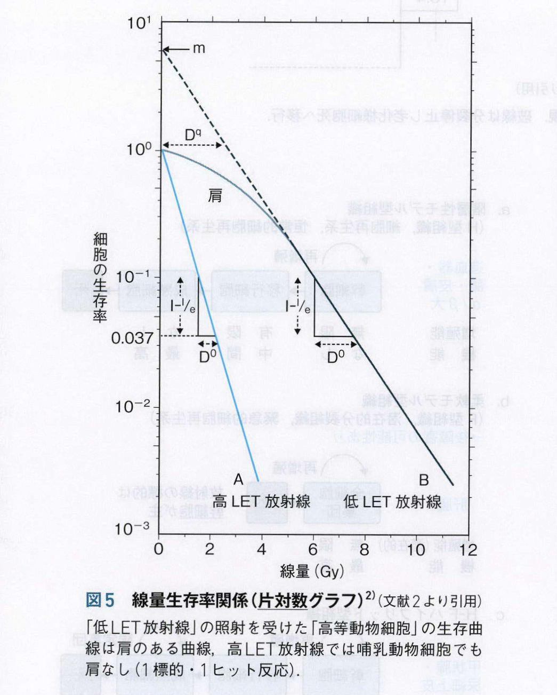

**こたえ**
- 2018-03: `数時間`
- 2019-02: `2回目照射後の生存曲線の形状は初回照射後と同様になる。`

### LQモデル (§2-13-7-2)

◎[2013-03](http://www.radiology.jp/content/files/2012_1s_exsam.pdf#page=1)
直線―2次曲線モデル（LQモデル）について**誤っている**のはどれか。1つ選べ。
`α/βの単位はGyである。`
`後期反応のα/βは早期反応に比して小さい。`
`1本の放射線で2本鎖切断が生じる確率は線量の2乗に比例するとした。`
`致死障害は2本鎖切断であり単鎖切断では致死に至らないとしたモデルである。`
`細胞の生残曲線を多標的1ヒットのみで説明するには低線量の部分に無理があるため提唱された。`

◎[2017-02](http://www.radiology.jp/content/files/20170904_2.pdf#page=2)
LQモデルで，1回の照射線量をd，照射回数をnとした場合，照射効果を表す式はどれか。1つ選べ。
`n(α+βd)`
`n(αd+βd)`
`n(αd+β^2d)`
`n(αd+βd^2)`
`n(d+α/β d^2)`

【LQモデル(Linear-Quadratic Model)】
ヒット論・ターゲット論では放射線1本で一気に二本鎖切断が起こった場合しか考えていなかった.  
しかし, 実際には線量が多ければ, 単鎖切断が2回つづけて起こって結果的に二本鎖切断となるような場合も増えてくると考えられる.  
そこで, DNAの2本鎖の切断を, 1回の二重鎖切断によるものと2回の単鎖切断によるものにわけ, 両者を考慮したのがLQモデルとなる.  
やはり線量が増えると細胞の死亡率は指数関数的に増加していくようになっているが, 2回の単鎖切断については指数部分は線量の2乗に比例する.生存率は **exp(-αD-βD^2)** で表される.  

この式からわかるように, Dの増加にしたがって2回の単鎖切断による細胞死のほうが優勢になってくる.  
α, βは組織によってそれぞれ異なっているが, その指標の一つとして**「1回の二重鎖切断の確率＝2回の単鎖切断の確率」となる線量の大きさ**をもって特徴量とするものがある.  
この線量はα/βと等しい(単位はGy). 単に"alpha beta"などとよばれる.

**こたえ**
- 2013-03: `1本の放射線で2本鎖切断が生じる確率は線量の2乗に比例するとした。` が誤り
- 2017-02: `n(αd+βd^2)`

◎[2018-04](http://www.radiology.jp/content/files/20180926_2.pdf#page=4)
腫瘍と正常組織におけるα/β 比(LQモデル)の関係で，寡分割照射が薦められる組み合わせはどれか。1つ選べ。  
`(腫瘍のα/β,正常組織のα/β)=(2,2),(2,3),(3,2),(3,3),(4,3)`

◎[2014-06](http://www.radiology.jp/content/files/1377.pdf#page=3)
放射線治療で起こりうる有害事象でα/β比（LQモデル）が大きいのはどれか。2つ選べ。  
`脱毛` `咽頭炎` `脳壊死` `白内障` `腎硬化症`

【α/β比の臨床的意味】
**α/β比は照射後の組織の回復にかかわる指標である**.  
あるターゲット(細胞/組織/臓器)とエンドポイント(障害/死亡)に対して生存率曲線を描くと, 
- 曲線の肩が大きい場合, LQモデルをフィッティングするとα/β比は小さくなる. 
- 曲線の肩が小さい場合, LQモデルをフィッティングするとα/β比は大きくなる. 

さらに, 曲線の肩が大きいということは亜致死損傷からの回復が見込めるということでもある.
したがって, 「**あるターゲットとエンドポイントの組に対し, α/βが小さいほど, 照射後の回復がより期待できる**」ということになる.  
そして, 一般的に **正常組織のα/βは小さく, 腫瘍のα/βは大きい**.

【同じエンドポイント・異なるターゲットに対するα/βの定性的比較】
正常組織と腫瘍のα/βをそれぞれ比べれば最適な分割回数を決定することができる. なぜなら,
- **α/β比が 正常組織 < 腫瘍 ならば, 正常組織の回復力に期待して, 分割回数を多くしたほうがよい**
- **α/β比が 正常組織 > 腫瘍 ならば, 腫瘍に再増殖の隙を与えないために, 分割回数を少なくしたほうがよい**
ことがいえるためである.

ちなみに, α/β比が高い組織を「**急性反応型組織**」, α/βが低い組織を「**晩期障害型組織**」とよぶ.  
- 急性反応型組織: 口腔粘膜, 骨髄, 皮膚, ほとんどの悪性腫瘍などのようにturn overの速い組織があてはまる.
- 晩期障害型組織: 脳, 脊髄, 肝臓, 腎臓, 肺などのようにturn overが遅いか, または全く起きない組織があてはまる.

【異なるエンドポイント・異なるターゲットに対するα/βの定性的比較】

放射線に対するさまざまな反応において, エンドポイントもターゲットも異なっているが, 概ね次のような傾向がある.
- 放射線治療に対する早期反応(急性障害)についてモデルフィッティングを行うと, α/βは大きくなる. 
    - 早期反応(急性障害)とは照射中〜照射後数ヶ月以内に生じる反応のこと.
    - 例: 粘膜炎, 皮膚炎, 骨髄抑制, 下痢など
- 放射線治療に対する晩期反応(晩期障害)についてモデルフィッティングを行うと, α/βは小さくなる.
    - 晩期反応(晩期障害)とは照射後6ヶ月〜数年後にはじめて生じる反応のこと.
    - 例: 皮膚潰瘍, 肺線維症, 腎不全, 放射線脊髄症など

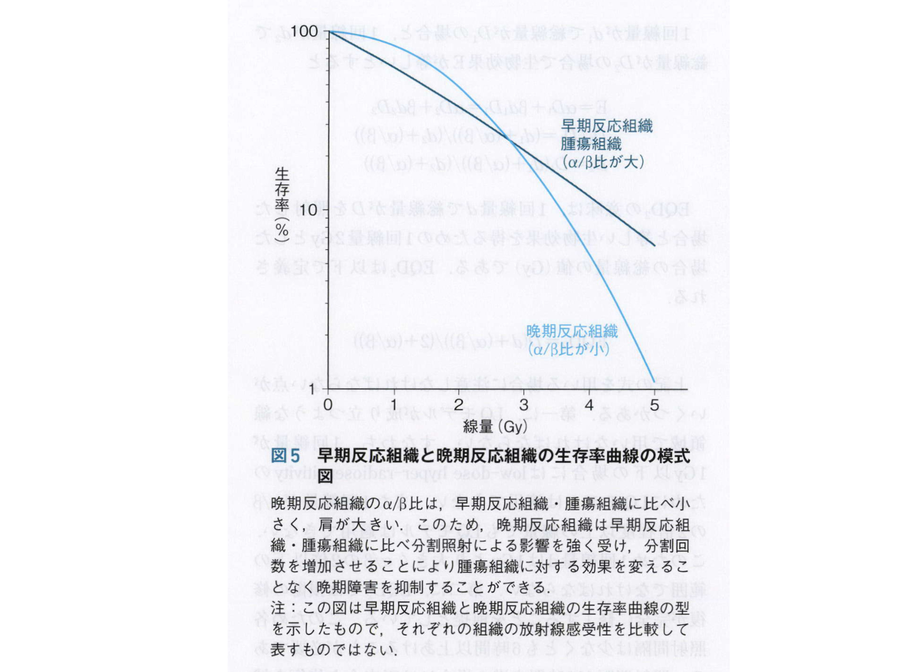

まとめ
||低α/β|高α/β|
|---|---|---|
|亜致死損傷からの回復力|高い|低い|
|組織のturn over|少ない|多い|
|組織の類型|晩期障害型組織|急性反応型組織|
|腫瘍に対する分割回数|減らす|増やす|
|腫瘍に対する1回線量|増やす|減らす|

**こたえ**
- 2018-04: `(腫瘍のα/β,正常組織のα/β)=(2,3)`
- 2014-06: `脱毛`, `咽頭炎` (早期障害を選べばよい)
- 2015-07: `前立腺癌（腺癌）`

◎[2015-07](http://www.radiology.jp/content/files/20150821.pdf#page=3)
LQモデルにおける α/β 比が小さいとされている腫瘍はどれか。1つ選べ。
`乳癌（腺癌）` `前立腺癌（腺癌）` `肺癌（扁平上皮癌）` `頭頸部癌（扁平上皮癌）` `子宮頸癌（扁平上皮癌）`

α/βの小さい腫瘍とは, 要するにturn overが少なく正常組織と似た性質を示す腫瘍のことである.  
α/βの小さい腫瘍の例:
- 前立腺癌, 悪性黒色腫, 聴神経腫瘍, 頭蓋底腫瘍, 髄膜腫, 下垂体腫瘍, 転移性脳腫瘍, 転移性脊髄腫瘍

**こたえ**

◎[2019-04](http://www.radiology.jp/content/files/20190904_02.pdf#page=3)
2Gy等価線量換算値（EQD2）の比較で，照射効果の大小関係が正しいのはどれか。2つ選べ。ただし，LQモデルにおけるα/β比は2と仮定する。  
`20Gy/4fr < 24Gy/12fr`  
`20Gy/5fr < 22Gy/11fr`  
`20Gy/8fr < 20Gy/10fr`  
`20Gy/10fr < 24Gy/12fr`  
`20Gy/20fr < 18Gy/9fr`  

◎[2016-07](http://www.radiology.jp/content/files/20160825.pdf#page=3)
正常組織の晩期反応が最も大きいのはどれか。1つ選べ。ただし，LQモデルにおけるα/β比は3で，照射期間の相違は無視できると仮定する。  
`30Gy/6回` `30Gy/10回` `30Gy/12回` `30Gy/15回` `30Gy/20回`

【2Gy等価線量換算値(EQD2)】  
1回線量をd, 照射回数をnとしたとき, その照射効果が1回2Gyで照射したときの総線量いくつ分に相当するかを計算することができる.  
計算式は EQD2 = d * n * (d + α/β) / (2 + α/β).  

ただし, EQD2の使用にあたっては以下の制約がある.  
- 1回線量は1Gy以上, かつα/βの2倍以下でなければならない.
- 各照射間隔は6時間以上空いていなければならない.  
- 比較する照射法の総治療期間は等しくなければならない.

**こたえ**
- 2019-04: `20Gy/10fr < 24Gy/12fr`, `20Gy/20fr < 18Gy/9fr`  
- 2016-07: `30Gy/6回`

## 分割照射 (§3-8)

◎[2017-01](http://www.radiology.jp/content/files/20170904_2.pdf#page=1)
加速過分割照射で使われている分割線量（1回線量）はどれか。1つ選べ。  
`1.0 Gy` `1.5 Gy` `2.0 Gy` `2.5 Gy` `3.0 Gy` 

◎[2014-08](http://www.radiology.jp/content/files/1377.pdf#page=4)
通常分割照射と比較した場合，加速過分割（多分割）照射で正しいのはどれか。1つ選べ。  
`総線量が多い。`  
`1回線量が多い。`  
`照射日数が多い。`  
`照射期間が短い。`  
`照射回数が少ない。`  

放射線治療計画においては晩期障害をいかに抑えるかがもっとも重要である.  
晩期障害こそが回復しにくく治療が困難であるためである.  

一般に, α/βの大きい腫瘍(ほとんどの腫瘍)については, 1回線量を減らしてかわりに回数を多くする.
逆に, α/βの小さい腫瘍(turn overが少なく正常組織と似た性質を示す腫瘍)については, 1回線量を多くしてかわりに回数を減らす.

- 過分割照射 Hyperfractionation
    - たとえば「1回2Gyで1日1回照射を25日間」を, 「1回1.1〜1.2Gyで1日2回照射を12.5日間」などにする.
    - 1回あたりの線量を落として正常組織への影響を減らすかわりに, 分割回数を増やすことで, 結果として総線量を増やせる.
- 加速分割照射 Accelerated fractionation
    - たとえば「1回2Gyで1日1回照射を25日間」を, 「1回2Gyで1日2回照射を12.5日間」などにする.
    - 1回あたりの線量を落とさないもの.
    - きわめて増殖の速い腫瘍を対象に行うが, 急性障害が強く出るため適応となるケースは少ない.
- 加速過分割照射 Accelerated hyperfractionation
    - たとえば「1回2Gyで1日1回照射を25日間」を, 「1回1.6Gyで1日2回照射を12.5日間, ただし前半と後半に1週間の休止期間をおく」などにする.
    - 加速分割照射を, 急性障害の緩和を狙って改変したもの.
- 寡分割照射 Hypofractionation
    - 1回線量を2Gy以上として分割回数を減らす方法.
    

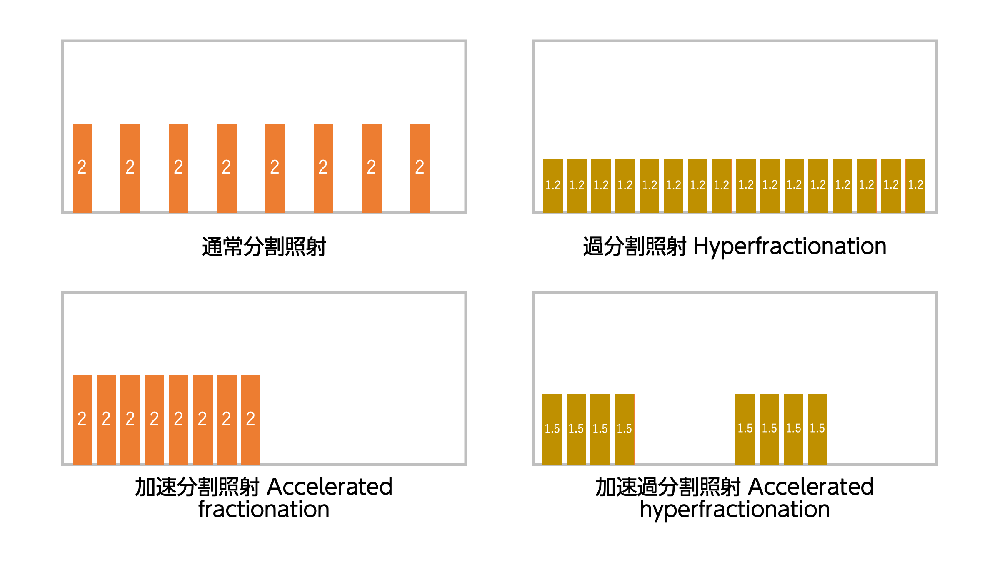

**こたえ**
- 2017-01: `1.5 Gy`
- 2014-08: `照射期間が短い。`

[2013-08](http://www.radiology.jp/content/files/2013_2s_exsam.pdf#page=3)
エックス線の放射線治療における分割照射のメリットとして**誤っている**のはどれか。1つ選べ。  
`治療可能比を上昇させる。`  
`腫瘍細胞の加速再増殖を抑える。`  
`腫瘍組織における再酸素化を促す。`  
`正常細胞の亜致死障害からの回復を促す。`  
`腫瘍組織における細胞周期の再分布を促す。` 

## LET, RBE, OER, 線量率効果 (§3-1-12,14,15,16,17,18)

◎[2013-02](http://www.radiology.jp/content/files/2013_2s_exsam.pdf#page=1)
高LET（線エネルギー付与）放射線はどれか。2つ選べ。  
`γ線`  `電子線`  `陽子線`  `中性子線`  `炭素イオン線`  

◎[2012-02](http://www.radiology.jp/content/files/2012_1s_exsam.pdf#page=1)
LETについて**誤っている**のはどれか。1つ選べ。  
`陽子線は低LET放射線である。`  
`高LET放射線では線量率効果は小さい。`  
`生物学的効果比(RBE)はLETに比例する。`  
`高LET放射線のDNA損傷は直接作用が主体である。`  
`高LET放射線では低LET放射線より酸素効果が小さい。`  

◎[2012-04](http://www.radiology.jp/content/files/2012_1s_exsam.pdf#page=2)
放射線生物学について**誤っている**のはどれか。1つ選べ。  
`細胞周期のうちS期にある細胞は放射線感受性が高い。`  
`LETとは飛跡上の一定距離当たりで付与するエネルギーのことである。`  
`高LET放射線は低LET放射線に比してDNAの二重鎖切断を起こしやすい。`  
`有酸素状態にある腫瘍細胞と比較して，低酸素状態にある腫瘍細胞はX線照射に対する感受性が低い。`  
`同等の生物学的効果を及ぼす線量がX線6Gy，炭素線2Gyであれば，炭素線の生物学的効果比
(RBE)は3である。`  

◎[2014-05](http://www.radiology.jp/content/files/1377.pdf#page=3)
エックス線と比較した場合に高LET放射線の特徴で正しいのはどれか。2つ選べ。  
`酸素効果が大きい。`  
`生存曲線の肩が大きい。`  
`直接作用が主体である。`  
`細胞周期依存性が低い。`  
`組織内で散乱しながら進行する。` 

◎[2016-06](http://www.radiology.jp/content/files/20160825.pdf#page=2)
治療に用いられている高LET放射線の特徴をX線と比較した記述で正しいのはどれか。1つ選べ。  
`酸素効果が小さい。`  
`間接作用の比率が高い。`  
`生存曲線に大きな肩ができる。`  
`組織内で散乱しながら進行する。`  
`分割照射における修復は同程度である。`  

◎[2019-03](http://www.radiology.jp/content/files/20190904_02.pdf#page=2)
治療に使われている重粒子線をX線と比較した場合に正しいのはどれか。2つ選べ。  
`酸素効果比（OER）が大きい。`  
`細胞周期の影響を受けやすい。`  
`組織間で感受性の差が小さい。`  
`線エネルギー付与（LET）が低い。`  
`生物学的効果比（RBE）が大きい。` 

◎[2015-06](http://www.radiology.jp/content/files/20150821.pdf#page=3)
治療に使われている放射線で生物学的効果比（RBE）が最も大きいのはどれか。1つ選べ。  
`炭素線` `電子線` `陽子線` `ガンマ線` `エックス線` 

◎[2012-05](http://www.radiology.jp/content/files/2012_1s_exsam.pdf#page=2)
酸素効果について正しいのはどれか。1つ選べ。  
`高LET放射線ではOERは2～3程度である。`  
`OERは酸素分圧が高くなればなるほど高くなる。`  
`放射線照射後に酸素濃度を高めるとOERが高くなる。`  
`照射時の組織の酸素分圧によって効果の大きさが決まる。`  
`高LET放射線では低LET放射線にくらべ酸素効果が大きい。`  

【線エネルギー付与(LET: Linear Energy Transfer)】

荷電粒子が物質中を通過する際の単位飛程あたりのエネルギー損失を表し, keV/μmで表す.  
基本的には重いほど大きい. なお, 電荷をもたない放射線であっても, 中性子線を高LET放射線に, X線やγ線などのを低LET放射線に慣習的に含める.  

- **核分裂生成物 > 低原子番号の原子核 > α線 > 中性子線 (ここまで高LET) > (ここから低LET) 陽子線, 電子線, X線, γ線**
- 実は中性子のほうが陽子の1.008倍重い.

【線量率効果】

低LET放射線は, 総線量が同じでも分割回数を増やすほどに生物学的効果が小さくなる.  
これは, ぎりぎり細胞死を免れるような程度のDNA損傷が次の照射までの間に回復されてしまうことにより説明できる.

【生物学的効果(RBE: Relative Biological Effectiveness)】

たとえ吸収線量の総量が同一であっても, それがもたらす生物学的効果はLET, 線量, 治療期間, 線量率, 分割回数などによりさまざまである.  
しかし, 異なる放射線照射どうしを基準放射線との比をとることによって相対的に比較することは可能であり, その比をRBEとよぶ.  
基準放射線には通常はX線が用いられる.  
**RBEは「基準放射線量÷対象の放射線量」によって計算する**. つまり, 1/3の線量で済んでしまう場合は生物学的効果は3倍となる.

なお, RBEはLETが大きいほど大きい傾向にあるが, 完全に比例するわけではなく, 下図のように**LETが大き過ぎるとRBEはむしろ低下する**.  
これは, 粒子線治療の際に無限に大きな核子を使うのではなく炭素線が使われている説明にもなろう.

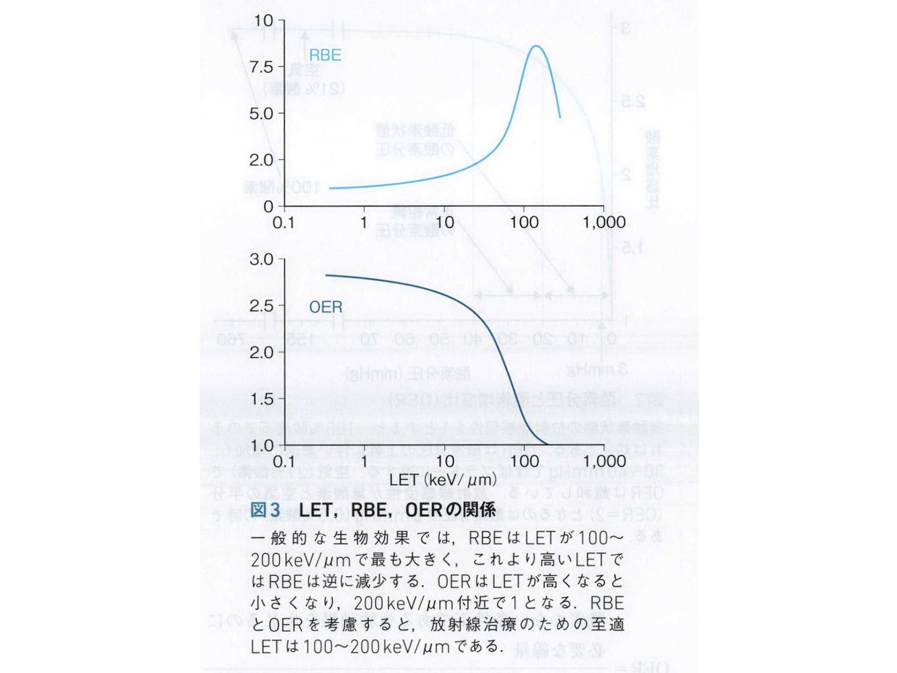

【酸素効果と酸素効果比(OER: Oxygen Enhancement Ratio)】

酸素の存在下では放射線の生物学的効果が大きくなる. これを酸素効果とよぶ.  
**OERは「酸素なしの場合の線量÷酸素ありの場合の線量」によって計算する**. つまり, 酸素があれば酸素がない場合の1/3の線量で済んでしまう場合, 酸素効果比は3倍となる.  
酸素効果は放射線の間接作用が増加することによるものなので, 直接作用が中心となる高LET放射線については酸素効果は小さい.

なお, 組織酸素分圧に応じてOERは下図のように変化する. 正常組織の酸素分圧は20〜40mmHgで, この時点ですでにOERは約3でプラトーに達している.  
したがって,OERを高めるためにさらに酸素分圧を上げようとする試みにはおそらく意味はない.

また, OERはあくまで照射時の酸素分圧に依存するため, **照射後に酸素分圧を上げることに意味はない**.

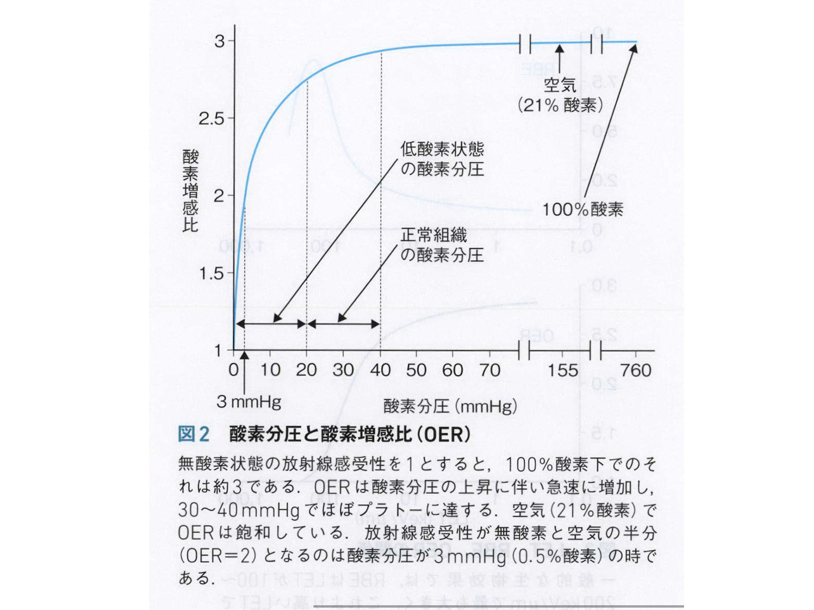

**こたえ**
- 2013-02: `炭素イオン線`, `中性子線`
- 2012-02: `生物学的効果比(RBE)はLETに比例する。`が誤り
- 2012-04: `細胞周期のうちS期にある細胞は放射線感受性が高い。` が誤り
- 2014-05: `直接作用が主体である。`, `細胞周期依存性が低い。`
- 2016-06: `酸素効果が小さい。`
- 2019-03: `組織間で感受性の差が小さい。`, `生物学的効果比（RBE）が大きい。` 
- 2015-06: `炭素線`
- 2012-05: `照射時の組織の酸素分圧によって効果の大きさが決まる。` 

## 放射線に対する反応モデル (§2-13-7)

# 放射線治療各論
## 肺癌
### ステージング (§7-26)
◎[2019-97](http://www.radiology.jp/content/files/20190904_02.pdf#page=34)
原発性肺癌IIIA期はどれか（ただし記載ない部位の進展はないものとする）。2つ選べ。  
`原発と同側別肺葉内の副腫瘍結節`  
`胸膜結節かつ同側肺門リンパ節転移`  
`心膜浸潤かつ同側縦隔リンパ節転移`  
`充実成分径1cmかつ同側鎖骨上窩リンパ節転移`  
`肺門まで連続する無気肺かつ気管分岐下リンパ節転移`  

【肺癌のStaging】

- 充実成分径によるT因子
    - Tis: 上皮内癌
    - T1: 3cm以下 (T1a: 1cm以下, T1b: 1cmを超え2cm以下, T1c: 2cmを超え3cm以下)
    - T2a: 3cmを超え4cm以下 (ただし後述する条件を満たす場合は大きさを問わない)
    - T2b: 4cmを超え5cm以下 (ただし後述する条件を満たす場合は大きさを問わない)
    - T3: 5cmを超え7cm以下 (ただし後述する条件を満たす場合は大きさを問わない)
    - T4: 7cmを超える (ただし後述する条件を満たす場合は大きさを問わない)
- 進展範囲によるT因子
    - 末梢側への進展
        - T1: 胸膜浸潤なし
        - T2: 臓側胸膜まで浸潤あれば大きさによらずT2
        - T3: 壁側胸膜または胸壁まで浸潤あれば大きさによらずT3
    - 中枢側への進展
        - T1: 主気管支に及んでいない
        - T2: 主気管支に及ぶが気管分岐部には及んでいなければ大きさによらずT2
        - T4: 気管分岐部に及んでいれば大きさによらずT4
    - 副腫瘍結節
        - T3: 不連続な副腫瘍結節が同一肺葉内にあれば大きさによらずT3
        - T4: 不連続な副腫瘍結節が同側の異なる肺葉内にあれば大きさによらずT4
    - 他臓器浸潤
        - T3: 心膜, 横隔神経のいずれかに浸潤していれば大きさによらずT3
        - T4: 心臓大血管, 縦隔, 食道, 反回神経, 横隔膜, 椎体のいずれかに浸潤していれば大きさによらずT4
    - ほか
        - T2: 肺門まで連続する部分的もしくは一側全体の無気肺もしくは閉塞性肺炎があれば大きさによらずT2
- N因子
    - N1: 同側肺門リンパ節までの転移
    - N2: 同側縦隔リンパ節または気管分岐部リンパ節までの転移
    - N3: 他の領域リンパ節 (対側縦隔, 対側肺門, 左右いずれかの前斜角筋, 左右いずれかの鎖骨上窩) までの転移
- M因子
    - M1a: 対側肺内の副腫瘍結節, 胸膜結節, 悪性胸水, 悪性心嚢水
    - M1b: 肺以外に遠隔転移があり, 単発である (1臓器かつ病変が1個)
    - M1c: 肺以外に遠隔転移があり, 多発している (病変が複数ある)
- Staging
    - Stage IA: T1N0M0
    - Stage IB: T2aN0M0
    - Stage IIA: T2bN0M0
    - Stage IIB: T1-2N1M0 または T3N0M0
    - Stage IIIA: T1-2N2M0 または T3N1M0 または T4N0-1M0
    - Stage IIIB: T1-2N3M0 または T3N2M0 または T4N2M0
    - Stage IIIC: T3-4N3M0
    - Stage IVA: M1a-b
    - Stage IVB: M1c

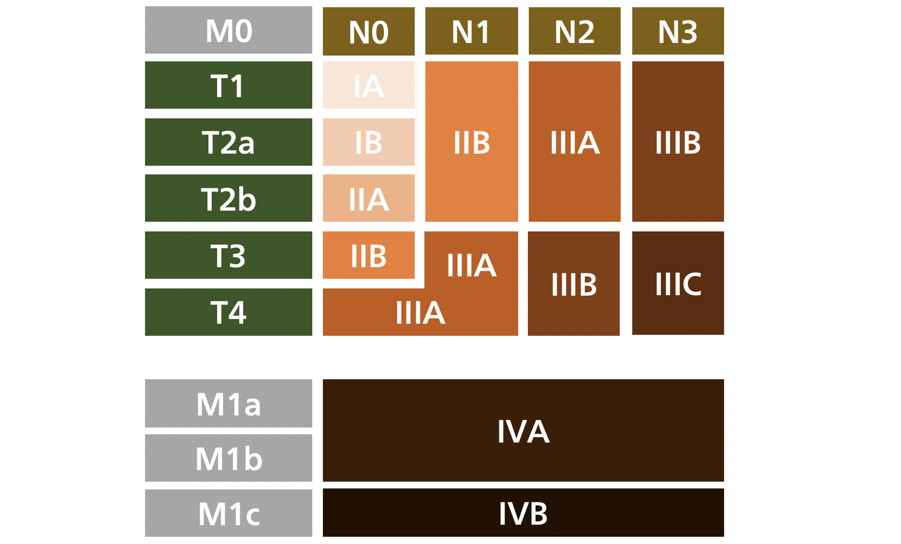

**こたえ**
- 2019-97: `原発と同側別肺葉内の副腫瘍結節`, `肺門まで連続する無気肺かつ気管分岐下リンパ節転移`

### 体幹部定位放射線照射 (§7-28)

◎[2018-104](http://www.radiology.jp/content/files/20180926_2.pdf#page=37)
原発性肺癌の定位放射線治療で正しいのはどれか。1つ選べ。  
`肺門リンパ節をCTVに含める。`  
`早期有害事象に肋骨骨折がある。`  
`腫瘍径3cm以内がよい適応である。`  
`腺癌では扁平上皮癌より線量増加する。`  
`肺門型には48Gy/4回/1～2週を用いる。`  

◎[2016-97](http://www.radiology.jp/content/files/20160825.pdf#page=35)
末梢型IA期非小細胞肺癌の定位放射線治療として**誤っている**のはどれか。1つ選べ。  
`放射線単独治療である。`  
`X線エネルギーは高いほどよい。`  
`線量分割に48Gy/4回を用いる。`  
`画像誘導放射線治療を併用する。`  
`重篤な合併症に致死的放射線肺炎がある。`  

◎[2012-94](http://www.radiology.jp/content/files/2012_1s_exsam.pdf#page=32)
肺癌の定位照射が原則適応に**ならない**部位はどこか。1つ選べ。  
`肺尖部`  `肺底部`  `肺門部`  `胸壁近接部`  `葉間胸膜部`  

- 定位放射線治療とは?
    - 多門照射にすることで線量集中性を高める照射法. これにより1回線量を増やすことができる.
    - 多門照射にするため照射時間が長くなる. また, 照射中心の固定精度をより高めることが要求される (三次元方向で5mm以内).

【原発性肺癌に対する体幹部定位放射線治療】

- 適応
    - 充実成分径5cm以内, かつ内科的理由などにより手術が困難な症例.
        - つまり stage 2A以下 (=T1-2bN0M0).
        - 原則的には末梢側肺癌が適応となる.
        - 肺門部型であっても適応となることはあるが, 大線量が食道, 気管, 血管などに照射される可能性が高い場合は照射適応にならないこともある.
- 体積
    - 原発巣をGTVかつCTVに設定し, 呼吸変動を考慮してPTVを設定する.
    - なお, **呼吸移動は上肺野よりも下肺野のほうが大きい**.
- 線量
    - 末梢型の場合: **48Gy/4Fr**, 45-54Gy/3Fr, 60Gy/5-8Frなど
    - 肺門型の場合は分割回数を多くする: **60Gy/8Fr** (JROSG10-1による線量決定試験における線量)など
    - 組織型によって線量を変えることは現在のところ行われていない.
- 有害事象
    - 放射線肺臓炎
        - もっとも頻度が高い.
        - 照射終了後2〜6ヶ月目に出現することが多い.
        - 大部分は画像上に変化が出たとしても無症状か, 軽度の咳嗽, 微熱にとどまり, 投薬不要
        - ただし, **背景に間質性肺疾患がある場合は致死的となるリスクが高い**ので注意.
    - ほか
        - 致死的な喀血, 致死的な食道潰瘍の報告がある.
    
【転移性肺癌に対する体幹部定位放射線治療】

- 適応
    - 直径5cm以内かつ3個以内であり, かつこれ以外に転移巣がない症例.

**こたえ**
- 2018-104: `腫瘍径3cm以内がよい適応である。`  
- 2016-97: `X線エネルギーは高いほどよい。`  
- 2012-94: `肺門部` 

### 非小細胞肺癌に対する根治照射 (§7-27)

◎[2018-105](http://www.radiology.jp/content/files/20180926_2.pdf#page=37)
右肺上葉扁平上皮癌T2N3M0に対して根治的化学放射線療法を計画した。正しいのはどれか。2つ選べ。  
`両側肺門をCTVに含める。`  
`肺V20を30%以内に設定する。`  
`74Gy/37回/7.5週まで治療を行う。`  
`下葉原発より体内標的体積が小さい。`  
`放射線単独治療より1回線量を減らす。`  

[2017-97](http://www.radiology.jp/content/files/20170904_2.pdf#page=34)
III期非小細胞肺癌の化学放射線療法として正しいのはどれか。2つ選べ。  
`肺野の腫瘤は定位照射の適応である。`  
`線量計算に不均質補正を必要としない。`  
`CRが得られれば予防的全脳照射を行う。`  
`60Gy/30回/6週が標準的線量分割である。`  
`腫瘍の呼吸性移動の把握に4D-CTを用いる。`  

◎[2016-96](http://www.radiology.jp/content/files/20160825.pdf#page=35)
IIIB期非小細胞肺癌の根治的化学放射線療法で照射野に**含めるべきでない**のはどれか。1つ選べ。  
`対側縦隔`  `対側肺門`  `気管分岐部`  `同側鎖骨上窩`  `対側鎖骨上窩`  

◎[2015-96](http://www.radiology.jp/content/files/20150821.pdf#page=33)
切除不能III期非小細胞肺癌に対する同時化学放射線療法の一般的な5年生存率はどれか。1つ選べ。  
`10％以下`  `15～25％`  `30～40％`  `45～55％`  `60％以上`  

◎[2014-97](http://www.radiology.jp/content/files/1377.pdf#page=34)
非小細胞肺癌に対する根治的放射線治療について正しいのはどれか。2つ選べ。  
`T3N1M0では縦隔リンパ節をCTVに含める。`  
`腺癌より扁平上皮癌の方が治療成績が良い。`  
`分子標的療法を併用すると治療成績が向上する。`  
`末梢型T1N0M0では肺門リンパ節をCTVに含める。`  
`同時併用化学放射線療法は順次併用療法よりも有害事象が多い。`  

◎[2012-95](http://www.radiology.jp/content/files/2012_1s_exsam.pdf#page=32)
非小細胞肺癌の放射線治療について正しいのはどれか。1つ選べ。  
`局所進行癌では化学療法を順次併用する。`  
`末梢型I期には強度変調放射線治療を行う。`  
`Pancoast腫瘍は根治照射の適応とならない。`  
`局所制御された場合は全脳予防照射の適応がある。`  
`対側肺門リンパ節転移のあるIIIb期は根治照射の適応とならない。`  

【原発性肺癌に対する根治照射】

- 適応のまとめ
    - 基本的には「stage4でない」「手術ができない」症例が根治照射の適応となる.
    - stage 1 (=T1N0M0, T2aN0M0)
        - 耐術能がなければ**RT単独**
            - 末梢型ならば, もしくは中枢側でも可能そうであれば定位放射線治療
    - stage 2A (=T2bN0M0)
        - 耐術能がなければ**RT単独**
            - 末梢型ならば, もしくは中枢側でも可能そうであれば定位放射線治療
    - stage 2B (=T3N0M0, T1-2N1M0)
        - 耐術能がない or 切除不能なら**RT単独もしくは化学放射線療法**
    - stage 3A, 3B, 3C (=T1-2N2-3M0, T3N1-3M0, T4N0-3M0)
        - 以下の3点をすべてみたす場合にのみ, **化学放射線療法もしくはRT単独**
            - 手術ができない.
            - 対側肺門リンパ節転移がない.
            - 同側の他の肺葉に肺内転移がない.
        - 基本的な考え方としては「腫瘍の存在範囲をすべて照射野内に含めることができ, かつ正常組織への影響を許容範囲内に収められる」.

【体幹部定位照射が適応とならない原発性肺癌に対する根治照射】

- 治療方針
    - 切除不能なstage3: 化学療法が可能であれば, **プラチナ製剤をふくむ化学療法と, できれば同時併用する (CCRT)**.
        - カルボプラチン+ドセタキセル(CP療法)との併用がスタンダード.
        - EGFR-TKIなどの分子標的薬はまだ臨床試験の段階なので避けたほうがよい.
        - 同時併用すると順次併用よりも生存期間は増すが, 急性有害事象の頻度も高くなる.
- 体積
    - GTV:
        - 肺癌原発巣 + CTにて短径1cm以上の腫大リンパ節
        - 短径1cm未満だがFDG-PET陽性の腫大リンパ節を含めるかどうかは総合的に判断する
    - CTV:
        - 原発巣について: GTV周囲の5〜10mm.
            - 注: 腺癌では潜在的な浸潤範囲が扁平上皮癌にくらべて広い.
        - 予防的リンパ節照射(ENI): 同側肺門, 気管分岐下リンパ節, 上縦隔リンパ節までを含める. **対側肺門リンパ節は含めてはならない!!**
            - 注: 扁平上皮癌の場合: **順次性にリンパ節転移する**ので所属リンパ節領域のみでよいことが多い.
            - 注: 腺癌の場合: **skipしたリンパ節転移がみられる場合がある**ので照射範囲は症例ごとに考慮する必要がある.
            - なお, 予防的リンパ節照射を省くかわりに線量を増やす病巣部照射野 (Involved Field (IF)) も検討されているが, まだ検討段階にすぎない.
    - PTV: CTV + 5〜10mm
    - 治療計画: 両側の正常肺 (つまりGTV以外の部分) において20Gy以上照射される体積 (V20) が**35%以下**となるように計画する.
- 線量
    - 線質: 6〜10MVのX線
    - 照射法: 3D-CRT (IMRTはエビデンスが集積していない)
    - 線量:
        - 化学放射線療法の場合, **60/30Fr〜66Gy/33Fr**. RT単独の場合, **少なくとも60Gy/30Fr, ただし74Gyまでは増やさないこと**.
        - 脊髄の耐容線量を考慮し, **40-44Gyに達した段階で照射野を小さくし**, 脊髄が照射野から外れるようにする.
        - 以前, 予防的リンパ節照射を省くかわりに線量を74Gy/37Frまでに増やす試験が行われたが, 有意に予後が悪かったため推奨されていない.
- 有害事象
    - 放射線肺臓炎: V20が重症度と相関する.
    - 心臓: 40Gy以上照射されると組織学的な変化が生じる. ただし, 心臓の1/3を超えない範囲であれば60Gy照射されても臨床的に問題となることは稀.
    - 放射線脊髄症: 脊髄の耐容線量は**50Gy/25Fr未満**.
- 効果
    - Stage3非小細胞肺癌に対して根治的CCRTを行った場合, **2年生存率は45〜60%, 5年生存率は15〜25%**.
    - なお, 腺癌と扁平上皮癌の違いによる生存率については, 少なくとも教科書には掲載されていない.

**こたえ**
- 2018-105: `肺V20を30%以内に設定する。``下葉原発より体内標的体積が小さい。`
- 2017-97: `60Gy/30回/6週が標準的線量分割である。`, `腫瘍の呼吸性移動の把握に4D-CTを用いる。` 
- 2016-96: `対側肺門`
- 2015-96: `15～25％`
- 2014-97: `T3N1M0では縦隔リンパ節をCTVに含める。`, `同時併用化学放射線療法は順次併用療法よりも有害事象が多い。`
- 2012-95: `対側肺門リンパ節転移のあるIIIb期は根治照射の適応とならない。`

### 小細胞肺癌に対する根治照射 (§7-30)

[2014-96](http://www.radiology.jp/content/files/1377.pdf#page=33)
限局型小細胞肺癌に対する放射線治療法として推奨されるのはどれか。1つ選べ。  
`寡分割照射`  
`導入化学療法`  
`体幹部定位放射線治療`  
`30Gy/10回/2週 の予防的全脳照射`  
`CDDP+VP-16療法との早期同時併用`  

[2013-97](http://www.radiology.jp/content/files/2013_2s_exsam.pdf#page=33)
小細胞肺癌の予防的全脳照射として推奨されるのはどれか。1つ選べ。  
`20Gy/5Fr/1週`  `25Gy/10Fr/2週`  `30Gy/10Fr/2週`  `37.5Gy/15Fr/3週`  `40Gy/20Fr/4週`  

### まとめ

[2019-96](http://www.radiology.jp/content/files/20190904_02.pdf#page=34)
肺癌の病状と放射線治療法の組み合わせで**誤っている**のはどれか。1つ選べ。  
`I期非小細胞肺癌 : 体幹部定位放射線治療`  
`限局期小細胞肺癌 : 予防的全脳照射`  
`進展型小細胞肺癌 : 加速過分割照射`  
`III期非小細胞肺癌 : 不均質補正法`  
`単発(2cm)脳転移 : 定位放射線治療`  

[2015-95](http://www.radiology.jp/content/files/20150821.pdf#page=33)
肺癌放射線治療の線量分割として正しいのはどれか。2 つ選べ。
`小細胞癌予防的全脳照射 25Gy/10回/2週`  
`小細胞癌脳転移全脳照射 45Gy/15回/3週`  
`III期非小細胞癌根治照射 50.4Gy/28回/5.5週`  
`限局型小細胞癌根治照射 60Gy/40回/4週 (1日2回)`  
`I期非小細胞癌定位放射線照射 48Gy/4回/1週`  

## 乳癌
### 乳房温存術後照射 (§7-34,35) 
◎[2019-99](http://www.radiology.jp/content/files/20190904_02.pdf#page=35)
乳房温存療法の放射線治療で正しいのはどれか。2つ選べ。  
`照射野の皮膚発汗が低下する。`  
`非浸潤性乳管癌では省略してよい。`  
`全乳房接線照射で腋窩は含まれない。`  
`左側乳癌で虚血性心疾患は増加しない。`  
`非浸潤性乳管癌では生存率は向上しない。`  

◎[2018-95](http://www.radiology.jp/content/files/20180926_2.pdf#page=34)
乳房温存術後の放射線治療で**誤っている**のはどれか。1つ選べ。  
`全乳房照射を行う。`   
`4MVのX線を用いる。`  
`非浸潤性乳管癌には省略してよい。`  
`腋窩リンパ節転移例で所属リンパ節照射を行う。`  
`腫瘍床ブースト照射の併用で乳房内再発が減少する。`  

◎[2017-99](http://www.radiology.jp/content/files/20170904_2.pdf#page=35)
乳房温存照射として正しいのはどれか。2つ選べ。  
`GTVは腫瘍床である。`  
`非浸潤癌は適応である。`  
`寡分割照射法は用いない。`  
`乳癌死の絶対リスクが低下する。`  
`術前化学療法で病理学的CRとなった場合は必要ない。`  

◎[2016-99](http://www.radiology.jp/content/files/20160825.pdf#page=36)
乳房温存術後照射で正しいのはどれか。2つ選べ。  
`50Gy/25回/5週を用いる。`  
`非浸潤癌では適応外である。`  
`同側腋窩リンパ節をCTVに含める。`  
`線量分布の改善にfield in field法が有用である。`  
`手術単独と比較して生存率の向上には寄与しない。`  

◎[2014-98](http://www.radiology.jp/content/files/1377.pdf#page=34)
pN0乳癌乳房温存術後の放射線治療について正しいのはどれか。1つ選べ。  
`化学療法を同時併用する。`  
`非浸潤性乳管癌は照射の適応である。`  
`同側傍胸骨リンパ節領域にも照射する。`  
`同側鎖骨上窩リンパ節領域にも照射する。`  
`10MV以上の高エネルギーX線で照射する。` 

◎[2013-98](http://www.radiology.jp/content/files/2013_2s_exsam.pdf#page=33)
乳癌cT1cN0M0で乳房温存術を施行したところ，腋窩リンパ節転移を4個認めた。術後照射における臨床標的体積（CTV）として適切なのはどれか。1つ選べ。  
`乳房のみ`  
`乳房，同側腋窩リンパ節`  
`乳房，同側胸骨傍リンパ節`  
`乳房，同側鎖骨上窩リンパ節`  
`乳房，同側鎖骨上窩リンパ節，同側腋窩リンパ節`  

◎[2012-97](http://www.radiology.jp/content/files/2012_1s_exsam.pdf#page=33)
乳癌に対する乳房温存術後の放射線治療として正しいのはどれか。1つ選べ。  
`全乳房照射は予後の改善に寄与しない。`  
`傍胸骨リンパ節転移が疑われる場合には手術切除が原則である。`  
`術後病理検査で断端陰性の場合には術後腫瘍床への局所照射のみで良い。`  
`腋窩リンパ節転移が4個以上の場合には同側鎖骨上窩への照射が必要である。`  
`センチネルリンパ節生検で陽性の場合には腋窩郭清後に腋窩への照射が必要である。`  

    
【乳房放射線治療の実際(1): 非浸潤癌】

- 適応, 効果, 照射法
    - 基本的に**早期浸潤癌に準ずる**.
    - DCISに対して乳房温存術を行い, 断端陰性であった場合, **放射線治療が必要(推奨グレードA)**.
        - **乳房内局所再発を低下させる** ことが4つのRCTにおいて示された.
        - **死亡率の低下は確認されていない**.
        - 全乳房接線照射. 4〜6MV X線を用いる. 1回線量は1.8〜2Gy, 総線量は45〜50Gy.
    - DCISに対して乳房温存術を行い, 断端陽性であった場合, **放射線治療が必要(推奨グレードA)**.
        - **乳房内局所再発を低下させる**.
        - 全乳房接線照射 50Gy/25Fr を行ったあと, 電子線ブースト照射を 10Gy/5Fr 追加する.
        

【乳房放射線治療の実際(2): 早期浸潤癌に対する温存療法後】

- 手術について
    - リンパ節の扱い
        - DCISでは, センチネルリンパ節生検は不要.
        - 浸潤癌では, cN0症例ならばセンチネルリンパ節生検を行う.
            - 転移陰性なら郭清を省略できる.
            - 微小転移であっても郭清を省略できる.
            - マクロ転移の場合は, 術後放射線治療を行う場合は郭清を省略できる. 乳房切除単独の場合は郭清を行う.

- 所属リンパ節転移のない場合
    - 適応
        - 早期浸潤癌に対して乳房温存術を行った場合, リンパ節転移陰性なら, 原則的に**放射線治療が必要**.
        - 乳房内の肉眼的病巣を外科的に切除しても, 乳管内進展や乳房内多発による微小な遺残病巣は残っている.
        - したがって, 微小な遺残病巣の根絶のために放射線治療は必要.
        - 手術単独の場合, 2cmのフリーマージンをとって切除しても42%の症例で遺残病変が存在する.
    - 効果
        - 局所再発防止に対する寄与
            - 顕微鏡的な残存腫瘍のおよそ2/3が制御可能.
            - 残りの1/3は放射線抵抗性であり, 放射線療法を行っても局所再発を完全に予防することはできない.
            - つまり, 放射線治療によって, **局所再発の相対リスクは約1/3になり, 絶対リスクは(非照射の局所再発リスク)×2/3だけ減少する.**
            - よって, 放射線治療による絶対リスクの減少の大きさは, もともとの局所再発リスクに依存する.
            - 復習: 絶対リスク, 相対リスク, リスク比
                - 絶対リスク   : p(イベント発生|母集団) のこと.
                - 絶対リスク差 : p(イベント発生|母集団1) - p(イベント発生|母集団2) のこと.
                - 相対リスク   : p(イベント発生|母集団1) / p(イベント発生|母集団2) のこと.
        - 生存率に対する寄与
            - 局所再発例を4例減らすごとに**乳癌死を1例減らす**ことができる.
            - ただし, もともと局所再発リスクが10%以上なければ生存率向上に結びつかないとの意見もあり, あらゆる患者に生存率向上が期待できるとは限らない.

- 所属リンパ節転移がある場合
    - 適応
        - 腋窩リンパ節転移が4個以上ある場合, **同側鎖骨上窩リンパ節領域への照射が必要**.
        - ただし, 近年では腋窩リンパ節転移が1〜3個の場合でも同側鎖骨上窩リンパ節領域への照射が勧められる.
    - 効果
        - 局所制御率, 所属リンパ節制御率が改善する
    - 照射法
        - 傍胸骨リンパ節領域については, 画像的/病理学的に転移が確認されていない場合は照射の意義についてのエビデンスに乏しい.

【寡分割照射を行ってよい場合】
- 乳房温存術後では, 以下の3条件をみたせば42.56Gy/16Frへの寡分割に変更してよい.
    - 50歳以上
    - 全身化学療法を行っていない
    - pT1N0M0 もしくは pT2N0M0 (=病巣が5cm以下)

【まとめ】
- 乳房温存術後の放射線治療は, 非浸潤癌であっても浸潤癌であっても局所再発率を低下させる.
- 一方, **生存率向上は浸潤癌でしか確認されていない**.
- 腋窩リンパ節転移陽性の場合は, **同側鎖骨上窩リンパ節領域に対して照射を行う**.

**こたえ**
- 2019-99: `照射野の皮膚発汗が低下する。`, `非浸潤性乳管癌では生存率は向上しない。` 
- 2018-95: `非浸潤性乳管癌には省略してよい。` が誤り
- 2017-99: `非浸潤癌は適応である。`, `乳癌死の絶対リスクが低下する。`  
- 2016-99: `50Gy/25回/5週を用いる。`, `線量分布の改善にfield in field法が有用である。`
- 2014-98: `非浸潤性乳管癌は照射の適応である。`
- 2013-98: `乳房，同側鎖骨上窩リンパ節`
- 2012-97: `腋窩リンパ節転移が4個以上の場合には同側鎖骨上窩への照射が必要である。`

◎[2019-98](http://www.radiology.jp/content/files/20190904_02.pdf#page=34)
乳癌温存手術後に全乳房照射を考慮してよいのはどれか。1つ選べ。  
`活動性SLE` `活動性強皮症` `活動性関節リウマチ` `Li-Fraumeni症候群` `仰臥位で患側上肢挙上不能`  

◎[2016-98](http://www.radiology.jp/content/files/20160825.pdf#page=35)
乳房温存術後照射を**避けるべき**併存症はどれか。2つ選べ。  
`掌蹠角化症` `尋常性ざ瘡` `尋常性乾癬` `全身性強皮症` `色素性乾皮症`  

    
【温存乳房に対する放射線治療の禁忌】
- 妊娠中.
- 患側乳房に対して放射線治療の既往がある.
- 仰臥位で患側上肢を挙上できない.
- 膠原病のうち, 活動性の強皮症もしくはSLEを合併している.
    - 皮膚や軟部組織に対する有害事象が高度であるため.
- 放射線療法による二次癌のリスクが極めて高い疾患を合併している(色素性乾皮症, Li Fraumeni症候群など).

**こたえ**
- 2019-98: `活動性関節リウマチ`
- 2016-98: `全身性強皮症`, `色素性乾皮症`

### 乳房切除術後照射 (§7-36)

[2015-97](http://www.radiology.jp/content/files/20150821.pdf#page=34)
右乳癌乳房切除術後，浸潤性乳管癌 腫瘍径3cm，腋窩リンパ節転移4個陽性であった。術後照射範囲として正しいのはどれか。1つ選べ。  
`右胸壁`  
`右腋窩リンパ節領域`  
`右胸壁，右鎖骨上リンパ節領域`  
`右鎖骨上リンパ節領域，右内胸リンパ節領域`  
`右胸壁，右鎖骨上リンパ節領域，右内胸リンパ節領域`  

  

## ほか

[2012-100](http://www.radiology.jp/content/files/2012_1s_exsam.pdf#page=34)
骨転移の放射線治療について正しいのはどれか。2つ選べ。
`疼痛改善率は 70～80％ 程度である。`  
`疼痛緩和効果が最大となるのは照射直後である。`  
`放射線抵抗性の腫瘍の骨転移では適応にならない。`  
`溶骨性病変の骨再生には治療終了後数ヶ月以上必要である。`  
`8Gy1回照射は30Gy10回照射と比較して疼痛緩和効果に劣る。`  

# 未分類

[2013-12](http://www.radiology.jp/content/files/2013_2s_exsam.pdf#page=4)
放射線診療従事者の管理で，男性と妊娠可能な女性とで異なるのはどれか。1つ選べ。  
`健康診断の項目` `教育訓練の項目` `線量集計の間隔` `一日の作業時間` `作業環境管理方法`  

[2013-13](http://www.radiology.jp/content/files/2013_2s_exsam.pdf#page=5)
エックス線の放射線加重係数の値はどれか。1つ選べ。  
`0.01` `0.05` `0.1` `1.0` `2.0`

[2013-14](http://www.radiology.jp/content/files/2013_2s_exsam.pdf#page=5)
放射線被ばくの分類で**誤っている**のはどれか。1つ選べ。  
`医師が医療行為で被ばく ――――――――――――――― 職業被ばく`  
`癌患者が放射線治療で被ばく ――――――――――――― 医療被ばく`  
`患者の検査時に介護者が被ばく ―――――――――――― 職業被ばく`  
`原子力発電所の職員が業務で被ばく ―――――――――― 職業被ばく`  
`妊娠女性が業務で被ばくした場合の胎児の被ばく ―――― 公衆被ばく`  

[2014-11](http://www.radiology.jp/content/files/1377.pdf#page=5)
医療被ばくについて正しいのはどれか。1つ選べ。  
`線量限度が設けられている。`  
`放射線治療による被ばくを含む。`  
`原子力災害による被ばくを含む。`  
`自然放射線による被ばくを含む。`  
`日本ではおおよそ年間1mSvである。`  

[2014-12](http://www.radiology.jp/content/files/1377.pdf#page=5)
Sv（シーベルト）以外の単位を用いる評価量はどれか。2つ選べ。  
`吸収線量` `実効線量` `線量限度` `等価線量` `放射能量` 

[2014-13](http://www.radiology.jp/content/files/1377.pdf#page=5)
小児の腹部CTにおける被ばく低減策として**誤っている**のはどれか。1つ選べ。  
`管電流を下げる。`  
`管電圧を下げる。`  
`スキャン範囲を限定する。`  
`ピッチファクターを小さくする。`  
`Automatic Exposure Control（AEC）を活用する。`  

[2015-12]
妊婦が放射線検査を受けた場合，胎児被ばく線量が最も高いのはどれか。1つ選べ。
`注腸造影`  
`頭部単純CT`  
`骨盤単純CT`  
`胸部X線撮影`  
`腰椎単純X線撮影（正，側2方向）`  

[2016-01](http://www.radiology.jp/content/files/20160825.pdf#page=1)
放射線の蛍光作用を用いる検出器はどれか。1つ選べ。  
`GM 計数管`  
`NaI 検出器`  
`比例計数管`  
`電離箱線量計`  
`半導体検出器`  

[2016-08](http://www.radiology.jp/content/files/20160825.pdf#page=3)
放射線感受性の腫瘍はどれか。2つ選べ。  
`胚腫`  
`膠芽腫`  
`腎細胞癌`  
`甲状腺乳頭癌`  
`Hodgkinリンパ腫`  

[2016-12](http://www.radiology.jp/content/files/20160825.pdf#page=4)
実測では求められないのはどれか。1つ選べ。  
`実効線量`  
`放射能量`  
`吸収線量`  
`入射皮膚表面線量`  
`dose length product（DLP）` 

[2016-13](http://www.radiology.jp/content/files/20160825.pdf#page=5)
小児の腹部CTにおける被ばく低減策として正しいのはどれか。2つ選べ。  
`管電流を下げる。`  
`管電圧を上げる。`  
`ピッチファクターを大きくする。`  
`AEC（automatic exposure control）を使用しない。`  
`寝台（クレードル）をガントリーの中心より低くする。`  

[2017-06](http://www.radiology.jp/content/files/20170904_2.pdf#page=3)
エックス線の測定器について，吸収線量を測定するのに適した装置とエネルギー測定に適した装置との組み合わせとして正しいのはどれか。1つ選べ。  
`GM 検出器　 - 　電離箱線量計`  
`GM 検出器　 - 　シンチレーション検出器`  
`電離箱線量計　 - 　GM 検出器`  
`電離箱線量計　 - 　シンチレーション検出器`  
`シンチレーション検出器　 - 　GM 検出器`  

[2017-09](http://www.radiology.jp/content/files/20170904_2.pdf#page=5)
IVRにおける患者皮膚線量の低減策として正しいのはどれか。2つ選べ。  
`照射野を絞る。`  
`透視時間を短くする。`  
`拡大透視を多用する。`  
`パルス透視を高レートにする。`  
`X線管球と患者の距離を近づける。`  

[2017-11](http://www.radiology.jp/content/files/20170904_2.pdf#page=5)
CT 検査を受ける患者の被ばく低減に有用なのはどれか。2つ選べ。  
`電圧を上げる。`  
`電流を上げる。`  
`多相撮影を推奨する。`  
`ガントリーの中心に患者を置く。`  
`撮影範囲を必要最小限にする。`  

[2018-11]
妊娠を申告した放射線科医師への対応として適切なのはどれか。2つ選べ。  
`IVR業務を免除する。`  
`特殊健康診断を実施する。`  
`本人の体調に合わせて業務を調整する。`  
`個人線量計の計測期間を2週間毎に変更する。`  
`出産までの実効線量が1mSv以下になるよう管理する。`  

[2018-12]
病院に出入りする人のうち公衆被ばくに含めるのはどれか。2つ選べ。  
`見舞客`  
`患者家族`  
`納品業者`  
`患者介護者`  
`健常志願者`  

[2018-13]
IVRで従事者の被ばく線量低減に効果的な手法はどれか。1つ選べ。  
`拡大透視の使用`  
`撮影回数の減少`  
`2管球装置の使用`  
`透視線量率の低減`  
`手指線量計の装着`  

[2018-15]
CT検査において防護の正当化に該当する行為はどれか。1つ選べ。  
`単純CTを省略する。`  
`適応のあることを確認する。`  
`年齢に合わせて線量を調節する。`  
`診断参考レベル以下の線量とする。`  
`automatic exposure control（AEC）を用いた撮影をする。`  

 
[2019-08]
自然放射線による被ばくについて正しいのはどれか。2つ選べ。  
`内部被ばくより外部被ばくが多い。`  
`外部被ばくで，大地からの被ばくは地域による差がない。`  
`宇宙線による外部被ばくは，高度が高いほど寄与が小さい。`  
`世界平均で，自然放射線による年間被ばくは 2.4 mSv 程度である。`  
`日本人の内部被ばくでは，吸入よりも食物摂取による被ばくが多い。`  

[2019-09]
職業被ばくの線量限度について**誤っている**のはどれか。1つ選べ。  
`実効線量限度は5年間で100mSvである。`  
`妊娠期間中の実効線量限度は1mSvである。`  
`皮膚の等価線量限度は年間500mSvである。`  
`水晶体の等価線量限度は年間150mSvである。`  
`内部被ばくの実効線量限度は年間5mSvである。`  

[2019-13](http://www.radiology.jp/content/files/20190904_02.pdf#page=6)
放射線診療の正当化に該当するのはどれか。1つ選べ。
`検査の適応の判断`  
`適切な放射線量の判断`  
`最新の装置での検査実施`  
`定期的な職員教育の実施`  
`充分な数のスタッフの配置`  

[2012-93](http://www.radiology.jp/content/files/2012_1s_exsam.pdf#page=31)
咽頭癌の放射線治療の有害事象として頻度が低いのはどれか。1つ選べ。  
`白内障` `味覚障害` `嚥下障害` `唾液腺障害` `甲状腺機能低下症`

前立腺癌の根治的外照射後の晩期有害事象として最も頻度が低いのはどれか。1つ選べ。
a	 尿道狭窄
b	 直腸潰瘍
c	 恥骨骨折
d	 性機能障害
e	 出血性膀胱炎
